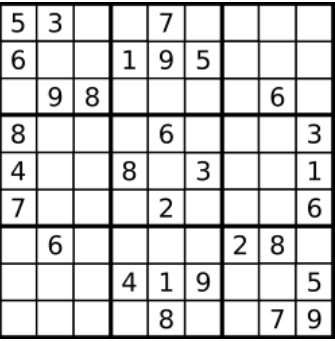
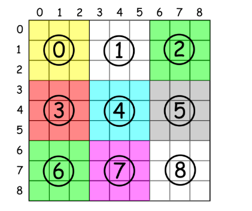

# 1. 删除数组中的重复项

[题目地址](https://leetcode-cn.com/problems/remove-duplicates-from-sorted-array/)

给定一个排序数组，你需要在 原地 删除重复出现的元素，使得每个元素只出现一次，返回移除后数组的新长度。

不要使用额外的数组空间，你必须在 原地 修改输入数组 并在使用 O(1) 额外空间的条件下完成。

 
```
示例 1:

给定数组 nums = [1,1,2], 

函数应该返回新的长度 2, 并且原数组 nums 的前两个元素被修改为 1, 2。 

你不需要考虑数组中超出新长度后面的元素。
示例 2:

给定 nums = [0,0,1,1,1,2,2,3,3,4],

函数应该返回新的长度 5, 并且原数组 nums 的前五个元素被修改为 0, 1, 2, 3, 4。

你不需要考虑数组中超出新长度后面的元素。

```

**思路**

- index维护着指向新的不重复数组的末尾位置
- 使用下标i遍历整个有序数组，因为数组是有序的，所以一旦i指向的元素值和index指向的元素值不一样的时候，就可以将不重复的元素加入到不重复的数组也就是++index
- 最后要返回的是整个数组的长度，index指向的是不重复数组末尾的位置，整个新的不重复数组的长度是index+1


```java
class Solution {
    public int removeDuplicates(int[] nums) {
        if(nums==null||nums.length==0){
            return 0;
        }
        int index=0;
        for(int i=0;i<nums.length;i++){
            if(nums[i]!=nums[index]){
                nums[++index]=nums[i];
            }
        }
        return index+1;
        
    }
}
```


# 2. 买卖股票的最佳时机 II

[题目地址](https://leetcode-cn.com/problems/best-time-to-buy-and-sell-stock-ii/)
给定一个数组，它的第 i 个元素是一支给定股票第 i 天的价格。

设计一个算法来计算你所能获取的最大利润。你可以尽可能地完成更多的交易（多次买卖一支股票）。

注意：你不能同时参与多笔交易（你必须在再次购买前出售掉之前的股票）。

```
示例 1:

输入: [7,1,5,3,6,4]
输出: 7
解释: 在第 2 天（股票价格 = 1）的时候买入，在第 3 天（股票价格 = 5）的时候卖出, 这笔交易所能获得利润 = 5-1 = 4 。
     随后，在第 4 天（股票价格 = 3）的时候买入，在第 5 天（股票价格 = 6）的时候卖出, 这笔交易所能获得利润 = 6-3 = 3 。
示例 2:

输入: [1,2,3,4,5]
输出: 4
解释: 在第 1 天（股票价格 = 1）的时候买入，在第 5 天 （股票价格 = 5）的时候卖出, 这笔交易所能获得利润 = 5-1 = 4 。
     注意你不能在第 1 天和第 2 天接连购买股票，之后再将它们卖出。
     因为这样属于同时参与了多笔交易，你必须在再次购买前出售掉之前的股票。
示例 3:

输入: [7,6,4,3,1]
输出: 0
解释: 在这种情况下, 没有交易完成, 所以最大利润为 0。

```

**思路**

本题是连续的进行交易并获得最大的利润，遵循着低买高卖的原则，那么只要前一天的价格比后一天低的话，那么就可以获得利润，我们可以将这些利润进行加和，得到最终的结果。


```java
class Solution {
    public int maxProfit(int[] prices) {
        if(prices.length<2){
            return 0;
        }
        int max=0;
        for(int i=1;i<prices.length;i++){
            int temp=prices[i]-prices[i-1];
            if(temp>0)
                max+=temp;
        }
        return max;
    }
}
```

# 3. 旋转数组

[题目地址](https://leetcode-cn.com/problems/rotate-array/)

给定一个数组，将数组中的元素向右移动 k 个位置，其中 k 是非负数。

```
示例 1:

输入: [1,2,3,4,5,6,7] 和 k = 3
输出: [5,6,7,1,2,3,4]
解释:
向右旋转 1 步: [7,1,2,3,4,5,6]
向右旋转 2 步: [6,7,1,2,3,4,5]
向右旋转 3 步: [5,6,7,1,2,3,4]
示例 2:

输入: [-1,-100,3,99] 和 k = 2
输出: [3,99,-1,-100]
解释: 
向右旋转 1 步: [99,-1,-100,3]
向右旋转 2 步: [3,99,-1,-100]
说明:

尽可能想出更多的解决方案，至少有三种不同的方法可以解决这个问题。
要求使用空间复杂度为 O(1) 的 原地 算法。
```

**思路**
1. 采用额外的数组空间实现取余操作
```java
class Solution {
    public void rotate(int[] nums, int k) {
        int[] newnums=new int[nums.length];
        for(int i=0;i<nums.length;i++){
            newnums[(i+k)%nums.length]=nums[i];
        }
        for(int i=0;i<nums.length;i++){
            nums[i]=newnums[i];
        }
    }
}
```

2. 模拟循环后移，将数组的最后一个元素放到数组第一个元素的位置，数组中其他元素都向后移动一位，整个过程相当于将整个数组循环移动一次，由于我们需要将整个数组移动k次，所以上述的过程要进行k次，由于我们仅仅需要移动k的余数次就可以，移动多个圈是无意义的，所以取余。


```java
class Solution {
    public void rotate(int[] nums, int k) {
        int n=nums.length;
        k%=n;

        for(int i=0;i<k;i++){
            int temp=nums[n-1];
            for(int j=n-1;j>0;j--){
                nums[j]=nums[j-1];
            }
            nums[0]=temp;
        }

    }
}
```

# 4. 存在重复元素

[题目地址](https://leetcode-cn.com/problems/contains-duplicate/)

给定一个整数数组，判断是否存在重复元素。

如果任意一值在数组中出现至少两次，函数返回 true 。如果数组中每个元素都不相同，则返回 false 。

```

示例 1:

输入: [1,2,3,1]
输出: true
示例 2:

输入: [1,2,3,4]
输出: false
示例 3:

输入: [1,1,1,3,3,4,3,2,4,2]
输出: true

```

**思路**

1. 哈希表统计法

使用哈希表来统计每个元素出现的次数，一旦某个值的出现次数超过了两次的情况下，那么就将该元素提出来。

```java
class Solution {
    public boolean containsDuplicate(int[] nums) {
        Map<Integer,Integer> map=new HashMap<>();
        for(int i=0;i<nums.length;i++){
            if(map.getOrDefault(nums[i],0)>=1){
                return true;
            }
            map.put(nums[i],map.getOrDefault(nums[i],0)+1);
        }
        return false;
    }
}
```

2. 排序法

一个排序好的数组，如果有重复元素，那么重复元素必相邻。

```java
class Solution {
    public boolean containsDuplicate(int[] nums) {
        if(nums.length<2){
            return false;
        }
        Arrays.sort(nums);
        for(int i=0;i<nums.length-1;i++){
            if(nums[i]==nums[i+1]) 
            return true;
        }
        return false;
    }
}
```

# 5. 只出现一次的数字

[题目地址](https://leetcode-cn.com/problems/single-number/)

给定一个非空整数数组，除了某个元素只出现一次以外，其余每个元素均出现两次。找出那个只出现了一次的元素。

说明：

你的算法应该具有线性时间复杂度。 你可以不使用额外空间来实现吗？

```
示例 1:

输入: [2,2,1]
输出: 1
示例 2:

输入: [4,1,2,1,2]
输出: 4
``` 

**思路**

这道题其实按照之前的方法如哈希表、排序也可以做出来，但是不是最优。最优的方法是采用异或的性质。首先我们需要知道异或的性质：

异或的真值表

|p|q|p^q|
|--|--|--|
|0|0|0|
|0|1|1|
|1|0|1|
|1|1|0|

说白点，就是两布尔值，两者不一样那么就异或为1，反之就是异或为0.异或运算具有如下的性质

1. 任何数和0做异或结果仍然是原来的数
2. 任何数和自身做异或运算结果都是0
3. 异或运算满足交换律和结合律：也就是a^b^a=a^a^b=b^a^a=0^b=b

根据上面的性质，对于一个数组{a1,a2,a3,...,a4}

我们初始化res=0,然后依次与数组中的每一个元素进行异或，那么相当于

```
0^a1^a2^a3^....^an
```
看起来有些太抽象了，那么具体化，假如是这样的式子

```
0^1^2^2^1^6^7^6
```

由于满足交换律

```
0^(2^2)^(1^1)^(6^6)^(7)
=0^0^0^0^7
=7
```

通过上面的式子，我们就可以求出仅仅出现一次的元素

```java
class Solution {
    public int singleNumber(int[] nums) {
        int res=0;
        for(int num:nums){
            res^=num;
        }
        return res;
    }
}
```

# 两个数组的交集

[题目地址](https://leetcode-cn.com/problems/intersection-of-two-arrays-ii/)

给定两个数组，编写一个函数来计算它们的交集。

 
示例 1：

输入：nums1 = [1,2,2,1], nums2 = [2,2]
输出：[2,2]
示例 2:

输入：nums1 = [4,9,5], nums2 = [9,4,9,8,4]
输出：[4,9]
 

```
说明：

输出结果中每个元素出现的次数，应与元素在两个数组中出现次数的最小值一致。
我们可以不考虑输出结果的顺序。
进阶：

如果给定的数组已经排好序呢？你将如何优化你的算法？
如果 nums1 的大小比 nums2 小很多，哪种方法更优？
如果 nums2 的元素存储在磁盘上，内存是有限的，并且你不能一次加载所有的元素到内存中，你该怎么办？
```

**思想**

排序预处理，双指针，相同添加到集合中两指针同时后移，否则分别调整两个指针前进，继续循环判断。

```java
class Solution {
    public int[] intersect(int[] nums1, int[] nums2) {
        if(nums1==null||nums2==null){
            return new int[0];
        }
        Arrays.sort(nums1);
        Arrays.sort(nums2);
        int l1=0,l2=0;
        List<Integer> list=new ArrayList<>();
        while(l1<nums1.length&&l2<nums2.length){
            if(nums1[l1]==nums2[l2]){
                list.add(nums1[l1]);
                l1++;
                l2++;
            }
            else if(nums1[l1]<nums2[l2]){
                l1++;
            }else{
                l2++;
            }
        }
       int [] ints = list.stream().mapToInt(Integer::intValue).toArray();
       return ints;
        
    }
}
```

# 加一
[题目地址](https://leetcode-cn.com/problems/plus-one/submissions/)
给定一个由整数组成的非空数组所表示的非负整数，在该数的基础上加一。

最高位数字存放在数组的首位， 数组中每个元素只存储单个数字。

你可以假设除了整数 0 之外，这个整数不会以零开头。

```
示例 1:

输入: [1,2,3]
输出: [1,2,4]
解释: 输入数组表示数字 123。
示例 2:

输入: [4,3,2,1]
输出: [4,3,2,2]
解释: 输入数组表示数字 4321。
```

**思想**
从数组最后一位开始加一，如果加一后不进位的话，直接返回结果，否则该位的前一位继续加一，这样一直循环到最高位。一旦最高位也进位那么，就新建一个n+1位的数组，第一位赋值为1.

```java
class Solution {
    public int[] plusOne(int[] digits) {
        if(digits==null) return new int[0];
        for(int i=digits.length-1;i>=0;i--){
            digits[i]++;
            digits[i]%=10;
            if(digits[i]!=0){
                return digits;
            }
        }
        int[] res=new int[digits.length+1];
        res[0]=1;
        return res;
    }
}
```

# 移动零
给定一个数组 nums，编写一个函数将所有 0 移动到数组的末尾，同时保持非零元素的相对顺序。

```
示例:

输入: [0,1,0,3,12]
输出: [1,3,12,0,0]
说明:

必须在原数组上操作，不能拷贝额外的数组。
尽量减少操作次数。
```
**思想**
1. 依次遍历原来的数组，如果遍历到的值不为0，那么就将其值赋值给index指向的元素，index++
2. index指向不为0元素的后一个元素的位置，从该元素位置开始，依次赋值为0

```java
class Solution {
    public void moveZeroes(int[] nums) {
        int index=0;
        for(int i=0;i<nums.length;i++){
            if(nums[i]!=0){
                nums[index++]=nums[i];
            }
        }
        for(int i=index;i<nums.length;i++){
            nums[i]=0;
        }
    }
}
```

# 两数之和

[题目地址](https://leetcode-cn.com/problems/two-sum/)
给定一个整数数组 nums 和一个目标值 target，请你在该数组中找出和为目标值的那 两个 整数，并返回他们的数组下标。

你可以假设每种输入只会对应一个答案。但是，数组中同一个元素不能使用两遍。

 
```
示例:

给定 nums = [2, 7, 11, 15], target = 9

因为 nums[0] + nums[1] = 2 + 7 = 9
所以返回 [0, 1]

```

**思想**

利用HashMap，遍历nums记录<nums[i],i>,之后遍历nums，使得对于nums[i],计算target-nums[i],是否已经存在map中，除此之外防止target-nums[i]是自己本身，在这种情况下，满足条件，就直接返回结果。

```java
class Solution {
    public int[] twoSum(int[] nums, int target) {
      Map<Integer, Integer> map = new HashMap<>();
        for(int i = 0; i<nums.length;i++){
            map.put(nums[i],i);
        }
        for(int i = 0;i<nums.length;i++){
            int tmp = target - nums[i];
            if(map.containsKey(tmp) && map.get(tmp) != i){
                return new int[]{i,map.get(tmp)};
            }
        }
        throw new RuntimeException("No two sum solution");
    }
}
```

# 有效的数独

[题目地址](https://leetcode-cn.com/problems/valid-sudoku/)

判断一个 9x9 的数独是否有效。只需要根据以下规则，验证已经填入的数字是否有效即可。

数字 1-9 在每一行只能出现一次。
数字 1-9 在每一列只能出现一次。
数字 1-9 在每一个以粗实线分隔的 3x3 宫内只能出现一次。


上图是一个部分填充的有效的数独。

数独部分空格内已填入了数字，空白格用 '.' 表示。

示例 1:

输入:
[
  ["5","3",".",".","7",".",".",".","."],
  ["6",".",".","1","9","5",".",".","."],
  [".","9","8",".",".",".",".","6","."],
  ["8",".",".",".","6",".",".",".","3"],
  ["4",".",".","8",".","3",".",".","1"],
  ["7",".",".",".","2",".",".",".","6"],
  [".","6",".",".",".",".","2","8","."],
  [".",".",".","4","1","9",".",".","5"],
  [".",".",".",".","8",".",".","7","9"]
]
输出: true
示例 2:

输入:
[
  ["8","3",".",".","7",".",".",".","."],
  ["6",".",".","1","9","5",".",".","."],
  [".","9","8",".",".",".",".","6","."],
  ["8",".",".",".","6",".",".",".","3"],
  ["4",".",".","8",".","3",".",".","1"],
  ["7",".",".",".","2",".",".",".","6"],
  [".","6",".",".",".",".","2","8","."],
  [".",".",".","4","1","9",".",".","5"],
  [".",".",".",".","8",".",".","7","9"]
]
输出: false
解释: 除了第一行的第一个数字从 5 改为 8 以外，空格内其他数字均与 示例1 相同。
     但由于位于左上角的 3x3 宫内有两个 8 存在, 因此这个数独是无效的。
说明:

一个有效的数独（部分已被填充）不一定是可解的。
只需要根据以上规则，验证已经填入的数字是否有效即可。
给定数独序列只包含数字 1-9 和字符 '.' 。
给定数独永远是 9x9 形式的。

**思想**

- row[i][num] 代表了位于第i行的num元素，是否出现过
- col[j][num] 代表了位于第j列的num元素，是否出现过
- board[boardIndex][num] 代表位于第boardIndex区域的num元素是否出现过
- (i/3)*3+(j/3)是该元素位于的区域号



步骤

1. 遍历数独。
2. 检查看到每个单元格值是否已经在当前的行 / 列 / 子数独中出现过：
    * 如果出现重复，返回 false。
    * 如果没有，则保留此值以进行进一步跟踪。
    返回 true。

```java
class Solution {


    public boolean isValidSudoku(char[][] board) {
      boolean [][] row=new boolean[9][9];
      boolean [][] col=new boolean[9][9];
      boolean [][] block=new boolean[9][9];

      for(int i=0;i<9;i++){
          for(int j=0;j<9;j++){
              if(board[i][j]!='.'){
                  int num=board[i][j]-'1';
                  int blockIndex=(i/3)*3+j/3;
                  if(row[i][num]||col[j][num]||block[blockIndex][num]){
                      return false;
                  }else{
                      row[i][num]=true;
                      col[j][num]=true;
                      block[blockIndex][num]=true;
                  }
              }
          }
      }
      return true;
    }
}
```

# 旋转图像

[题目地址](https://leetcode-cn.com/problems/rotate-image/)
给定一个 n × n 的二维矩阵表示一个图像。

将图像顺时针旋转 90 度。

```

说明：

你必须在原地旋转图像，这意味着你需要直接修改输入的二维矩阵。请不要使用另一个矩阵来旋转图像。

示例 1:

给定 matrix = 
[
  [1,2,3],
  [4,5,6],
  [7,8,9]
],

原地旋转输入矩阵，使其变为:
[
  [7,4,1],
  [8,5,2],
  [9,6,3]
]
示例 2:

给定 matrix =
[
  [ 5, 1, 9,11],
  [ 2, 4, 8,10],
  [13, 3, 6, 7],
  [15,14,12,16]
], 

原地旋转输入矩阵，使其变为:
[
  [15,13, 2, 5],
  [14, 3, 4, 1],
  [12, 6, 8, 9],
  [16, 7,10,11]
]
```
**思路**

先转置再镜像对称

```java
class Solution {
    public void rotate(int[][] matrix) {
        int n=matrix.length;
        for(int i=0;i<n;i++){
            for(int j=0;j<i;j++){
                int temp=matrix[i][j];
                matrix[i][j]=matrix[j][i];
                matrix[j][i]=temp;
            }
        }

        for(int i=0;i<n;i++){
            for(int j=0;j<n/2;j++){
                int temp=matrix[i][j];
                matrix[i][j]=matrix[i][n-1-j];
                matrix[i][n-1-j]=temp;
            }
        }

    }
}
```


