# JDBC

## JDBC概述

### 数据的持久化

- 持久化(persistence)：把数据保存到可掉电式存储设备中以供之后使用。大多数情况下，特别是企业级应用，
  数据持久化意味着将内存中的数据保存到硬盘上加以”固化”，而持久化的实现过程大多通过各种关系数据库来完
  成。
- 持久化的主要应用是将内存中的数据存储在关系型数据库中，当然也可以存储在磁盘文件、XML数据文件中。

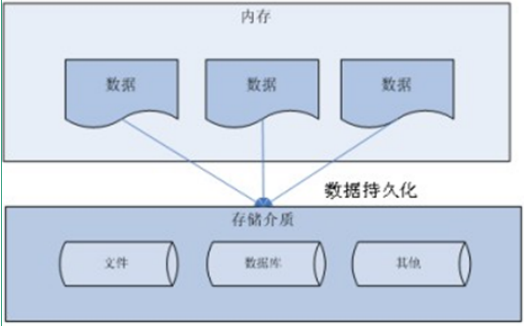

### Java中数据存储技术

- JDBC(Java Database Connectivity)是一个独立于特定数据库管理系统、通用的SQL数据库存取和操作的公共接
  口（一组API），定义了用来访问数据库的标准Java类库，（java.sql,javax.sql）使用这些类库可以以一种标准的方法、方便地访问数据库资源。
- JDBC为访问不同的数据库提供了一种统一的途径，为开发者屏蔽了一些细节问题。
- JDBC的目标是使Java程序员使用JDBC可以连接任何提供了JDBC驱动程序的数据库系统，这样就使得程序员无需
- 对特定的数据库系统的特点有过多的了解，从而大大简化和加快了开发过程。
- 如果没有JDBC，那么Java程序访问数据库时是这样的：

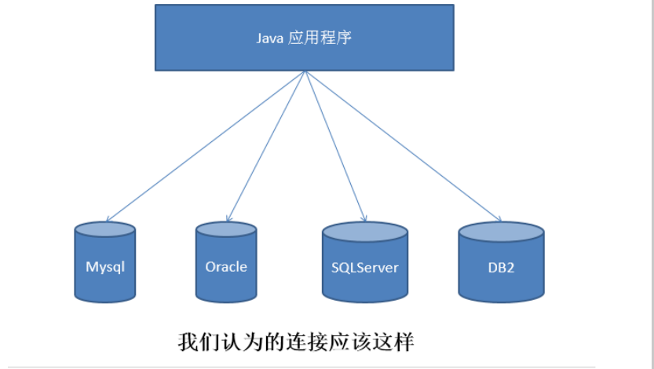

有了JDBC，Java程序访问数据库时是这样的：

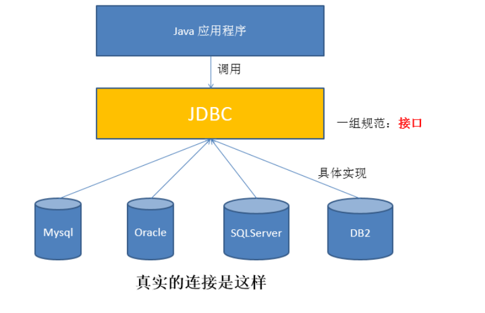

- 总结如下：

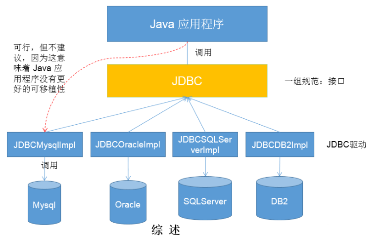

### JDBC体系结构

JDBC接口（API）包括两个层次：

- **面向应用的API：**Java API，抽象接口，供应用程序开发人员使用（连接数据库，执行SQL语句，获得结
  果）。
- **面向数据库的API**：Java Driver API，供开发商开发数据库驱动程序用。
  JDBC是sun公司提供一套用于数据库操作的接口，java程序员只需要面向这套接口编程即可。
  不同的数据库厂商，需要针对这套接口，提供不同实现。不同的实现的集合，即为不同数据库的驱动。
  ————面向接口编程

### JDBC程序编写的过程

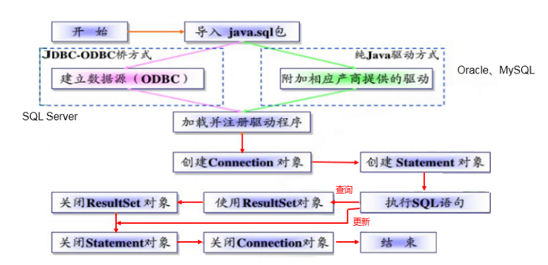

> 补充：ODBC(Open Database Connectivity，开放式数据库连接)，是微软在Windows平台下推出的。使用
> 者在程序中只需要调用ODBC API，由 ODBC 驱动程序将调用转换成为对特定的数据库的调用请求。

### JDBC的优缺点

JDBC的优点：
 直接底层操作，提供了很简单、便捷的访问数据库的方法，跨平台性比较强。灵活性比较强，可以写很复杂的SQL语句。
JDBC的缺点：
因为JAVA是面向对象的，JDBC没有做到使数据能够面向对象的编程，使程序员的思考仍停留在SQL语句上。
操作比较繁琐，很多代码需要重复写很多次。

## 获取数据库连接

**连接方式一**

```java
package com.dreamcold.connect;

import java.sql.Connection;
import java.sql.Driver;
import java.sql.SQLException;
import java.util.Properties;

public class ConnectionDemo01 {
    public static void main(String[] args)  {
      try {
          Driver driver=null;
          driver=new  com.mysql.jdbc.Driver();

          String url="jdbc:mysql://localhost:3305/test";

          Properties info=new Properties();
          info.setProperty("user","root");
          info.setProperty("password","abc123");
          Connection connection=driver.connect(url,info);
          System.out.println(connection);
      }catch (SQLException e){
          e.printStackTrace();
      }


    }
}
```

> 说明：上述代码中显式出现了第三方数据库的API

**连接方式二：**

```sql
package com.dreamcold.connect;

import java.sql.Connection;
import java.sql.Driver;
import java.util.Properties;

public class ConnectionDem02 {
    public static void main(String[] args) {
        try {
            String className="com.mysql.jdbc.Driver";
            Class clazz=Class.forName(className);
            Driver driver=(Driver) clazz.newInstance();
            String url="jdbc:mysql://localhost:3305/test";

            Properties info=new Properties();
            info.setProperty("user","root");
            info.setProperty("password","abc123");
            Connection connection=driver.connect(url,info);
            System.out.println(connection);
        }catch (Exception e){
            e.printStackTrace();
        }
    }
}

```

> 说明：相较于方式一，这里使用反射实例化Driver，不在代码中体现第三方数据库的API。体现了面向接口编程
> 思想

**连接方式三**

```java
package com.dreamcold.connect;

import java.sql.Connection;
import java.sql.Driver;
import java.sql.DriverManager;

public class ConnectionDemo03 {
    public static void main(String[] args) {
        try {
            String url="jdbc:mysql://localhost:3305/test";
            String user="root";
            String password="abc123";
            String driverName="com.mysql.jdbc.Driver";
            Class clazz=Class.forName(driverName);
            Driver driver=(Driver)clazz.newInstance();
            //注册驱动
            DriverManager.registerDriver(driver);
            Connection connection = DriverManager.getConnection(url, user, password);
            System.out.println(connection);

        }catch (Exception e){
            e.printStackTrace();
        }
    }
}
```

> 说明：使用DriverManager实现数据库的连接。体会获取连接必要的4个基本要素。

**连接方式四：**

```java
package com.dreamcold.connect;

import java.sql.Connection;
import java.sql.DriverManager;

public class ConnectionDemo04 {
    public static void main(String[] args) {
        try {
            String url="jdbc:mysql://localhost:3305/test";
            String user="root";
            String password="abc123";
            String driverName="com.mysql.jdbc.Driver";
            Class.forName(driverName);
            Connection connection = DriverManager.getConnection(url, user, password);
            System.out.println(connection);
        }catch (Exception e){
            e.printStackTrace();
        }
    }
}
```

> 说明：不必显式的注册驱动了。因为在DriverManager的源码中已经存在静态代码块，实现了驱动的注册。

**连接方式五(最终版)**

```java
package com.dreamcold.connect;

import java.io.InputStream;
import java.sql.DriverManager;
import java.util.Properties;

public class ConnectionDemo05 {
    public static void main(String[] args) {
        try {

            InputStream in = ConnectionDemo05.class.getResourceAsStream("jdbc.properties");
            Properties properties = new Properties();
            properties.load(in);
            String url="jdbc:mysql://localhost:3305/test";
            String user="root";
            String password="abc123";
            String driverName="com.mysql.jdbc.Driver";
            Class.forName(driverName);
            DriverManager.getConnection(url,user,password);
        }catch (Exception e){
            e.printStackTrace();
        }

    }
}
```

> 说明：使用配置文件的方式保存配置信息，在代码中加载配置文件
> 使用配置文件的好处：
> ①实现了代码和数据的分离，如果需要修改配置信息，直接在配置文件中修改，不需要深入代码 ②如果修改了
> 配置信息，省去重新编译的过程

## 使用PreparedStatement实现CRUD操作

### 操作和访问数据库

- 数据库连接被用于向数据库服务器发送命令和 SQL 语句，并接受数据库服务器返回的结果。其实一个数据库连
  接就是一个Socket连接。
- 在 java.sql 包中有 3 个接口分别定义了对数据库的调用的不同方式：
  - Statement：用于执行静态 SQL 语句并返回它所生成结果的对象。
  - PrepatedStatement：SQL 语句被预编译并存储在此对象中，可以使用此对象多次高效地执行该语句。
  - CallableStatement：用于执行 SQL 存储过程

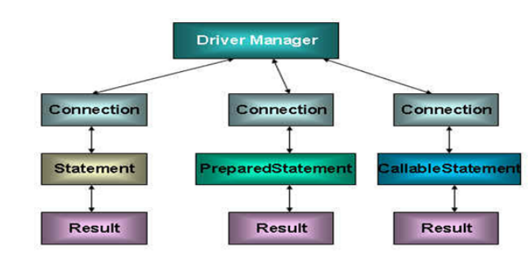

### 使用Statement操作数据表的弊端

- 通过调用 Connection 对象的 createStatement() 方法创建该对象。该对象用于执行静态的 SQL 语句，并且返
  回执行结果。
- Statement 接口中定义了下列方法用于执行 SQL 语句：

- 但是使用Statement操作数据表存在弊端：
  - 问题一：存在拼串操作，繁琐
  - 问题二：存在SQL注入问题

- SQL 注入是利用某些系统没有对用户输入的数据进行充分的检查，而在用户输入数据中注入非法的 SQL 语句段
  或命令(如：SELECT user, password FROM user_table WHERE user='a' OR 1 = ' AND password = ' OR '1' =
  '1') ，从而利用系统的 SQL 引擎完成恶意行为的做法。
- 对于 Java 而言，要防范 SQL 注入，只要用 PreparedStatement(从Statement扩展而来) 取代 Statement 就可
  以了。
- 代码演示：

```java
package com.dreamcold.excute;

import java.io.InputStream;
import java.lang.reflect.Field;
import java.sql.*;
import java.util.Properties;
import java.util.Scanner;

public class Demo01 {


    public void testLogin(){
        Scanner scan=new Scanner(System.in);
        System.out.println("请输入用户名：");
        String userName=scan.nextLine();
        System.out.println("密码：");
        String pasWord=scan.nextLine();
        String sql="SELECT USER,PASSWORD FROM USER_TABLE WHERE USER='"+userName+"' AND PASSWORD='"+pasWord+"'";
        User user=get(sql,User.class);
        if(user!=null){
            System.out.println("登录成功");
        }else{
            System.out.println("用户名或者密码错误");
        }
    }

    public <T> T get(String sql,Class<T> clazz)  {
        T t=null;
        Connection conn=null;
        Statement st=null;
        ResultSet rs=null;
        try{
            //加载配置文件
            InputStream is=Demo01.class.getClassLoader().getResourceAsStream("jdbc.properties");
            Properties pros=new Properties();
            pros.load(is);
            //读取配置文件
            String user=pros.getProperty("user");
            String password=pros.getProperty("password");
            String url=pros.getProperty("url");
            String dirverClass=pros.getProperty("driverClass");
            //加载驱动
            Class.forName(dirverClass);
            //获取连接
            conn= DriverManager.getConnection(url,user,password);
            st=conn.createStatement();
            rs=st.executeQuery(sql);
            //获取结果集合中的原数据
            ResultSetMetaData rsdm=rs.getMetaData();
            int columnCouunt=rsdm.getColumnCount();
            if (rs.next()){
                t=clazz.newInstance();
                for (int i=0;i<columnCouunt;i++){
                    //获取列名
                    String columnName=rsdm.getColumnLabel(i+1);
                    //根据列名获取数据表中的数据
                    Object columnVal=rs.getObject(columnCouunt);
                    //将数据表中得到的数据封装到对象
                    Field field=clazz.getDeclaredField(columnName);
                    field.setAccessible(true);
                    field.set(t,columnVal);
                }
                return t;
            }
        }catch (Exception e){
            e.printStackTrace();
        }finally {
            //关闭资源
            if (rs!=null){
                try {
                    rs.close();
                }catch (SQLException e){
                    e.printStackTrace();
                }
            }
            if (st!=null){
                try {
                    st.close();
                } catch (SQLException e) {
                    e.printStackTrace();
                }
            }

            if (conn!=null){
                try {
                    conn.close();
                }catch (SQLException e){
                    e.printStackTrace();
                }
            }

        }
        return null;
    }
}

```

综上：

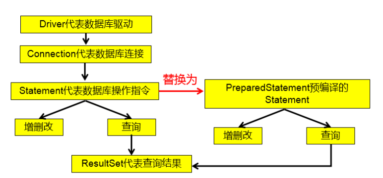

### PreparedStatement的使用

PreparedStatement介绍

- 可以通过调用 Connection 对象的 preparedStatement(String sql) 方法获取 PreparedStatement 对象
- PreparedStatement 接口是 Statement 的子接口，它表示一条预编译过的 SQL 语句
- PreparedStatement 对象所代表的 SQL 语句中的参数用问号(?)来表示，调用 PreparedStatement 对象的
- setXxx() 方法来设置这些参数. setXxx() 方法有两个参数，第一个参数是要设置的 SQL 语句中的参数的索引(从 1开始)，第二个是设置的 SQL 语句中的参数的值

### PreparedStatement vs Statement

- 代码的可读性和可维护性。
- PreparedStatement 能最大可能提高性能：
- DBServer会对预编译语句提供性能优化。因为预编译语句有可能被重复调用，所以语句在被DBServer的编译器编译后的执行代码被缓存下来，那么下次调用时只要是相同的预编译语句就不需要编译，只要将参数直接传入编译过的语句执行代码中就会得到执行。
- 在statement语句中,即使是相同操作但因为数据内容不一样,所以整个语句本身不能匹配,没有缓存语句的意义.事实是没有数据库会对普通语句编译后的执行代码缓存。这样每执行一次都要对传入的语句编译一次。(语法检查，语义检查，翻译成二进制命令，缓存)PreparedStatement 可以防止 SQL 注入

### Java与SQL对应数据类型转换表

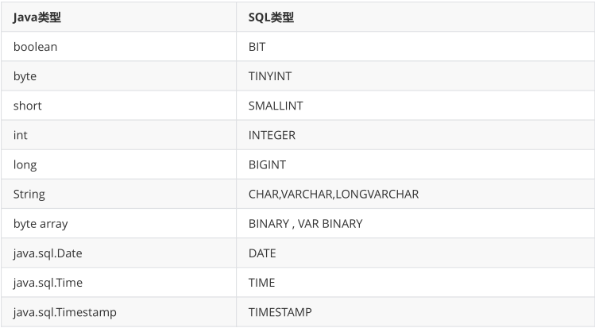

### 使用PreparedStatement实现增、删、改操作

```java
package com.dreamcold.excute;

import com.dreamcold.util.JDBCUtil;

import java.sql.Connection;
import java.sql.PreparedStatement;

public class PreparedStatementUtil {
    //通过PreparedStatement增、删、改操作
    public void update(String sql,Object ...args){
        Connection conn=null;
        PreparedStatement ps=null;
        try {
            //获取数据库连接
            conn= JDBCUtil.getConnection();
            //获取PrepareStatement
            ps=conn.prepareStatement(sql);
            //填充占位符
            for (int i=0;i<args.length;i++){
                ps.setObject(i+1,args[i]);
            }
            //执行sql语句
            ps.execute();
        }catch (Exception e){
            e.printStackTrace();
        }finally {
            JDBCUtil.close(conn,ps);
        }
    }
}
```

### 使用PreparedStatement实现查询操作

```java
package com.dreamcold.excute;

import com.dreamcold.util.JDBCUtil;

import java.lang.reflect.Field;
import java.sql.Connection;
import java.sql.PreparedStatement;
import java.sql.ResultSet;
import java.sql.ResultSetMetaData;

public class PreparedStatementUtil {
    //通过PreparedStatement增、删、改操作
    public void update(String sql,Object ...args){
        Connection conn=null;
        PreparedStatement ps=null;
        try {
            //获取数据库连接
            conn= JDBCUtil.getConnection();
            //获取PrepareStatement
            ps=conn.prepareStatement(sql);
            //填充占位符
            for (int i=0;i<args.length;i++){
                ps.setObject(i+1,args[i]);
            }
            //执行sql语句
            ps.execute();
        }catch (Exception e){
            e.printStackTrace();
        }finally {
            JDBCUtil.close(conn,ps);
        }
    }

    //通用的针对于不同表的查询，返回一个对象（version1.0）
    public <T> T getInstance(Class<T> clazz,String sql,Object... args){
        Connection conn=null;
        PreparedStatement ps=null;
        ResultSet rs=null;
        try {
            //获取数据库的连接
            conn= JDBCUtil.getConnection();
            //预编译sql语句，得到PrepareStatment对象
            ps=conn.prepareStatement(sql);
            //填充占位符
            for (int i=0;i<args.length;i++){
                ps.setObject(i+1,args[i]);
            }
            rs=ps.executeQuery();
            //得到结果的元数据集
            ResultSetMetaData rsmd=rs.getMetaData();
            int columnCount=rsmd.getColumnCount();
            if (rs.next()){
                T t=clazz.newInstance();
                for (int i = 0; i < columnCount; i++) {
                    //获取列值
                    Object columnVal=rs.getObject(i+1);
                    //获取列的别名，
                    String columnLabel=rsmd.getColumnLabel(i+1);
                    //使用反射
                    Field field=clazz.getDeclaredField(columnLabel);
                    field.setAccessible(true);
                    field.set(t,columnVal);

                }
                return t;
            }

        }catch (Exception e){
            e.printStackTrace();
        }finally {
            JDBCUtil.close(conn,ps);
        }
        return null;
    }
}
```

> 说明：使用PreparedStatement实现的查询操作可以替换Statement实现的查询操作，解决Statement拼串和
> SQL注入问题。

### ResultSet与ResultSetMetaData

#### ResultSet

- 查询需要调用PreparedStatement 的 executeQuery() 方法，查询结果是一个ResultSet 对象
- ResultSet 对象以逻辑表格的形式封装了执行数据库操作的结果集，ResultSet 接口由数据库厂商提供实现
- ResultSet 返回的实际上就是一张数据表。有一个指针指向数据表的第一条记录的前面。
- ResultSet 对象维护了一个指向当前数据行的游标，初始的时候，游标在第一行之前，可以通过 ResultSet 对象的 next() 方法移动到下一行。调用 next()方法检测下一行是否有效。若有效，该方法返回 true，且指针下移。相当于Iterator对象的 hasNext() 和 next() 方法的结合体

- 当指针指向一行时, 可以通过调用 getXxx(int index) 或 getXxx(int columnName) 获取每一列的值。
  - 例如: getInt(1), getString("name")
  - 注意：Java与数据库交互涉及到的相关Java API中的索引都从1开始。
  - ResultSet 接口的常用方法：
    - boolean next()
    - getString()
    - …

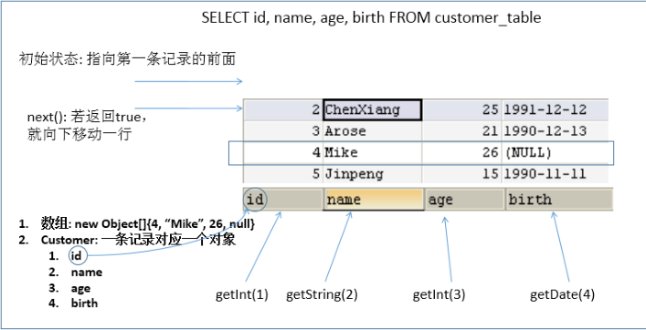

#### ResultSetMetaData

- 可用于获取关于 ResultSet 对象中列的类型和属性信息的对象
- ResultSetMetaData meta = rs.getMetaData();
  - getColumnName(int column)：获取指定列的名称
  - getColumnLabel(int column)：获取指定列的别名
  - getColumnCount()：返回当前 ResultSet 对象中的列数。
  - getColumnTypeName(int column)：检索指定列的数据库特定的类型名称。
  - getColumnDisplaySize(int column)：指示指定列的最大标准宽度，以字符为单位。
  - isNullable(int column)：指示指定列中的值是否可以为 null。
  - isAutoIncrement(int column)：指示是否自动为指定列进行编号，这样这些列仍然是只读的。

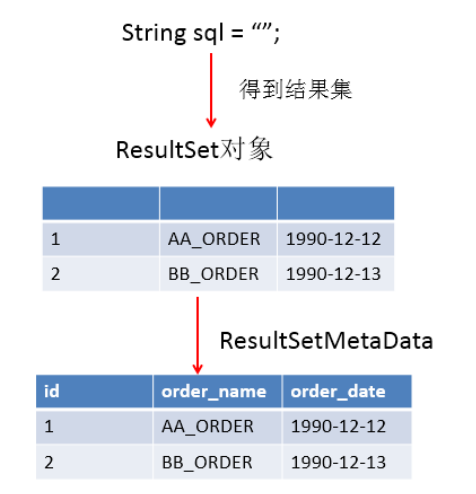

**问题1：得到结果集后, 如何知道该结果集中有哪些列 ？ 列名是什么？**
需要使用一个描述 ResultSet 的对象， 即 ResultSetMetaData
**问题2：关于ResultSetMetaData**

1. 如何获取 ResultSetMetaData： 调用 ResultSet 的 getMetaData() 方法即可
2. 获取 ResultSet 中有多少列：调用 ResultSetMetaData 的 getColumnCount() 方法
3. 获取 ResultSet 每一列的列的别名是什么：调用 ResultSetMetaData 的getColumnLabel() 方法

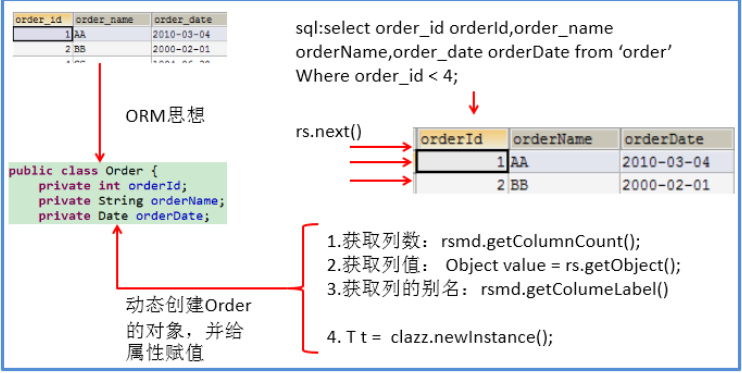

#### 资源的释放

释放ResultSet, Statement,Connection。

- 数据库连接（Connection）是非常稀有的资源，用完后必须马上释放，如果Connection不能及时正确的关闭将
  导致系统宕机。Connection的使用原则是尽量晚创建，尽量早的释放。
- 可以在finally中关闭，保证及时其他代码出现异常，资源也一定能被关闭。

#### JDBC API小结

**两种思想**
面向接口编程的思想

- ORM思想(object relational mapping)
  - 一个数据表对应一个java类
  - 表中的一条记录对应java类的一个对象
  - 表中的一个字段对应java类的一个属性
  - sql是需要结合列名和表的属性名来写。注意起别名。
    两种技术
- JDBC结果集的元数据：ResultSetMetaData
    - 获取列数：getColumnCount()
    - 获取列的别名：getColumnLabel()
    - 通过反射，创建指定类的对象，获取指定的属性并赋值


## MySQL BLOB类型

- MySQL中，BLOB是一个二进制大型对象，是一个可以存储大量数据的容器，它能容纳不同大小的数据。
- 插入BLOB类型的数据必须使用PreparedStatement，因为BLOB类型的数据无法使用字符串拼接写的。
- MySQL的四种BLOB类型(除了在存储的最大信息量上不同外，他们是等同的)

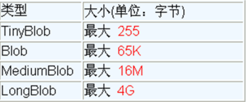

- 实际使用中根据需要存入的数据大小定义不同的BLOB类型。

- 需要注意的是：如果存储的文件过大，数据库的性能会下降。

- 如果在指定了相关的Blob类型以后，还报错：xxx too large，那么在mysql的安装目录下，找my.ini文件加上如

  下的配置参数： max_allowed_packet=16M。同时注意：修改了my.ini文件之后，需要重新启动mysql服务。

### 向数据表中插入大数据类型

```java
package com.dreamcold.blob;

import com.dreamcold.util.JDBCUtil;

import java.io.FileInputStream;
import java.sql.Connection;
import java.sql.PreparedStatement;
import java.sql.Date;

public class Demo01 {
    public static void main(String[] args){
        try {
            //获取连接
            Connection conn= JDBCUtil.getConnection();
            String sql="insert into customer(name,email,birth,photp) values(?,?,?,?)";
            PreparedStatement ps=conn.prepareStatement(sql);
            //填充占位符
            ps.setString(1,"dreamcold");
            ps.setString(2,"dreamcold@163.com");
            ps.setDate(3,new Date(new java.util.Date().getTime()));
            //操作Blob类型的变量
            FileInputStream fis=new FileInputStream("dreamcold.png");
            ps.execute();
            fis.close();
            JDBCUtil.close(conn,ps);
        }catch (Exception e){
            e.printStackTrace();
        }
    }
}
```

### 修改数据表中的Blob类型字段

```java
package com.dreamcold.blob;

import com.dreamcold.util.JDBCUtil;

import java.io.FileInputStream;
import java.sql.Connection;
import java.sql.PreparedStatement;

public class Demo02 {
    public static void main(String[] args) {
        try {
            Connection conn= JDBCUtil.getConnection();
            String sql="update customer set photo= ? where id =?";
            PreparedStatement ps=conn.prepareStatement(sql);
            //填充占位符
            //操作Blob类型的变量
            FileInputStream fis=new FileInputStream("coffe.png");
//            ps.setBlob(1,fis);
            ps.setInt(2,25);
            ps.execute();
            fis.close();
            JDBCUtil.close(conn,ps);

        }catch (Exception e){
            e.printStackTrace();
        }
    }
}
```

### 从数据表中读取大数据类型

```java
package com.dreamcold.blob;

import com.dreamcold.util.JDBCUtil;

import java.io.FileOutputStream;
import java.io.InputStream;
import java.io.OutputStream;
import java.sql.*;

public class Demo03 {
    public static void main(String[] args) {
      try {
          String sql="SELECT ID,NAME,EMAIL,BIRTH,PHOTO FROM CUSTOMER WHERE ID =?";
          Connection conn= JDBCUtil.getConnection();
          PreparedStatement ps=conn.prepareStatement(sql);
          ps.setInt(1,8);
          ResultSet rs=ps.executeQuery();
          if (rs.next()){
              Integer id=rs.getInt(1);
              String name=rs.getString(2);
              String email=rs.getString(3);
              Date birth=rs.getDate(4);
              Blob photo =rs.getBlob(5);
              InputStream is=photo.getBinaryStream();
              OutputStream os=new FileOutputStream("c.jpg");
              byte[] buffer=new byte[1024];
              int len;
              while ((len=is.read(buffer))!=-1){
                  os.write(buffer,0,len);
              }
              JDBCUtil.close(conn,ps);
          }
      }catch (Exception e){
          e.printStackTrace();
      }
    }
}
```

## 批量插入

### 批量执行SQL语句

当需要成批插入或者更新记录时，可以采用Java的批量更新机制，这一机制允许多条语句一次性提交给数据库批量处
理。通常情况下比单独提交处理更有效率
JDBC的批量处理语句包括下面三个方法：

- addBatch(String)：添加需要批量处理的SQL语句或是参数；
- executeBatch()：执行批量处理语句；
- clearBatch():清空缓存的数据
- 通常我们会遇到两种批量执行SQL语句的情况：
  - 多条SQL语句的批量处理；
  - 一个SQL语句的批量传参；

### 高效的批量插入

举例：向数据表中插入20000条数据
数据库中提供一个goods表。创建如下：

```sql
CREATE TABLE GOODS(
	ID INT PRIMARY KEY AUTO_INCREMENT,
    NAME VARCHAR(20)
);
```

####  实现层次一：使用Statement

```java
package com.dreamcold.batch;

import com.dreamcold.util.JDBCUtil;

import java.sql.Connection;
import java.sql.Statement;

public class Demo01 {
    public static void main(String[] args) {
        try {
            Connection conn= JDBCUtil.getConnection();
            Statement st=conn.createStatement();
            for (int i = 0; i <=200000; i++) {
                String sql="insert into goods(name) values('name_'+"+i+")";
                st.executeUpdate(sql);
            }
        }catch (Exception e){
            e.printStackTrace();
        }
    }
}
```

#### 实现层次二：使用PreparedStatement

```java
package com.dreamcold.batch;

import com.dreamcold.util.JDBCUtil;

import java.sql.Connection;
import java.sql.PreparedStatement;

public class Demo02 {
    public static void main(String[] args) {
        try {
            long start=System.currentTimeMillis();
            Connection conn= JDBCUtil.getConnection();
            String sql="insert into goods(name) values(?)";
            PreparedStatement ps=conn.prepareStatement(sql);
            for (int i=1;i<=2000;i++){
                ps.setString(1,"name_"+i);
                ps.executeUpdate();
            }
            long end=System.currentTimeMillis();
            System.out.println("花费时间为："+(end-start));
        }catch (Exception e){
            e.printStackTrace();
        }
    }
}
```

#### 实现层次三

* 修改1： 使用 addBatch() / executeBatch() / clearBatch()
* 修改2：mysql服务器默认是关闭批处理的，我们需要通过一个参数，让mysql开启批处理的支持。
* rewriteBatchedStatements=true 写在配置文件的url后面
* 修改3：使用更新的mysql 驱动：mysql-connector-java-5.1.37-bin.jar

```sql
package com.dreamcold.batch;

import com.dreamcold.util.JDBCUtil;

import java.sql.Connection;
import java.sql.PreparedStatement;

public class Demo03 {
    public static void main(String[] args) {
        Connection conn= null;
        PreparedStatement ps=null;
        long start=0;
        try {
            start=System.currentTimeMillis();
            conn= JDBCUtil.getConnection();
            String sql="insert into goods(name) values(?)";
            ps=conn.prepareStatement(sql);
            for (int i = 0; i < 1000000; i++) {
                ps.setString(1,"name_"+i);
                //攒sql
                ps.addBatch();
                if(i%500==0){
                    //执行
                    ps.executeBatch();
                    //清空
                    ps.clearBatch();;
                }
            }
        }catch (Exception e){
            
        }
        long end=System.currentTimeMillis();
        System.out.println("cost time:"+(end-start));
        JDBCUtil.close(conn,ps);
    }
}

```

#### 实现层次四

层次四：在层次三的基础上操作

* 使用Connection 的 setAutoCommit(false) / commit()

```java
package com.dreamcold.batch;

import com.dreamcold.util.JDBCUtil;

import java.sql.Connection;
import java.sql.PreparedStatement;

public class Demo04 {
    public static void main(String[] args) {
        Connection conn= null;
        PreparedStatement ps=null;
        long start=0;
        try {
            start=System.currentTimeMillis();
            conn= JDBCUtil.getConnection();
            //设置为不自动提交
            conn.setAutoCommit(false);
            String sql="insert into goods(name) values(?)";
            ps=conn.prepareStatement(sql);
            for (int i = 0; i < 1000000; i++) {
                ps.setString(1,"name_"+i);
                //攒sql
                ps.addBatch();
                if(i%500==0){
                    //执行
                    ps.executeBatch();
                    //清空
                    ps.clearBatch();;
                }
            }
            conn.commit();
        }catch (Exception e){
            e.printStackTrace();
        }
       
        long end=System.currentTimeMillis();
        System.out.println("cost time:"+(end-start));
        JDBCUtil.close(conn,ps);
    }
}
```

## 数据库事务

- 事务：一组逻辑操作单元,使数据从一种状态变换到另一种状态。
- 事务处理（事务操作）：保证所有事务都作为一个工作单元来执行，即使出现了故障，都不能改变这种执行方式。当在一个事务中执行多个操作时，要么所有的事务都被提交(commit)，那么这些修改就永久地保存下来；要么数据库管理系统将放弃所作的所有修改，整个事务回滚(rollback)到最初状态。
- 为确保数据库中数据的一致性，数据的操纵应当是离散的成组的逻辑单元：当它全部完成时，数据的一致性可以保持，而当这个单元中的一部分操作失败，整个事务应全部视为错误，所有从起始点以后的操作应全部回退到开始状态。

### JDBC的事务处理

- 数据一旦提交，就不可回滚。
- 数据什么时候意味着提交？
  - 当一个连接对象被创建时，默认情况下是自动提交事务：每次执行一个 SQL 语句时，如果执行成功，就会
    向数据库自动提交，而不能回滚。
  - 关闭数据库连接，数据就会自动的提交。如果多个操作，每个操作使用的是自己单独的连接，则无法保证
    事务。即同一个事务的多个操作必须在同一个连接下。

- JDBC程序中为了让多个 SQL 语句作为一个事务执行：
  - 调用 Connection 对象的 setAutoCommit(false); 以取消自动提交事务
  - 在所有的 SQL 语句都成功执行后，调用 commit(); 方法提交事务
  - 在出现异常时，调用 rollback(); 方法回滚事务
- 若此时 Connection 没有被关闭，还可能被重复使用，则需要恢复其自动提交状态
  - setAutoCommit(true)。尤其是在使用数据库连接池技术时，执行close()方法前，建议恢复自动提交状态。

> 【案例：用户AA向用户BB转账100】

```java
public void testJDBCTransaction() {
Connection conn = null;
try {
    // 1.获取数据库连接
    conn = JDBCUtils.getConnection();
    // 2.开启事务
    conn.setAutoCommit(false);
    // 3.进行数据库操作
    String sql1 = "update user_table set balance = balance - 100 where user = ?";
    update(conn, sql1, "AA");
    // 模拟网络异常
    //System.out.println(10 / 0);
    String sql2 = "update user_table set balance = balance + 100 where user = ?";
    update(conn, sql2, "BB");
    // 4.若没有异常，则提交事务
    conn.commit();
    } 
    catch (Exception e) {
        e.printStackTrace();
        // 5.若有异常，则回滚事务
        try {
        conn.rollback();
        } catch (SQLException e1) {
        e1.printStackTrace();
        }
     } finally {
        try {
        //6.恢复每次DML操作的自动提交功能
        conn.setAutoCommit(true);
        } catch (SQLException e) {
        e.printStackTrace();
        }
        //7.关闭连接
   	 JDBCUtils.closeResource(conn, null, null);
     } 
}
```

其中，对数据库操作的方法为：

```java
//使用事务以后的通用的增删改操作（version 2.0）
public void update(Connection conn ,String sql, Object... args) {
    PreparedStatement ps = null;
    try {
    // 1.获取PreparedStatement的实例 (或：预编译sql语句)
    ps = conn.prepareStatement(sql);
    // 2.填充占位符
    for (int i = 0; i < args.length; i++) {
    	ps.setObject(i + 1, args[i]);
    }
        // 3.执行sql语句
        ps.execute();
    } catch (Exception e) {
    	e.printStackTrace();
    } finally {
    // 4.关闭资源
   	 JDBCUtils.closeResource(null, ps);
    }
}
```

### 事务的ACID属性

1. 原子性（Atomicity） 原子性是指事务是一个不可分割的工作单位，事务中的操作要么都发生，要么都不发
生。
2. 一致性（Consistency） 事务必须使数据库从一个一致性状态变换到另外一个一致性状态。
3. 隔离性（Isolation） 事务的隔离性是指一个事务的执行不能被其他事务干扰，即一个事务内部的操作及使用的
数据对并发的其他事务是隔离的，并发执行的各个事务之间不能互相干扰。
4. 持久性（Durability） 持久性是指一个事务一旦被提交，它对数据库中数据的改变就是永久性的，接下来的其
他操作和数据库故障不应该对其有任何影响。

### 数据库的并发问题

- 对于同时运行的多个事务, 当这些事务访问数据库中相同的数据时, 如果没有采取必要的隔离机制, 就会导致各种
  并发问题:
  - 脏读: 对于两个事务 T1, T2, T1 读取了已经被 T2 更新但还没有被提交的字段。之后, 若 T2 回滚, T1读取的
    内容就是临时且无效的。
  - 不可重复读: 对于两个事务T1, T2, T1 读取了一个字段, 然后 T2 更新了该字段。之后, T1再次读取同一个字
    段, 值就不同了。
  - 幻读: 对于两个事务T1, T2, T1 从一个表中读取了一个字段, 然后 T2 在该表中插入了一些新的行。之后, 如
    果 T1 再次读取同一个表, 就会多出几行。

- 数据库事务的隔离性: 数据库系统必须具有隔离并发运行各个事务的能力, 使它们不会相互影响, 避免各种并发问
  题。
- 一个事务与其他事务隔离的程度称为隔离级别。数据库规定了多种事务隔离级别, 不同隔离级别对应不同的干扰
  程度, 隔离级别越高, 数据一致性就越好, 但并发性越弱

### 四种隔离级别
数据库提供的4种事务隔离级别：


Oracle 支持的 2 种事务隔离级别：READ COMMITED, SERIALIZABLE。 Oracle 默认的事务隔离级别为: READ
COMMITED 。
Mysql 支持 4 种事务隔离级别。Mysql 默认的事务隔离级别为: **REPEATABLE READ。**

### 在MySql中设置隔离级别

每启动一个 mysql 程序, 就会获得一个单独的数据库连接. 每个数据库连接都有一个全局变量 @@tx_isolation,
表示当前的事务隔离级别。

- 查看当前的隔离级别:

```sql
SELECT @@tx_isolation; 
```

- 设置当前 mySQL 连接的隔离级别:

```sql
set  transaction isolation level read committed; 
```

- 设置数据库系统的全局的隔离级别:

```sql
set global transaction isolation level read committed; 
```

- 补充操作：
  - 创建mysql数据库用户：

```sql
create user tom identified by 'abc123'; 
```
  - 授予权限

```sql
-- 授予通过网络方式登录的tom用户，对所有库所有表的全部权限，密码设为abc123.
grant all privileges on *.* to tom@'%' identified by 'abc123';
-- 给tom用户使用本地命令行方式，授予atguigudb这个库下的所有表的插删改查的权限。
grant select,insert,delete,update on atguigudb.* to tom@localhost identified by 'abc123';
```

