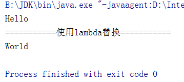

# Java8新特性

## Java8介绍

### 关于Java8

1. Java 8(又称为jdk 1.8)是Java语言开发的一个主要版本。
2. Java 8是oracle公司于2014年3月发布，可以看成是自Java5以来最具革命性的版本。Java 8为Java语言、编译器、类库、开发工具与JVM带来了大量新特性。

### Java8的特性

- 速度更快
- 代码更少(增加了新的语法: Lambda表达式)
- 强大的Stream API
- 便于并行
- 最大化减少空指针异常: Optional
- Nashorn引擎，允许在JVM上运行JS应用

## Lambda表达式

### 为什么使用Lambda表达式

Lambda是一个匿名函数，我们可以把Lambda表达式理解为是一-段可以传递的代码(将代码像数据一样进行传递)。使用它可以写出更简洁、更灵活的代码。作为-种更紧凑的代码风格，使Java的语自表达能力得到了提升。

### Lambda表达式举例

1. **示例一：匿名类中的函数表示**

```java
package com.dreamcold.java8;

/**
 * Lambda表达式的使用举例
 */
public class LambdaTest01 {
    public static void main(String[] args){
        Runnable r1=new Runnable() {
            @Override
            public void run() {
                System.out.println("我爱北京");
            }
        };
        r1.run();
        System.out.println("=========使用lambda表达式=========");
        Runnable r2=()->{
            System.out.println("我爱天津");
        };
        r2.run();
    }
}
```

效果：


2. **示例二：比较器中传入比较函数**

```java
package com.dreamcold.java8;

import java.util.Comparator;
/**
 * Lambda表达式的使用举例
 */
public class LambdaTest02 {
    public static void main(String[] args) {
        Comparator<Integer> com1=new Comparator<Integer>(){
            @Override
            public int compare(Integer o1, Integer o2) {
                return Integer.compare(o1,o2);
            }
        };
        System.out.println(com1.compare(12, 21));
        System.out.println("========使用lambda表达式========");
        Comparator<Integer> com2=(o1,o2)->Integer.compare(o1,o2);
        System.out.println(com2.compare(32, 21));
        System.out.println("=========使用::方法引用==================");
        Comparator<Integer> com3=Integer::compare;
        System.out.println(com3.compare(21,12));
    }
}
```

效果：


### Lambda表达式的使用

1. 举例: (o1,o2) -> Integer.compare(o1,02);

2. 格式:

```
->lambda操作符戚箭头操作符
->左边: lambda形参列表(其实就是 接口中的抽象方法的形参列表)
->右边: lambda体 (其实就是 重写的抽象方法的方法体)
```

3. Lambda 表达式的使用: (分为6 种情况介绍)

- 语法格式一。语法格式无参

```java
Runnable r1 =() -> {Systen.out.println("Hello Lambda!");};
```

- 语法格式二。Lambda需要一个参数， 但是没有返回值.

```java
Consumner<String> con = (String str) -> (System.out.println(str););
```

- 语缺格式三。数据类型可以省略，因为可由编评器推断得出。称为“类型推断”

```java
Consumer<String> con = (str) -> {System.out.println(str);};
```

- 语法格式四。Lambda若只需要一个参 数时，参数的小括号可以省略

```java
Consumer<String> con = str -> {System.out.println(str);};
```

- 语法格式五，Lambda雷要两个或以上的参数，多条执行语句，并且可以有返回值

```java
Comparator<Integer> com = (xy) > {
    System.out.println("实现函数式接口方法! ");
    return Integer.compare(x,y);
};
```

- 语认格式六。当Lambda体只有一条语句时. return与大括号若有``都可以省略

```java
Comparator< Integer> com = (x,y) > Integer.compare(x,y);
```

4. .Lambda表达式的本质:作为接口的实例

### 六种Lambda表达式实例

**示例一：语法格式一。语法格式无参**

```java
package com.dreamcold.java8;

/**
 * Lambda表达式的使用举例
 */
public class LambdaTest01 {
    public static void main(String[] args){
        Runnable r1=new Runnable() {
            @Override
            public void run() {
                System.out.println("我爱北京");
            }
        };
        r1.run();
        System.out.println("=========使用lambda表达式=========");
        Runnable r2=()->{
            System.out.println("我爱天津");
        };
        r2.run();
    }
}
```

效果：


示例二：语法格式二: Lambda 需要一个参数，但是没有返回值。

```java
package com.dreamcold.java8;

import java.util.function.Consumer;

public class LambdaTest03 {
    public static void main(String[] args) {
        Consumer<String> consumer=new Consumer<String>() {
            @Override
            public void accept(String s) {
                System.out.println(s);
            }
        };
        consumer.accept("Hello");
        System.out.println("===========使用lambda替换===========");
        Consumer<String> con1=(String s)->{
            System.out.println(s);
        };
        consumer.accept("World");
    }
}
```

效果：


示例四：数据类型可以省略，因为可由编译器推断得出，称为“类型推断”

```java
package com.dreamcold.java8;

import java.util.function.Consumer;

public class LambdaTest04 {
    public static void main(String[] args) {
        Consumer<String> consumer=new Consumer<String>() {
            @Override
            public void accept(String s) {
                System.out.println(s);
            }
        };
        consumer.accept("Hello");
        System.out.println("===========使用lambda替换===========");
        Consumer<String> consumer1=(s)->{
            System.out.println(s);
        };
        consumer1.accept("World");
    }
}
```

效果：



示例五：类型推断示例

```java
package com.dreamcold.java8;

import java.util.ArrayList;

public class Demo01 {
    public static void main(String[] args) {
        ArrayList<String> list=new ArrayList<>();//ArrayList<String> list=new ArrayList<String>();
        int[] arr={1,2,3};// int[] arr=new int[]{1,2,3};
    }
}
```

效果：


## 函数式(Functional)接口

## 方法引用与构造器引用

## 强大的Stream API

## Optional类

