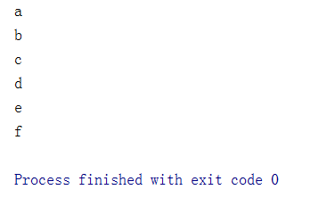

# Java8新特性

## Java8介绍

### 关于Java8

1. Java 8(又称为jdk 1.8)是Java语言开发的一个主要版本。
2. Java 8是oracle公司于2014年3月发布，可以看成是自Java5以来最具革命性的版本。Java 8为Java语言、编译器、类库、开发工具与JVM带来了大量新特性。

### Java8的特性

- 速度更快
- 代码更少(增加了新的语法: Lambda表达式)
- 强大的Stream API
- 便于并行
- 最大化减少空指针异常: Optional
- Nashorn引擎，允许在JVM上运行JS应用

## Lambda表达式

### 为什么使用Lambda表达式

Lambda是一个匿名函数，我们可以把Lambda表达式理解为是一-段可以传递的代码(将代码像数据一样进行传递)。使用它可以写出更简洁、更灵活的代码。作为-种更紧凑的代码风格，使Java的语自表达能力得到了提升。

### Lambda表达式举例

1. **示例一：匿名类中的函数表示**

```java
package com.dreamcold.java8;

/**
 * Lambda表达式的使用举例
 */
public class LambdaTest01 {
    public static void main(String[] args){
        Runnable r1=new Runnable() {
            @Override
            public void run() {
                System.out.println("我爱北京");
            }
        };
        r1.run();
        System.out.println("=========使用lambda表达式=========");
        Runnable r2=()->{
            System.out.println("我爱天津");
        };
        r2.run();
    }
}
```

效果：


2. **示例二：比较器中传入比较函数**

```java
package com.dreamcold.java8;

import java.util.Comparator;
/**
 * Lambda表达式的使用举例
 */
public class LambdaTest02 {
    public static void main(String[] args) {
        Comparator<Integer> com1=new Comparator<Integer>(){
            @Override
            public int compare(Integer o1, Integer o2) {
                return Integer.compare(o1,o2);
            }
        };
        System.out.println(com1.compare(12, 21));
        System.out.println("========使用lambda表达式========");
        Comparator<Integer> com2=(o1,o2)->Integer.compare(o1,o2);
        System.out.println(com2.compare(32, 21));
        System.out.println("=========使用::方法引用==================");
        Comparator<Integer> com3=Integer::compare;
        System.out.println(com3.compare(21,12));
    }
}
```

效果：


### Lambda表达式的使用

1. 举例: (o1,o2) -> Integer.compare(o1,02);

2. 格式:

```
->lambda操作符戚箭头操作符
->左边: lambda形参列表(其实就是 接口中的抽象方法的形参列表),如果参数列表只有一个参数可以省略()
->右边: lambda体 (其实就是 重写的抽象方法的方法体),如果Lambda体中仅仅只有一条执行语句，可能是return语句，可以省略一对{},以及return关键字
```

3. Lambda 表达式的使用: (分为6 种情况介绍)

- 语法格式一。语法格式无参

```java
Runnable r1 =() -> {Systen.out.println("Hello Lambda!");};
```

- 语法格式二。Lambda需要一个参数， 但是没有返回值.

```java
Consumner<String> con = (String str) -> (System.out.println(str););
```

- 语缺格式三。数据类型可以省略，因为可由编评器推断得出。称为“类型推断”

```java
Consumer<String> con = (str) -> {System.out.println(str);};
```

- 语法格式四。Lambda若只需要一个参 数时，参数的小括号可以省略

```java
Consumer<String> con = str -> {System.out.println(str);};
```

- 语法格式五，Lambda雷要两个或以上的参数，多条执行语句，并且可以有返回值

```java
Comparator<Integer> com = (xy) > {
    System.out.println("实现函数式接口方法! ");
    return Integer.compare(x,y);
};
```

- 语认格式六。当Lambda体只有一条语句时. return与大括号若有``都可以省略

```java
Comparator< Integer> com = (x,y) > Integer.compare(x,y);
```

4. .Lambda表达式的本质:作为接口的实例

### 六种Lambda表达式实例

**示例一：语法格式一。语法格式无参**

```java
package com.dreamcold.java8;

/**
 * Lambda表达式的使用举例
 */
public class LambdaTest01 {
    public static void main(String[] args){
        Runnable r1=new Runnable() {
            @Override
            public void run() {
                System.out.println("我爱北京");
            }
        };
        r1.run();
        System.out.println("=========使用lambda表达式=========");
        Runnable r2=()->{
            System.out.println("我爱天津");
        };
        r2.run();
    }
}
```

效果：


示例二：语法格式二: Lambda 需要一个参数，但是没有返回值。

```java
package com.dreamcold.java8;

import java.util.function.Consumer;

public class LambdaTest03 {
    public static void main(String[] args) {
        Consumer<String> consumer=new Consumer<String>() {
            @Override
            public void accept(String s) {
                System.out.println(s);
            }
        };
        consumer.accept("Hello");
        System.out.println("===========使用lambda替换===========");
        Consumer<String> con1=(String s)->{
            System.out.println(s);
        };
        consumer.accept("World");
    }
}
```

效果：


示例四：数据类型可以省略，因为可由编译器推断得出，称为“类型推断”

```java
package com.dreamcold.java8;

import java.util.function.Consumer;

public class LambdaTest04 {
    public static void main(String[] args) {
        Consumer<String> consumer=new Consumer<String>() {
            @Override
            public void accept(String s) {
                System.out.println(s);
            }
        };
        consumer.accept("Hello");
        System.out.println("===========使用lambda替换===========");
        Consumer<String> consumer1=(s)->{
            System.out.println(s);
        };
        consumer1.accept("World");
    }
}
```

效果：


示例五：类型推断示例

```java
package com.dreamcold.java8;

import java.util.ArrayList;

public class Demo01 {
    public static void main(String[] args) {
        ArrayList<String> list=new ArrayList<>();//ArrayList<String> list=new ArrayList<String>();
        int[] arr={1,2,3};// int[] arr=new int[]{1,2,3};
    }
}
```

效果：


示例六：语法格式四。Lambda若只需要一个参 数时，参数的小括号可以省略

```java
package com.dreamcold.java8;

import java.util.function.Consumer;

public class LambdaTest05 {
    public static void main(String[] args) {
        Consumer<String> consumer=new Consumer<String>() {
            @Override
            public void accept(String s) {
                System.out.println(s);
            }
        };
        consumer.accept("Hello");
        System.out.println("===========使用lambda替换===========");
        Consumer<String> consumer1=s->{
            System.out.println(s);
        };
        consumer1.accept("World");
    }
}
```

效果：


示例七：语法格式五: Lambda 需要两个或以上的参数，多条执行语句，并且可以有返回值

```java
package com.dreamcold.java8;

import java.util.Comparator;

public class LambdaTest06 {
    public static void main(String[] args){
        Comparator<Integer> com1=new Comparator<Integer>() {
            @Override
            public int compare(Integer o1, Integer o2) {
                System.out.println(o1);
                System.out.println(o2);
                return o1.compareTo(o2);
            }
        };
        System.out.println(com1.compare(12,21));
        System.out.println("========================");
        Comparator<Integer> com2=(o1,o2)->{
            System.out.println(o1);
            System.out.println(o2);
            return o1.compareTo(o2);
        };
        System.out.println(com2.compare(12,6));
    }
}
```

效果：


示例八：方法体只有一条语句时，return 与大括号若有，都可以省略。

```java
package com.dreamcold.java8;

import java.util.Comparator;

public class LamdaTest07 {
    public static void main(String[] args) {
        Comparator<Integer> com1=(o1,o2)->o1.compareTo(o2);
        System.out.println(com1.compare(1,12));
    }
}
```

## 函数式(Functional)接口

### 什么是函数式接口？

- 只包含一个抽象方法的接口，称为函数式接口。
- 你可以通过Lambda表达式来创建该接口的对象。(若 Lambda表达式抛出一个受检异常(即:非运行时异常)，那么该异常需要在目标接口的抽象方法上进行声明)。
- 我们可以在一个接口上使用@FunctionalInterface注解，这样做可以检查它是否是一个函数式接口。同时javadoc也会包含一条声明，说明这个
- 接口是一个函数式接口。在java.util.function包下定义了Java 8的丰富的函数式接口
  

### Java内置的四大函数式接口


## 方法引用与构造器引用

### 什么是方法引用

所谓方法引用，是指如果某个方法签名和接口恰好一致，就可以直接传入方法引用。

因为`Comparator<String>`接口定义的方法是`int compare(String, String)`，和静态方法`int cmp(String, String)`相比，除了方法名外，方法参数一致，返回类型相同，因此，我们说两者的方法签名一致，可以直接把方法名作为Lambda表达式传入：

```java
package com.dreamcold.java8;

import java.util.Arrays;
import java.util.Comparator;

public class Demo06 {
    public static void main(String[] args) {
        String[] things={"hello","world","kangyujian"};
        //原始的情况
        Arrays.sort(things, new Comparator<String>() {
            @Override
            public int compare(String o1, String o2) {
                return o1.compareTo(o2);
            }
        });
        //lambda表达式的写法
        Arrays.sort(things,(a,b)->{
            return a.compareTo(b);
        });
        //引用类方法
        Arrays.sort(things,Demo06::cmp);
        //引用实例方法,String类中compareTo是实例方法，但是之所以可以传入是因为该实例方法包含了默认参数this
        Arrays.sort(things,String::compareTo);

    }

    public static int cmp(String s1,String s2){
        return s1.compareTo(s2);
    }
}
```

### 构造方法引用

```java
package com.dreamcold.java8;

import java.util.Arrays;
import java.util.List;
import java.util.stream.Collectors;

class Person {
    String name;
    public Person(String name) {
        this.name = name;
    }

    @Override
    public String toString() {
        return "Person{" +
                "name='" + name + '\'' +
                '}';
    }
}

public class Demo07 {
    public static void main(String[] args) {
        String[] names={"xiaoming","xiaohong","xiaoli"};
        List<String> list = Arrays.asList(names);
        List<Person> personList=list.stream().map(Person::new).collect(Collectors.toList());
        for (int i = 0; i < personList.size() ;i++) {
            System.out.println(personList.get(i));
        }
    }
}
```

效果：


后面我们会讲到`Stream`的`map()`方法。现在我们看到，这里的`map()`需要传入的FunctionalInterface的定义是：

```java
@FunctionalInterface
public interface Function<T, R> {
    R apply(T t);
}
```

把泛型对应上就是方法签名`Person apply(String)`，即传入参数`String`，返回类型`Person`。而`Person`类的构造方法恰好满足这个条件，因为构造方法的参数是`String`，而构造方法虽然没有`return`语句，但它会隐式地返回`this`实例，类型就是`Person`，因此，此处可以引用构造方法。构造方法的引用写法是`类名::new`，因此，此处传入`Person::new`。

## 强大的Stream API

### 什么是Stream

Java从8开始，不但引入了Lambda表达式，还引入了一个全新的流式API：Stream API。它位于`java.util.stream`包中。

*划重点*：这个`Stream`不同于`java.io`的`InputStream`和`OutputStream`，它代表的是任意Java对象的序列。两者对比如下：

|      | java.io                  | java.util.stream           |
| :--- | :----------------------- | :------------------------- |
| 存储 | 顺序读写的`byte`或`char` | 顺序输出的任意Java对象实例 |
| 用途 | 序列化至文件或网络       | 内存计算／业务逻辑         |

有同学会问：一个顺序输出的Java对象序列，不就是一个`List`容器吗？

*再次划重点*：这个`Stream`和`List`也不一样，`List`存储的每个元素都是已经存储在内存中的某个Java对象，而`Stream`输出的元素可能并没有预先存储在内存中，而是实时计算出来的。

换句话说，`List`的用途是操作一组已存在的Java对象，而`Stream`实现的是惰性计算，两者对比如下：

|      | java.util.List           | java.util.stream     |
| :--- | :----------------------- | :------------------- |
| 元素 | 已分配并存储在内存       | 可能未分配，实时计算 |
| 用途 | 操作一组已存在的Java对象 | 惰性计算             |

我们总结一下`Stream`的特点：它可以“存储”有限个或无限个元素。这里的存储打了个引号，是因为元素有可能已经全部存储在内存中，也有可能是根据需要实时计算出来的。

`Stream`的另一个特点是，一个`Stream`可以轻易地转换为另一个`Stream`，而不是修改原`Stream`本身。

最后，真正的计算通常发生在最后结果的获取，也就是惰性计算。

```java
Stream<BigInteger> naturals = createNaturalStream(); // 不计算
Stream<BigInteger> s2 = naturals.map(BigInteger::multiply); // 不计算
Stream<BigInteger> s3 = s2.limit(100); // 不计算
s3.forEach(System.out::println); // 计算
```

惰性计算的特点是：一个`Stream`转换为另一个`Stream`时，实际上只存储了转换规则，并没有任何计算发生。

例如，创建一个全体自然数的`Stream`，不会进行计算，把它转换为上述`s2`这个`Stream`，也不会进行计算。再把`s2`这个无限`Stream`转换为`s3`这个有限的`Stream`，也不会进行计算。只有最后，调用`forEach`确实需要`Stream`输出的元素时，才进行计算。我们通常把`Stream`的操作写成链式操作，代码更简洁：

```java
createNaturalStream()
    .map(BigInteger::multiply)
    .limit(100)
    .forEach(System.out::println);
```

因此，Stream API的基本用法就是：创建一个`Stream`，然后做若干次转换，最后调用一个求值方法获取真正计算的结果：

```java
int result = createNaturalStream() // 创建Stream
             .filter(n -> n % 2 == 0) // 任意个转换
             .map(n -> n * n) // 任意个转换
             .limit(100) // 任意个转换
             .sum(); // 最终计算结果
```

**小结**

Stream API的特点是：

- Stream API提供了一套新的流式处理的抽象序列；
- Stream API支持函数式编程和链式操作；
- Stream可以表示无限序列，并且大多数情况下是惰性求值的

### 创建Stream

#### Stream.of()

创建`Stream`最简单的方式是直接用`Stream.of()`静态方法，传入可变参数即创建了一个能输出确定元素的`Stream`：

```java
package com.dreamcold.java8;

import java.util.stream.Stream;

public class Demo08 {
    public static void main(String[] args) {
        Stream<String> stringStream = Stream.of("a", "b", "c", "d", "e", "f");
        stringStream.forEach(System.out::println);
    }
}
```

效果：



#### 基于数组或Collection

第二种创建`Stream`的方法是基于一个数组或者`Collection`，这样该`Stream`输出的元素就是数组或者`Collection`持有的元素：

```java
package com.dreamcold.java8;

import java.util.Arrays;
import java.util.List;
import java.util.stream.Collectors;

public class Demo09 {
    public static void main(String[] args) {
        List<String> strings = Arrays.stream(new String[]{"a", "b", "c"}).collect(Collectors.toList());
        strings.stream().forEach(System.out::println);
    }
}
```

把数组变成`Stream`使用`Arrays.stream()`方法。对于`Collection`（`List`、`Set`、`Queue`等），直接调用`stream()`方法就可以获得`Stream`。

上述创建`Stream`的方法都是把一个现有的序列变为`Stream`，它的元素是固定的。

#### 基于Supplier

创建`Stream`还可以通过`Stream.generate()`方法，它需要传入一个`Supplier`对象：

```java
Stream<String> s = Stream.generate(Supplier<String> sp);
```

基于`Supplier`创建的`Stream`会不断调用`Supplier.get()`方法来不断产生下一个元素，这种`Stream`保存的不是元素，而是算法，它可以用来表示无限序列。

例如，我们编写一个能不断生成自然数的`Supplier`，它的代码非常简单，每次调用`get()`方法，就生成下一个自然数：

```java
package com.dreamcold.java8;

import java.util.function.Supplier;
import java.util.stream.Stream;

class NatualSupplier implements Supplier{

    Integer cnt=0;

    @Override
    public Object get() {
        cnt++;
        return cnt;
    }
}

public class Demo10 {
    public static void main(String[] args) {
        Stream generate = Stream.generate(new NatualSupplier());
        generate.limit(10).forEach(System.out::println);
    }
}
```

上述代码我们用一个`Supplier<Integer>`模拟了一个无限序列（当然受`int`范围限制不是真的无限大）。如果用`List`表示，即便在`int`范围内，也会占用巨大的内存，而`Stream`几乎不占用空间，因为每个元素都是实时计算出来的，用的时候再算。

对于无限序列，如果直接调用`forEach()`或者`count()`这些最终求值操作，会进入死循环，因为永远无法计算完这个序列，所以正确的方法是先把无限序列变成有限序列，例如，用`limit()`方法可以截取前面若干个元素，这样就变成了一个有限序列，对这个有限序列调用`forEach()`或者`count()`操作就没有问题。


#### 基于类型

因为Java的范型不支持基本类型，所以我们无法用`Stream<int>`这样的类型，会发生编译错误。为了保存`int`，只能使用`Stream<Integer>`，但这样会产生频繁的装箱、拆箱操作。为了提高效率，Java标准库提供了`IntStream`、`LongStream`和`DoubleStream`这三种使用基本类型的`Stream`，它们的使用方法和范型`Stream`没有大的区别，设计这三个`Stream`的目的是提高运行效率：

```java
package com.dreamcold.java8;

import java.util.Arrays;
import java.util.stream.IntStream;
import java.util.stream.Stream;

public class Demo11 {
    public static void main(String[] args) {
        Stream<int[]> stream = Stream.of(new int[]{1, 2, 3, 4, 5});
        IntStream stream1 = Arrays.stream(new int[]{1, 2, 3, 4, 5, 6});
        stream1.forEach(System.out::println);
        
    }
}
```

实现一个斐波那契数列:

```java
package com.dreamcold.java8;

import java.util.function.Supplier;
import java.util.stream.Stream;

class FibSupplier implements Supplier{
    int a=1;
    int b=0;

    @Override
    public Object get() {
        int temp=a+b;
        b=a;
        a=temp;
        return b;
    }
}

public class Demo12 {
    public static void main(String[] args) {
        Stream generate = Stream.generate(new FibSupplier());
        generate.limit(10).forEach(System.out::println);

    }
}
```

效果：

、

### Stream流的操作

#### map操作

`Stream.map()`是`Stream`最常用的一个转换方法，它把一个`Stream`转换为另一个`Stream`。

所谓`map`操作，就是把一种操作运算，映射到一个序列的每一个元素上。例如，对`x`计算它的平方，可以使用函数`f(x) = x * x`。我们把这个函数映射到一个序列1，2，3，4，5上，就得到了另一个序列1，4，9，16，25：

```ascii
            f(x) = x * x

                  │
                  │
  ┌───┬───┬───┬───┼───┬───┬───┬───┐
  │   │   │   │   │   │   │   │   │
  ▼   ▼   ▼   ▼   ▼   ▼   ▼   ▼   ▼

[ 1   2   3   4   5   6   7   8   9 ]

  │   │   │   │   │   │   │   │   │
  │   │   │   │   │   │   │   │   │
  ▼   ▼   ▼   ▼   ▼   ▼   ▼   ▼   ▼

[ 1   4   9  16  25  36  49  64  81 ]
```

可见，`map`操作，把一个`Stream`的每个元素一一对应到应用了目标函数的结果上。

```java
Stream<Integer> s = Stream.of(1, 2, 3, 4, 5);
Stream<Integer> s2 = s.map(n -> n * n);
```

如果我们查看`Stream`的源码，会发现`map()`方法接收的对象是`Function`接口对象，它定义了一个`apply()`方法，负责把一个`T`类型转换成`R`类型：

```java
<R> Stream<R> map(Function<? super T, ? extends R> mapper);
```

其中，`Function`的定义是：

```java
@FunctionalInterface
public interface Function<T, R> {
    // 将T类型转换为R:
    R apply(T t);
}
```

利用`map()`，不但能完成数学计算，对于字符串操作，以及任何Java对象都是非常有用的。例如：

```java
package com.dreamcold.java8;


import java.util.Arrays;
import java.util.List;
import java.util.stream.Stream;

public class Demo13 {
    public static void main(String[] args) {
        String[] fruit={"  Apple ", " pear ", " ORANGE", " BaNaNa "};
        Stream<String> stream = Arrays.stream(fruit);
        stream.map((x)->{
            return x.trim();
        }).map((x)->{
            return x.toLowerCase();
        }).forEach(System.out::println);
        
    }


}
```

#### filter操作

`Stream.filter()`是`Stream`的另一个常用转换方法。

所谓`filter()`操作，就是对一个`Stream`的所有元素一一进行测试，不满足条件的就被“滤掉”了，剩下的满足条件的元素就构成了一个新的`Stream`。

例如，我们对1，2，3，4，5这个`Stream`调用`filter()`，传入的测试函数`f(x) = x % 2 != 0`用来判断元素是否是奇数，这样就过滤掉偶数，只剩下奇数，因此我们得到了另一个序列1，3，5：

```ascii
            f(x) = x % 2 != 0

                  │
                  │
  ┌───┬───┬───┬───┼───┬───┬───┬───┐
  │   │   │   │   │   │   │   │   │
  ▼   ▼   ▼   ▼   ▼   ▼   ▼   ▼   ▼

[ 1   2   3   4   5   6   7   8   9 ]

  │   X   │   X   │   X   │   X   │
  │       │       │       │       │
  ▼       ▼       ▼       ▼       ▼

[ 1       3       5       7       9 ]
```

用IntStream写出上述逻辑，代码如下：

```java
package com.dreamcold.java8;

import java.util.stream.IntStream;

public class Demo14 {
    public static void main(String[] args) {
        IntStream.of(1,2,3,4,5,6,7,8,9).
                filter((x)->{return x%2==0;}).
                forEach(System.out::println);
    }
}
```

#### reduce

```java
package com.dreamcold.java8;

import java.util.stream.Stream;

public class Demo15 {
    public static void main(String[] args) {
        int sum= Stream.of(1,2,3,4,5,6,7,8,9).reduce(0,(acc,n)->acc+n);
        System.out.println(sum);
    }
}
```

效果：


**注意：**

`reduce()`方法将一个`Stream`的每个元素依次作用于`BinaryOperator`，并将结果合并。

`reduce()`是聚合方法，聚合方法会立刻对`Stream`进行计算。

## Optional类


