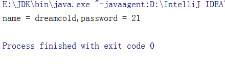

# 反射

## Java反射机制概述

### 什么是反射

- Reflection (反射)是被视为动态语言的关键，反射机制允许程序在执行期借助于Reflection API取得任何类的内部信息，并能直接操作任意对象的内部属性及方法。

- 加载完类之后，在堆内存的方法区中就产生了一个Class类型的对象(一个类只有一个Class对象)，这个对象就包含了完整的类的结构信息。我们可以通过这个对象看到类的结构。这个对象就像一面镜子，透过这个镜子看到类的结构，所以，我们形象的称之为:反射。


### 动态语言与静态语言

#### 动态语言

是一类在运行时可以改变其结构的语言:例如新的函数、对象、甚至代码可以被引进，已有的函数可以被删除或是其他结构上的变化。通俗点说就是在运行时代码可以根据某些条件改变自身结构。

主要动态语言: `Object-C. C#、JavaScript. PHP、Python、 Erlang`

#### 静态语言

与动态语言相对应的，运行时结构不可变的语言就是静态语言。如`Java、 C、C++`。

#### 关于Java的语言特性

Java不是动态语言，但Java可以称之为“准动态语言”。即Java有 ”定 的动态性，我们可以利用反射机制、字节码操作获得类似动态语言的特性。Java的动态性让编程的时候更加灵活!

### Java反射机制提供的功能

- 在运往时判断任意一个对象所属的类
- 在运行时构造任意一个类的对象
- 在运行时判断任意一个类所具有的成员变量和方法
- 在运行时获取泛型信息
- 在运行时调用任意一个对象的成员变量和方法
- 在运行时处理注解
- 生成动态代理

### 反射相关的主要API

- `java.lang.Class`:代表- 一个类
- `java.lang.reflect.Method`:代表类的方法
- `java.lang.reflect.Field`:代表类的成员变量
- `java.lang.reflect.Constructor`:代表类的构造器


### 反射之前对Person类的操作

1. 定义Person类

```java
class Person{
    public int age;
    private String name;


    public Person(int age, String name) {
        this.age = age;
        this.name = name;
    }

    private Person(String name){
        this.name=name;
    }

    public Person() {
    }

    public int getAge() {
        return age;
    }

    public void setAge(int age) {
        this.age = age;
    }

    public String getName() {
        return name;
    }

    public void setName(String name) {
        this.name = name;
    }

    public void show(){
        System.out.println("你好，我是"+this.name);
    }

    private String showNation(String nation){
        System.out.println("我的国籍是"+nation);
        return nation;
    }
}
```

2. 我们可以访问其公有的属性和方法

```java
public class Demo01 {
    public static void main(String[] args) {
        //1. 创建Person类对象
        Person p1=new Person(12,"Tom");

        //2. 通过对象，调用其内部的属性，方法
        p1.age=10;
        System.out.println(p1.toString());
        p1.show();
        //在Person类的内部，不可以通过Person类对象调用其内部的结构
        //比如:name、showNation()以及其私有的构造函数
    }
}
```

### 使用反射可以对一个Person类的操作

1. 通过反射调用对应类的构造器

```java
public static void main(String[] args) throws NoSuchMethodException, IllegalAccessException, InvocationTargetException, InstantiationException {
    Class clazz=Person.class;//获取Person类的class类
    Constructor cons=clazz.getConstructor(int.class,String.class);//通过反射获取构造器
    Object obj=cons.newInstance(12,"Tom");//通过发射调用构造器创建对象
    System.out.println(obj.toString());

}
```

效果：


2. 通过反射访问类的属性与方法

```java
public static void main(String[] args) throws NoSuchMethodException, IllegalAccessException, InvocationTargetException, InstantiationException, NoSuchFieldException {
    //通过反射，调用对象的指定的属性、方法
    Class clazz=Person.class;
    Constructor cons=clazz.getConstructor(int.class,String.class);
    Object obj=cons.newInstance(12,"Tom");
    System.out.println(obj.toString());
    Field name = clazz.getDeclaredField("age");
    name.set(obj,10);
    System.out.println(obj.toString());
}
```

效果：


3. 通过反射调用方法

```java
public static void main(String[] args) throws NoSuchMethodException, IllegalAccessException, InvocationTargetException, InstantiationException, NoSuchFieldException {
    //通过反射，调用对象的指定的属性、方法
    Class clazz=Person.class;
    Constructor cons=clazz.getConstructor(int.class,String.class);
    Object obj=cons.newInstance(12,"Tom");
    System.out.println(obj.toString());
    Field name = clazz.getDeclaredField("age");
    name.set(obj,10);
    System.out.println(obj.toString());
    //反射调用方法
    Method show = clazz.getDeclaredMethod("show");
    show.invoke(obj);


}
```

效果：


4. 通过反射，可以调用Person类的私有结构的。比如:私有的构造器、方法、属性

```java
public static void main(String[] args) throws NoSuchMethodException, IllegalAccessException, InvocationTargetException, InstantiationException, NoSuchFieldException {
    //通过反射，调用对象的指定的属性、方法
    Class clazz=Person.class;
    Constructor cons=clazz.getConstructor(int.class,String.class);
    Object obj=cons.newInstance(12,"Tom");
    System.out.println(obj.toString());
    Field name = clazz.getDeclaredField("age");
    name.set(obj,10);
    System.out.println(obj.toString());
    //反射调用方法
    Method show = clazz.getDeclaredMethod("show");
    show.invoke(obj);
    //通过反射。可以地哦啊用Person类的私有结构，比如私有的构造器、方法、属性
    Constructor constructor=clazz.getDeclaredConstructor(String.class);
    constructor.setAccessible(true);
    Person p2=(Person) constructor.newInstance("Jerry");
    System.out.println(p2);


}
```

效果：


5. 修改私有属性

```java
public static void main(String[] args) throws NoSuchFieldException, IllegalAccessException {
    Person p1=new Person(12,"dreamcold");
    Class clazz=Person.class;
    //调用私有属性
    Field name = clazz.getDeclaredField("name");
    name.setAccessible(true);
    name.set(p1,"HanMeiMei");
    System.out.println(p1);
}
```

效果：


6. 调用私有方法

```java
public static void main(String[] args) throws NoSuchFieldException, IllegalAccessException, NoSuchMethodException, InvocationTargetException {
    Person p1=new Person(12,"dreamcold");
    Class clazz=Person.class;
    //调用私有属性
    Field name = clazz.getDeclaredField("name");
    name.setAccessible(true);
    name.set(p1,"HanMeiMei");
    System.out.println(p1);
    //调用私有方法
    Method showNation = clazz.getDeclaredMethod("showNation", String.class);
    showNation.setAccessible(true);
    showNation.invoke(p1,"中国");//相当于p1.showNation("中国")
    
}
```

效果：


### 如何看待反射破坏封装性

1. 疑问:通过直接new的方式或反射的方式都可以调用公共的结构，开发中到底用那个?

- 建议:直接new的方式
- 什么时候会使用:反射的方式。 反射的特征:动态性，比如servlet在接收浏览器路径的时候，根据不同的路径造不同对应的对象

2. 疑问:反射机制与面向对象中的封装性是不是矛盾的?如何看待两个技术?

- 不矛盾，封装性相当于建议你怎么调，但是实际还是可以通过反射来访问私有属性的

## 理解Class类并获取Class实例

### 关于java.lang.class的理解

1. 类的加载过程: 
   程序经过javac.exe命令以后，会生成一个或多个字节码文件(.class结尾),接着我们使用Java.exe命令对某个字节码文件进行解释运行。相当于将某个字节码文件加载到内存中。相当于将某个字节码文件加载到内存中。加载到内存中的类，我们就称为运行时类，此运行时类，就作为Class的一个实例。
2. 万事万物皆对象?对象. xxx, File,URL,反射,前端、数据库操作,换句话说，Class的实例就对应着一个运行时类。

### class实例的获取

加载到内存中的运行时类，会缓存- -定的时间。在此时间之内，我们可以通过不同的方式
来获取此运行时类。获取Class对象的三种方式:

```java
    public static void main(String[] args) throws NoSuchFieldException, IllegalAccessException, NoSuchMethodException, InvocationTargetException, ClassNotFoundException {
        //方式一：调用运行时类的属性: .class
        Class clazz1=Person.class;
        System.out.println(clazz1);
        //方式二:通过运行时类的对象
        Person p1=new Person();
        Class clazz2=p1.getClass();
        System.out.println(clazz2);
        //方式三:调用Class的静态方法: forName(String classPath)
        Class clazz3=Class.forName("com.dreamcold.thread.NumThread");
        System.out.println(clazz3);
        //方式四：使用类加载器: ClassLoader
        ClassLoader classLoader=Person.class.getClassLoader();
        Class claszz4=classLoader.loadClass("com.dreamcold.reflect.Person");
        System.out.println(claszz4);
        System.out.println(clazz1==claszz4);

    }
```

效果：


### 那些可以有Class对象

外部类，成员(成员内部类，静态内部类)，局部内部类，匿名内部类
(2) interface: 接口
(3) []: 数组
(4) enum:枚举
(5) annotation: 注解@interface
(6) primitive type:基本数据类型
(7) void

```java
Class c1 = object. class;
Class c2 = Comparable. class;
Class c3 = String[] .class;
Class c4 = int[][] . class;
Class c5 = ElemenitType. class;
Class c6 = Override. class;
Class c7 = int.class;
Class C8 = void.class;
Class c9 = Class. class;
int[] a = new int[10] ;
int[] b = new int[100] ;
Class c10 = a.getClass();
Class c11 =b. getClass();
//只要元素类型与维度一样,就是同一个Class
System. out. println(c10 == c11);
```

### 类的加载过程

当程序正动使用某个类时，如果该类还未被加载到内存中，则系统会通过如下三个步骤来对该类进行初始化。


加载:将class文件字节码内容加载到内存中，并将这些静态数据转换成方法区的运行时
数据结构，然后生成-一个代表这个类的java.lang.Class对象，作为方法区中类数据的访问
入口(即引用地址)。所有需要访问和使用类数据只能通过这个Class对象。这个加载的
过程需要类加载器参与。

- 链接:将Java类的二 进制代码合并到JVM的运行状态之中的过程。
  - 验证:确保加载的类信息符合JMM规范，例如:以cafe开头， 没有安全方面的问题
  - 准备:正式为类变量(static) 分配内存并设置类变量默认初始值的阶段，这些内存都将在方法区中进行分配。
  - 解析:虚拟机常量池内的符号引用(常量名)替换为直接引用(地址)的过程。
- 初始化:
  - 执行类构造器`<clinit>()`方法的过程。类构造器`<clinit>()`方法是由编译期自动收集类中
    所有类变量的赋值动作和静态代码块中的语句合并产生的。(类构造 器是构造类信
    息的，不是构造该类对象的构造器)。
  - 当初始化一个类的时候，如果发现其父类还没有进行初始化，则需要先触发其父类
    的初始化。
  - 虚拟机会保证一个类的`<clinit>`()方 法在多线程环境中被正确加锁和同步。

```java
pub1ic class ClassLoadingTest {
public static void main(String[] args) {
	System. out .print1n(A.m);
}
class A {
	static{
		m =300;
	}
	static int m = 100;
//第二步:链接结束后m=6
//第三步:初始化后，m的值由<clinit>()方法执行决定
//这个A的类构造器<clinit>()方法由类变量的赋值和静态代码块中的语句按照顺序合并产生，类似于
    <clinit>(){
    m = 300;
    m =100;
	}
}
```


## 类的加载与ClassLoader的理解

### 类加载器的作用


- 类加载的作用:将class文 件字节码内容加载到内存中，并将这些静态数据转换成方法区的运行时数据结构，然后在堆中生成-一个代表这个类的java.langCass对象，作为。方法区中类数据的访问入口。
- 类缓存:标准的JavaSE类加载器可以按要求查找类，但一旦某个类被加载到类加载器中，它将维持加载(缓存)一段时间。不过JVM垃圾回收机制可以回收这些lass对象。


### 了解Classloader

类加载器作用是用来把类(class)装载进内存的。JVM规范定义了如下类型的类的加载器。


- 引导类加载器:用C++编写的，是JMM自带的类加载器，员Java平台核心库，用来装载核心类库。该加载器无法直接获职

- 扩展类加战器:负责e/ibext目录下的ar包或-java.ext.dirs指定目录下的ar包装入工作库系统类加载器:负责java- classpalh或 

- java.class path所指的目录下的类与jar包装入工作，是最常用的加戟器

```java
package com.dreamcold.reflect;

public class ClassLoaderTest {
    public static void main(String[] args) {
        //对于自定义类，使用系统类加载器进行加载
        ClassLoader classLoader = ClassLoaderTest.class.getClassLoader();
        System.out.println(classLoader);
        //调用系统类加载器的getParent():获取扩展类加载器
        ClassLoader parent = classLoader.getParent();
        System.out.println(parent);
        //引导类加载器主要负责加载java的核心类库，无法加载自定义类的。
        ClassLoader parent1 = parent.getParent();
        System.out.println(parent1);
    }
}
```

效果：


### Properties:用来读取配置文件

1. 读取配置文件的方式一

```java
package com.dreamcold.reflect;

import java.io.FileInputStream;
import java.io.FileNotFoundException;
import java.io.IOException;
import java.util.Properties;

public class Demo02 {
    public static void main(String[] args) throws IOException {
        Properties pros=new Properties();
        FileInputStream fis=new FileInputStream("classload.properties");
        pros.load(fis);
        String name = pros.getProperty("name");
        String age=pros.getProperty("age");
        System.out.println("name = "+name+",password = "+age);
    }
}
```

效果：


2. 读取配置文件的方式二

```java
package com.dreamcold.reflect;

import java.io.FileInputStream;
import java.io.FileNotFoundException;
import java.io.IOException;
import java.io.InputStream;
import java.util.Properties;

public class Demo02 {
    public static void main(String[] args) throws IOException {
        Properties pros=new Properties();
//        FileInputStream fis=new FileInputStream("classload.properties");
//        pros.load(fis);
        ClassLoader classLoader=ClassLoaderTest.class.getClassLoader();
        InputStream resourceAsStream = classLoader.getResourceAsStream("classload.properties");
        pros.load(resourceAsStream);
        String name = pros.getProperty("name");
        String age=pros.getProperty("age");
        System.out.println("name = "+name+",password = "+age);
    }
}
```

效果：


原因：配置文件默认识别为:当前module的src下，配置文件放在如下的位置：


再次运行：




## 创建运行时类的对象

newInstance():调用此方法，创建对应的运行时类的对象

要想此方法正常的创建运行时类的对象，要求:

1. 运行时类必须提供空参的构造器
2. 空参的构造器的访问权限得够。通常，设置为public。

注意：

在javabean中要求提供一public 的空参构造器。原因:

1. 便于通过反射，创建运行时类的对象
2. 便于子类继承此运行时类时，默认调用super()时，保证父类有此构造器

```java
package com.dreamcold.reflect;

public class NewInstanceTest {
    public static void main(String[] args) throws IllegalAccessException, InstantiationException {
        Class claz=Person.class;
        Object o = claz.newInstance();
        System.out.println(o.toString());
    }
}
```

效果：


### 举例反射是动态语言的关键

该例子会随机创建对应的不同对象，体现了反射的动态性

```java
package com.dreamcold.reflect;

import java.util.Random;

public class Demo03 {
    /**
     * 创建- -个指定类的对象。
     * classPath:指定类的全类名
     * @param args
     * @throws ClassNotFoundException
     * @throws IllegalAccessException
     * @throws InstantiationException
     */
    public static void main(String[] args) throws ClassNotFoundException, IllegalAccessException, InstantiationException {
        int num=new Random().nextInt(3);//0,1,2
        String classPath="";
        switch (num){
            case 0:
                classPath="java.util.Date";
                break;
            case 1:
                classPath="java.sql.Date";
                break;
            case 2:
                classPath="com.dreamcold.reflect.Person";
                break;
        }
        try {
            Object obj=newInstance(classPath);
            System.out.println(obj);
        }catch (Exception e){
            e.printStackTrace();
        }
    }

    private static Object newInstance(String classPath) throws ClassNotFoundException, IllegalAccessException, InstantiationException {
        return Class.forName(classPath).newInstance();
    }
}
```

## 获取运行时类的完整结构

### 前提准备

反射提供了很多丰富的接口来帮助我们获取类的相应信息：

**Person类**

```java
package com.dreamcold.reflect2;

@MyAnnoation("hi")
public class Person extends Creature<String> implements  Comparable<String> ,MyInterface{
    private String name;
    int age;
    public int id;

    @MyAnnoation("abc")
    public Person(){

    }

    private Person(String name){
        this.name=name;
    }

    public Person(String name,int age){
        this.name=name;
        this.age=age;
    }
    @MyAnnoation
    private String show(String nation){
        System.out.println("我的国籍是: "+nation);
        return nation;
    }

    public String display(String insterest){
        return insterest;
    }

    @Override
    public void info() {
        System.out.println("我是一个人");
    }

    @Override
    public int compareTo(String o) {
        return 0;
    }
}
```

**自定义注解MyAnnoation**

```java
package com.dreamcold.reflect2;

import java.lang.annotation.Retention;
import java.lang.annotation.RetentionPolicy;
import java.lang.annotation.Target;

import static java.lang.annotation.ElementType.*;
import static java.lang.annotation.ElementType.LOCAL_VARIABLE;

@Target({TYPE, FIELD, METHOD, PARAMETER, CONSTRUCTOR, LOCAL_VARIABLE})
@Retention(RetentionPolicy.RUNTIME)
public @interface MyAnnoation {
    String value() default "hello";
}
```

**自定义接口MyInterface**

```java
package com.dreamcold.reflect2;

public interface MyInterface {
    void info();
}
```

**父类Creature**

```java
package com.dreamcold.reflect2;

import java.io.Serializable;

public class Creature<T> implements Serializable {
    private char gender;
    public double weight;

    private void breath(){
        System.out.println("生物呼吸");
    }

    public void eat(){
        System.out.println("生物吃东西");
    }
}
```

目录的完整结构：


## 调用运行时类的指定结构

## 反射的应用:动态代理

