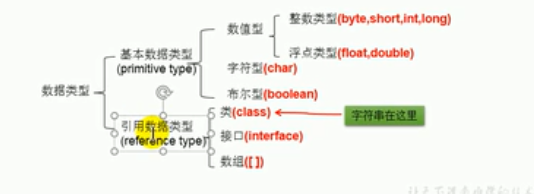
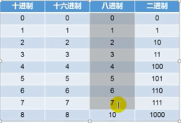
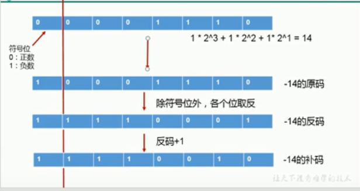

# 关键字和保留字

- 定义：被Java语言赋予了特殊的含义,用做专门用途的字符串(单词)
- 特点：关键字所有字母都为小写


保留字：现在的Java版本尚未使用，但是以后的版本可能会作为关键字使用，自己明明的标识符是后要避免使用这些关键字
goto、const

# 标识符

标识符
- Java对各种变量、类和方法等要素命名实收使用的字符序列成为标识符
- 技巧:凡是自己可以起名字的地方都叫做标识符

定义合法标识符的规则
- 由26个英文字母大小写，0-9,_或$组成
- 数字不可以开头
- 不可以使用关键字和保留字，但是可以包含关键字和保留字
- Java中严格区分大小写，长度没有限制
- 标识符不得包含空格

Java中的名称命名规范

- 包名：多单词组成所有的字母小写：xxxyyyzzz
- 类名、接口吗：多单词组成，所有的单词的首字母大写:XxxYyyZzzz
- 变量名、方法名：多单词组成时候，第一个单词首字母小写，第二个单词开始没单词首字母大写xxxYyyZzz
- 常量名：所有的字母都大写，多单词时候，每个单词用下划线进行连接XXX_YYY_ZZZ
- 在起名字的时候，为了提高可读性，要尽量的有意义，“见名知意”
- Java采用的是unicode字符集，因此标识符可以采用汉字声明，但是不建议使用

## 变量

### 变量的定义


变量的概念
- 内存中的一个存储区域
- 该区域的数据可以在一个同类型范围内不断变化
- 变量是程序中最基本的存储单元，包含变量类型、变量名、和存储的值

变量的作用
- 在内存的中保存数据

使用变量注意

- Java中每个变量必须声明，后使用
- 使用变量名来访问该区域的数据
- 变量的作用域，其定义在一对{}内
- 变量仅仅在它的作用域才有效
- 同一个作用域不能定义重名的变量

### 基本数据类型

分类



|基本类型|位数|	字节|	默认值|
|---|---|---|---|
|int|32|	4	|0|
|short|	16	|2|	0|
|long|	64|	8|	0L|
|byte|	8 |	1|	0|
|char|	16|	2|	'u0000'|
|float|	32|	4|	0f|
|double|	64|	8|	0d|
|boolean|	1 |	|	false|

整数类型

- Java各个整数类型有固定的表数范围和字段长度，不受具体的OS的影响，一保证Java程序的可移植性
- Java的整型常量默认为int型，声明long中常量后必须加上'l'或者'L'
- Java程序中变量通常声明为int型除非哦=不足以表示较大的数据，才使用long

浮点类型

- 与整数类型蕾西，Java浮点类型也有固定的表数范围和字段长度，不受具体的操作系统的影响
- 浮点型常量有梁总表示形式
    - 十进制的形式，如：5.12 512.0f 512(必须有小数点)
    - 科学计数法的形式：5.12e2 512E2 100E-2
- float：单精度，尾数可以精确到7位有效数组，很多情况下精度难以满足需求
- double：双精度：精度是float的两倍通常采用此类型
- Java的浮点数常量默认都是double类型，声明float类型的常量，需后面加上'f'或者'F'


字符类型

- char型数据用来表示通常意义上的“字符”(两字节)
- Java中的所以字符都使用Unicode编码，故一个字符可以存储一个字母，一个汉字，或者其他书面语的一个字符
- 字符型变量又三种表现形式
    - 字符常量是用单引号('')括起来的单个字符，例如char c1='a' ; char c2='中';char c3='9';
    - Java中还允许使用转义字符'\'来将其后面的字符转变为特殊的字符型常量，例如char c3='\n';//'\n'是表示换行符

    - 直接使用unicode值来表示字符型号的常量，'\uXXXX',其中XXXX代表一个十六进制的整数，如'\u000a'表示'\n'

- char类型是可以进行运算的，因为他们都是对应着unicode码

ASCLL码

- 在计算机的内部，所有的数据采用二进制表示，每个二进制为有0和1两种状态，因此8个二进制位就可以组合出256种状态，这被称为一个字节，一个字节一共可以用来表示256种不同的状态，每一个状态对应一个符号，就是256个符号，从0000000到1111111

- ASCll码，美国制定的一套字符编码，对英语字符与二进制之间的关系，做了统一的规定，这被称为ASCll码，ASCll码一共规定了128个字符的编码，比如"SPACE"是32，大写的字母A是65，这128个符号，仅仅占用一个字节的后面7位，最前面的1位统一规定为0

布尔类型

- 仅仅能取true和false两个值
- 常常在条件判断，循环结构中使用

## 自动类型转换

前提这里对于7中基本数据类型变量间的运算，不包含Boolean类型的

### 自动类型提升

byte、short、int-->long-->float -->double

结论：当容量小的数据类型变量与容量大的数据类型变量做运算的时候，自动提升为容量大的数据类型

说明：此时容量的带下，表示数的范围的大和小，比如float容量要大于long的容量

byte、short、char三者任意两者之间做运算得到的结果都是int

### 强制类型转换

自动提升运算的逆运算，比如将一个容量大的类型变量赋值给一个容量小的类型变量,该操截断了小数点后面的部分，损失了精度


```java
package day01;

public class Variable {
    public static void main(String[] args) {
        double d=3.14;
        int a=(int)d;
        System.out.println(a);

    }
}
```

- 强制类型转换可能会导致精度损失
- 需要使用强制转换符()

## String类型

- String属于引用数据类型
- 声明String类型的变量的时候，使用一对""
- String可以和八种数据类型做运算且运算仅仅是连接运算也就是+
- 运算的结果依旧是String类型

## 进制与进制之间的转换



- 所有数字在计算机底层都是以二进制形式存在的

- 对于整数，有四种表示方式
    - 二进制：0,1,满2进1，以0b和0B开头
    - 十个进制：0-9，满10进1
    - 八进制 0-7，满8进1，以数字0开头表示
    - 十六进制(hex) 0-9以及A-F，满16进1，以0x或者0X表示，此处的A-F不区分大小写，如0x21AF+1=0x21B0


### 二进制与十进制之间的转换

```
172
=128+32+8+4
=2^7+2^5+2^3+2^2
=10000000+100000+1000+100
=10101100

10101100=2^7+2^5+2^3+2^2=172

```

- Java整数常量默认是int类型，当用二进制定义整数时候，其32位是符号为，当时long类型的时候，二进制默认是64位，当64位是符号位
-二进制整数有如下三种形式：
    - 原码：直接将一个数值换成二进制数，最高位是符号位
    - 负数的反码：是对原码按照位数取反，知识最高位确定为1
    - 负数的补码：其反码加1

总结
- 对于正数来说三码合一
- 对于负数来说原码、反码、补码存在的关系
    - 原码-->反码，除了符号位以外，所有位取反
    - 反码-->补码，末位加一
- 计算机的底层都是通过补码的方式来存储数据，无论是正数或者负数都是一样




### 二进制与八进制十六进制之间转换


1. 二进制转八进制，从低到高，每三个位数作为一位
2. 二进制转十六进制，从低到高，每四个位作为一位


