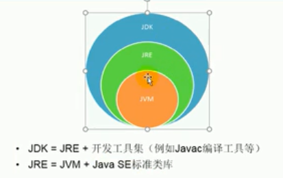
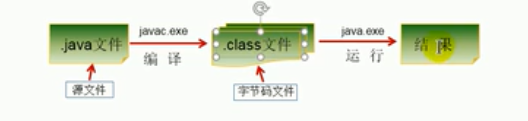

# 软件开发介绍

## 软件开发

软件，也就是按照一定的顺序组织的计算机数据和指令的集合。有系统软件和应用软件之分。


## 人机交互的方式

- 图形化界面(GUI)：这种方式简单直观，使用者容易接受，容易上手操作

- 命令行方式：需要一个控制台，输入指定的命令，让计算机完成一些操作，较为麻烦，需要激励一些命令

## 常见DOS命令

- dir:列出当前目录下的文件以及文件夹
- md+文件夹名称:创建目录
- rd:删除目录
- d::进入根目录D盘
- cd+目录名：进入目录中
- cd..：回退到上一级目录
- cd/:进入到根目录中
- echo javase>1.doc:创建文件
- ↑或者↓：可以调出之前的命令
- del+文件名：删除当前目录中的文件
- del+*.txt:删除该目录下的所有txt后缀的文件
- rd+文件夹名称：删除文件夹
- cd /d 路径：跨盘切换路径

## 计算机编程语言的介绍

语言：是人与人之间用于沟通的一种方式，例如：中国人与中国人用普通话沟通，而中国人与英国人交流的话，就要用英语

计算机语言：人和计算机交流的方式

如果人和计算机交流，那么就要学习计算机语言
计算机语言分为很多种比如C++，C，Python,Go...等

**第一代语言**
机器语言：指令通过二进制代码的形式存在

**第二代语言**
汇编语言，使用助记符表示一条机器指令

**第三代语言**
高级语言
- C、Pascal、Fortran面向过程的语言
- C++面向过程/面向对象
- Java快平台的纯面向对象的语言
- NET跨平台的原因
- Python、Scala

## Java语言的优点

- 简单易学；
- 面向对象（封装，继承，多态）；
- 平台无关性（ Java 虚拟机实现平台无关性）；
- 可靠性；
- 安全性；
- 支持多线程（ C++ 语言没有内置的多线程机制，因此必须调用操作系统的多线程功能来进行多线程程序设计，而 Java 语言却提供了多线程支持）；
- 支持网络编程并且很方便（ Java 语言诞生本身就是为简化网络编程设计的，因此 Java 语言不仅支持网络编程而且很方便）；
- 编译与解释并存；


## Java语言概述

- 是SUN公司1995年推出的一门高级语言
- 是一门面向Internet的编程语言。Java一开始富有吸引力是因为Java可以在WEB浏览器中运行。这些Java程序被称为Java小程序(applet),applet使用现代的图形界面和WEB用户进行交互，Applet内嵌在HTML代码中。
- 随着Java技术在WEB方面的不断成熟，已经成为了WEB程序的首选的开发语言

## Java重要的时间节点

- 2004年，发布了里程碑式版本JDK1.5，为了突出版本的重要性，更名为JDK5.0
- 2014年，发布JDK8.0，是JDK5.0以来最大变化的版本


## Java主要的应用领域

- 企业级应用
- Android平台应用
- 大数据平台开发

## Java运行的机制和运行过程

### 面向对象
- 两个基本概念：类、对象
- 三大特性：封装、继承、多态

### 健壮性
- 吸收了C/c++的语言特点，但是去掉了其影响程序健壮性的部分(比如指针、内存申请与释放等等)，提供一个相对安全的内存管理和访问机制

### 跨平台

- 跨平台性：通过Java语言编写的应用程序在不同的平台上都可以运行，一次编写处处运行
- 原理：仅仅需要运行在Java应用程序的操作系统，先安装一个Java虚拟机就可以，由JVM负责Java程序在该系统上的运行


因为有了JVM，同一个Java程序在三个不同的操作系统中都可以执行，这样就实现了Java程序的跨平台性。

## Java两种核心机制

### Java虚拟机

JVM是一个虚拟的计算机，具有指令集并使用不用的存储区域。负责执行指令，管理数据、内存、寄存器

* 针对不同的平台有不同的虚拟机
* 只有某平台提供了对应的Java虚拟机，Java程序才能在此平台运行
* Java虚拟机机制屏蔽了底层运行平台的差别，实现一次编译导出运行


### 垃圾回收机制

- 在使用C/C++等语言中，由程序员负责回收无用的内存
- Java语言清除了程序员回收无用内存空间的责任，它提供一种系统级线程跟踪存储空间的分配情况，并在JVM空闲的时候，检查并释放那些可以被释放的存储空间。

- 垃圾回收机制在Java1程序运行的过程中自动进行，程序员无法精确的控制和干预
- 尽管有这样的垃圾回收机制，Java程序还会出现内存泄漏和内存溢出问题

### 什么是JDK，JRE

### JDK（Java开发工具）

JDK是提供给Java开发人员的使用的，其中包含了Java开发工具的开发工具，也包括了JRE，所以安装了JDK就不用再单独安装JRE了，其中的开发工具包括编译工具(javac.exe)和打包工具(jar.exe)

### JRE（Java运行环境）

包括了Java虚拟机和Java所需要的核心类库等，如果仅仅需要运行一个开发好的Java程序，计算机中仅仅需要按照JRE就可以了




## Java的实际安装和配置

[安装教程](https://how2j.cn/k/helloworld/helloworld-jdk/141.html)

## HelloWorld

1. 将Java代码编写到扩展名为.java中的文件中去
2. 通过javac命令对该java文件进行编译
3. 通过java命令对生成的class文件进行运行



```java
package day01;

public class HelloWorld {
    public static void main(String[] args) {
        System.out.println("Hello World!");
    }
}
```

## 注释

- 用于注解说明解释程序的文字就是注释

- Java中的注释类型
    - 单行注释
    - 多行注释
    - 文档注释(Java特有的)
- 提高了代码的阅读性，调试程序的重要方法
- 注释是一个程序员必须要具有的良好的编程习惯
- 将自己的思想通过注释先整理出来，在用代码来进行实现
- 文档注释可以被JDK所提供的工具javadoc所解析的，生成一套以网页形式体现的该程序的说明文档
- 多行注释不可以嵌套使用

```java
 //单行注释
    /* 多行
        注释
     */
    /**
     * @author me
     * @version me
     */
```

## JDK文档下载

[下载地址](https://www.oracle.com/java/technologies/javase-downloads.html)


