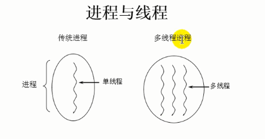
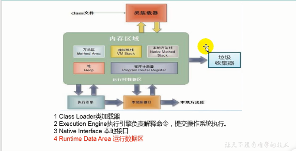
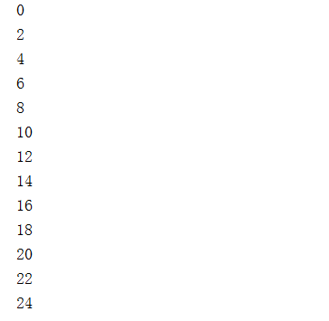
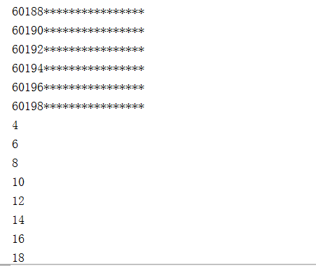
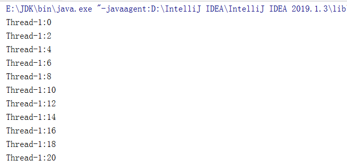
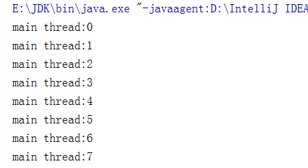
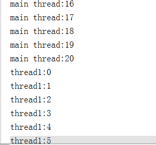

# 多线程

## 程序、进程、线程

### 进程与线程



- 程序(program)是为完成特定任务、用某种语言编写的一-组指令的集合。即指一段静态的代码，静态对象。

- 进程(process)是程序的一次执行过程，或是正在运行的一个程序。是一个动态的过程:有它自身的产生、存在和消亡的过程。一生命周期
  - 如:运行中的QQ，运行中的MP3播放器
  - 程序是靜态的，进程是动态的
  - 进程作为资源分配的单位，系统在运行时会为每个进程分配不同的内存区域
- 线程(thread)，进程可进一- 步细化为线程，是一个程序内部的一条执行路径。
    - 若一个进程同一时间并行执行多个线程，就是支持多线程的
    - 线程作为调度和执行的单位，每个线程拥有独立的运行栈和程序计数器(pc),线程切换的开销小
    - 一个进程中的多个线程共享相同的内存单元/内存地址空间>它们从同一堆中分配对象，可以问相同的变量和对象。这就使得线程间通信更简便、高效。但多个线程操作共享的系统资源可能就会带来安全的隐患。
    - 线程各自独立有栈和PC，共享堆和方法区




### 单核CPU和多核CPU的理解

- 单核CPU,其实是一种假的多线程，因为在一 一个时间单元内，也只能执行一一个线程的任务。例如:虽然有多车道，但是收费站只有-一个工作人员在收费，只有收了费才能通过，那么CPU就好比收费人员。如果有某个人不想交钱，那么收费人员可以把他“挂起”(晾着他， 等他想通了，准备好了钱，再去收费)。但是因为CPU时间单元特别短，因此感觉不出来。

- 如果是多核的话，才能更好的发挥多线程的效率。 (现在的服务器都是多核的)

- 一个Java应用程序java.exe，其实至少有三个线程: main()主线程，gc()垃圾回收线程，异常处理线程。当然如果发生异常，会影响主线程。

### 并行与并发
- 并行:多个CPU同时执行多个任务。比如:多个人同时做不同的事。
- 并发: 一个CPU(采用时间片)同时执行多个任务。比如:秒杀、多个人做同一件事.


### 使用多线程的优点

背景:以单核CPU为例， 只使用单个线程先后完成多个任务(调用多个方法)，肯定比用多个线程来完成用的时间更短，为何仍需多线程呢?
**多线程程序的优点:**

1. 提高应用程序的响应。对图形化界面更有意义，可增强用户体验。
2. 提高计算机系统CPU的利用率
3. 改善程序结构。将既长又复杂的进程分为多个线程，独立运行，利于理解和修改

### 何时需要多线程

- 程序需要同时执行两个或多个任务。
- 程序需要实现- -些需要等待的任务时，如用户输入、文件读写操作、网络操作、搜索等。
- 需要一些后台运行的程序时。

## 线程的创建和使用

**引例一**

如下的程序不是多线程!

```java
public class Sample {
public void method1(String str) {
	System.out.println(str);
}
public void method2(String str) {
	method1(str);
}
public static void main(String[] args) {
	Sample s = new Sample(); 
	s.method2( "hello!");
}

```

其中的路径为`main->method2->method1`仅仅只有一条路径

### 线程的创建和启动

- Java语言的JVM允许程序运行多个线程，它通过java.lang.Thrend类来体现。
- Thread类的特性
  - 每个线程都是通过某个特定Thread对象的run()方法来完成操作的，经常把run()方法的主体称为线程体
  - 通过该Thread对象的star()方法来启动这个线程，而非直接调用run()

### 方式一:继承于thread类

**步骤**

1. 创建-个继承于Thread类的子类
2. 重写Thread类的run()
3. 创建Thread 类的子类的对象
4. 通过此对象调用start()

**例子：遍历1~100内的偶数**

```java
package com.dreamcold.thread;

public class Demo01 {
    public static void main(String[] args){
        MyThread thread = new MyThread();
        thread.start();
    }
}

class MyThread extends Thread{
    @Override
    public void run() {
        for(int i=0;i<100;i++){
            if(i%2==0){
                System.out.println(i);
            }
        }
    }
}
```

效果：



主线程和创建的新的线程会交替执行：

```java
package com.dreamcold.thread;

public class Demo01 {
    public static void main(String[] args){
        MyThread thread = new MyThread();
        thread.start();
        for (int i = 0; i < 100000; i++) {
            if (i%2==0){
                System.out.println(i+"****************");
            }
        }
    }
}

class MyThread extends Thread{
    @Override
    public void run() {
        for(int i=0;i<100000;i++){
            if(i%2==0){
                System.out.println(i);
            }
        }
    }
}
```

效果：



**问题一：能否不调用start方法而调用run方法来创建一个线程？**

不可以，因为调用run方法相当于调用了一个普通的方法，不会创建新的线程

**问题二：能否重复调用线程的start方法来创建一个新的线程？**

不可以，线程中的start方法仅仅可以调用一次，否则会抛出IllegalThreadstateException，此时应该新建一个线程对象再调用start方法。

```java
MyThread thread2 = new MyThread();
thread2.start();
```

**练习:创建两个分线程，其中一个线程追历100以内的偶数，另一个线程遍历100以内的奇数**

```java
package com.dreamcold.thread;

public class Demo02 {
    public static void main(String[] args) {
        MyThreadOdd thread1=new MyThreadOdd();
        MyThreadEven thread2=new MyThreadEven();
        thread1.start();
        thread2.start();
    }
}

//打印奇数
class  MyThreadOdd extends Thread{
    @Override
    public void run() {
        for (int i = 0; i < 100; i++) {
            if (i%2!=0){
                System.out.println(Thread.currentThread().getName()+":"+i);
            }
        }
    }
}

//打印偶数
class MyThreadEven extends Thread{
    @Override
    public void run() {
        for (int i = 0; i < 100 ;i++){
            if (i%2==0){
                System.out.println(Thread.currentThread().getName()+":"+i);
            }
        }
    }
}

```

效果：



**匿名创建线程的方式**

```java
package com.dreamcold.thread;

public class Demo03 {
    public static void main(String[] args) {
        new Thread(){
            @Override
            public void run() {
                for (int i = 0; i < 100; i++) {
                    System.out.println(i);
                }
            }
        }.start();
    }
}
```

在仅仅使用一次该线程的时候选择该方法进行创建：

效果：


### Thread类有关方法

- void start(): 启动线程，并执行对象的run()方法
- run(): 线程在被调度时执行的操作
- String getName(): 返回线程的名称
- void setName(String name):设置该线程名称
- static Thread currentThread():返回当前线程。在Thread子类中就是this，通常用于主线程和Runnable实现类
- yield():释放当前cpu的执行权
- join():在线程a中调用线程的join(),此时线程a就进入阻塞状态，直到线和完全执行完以后，线程a才
  结束阻塞状态
- stop():强制线程生命期结束，不推荐使用,已经过时
- sleep(long millitime): i当前线程“睡眠”指定的millitime毫秒。在指定的millitime 毫秒时间内，当前线程是阻塞状态。
- isAlive():判断当前线程是否存活

**示例一：给线程起名字**

```java
package com.dreamcold.thread;

public class Demo04 {
    public static void main(String[] args) {
        HelloThread h1=new HelloThread();
        h1.setName("thread 1");
        h1.start();
        //给主线程命名
        Thread.currentThread().setName("main thread");

        for (int i = 0; i < 100; i++) {
            System.out.println(Thread.currentThread().getName()+":"+i);
        }
    }
}

class HelloThread extends Thread{
    @Override
    public void run() {
        for (int i = 0; i < 100; i++) {
            System.out.println(Thread.currentThread().getName()+":"+i);
        }
    }
}
```

效果：




**示例二：通过写子类构造器给线程起名字**

```java
class HelloThread extends Thread{
    
    HelloThread(String str){
        super(str);
    }
    
    @Override
    public void run() {
        for (int i = 0; i < 100; i++) {
            System.out.println(Thread.currentThread().getName()+":"+i);
        }
    }
}

public class Demo04 {
    public static void main(String[] args) {
        HelloThread h1=new HelloThread("thread1");//调用构造器的时候给其起名
    }
}
```

**示例三:yield方法的使用**

```java
package com.dreamcold.thread;

public class Demo04 {
    public static void main(String[] args) {
        HelloThread h1=new HelloThread("thread1");
        h1.start();
        //给主线程命名
        Thread.currentThread().setName("main thread");

        for (int i = 0; i < 100; i++) {
            System.out.println(Thread.currentThread().getName()+":"+i);
        }
    }
}

class HelloThread extends Thread{

    HelloThread(String str){
        super(str);
    }

    @Override
    public void run() {
        for (int i = 0; i < 100; i++) {
            System.out.println(Thread.currentThread().getName()+":"+i);
            if (i%20==0){
                this.yield();//   Thread.currentThread().yield();

            }
        }
    }
}
```

**示例五：join方法**

```java
package com.dreamcold.thread;

public class Demo04 {
    public static void main(String[] args) {
        HelloThread h1=new HelloThread("thread1");
        h1.start();
        //给主线程命名
        Thread.currentThread().setName("main thread");
        try {
            Thread.sleep(100);
        } catch (InterruptedException e) {
            e.printStackTrace();
        }

        for (int i = 0; i < 100; i++) {
            System.out.println(Thread.currentThread().getName()+":"+i);
            if (i==20) {
                try {
                    h1.join();
                } catch (InterruptedException e) {
                    e.printStackTrace();
                }
            }
        }
    }
}

class HelloThread extends Thread{

    HelloThread(String str){
        super(str);
    }

    @Override
    public void run() {
        for (int i = 0; i < 100; i++) {
            System.out.println(Thread.currentThread().getName()+":"+i);
            if (i%20==0){
                this.yield();//   Thread.currentThread().yield();

            }
        }
    }
}
```

效果：



**示例六：sleep方法演示**

```java
class HelloThread extends Thread{

    HelloThread(String str){
        super(str);
    }

    @Override
    public void run() {
        for (int i = 0; i < 100; i++) {
            System.out.println(Thread.currentThread().getName()+":"+i);
            if (i%2==0){
                try {
                    Thread.sleep(1000);
                } catch (InterruptedException e) {
                    e.printStackTrace();
                }
            }
        }
    }
}
```


### 线程的调度

422:0010

## 生命周期

## 线程的同步

## 线程的通信

## JDK5.0新增线程创建方式

