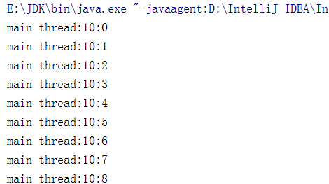
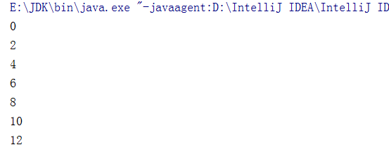
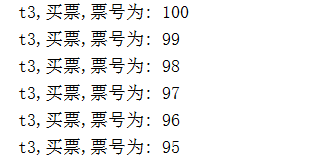
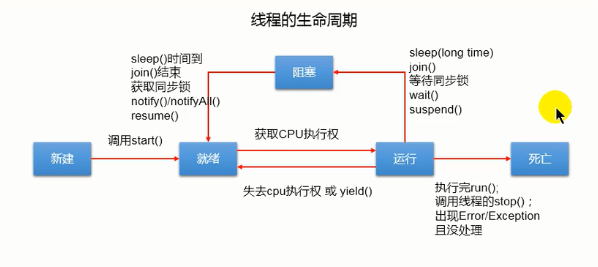
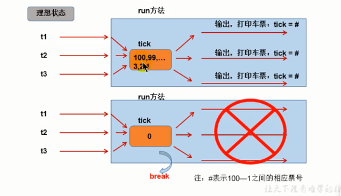
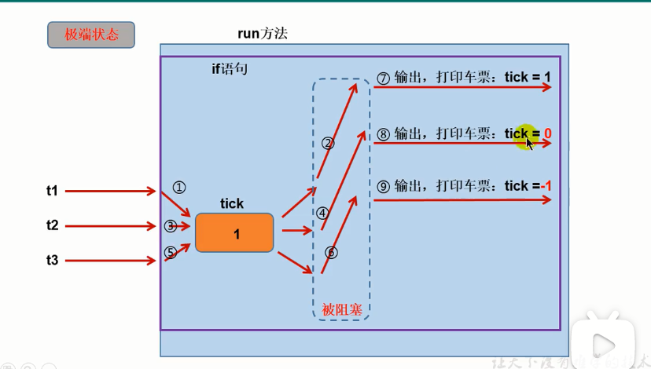

# 多线程

## 程序、进程、线程

### 进程与线程


- 程序(program)是为完成特定任务、用某种语言编写的一-组指令的集合。即指一段静态的代码，静态对象。

- 进程(process)是程序的一次执行过程，或是正在运行的一个程序。是一个动态的过程:有它自身的产生、存在和消亡的过程。一生命周期
  - 如:运行中的QQ，运行中的MP3播放器
  - 程序是靜态的，进程是动态的
  - 进程作为资源分配的单位，系统在运行时会为每个进程分配不同的内存区域
- 线程(thread)，进程可进一- 步细化为线程，是一个程序内部的一条执行路径。
    - 若一个进程同一时间并行执行多个线程，就是支持多线程的
    - 线程作为调度和执行的单位，每个线程拥有独立的运行栈和程序计数器(pc),线程切换的开销小
    - 一个进程中的多个线程共享相同的内存单元/内存地址空间>它们从同一堆中分配对象，可以问相同的变量和对象。这就使得线程间通信更简便、高效。但多个线程操作共享的系统资源可能就会带来安全的隐患。
    - 线程各自独立有栈和PC，共享堆和方法区


### 单核CPU和多核CPU的理解

- 单核CPU,其实是一种假的多线程，因为在一 一个时间单元内，也只能执行一一个线程的任务。例如:虽然有多车道，但是收费站只有-一个工作人员在收费，只有收了费才能通过，那么CPU就好比收费人员。如果有某个人不想交钱，那么收费人员可以把他“挂起”(晾着他， 等他想通了，准备好了钱，再去收费)。但是因为CPU时间单元特别短，因此感觉不出来。

- 如果是多核的话，才能更好的发挥多线程的效率。 (现在的服务器都是多核的)

- 一个Java应用程序java.exe，其实至少有三个线程: main()主线程，gc()垃圾回收线程，异常处理线程。当然如果发生异常，会影响主线程。

### 并行与并发
- 并行:多个CPU同时执行多个任务。比如:多个人同时做不同的事。
- 并发: 一个CPU(采用时间片)同时执行多个任务。比如:秒杀、多个人做同一件事.


### 使用多线程的优点

背景:以单核CPU为例， 只使用单个线程先后完成多个任务(调用多个方法)，肯定比用多个线程来完成用的时间更短，为何仍需多线程呢?
**多线程程序的优点:**

1. 提高应用程序的响应。对图形化界面更有意义，可增强用户体验。
2. 提高计算机系统CPU的利用率
3. 改善程序结构。将既长又复杂的进程分为多个线程，独立运行，利于理解和修改

### 何时需要多线程

- 程序需要同时执行两个或多个任务。
- 程序需要实现- -些需要等待的任务时，如用户输入、文件读写操作、网络操作、搜索等。
- 需要一些后台运行的程序时。

## 线程的创建和使用

**引例一**

如下的程序不是多线程!

```java
public class Sample {
public void method1(String str) {
	System.out.println(str);
}
public void method2(String str) {
	method1(str);
}
public static void main(String[] args) {
	Sample s = new Sample(); 
	s.method2( "hello!");
}

```

其中的路径为`main->method2->method1`仅仅只有一条路径

### 线程的创建和启动

- Java语言的JVM允许程序运行多个线程，它通过java.lang.Thrend类来体现。
- Thread类的特性
  - 每个线程都是通过某个特定Thread对象的run()方法来完成操作的，经常把run()方法的主体称为线程体
  - 通过该Thread对象的star()方法来启动这个线程，而非直接调用run()

### 方式一:继承于thread类创建线程

**步骤**

1. 创建-个继承于Thread类的子类
2. 重写Thread类的run()
3. 创建Thread 类的子类的对象
4. 通过此对象调用start()

**例子：遍历1~100内的偶数**

```java
package com.dreamcold.thread;

public class Demo01 {
    public static void main(String[] args){
        MyThread thread = new MyThread();
        thread.start();
    }
}

class MyThread extends Thread{
    @Override
    public void run() {
        for(int i=0;i<100;i++){
            if(i%2==0){
                System.out.println(i);
            }
        }
    }
}
```

效果：


主线程和创建的新的线程会交替执行：

```java
package com.dreamcold.thread;

public class Demo01 {
    public static void main(String[] args){
        MyThread thread = new MyThread();
        thread.start();
        for (int i = 0; i < 100000; i++) {
            if (i%2==0){
                System.out.println(i+"****************");
            }
        }
    }
}

class MyThread extends Thread{
    @Override
    public void run() {
        for(int i=0;i<100000;i++){
            if(i%2==0){
                System.out.println(i);
            }
        }
    }
}
```

效果：


**问题一：能否不调用start方法而调用run方法来创建一个线程？**

不可以，因为调用run方法相当于调用了一个普通的方法，不会创建新的线程

**问题二：能否重复调用线程的start方法来创建一个新的线程？**

不可以，线程中的start方法仅仅可以调用一次，否则会抛出IllegalThreadstateException，此时应该新建一个线程对象再调用start方法。

```java
MyThread thread2 = new MyThread();
thread2.start();
```

**练习:创建两个分线程，其中一个线程追历100以内的偶数，另一个线程遍历100以内的奇数**

```java
package com.dreamcold.thread;

public class Demo02 {
    public static void main(String[] args) {
        MyThreadOdd thread1=new MyThreadOdd();
        MyThreadEven thread2=new MyThreadEven();
        thread1.start();
        thread2.start();
    }
}

//打印奇数
class  MyThreadOdd extends Thread{
    @Override
    public void run() {
        for (int i = 0; i < 100; i++) {
            if (i%2!=0){
                System.out.println(Thread.currentThread().getName()+":"+i);
            }
        }
    }
}

//打印偶数
class MyThreadEven extends Thread{
    @Override
    public void run() {
        for (int i = 0; i < 100 ;i++){
            if (i%2==0){
                System.out.println(Thread.currentThread().getName()+":"+i);
            }
        }
    }
}

```

效果：


**匿名创建线程的方式**

```java
package com.dreamcold.thread;

public class Demo03 {
    public static void main(String[] args) {
        new Thread(){
            @Override
            public void run() {
                for (int i = 0; i < 100; i++) {
                    System.out.println(i);
                }
            }
        }.start();
    }
}
```

在仅仅使用一次该线程的时候选择该方法进行创建：

效果：


### Thread类有关方法

- void start(): 启动线程，并执行对象的run()方法
- run(): 线程在被调度时执行的操作
- String getName(): 返回线程的名称
- void setName(String name):设置该线程名称
- static Thread currentThread():返回当前线程。在Thread子类中就是this，通常用于主线程和Runnable实现类
- yield():释放当前cpu的执行权
- join():在线程a中调用线程的join(),此时线程a就进入阻塞状态，直到线和完全执行完以后，线程a才
  结束阻塞状态
- stop():强制线程生命期结束，不推荐使用,已经过时
- sleep(long millitime): i当前线程“睡眠”指定的millitime毫秒。在指定的millitime 毫秒时间内，当前线程是阻塞状态。
- isAlive():判断当前线程是否存活

**示例一：给线程起名字**

```java
package com.dreamcold.thread;

public class Demo04 {
    public static void main(String[] args) {
        HelloThread h1=new HelloThread();
        h1.setName("thread 1");
        h1.start();
        //给主线程命名
        Thread.currentThread().setName("main thread");

        for (int i = 0; i < 100; i++) {
            System.out.println(Thread.currentThread().getName()+":"+i);
        }
    }
}

class HelloThread extends Thread{
    @Override
    public void run() {
        for (int i = 0; i < 100; i++) {
            System.out.println(Thread.currentThread().getName()+":"+i);
        }
    }
}
```

效果：


**示例二：通过写子类构造器给线程起名字**

```java
class HelloThread extends Thread{
    
    HelloThread(String str){
        super(str);
    }
    
    @Override
    public void run() {
        for (int i = 0; i < 100; i++) {
            System.out.println(Thread.currentThread().getName()+":"+i);
        }
    }
}

public class Demo04 {
    public static void main(String[] args) {
        HelloThread h1=new HelloThread("thread1");//调用构造器的时候给其起名
    }
}
```

**示例三:yield方法的使用**

```java
package com.dreamcold.thread;

public class Demo04 {
    public static void main(String[] args) {
        HelloThread h1=new HelloThread("thread1");
        h1.start();
        //给主线程命名
        Thread.currentThread().setName("main thread");

        for (int i = 0; i < 100; i++) {
            System.out.println(Thread.currentThread().getName()+":"+i);
        }
    }
}

class HelloThread extends Thread{

    HelloThread(String str){
        super(str);
    }

    @Override
    public void run() {
        for (int i = 0; i < 100; i++) {
            System.out.println(Thread.currentThread().getName()+":"+i);
            if (i%20==0){
                this.yield();//   Thread.currentThread().yield();

            }
        }
    }
}
```

**示例五：join方法**

```java
package com.dreamcold.thread;

public class Demo04 {
    public static void main(String[] args) {
        HelloThread h1=new HelloThread("thread1");
        h1.start();
        //给主线程命名
        Thread.currentThread().setName("main thread");
        try {
            Thread.sleep(100);
        } catch (InterruptedException e) {
            e.printStackTrace();
        }

        for (int i = 0; i < 100; i++) {
            System.out.println(Thread.currentThread().getName()+":"+i);
            if (i==20) {
                try {
                    h1.join();
                } catch (InterruptedException e) {
                    e.printStackTrace();
                }
            }
        }
    }
}

class HelloThread extends Thread{

    HelloThread(String str){
        super(str);
    }

    @Override
    public void run() {
        for (int i = 0; i < 100; i++) {
            System.out.println(Thread.currentThread().getName()+":"+i);
            if (i%20==0){
                this.yield();//   Thread.currentThread().yield();

            }
        }
    }
}
```

效果：


**示例六：sleep方法演示**

```java
class HelloThread extends Thread{

    HelloThread(String str){
        super(str);
    }

    @Override
    public void run() {
        for (int i = 0; i < 100; i++) {
            System.out.println(Thread.currentThread().getName()+":"+i);
            if (i%2==0){
                try {
                    Thread.sleep(1000);
                } catch (InterruptedException e) {
                    e.printStackTrace();
                }
            }
        }
    }
}
```


### 线程的调度

#### 调度策略


#### Java的调度方法

- 同优先级线程组成先进先出队列(先到先服务)，使用时间片策略
- 对高优先级，使用优先调度的抢占式策略

#### 设置优先级

**在Thread类中有三个常量来进行表示优先级，从1~10**

```java
MAX_PRIORITY=10
MIN_PRIORITY=1
NORM_PRIORITY=5
```

**如何获取和设置当前线程的优先级？**

```java
getPriority();//获取优先级
setPriority(int p);//设置优先级
```

示例：给主线程更高的优先级，执行的过程中打印优先级

```java
package com.dreamcold.thread;

public class Demo04 {
    public static void main(String[] args) {
        HelloThread h1=new HelloThread("thread1");
        h1.start();
        //给主线程命名
        Thread.currentThread().setName("main thread");
        //给主线程设置比较高的优先级
        Thread.currentThread().setPriority(Thread.MAX_PRIORITY);

        for (int i = 0; i < 100; i++) {
            System.out.println(Thread.currentThread().getName()+":"+Thread.currentThread().getPriority()+":"+i);

        }
    }
}

class HelloThread extends Thread{

    HelloThread(String str){
        super(str);
    }

    @Override
    public void run() {
        for (int i = 0; i < 100; i++) {
            System.out.println(Thread.currentThread().getName()+":"+Thread.currentThread().getPriority()+":"+i);
            if (i%2==0){
                try {
                    Thread.sleep(1000);
                } catch (InterruptedException e) {
                    e.printStackTrace();
                }
            }
        }
    }
}
```

**说明:高优先级的线程要抢占低优先级线程cpu的执行权。但是只是从概率上讲，高优先级的线程高概率的情况下被执行。并不意味者只有当高优先级的线程执行完以后，低优先级的线程才执行。**

效果：




### 多窗口买票的例子

例子:创建三个窗口卖票，总票数为100张

```java
package com.dreamcold.thread;

public class Window  extends Thread{

    public static void main(String[] args) {
        Window t1=new Window();
        Window t2=new Window();
        Window t3=new Window();
        t1.setName("窗口一");
        t2.setName("窗口二");
        t3.setName("窗口三");
        t1.start();
        t2.start();
        t3.start();

    }

    private int ticket=100;

    @Override
    public void run() {
        while(true){
            if(ticket>0){
                System.out.println(getName()+",买票,票号为: "+ticket);
                ticket--;
            }else{
                break;
            }
        }
    }
}
```

效果：


窗口二和窗口三都在卖第100张票，每个窗口有100张票，我们将ticket改为static变量，却发现如上的问题还是出现了

```java
package com.dreamcold.thread;

public class Window  extends Thread{

    public static void main(String[] args) {
        Window t1=new Window();
        Window t2=new Window();
        Window t3=new Window();
        t1.setName("窗口一");
        t2.setName("窗口二");
        t3.setName("窗口三");
        t1.start();
        t2.start();
        t3.start();

    }

    private static int ticket=100;

    @Override
    public void run() {
        while(true){
            if(ticket>0){
                System.out.println(getName()+",买票,票号为: "+ticket);
                ticket--;
            }else{
                break;
            }
        }
    }
}
```

出现效果：出现了线程安全的问题


### 方式二：实现Runnable接口的方式来创建线程

创建多线程的方式二:实现Runnable接口
1.创建一个实现TRunnable接口的类
2.实现类去实现Runnable中的抽象方法: run()
3.创建实现类的对象
4.将此对象作为参数传递到Thread类的构造器中，创建Thread类的对象
5.通过Thread类的对象 调用start()

示例一：通过实现Runnable接口来创建线程

```java
package com.dreamcold.thread;

public class Demo05 {
    public static void main(String[] args){
        //1.可以直接创建实现类的对象
        ThreadRunable mthread=new ThreadRunable();
        //2.将此对象作为参数传递到对应的Thread构造器中
        Thread thread=new Thread(mthread);
        //3. 启动线程
        thread.start();

    }
}

class ThreadRunable implements Runnable{
    @Override
    public void run() {
        for (int i = 0; i < 100; i++) {
            if(i%2==0){
                System.out.println(i);
            }
        }
    }
}
```

效果：



示例二：通过实现Runnable接口来实现三个窗口买票

```java
package com.dreamcold.thread;

public class Window1 implements Runnable{

    public static void main(String[] args) {
        //因为是一个Window对象所以里面的ticket只有一份
        Window1 w=new Window1();
        Thread t1=new Thread(w);
        Thread t2=new Thread(w);
        Thread t3=new Thread(w);
        t1.setName("t1");
        t2.setName("t2");
        t3.setName("t3");
        t1.start();
        t2.start();
        t3.start();

    }

    //这里不需要static修饰
    private int ticket=100;

    @Override
    public void run() {
        while(true){
            if(ticket>0){
                System.out.println(Thread.currentThread().getName()+",买票,票号为: "+ticket);
                ticket--;
            }else{
                break;
            }
        }
    }
}
```

效果：



### 两种创建线程的方式的对比

比较创建线程的两种方式。
**开发中:优先选择:实现Runnable 接口的方式**
原因: 

1. 实现的方式没有类的单继承性的局限性
2. 实现的方式更适合来处理多个线程有共享数据的情况。
3. 联系: public class Thread implements Runnable
4. 相同点:两种方式都需要重写run(),将线程要执行的逻辑声明在run()中。|

## 生命周期

- JDK中用Thread.State类定义了线程的几种状态要想实现多线程，必须在主线程中创建新的线程对象。Java语言使用Thread类及其子类的对象来表示线程，在它的一个完整的生命周期中通常要经历如下的五.种状态:
- 新建:当一个Thread类或其 子类的对象被声明并创建时，新生的线程对象处于新建状态
- 就绪:处于新建状态的线程被star()后，将进入线程队列等待CPU时间片，此时它已具备了运行的条件，只是没分配到CPU资源
- 运行:当就绪的线程被调度并获得CPU资源时,便进入运行状态，run()方法定 义了线程的操作和功能
- 阻塞:在某种特殊情况下，被人为挂起或执行输入输出操作时，让出CPU并临时中止自己的执行，进入阻塞状态
- 死亡:线程完成了它的全部工作或线程被提前强制性地中止或出现异常导致结束

**线程的声明周期图如下：**




## 线程的同步

对于以上的三个窗口买票的问题中，我们发现出现了线程不安全的问题

理想状态：



极端状态：



- 问题:卖票过程中，出现了重票、错票-->出现了线程的安全问题
- 问题出现的原因:当某个线程操作车票的过程中，尚未操作完成时，其他线程参与进来，也操作车票
- 问题的提出
  - 多个线程执行的不确定性引起执行结果的不稳定
  - 多个线程对账本的共享，会造成操作的不完整性，会破坏数据。


- 当一个线租在操作ticket的时候，其他线程不能参与进来。直到线程a操作完ticket的时候，其他的线程才可以参与进来，这种情况即使我们的线程a出现了阻塞也不可以被改变


### 同步代码块

431

## 线程的通信

## JDK5.0新增线程创建方式

