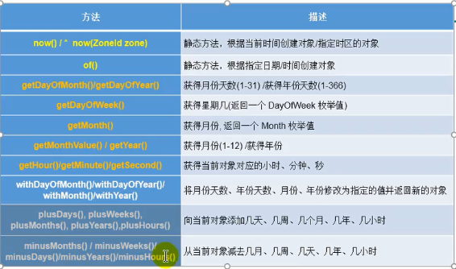

# 常用类

## 字符串相关的类

### String类

- String类:代表字符串。Java 程序中的所有字符串字面值(如"abc" )都作为此类的实例实现。
- String是一个final类，代表不可变的字符序列。
- 字符串是常量，用双引号引起来表示。它们的值在创建之后不能更改。
- String对象的字符内容是存储在一个字符数组value[]中的。
- String声明为final的，不可被继承
- String实现了Serializable接口:表示字符串可以序列化
- 实现了Comparable接口可以比较大小
- String内部定义了final char[] value用于存储字符串数据
- String代表不可变的字符序列
  - 当对字符串重新赋值时，需要重写指定内存区域赋值，不能使用原有的value进行赋值。
  - 当对现有的字符串进行连接操作时，也需要重新指定内存区域赋值，不能在原有value上赋值
  - 当调用String的replace()方法修改指定字符或字符串时，也需要重新指定内存区域赋值,
- 通过字面量的方式(区别new)给-一个字符串赋值，此时的字符串值声明在字符事常量池中。
- 字符串常量池中是不会存储相同内容的字符串的。


#### String的不可变性

样例一：

```java
package com.dreamcold.useful;

public class Demo01 {
    public static void main(String[] args) {
        String s1="abc";
        String s2="abc";

        System.out.println(s1==s2);//比较s1和s2的地址值
        s1="hello";
        System.out.println(s1);//hello
        System.out.println(s2);//abc
    }
}

```

效果：


- 原因：方法区中间有字符串常量池，两个变量同时指向该常量


样例二：

```java
package com.dreamcold.useful;

public class Demo01 {
    public static void main(String[] args) {
        String s1="abc";
        String s2="abc";

        System.out.println(s1==s2);//比较s1和s2的地址值
        s1="hello";
        System.out.println(s1);//hello
        System.out.println(s2);//abc
        System.out.println("=========");
        String s3="abc";
        s3+="def";
        System.out.println("s3="+s3);
        System.out.println("s2="+s2);
    }
}
```

效果：s2并没有改变，得出结论当对现有的字符串进行连接操作时，也需要重新指定内存区域赋值，不能在原有value上赋值


样例三：

```java
package com.dreamcold.useful;

public class Demo03 {
    public static void main(String[] args) {
        String s1="abc";
        String s2=s1.replace('a','m');
        System.out.println("s1="+s1);
        System.out.println("s2="+s2);
    }
}
```

结果：当调用String的replace()方法修改指定字符或字符串时，也需要重新指定内存区域赋值,


#### String对象的创建

```java
String str = "he1lo";
//本质上.this.value = new char[0];
String s1 = new String();
//this.value = original. value;
String s2 = new String(String original);
//this.value = Arrays . copy0f(value, value. length) ;
String s3 = new String(char[] a);
String s4 = new String(char[] a,int startIndex,int count);
```

样例一：

```java
package com.dreamcold.useful;

public class Demo04 {
    public static void main(String[] args) {
        //通过字面量定义的方式:此时的s1和s2的数据javaEE声明在方法区中的字符串常量池中。
        String s1="javaEE";
        String s2="javaEE";
        //通过new +构造器的方式:此时的s3和Is4保存的地址值，是数据在堆空间中开辟空间保存的地址值
        String s3=new String("javaEE");
        String s4=new String("javaEE");
        System.out.println(s1==s2);
        System.out.println(s1==s3);
        System.out.println(s1==s4);
        System.out.println(s3==s4);
    }
}
```

效果：


样例二：

Person.java

```java
package com.dreamcold.useful;

public class Person {
    String name;
    int age;

    public Person(String name, int age) {
        this.name = name;
        this.age = age;
    }

    public Person() {
    }
}
```

Demo05.java

```java
package com.dreamcold.useful;

public class Demo05 {
    public static void main(String[] args) {
        Person p1=new Person("Tom",12);
        Person p2=new Person("Tom",12);
        System.out.println(p1.name.equals(p2.name));
        System.out.println(p1.name==p2.name);
    }
}
```

效果：


原因内存示意图：


- 面试题: String s = new string( "abc");方式创建对象，在内存中创建了几个对象?
- 回答：两个，包含堆中new出来的对象，以及常量池中的对象

样例三：拼接的方式

```java
package com.dreamcold.useful;

public class Demo06 {
    public static void main(String[] args){
        String s1="javaEE";
        String s2="hadoop";

        String s3="javaEEhadoop";
        String s4="javaEE"+"hadoop";
        String s5=s1+"hadoop";
        String s6="javaEE"+s2;
        String s7=s1+s2;
        System.out.println(s3==s4);
        System.out.println(s3==s5);
        System.out.println(s3==s6);
        System.out.println(s5==s6);
        System.out.println(s3==s7);
        System.out.println(s5==s7);
    }
}
```

结果：


结论:

- 常量与常量的拼接结果在常量池。且常量池中不会存在相同内容的常量。T
- 只要其中有一个是变量，结果就在堆中
- 如果拼接的结果调用intern()方法，返回值就在常量池中


```java
///返回值得到的s8使用的常量值中已经存在的"javaEEhadoop"
String s8=s5.intern();
```

#### JVM中涉及String


**三种JVM**

- Sun公司的HotSpot
- BEA公司的JRockit
- IBM公司的J9 VM

**堆内存示意图**


**Heap堆**
一个JVM实例只存在一个堆内存,堆内存的大小是可以调节的。类。加载器读取了类文件后 ,需要把类. 方法、常变量放到堆内存中 ,保存所有引用类型的真实信息，以方便执行器执行,堆内存分为三部分:


**常量池的位置随着版本的变化**


#### String常用的方法

````java
int length()//:返回字符串的长度: return value.length
char charAt(int index)//:返回某索 引处的字符return value[index]
boolean isEmpty()//:判断是否是空字符串: return value.length == 0
String toLowerCase()//:使用默认语言环境，将String中的所有字符转换为小写
String toUpperCase()//:使用默认语言环境，将String中的所有字符转换为大写
String trim()//:返回字符串的副本，忽略前导空白和尾部空白
boolean equals(Object obj)//:比较字符串的内容是否相同
boolean equalslgnoreCase(String anotherString)//:与equals方法类似， 忽略大
小写
String concat(String str)//:将指定字符串连接到此字符串的结尾。等价于用“+”
int compareTo(String anotherString)//:比较两 个字符串的大小
String substring(int beginIndex)//: 返回一个新的字符串，它是此字符串的从beginIndex开始截取到最后的一个子字符串。
String substring(int beginIndex, int endIndex) //:返回一个新字符串，它是此字符串从beginIndex开始截取到endIndex(不包含)的一个子字符串。

````

示例一:

```java
package com.dreamcold.useful;

public class Demo07 {
    public static void main(String[] args) {
        String s1="HelloWorld";
        System.out.println(s1.length());
        System.out.println(s1.charAt(0));
        System.out.println(s1.charAt(9));

        System.out.println(s1.isEmpty());

        String s2= s1.toLowerCase();
        System.out.println(s1);//s1不可变的，仍然为原来的字符串

        System.out.println(s2);//改写为小写

        String s3=" he llo world    ";
        String s4=s3.trim();
        System.out.println("======="+s3+"======");
        System.out.println("======="+s4+"======");
        
    }
}
```

效果：


示例二：忽略大小写比较

```java
package com.dreamcold.useful;

public class Demo08 {
    public static void main(String[] args) {
        String s1="HelloWorld";
        String s2="helloworld";
        System.out.println(s1.equals(s2));
        System.out.println(s1.equalsIgnoreCase(s2));
    }
}
```

示例三：字符串拼接

```java
package com.dreamcold.useful;

public class Demo08 {
    public static void main(String[] args) {
        String s3="abc";
        String s4=s3.concat("def");
        System.out.println(s4);
    }
}

```


示例四：字符串比较

```java
package com.dreamcold.useful;

public class Demo09 {
    public static void main(String[] args) {
        String s1="abc";
        String s2="abd";
        System.out.println(s1.compareTo(s2));
    }
}
```

- 大于为1
- 小于为-1
- 等于为0
- 按照字母的顺序进行比较排序


示例五：字符串切片

```java
package com.dreamcold.useful;

public class Demo10 {
    public static void main(String[] args) {
        String name="dreamcold";
        System.out.println(name.substring(0,3));
    }
}

```

效果：


注意：区间为[a,b)

```java
boolean endsWith(String suffx)//:测试此字符串是否以指定的后缀结束
boolean startsWith(String prefix)//: 测试此字符串是否以指定的前缀开始
boolean startsWith(String prefix, int toffset)//: 测试此字符串从指定索引开始的子字符串是否以指定前缀开始
```

示例六：以某种字符串开头

```java
package com.dreamcold.useful;

public class Demo11 {
    public static void main(String[] args) {
        String str1="helloworld";
        System.out.println(str1.endsWith("ld"));
    }
}

```

效果：


示例七：以某个字符串开头

```java
package com.dreamcold.useful;

public class Demo12 {
    public static void main(String[] args) {
        String s="helloworld";
        System.out.println(s.startsWith("he"));
    }
}
```

效果：


```java
boolean contains(CharSequence s)//: 当且仅当此字符串包含指定的char值序列时，返回true
int indexOf(String str)//:返回指定子字符串在此字符串中第一次 出现处的索引
int indexOf(String str, int fromIndex)//:返回指定子字符串在此字符串中第一次出现处的索引，从指定的索引开始
int lastiIndexOf(String str)//:返回指定子字符串在此字符串中最右边出现处的索引
int lastlndexOf(String str, int fromIndex)//:返回指定子字符串在此字符串中最后次出现处的索引， 从指定的索引开始反向搜索
//注: indexOf 和lastlndexOf方法如果未找到都是返回-1 ]
```

示例八：是否包含该字符串

```java
package com.dreamcold.useful;

public class Demo13 {
    public static void main(String[] args) {
        String s1="HelloWorld";
        System.out.println(s1.contains("He"));
    }
}
```

效果：


示例九：判断字符串在该字符串中出现的索引

```java
package com.dreamcold.useful;

public class Demo14 {
    public static void main(String[] args) {
        String s="HelloWorld";
        System.out.println(s.indexOf('a'));
        System.out.println(s.indexOf('H'));
        System.out.println(s.indexOf("He"));

    }
}
```

效果：


示例十：

```java
package com.dreamcold.useful;

public class Demo15 {
    public static void main(String[] args) {
        String s="HelloWorld";
        System.out.println(s.lastIndexOf("ld"));
    }
}
```

效果：


```java
String replace(char oldChar, char newChar)//:返回一个新的字符串，它是通过用newChar替换此字符串中出现的所有oldChar得到的。
String replace(CharSequence target, CharSequence replacement)//: 使用指定的字面值替换序列替换此字符串所有匹配字面值目标序列的子字符串。
String replaceAll(String regex, String replacement)// :使用给定的replacement替换此字符串所有匹配给定的正则表达式的子字符串。
String replaceFirst(String regex, String replacement)//: 使用给定的replacement替换此字符串匹配给定的正则表达式的第一个 子字符串。

```

示例十二：字符串替换

```java
package com.dreamcold.useful;

public class Demo16 {
    public static void main(String[] args) {
        String str1="我想学Java";
        String str2=str1.replace('我','你');
        System.out.println(str1);
        System.out.println(str2);
        String str3=str1.replace("Java","Python");
        System.out.println(str3);
        
    }
}
```

效果：


示例十三：正则表达式匹配与替换

```java
package com.dreamcold.useful;

public class Demo17 {
    public static void main(String[] args) {
        String str="12345";
        //判断str字符是不是全部由数字组成，即由1-n中的数字组成
        boolean matches=str.matches("\\d+");
        System.out.println(matches);
        //判断是杭州的电话号码
        String tel="0571-4534289";
        boolean result=tel.matches("0571-\\d{7,8}");
        System.out.println(result);
    }
}
```

效果：


#### 字符串与其他类型进行转化

- 字符串>基本数据类型、包装类
  - Integer包装类的public static int parselnt(String s):可以将由“数字”字
    符组成的字符串转换为整型。
  - 类似地,使用java.lang包中的Byte、Short、 Long、 Float、 Double 类调相应的类方法可以将由“数字”字符组成的字符串，转化为相应的基本数据类型。
- 基本数据类型、包装类>字符串
  - 调用String类的public String valueOf(int n)可将int型转换为字符串
  - 相应的valueOf(byte b)、valueOf(long)、valueOf(float f)、valueOf(double
  - valueOf(boolean b)可由参数的相应类型到字符串的转换

示例一：字符串与其他类型进行转换

```java
package com.dreamcold.useful;

public class Demo18 {
    public static void main(String[] args) {
        String str1="123";
        int num=Integer.parseInt(str1);
        String strnum=String.valueOf(num);
        System.out.println(strnum);
        String strnum1=num+"";
        System.out.println(strnum1);
    }
}
```

效果：


#### String与字符数组的转换

```java
package com.dreamcold.useful;

public class Demo19 {
    public static void main(String[] args) {
        String str1="abc123";
        char[] charArray=str1.toCharArray();
        for (int i = 0; i < charArray.length; i++) {
            System.out.println(charArray[i]);
        }
        char[] chars=new char[]{'H','l','l','o'};
        String sc=new String(chars);
        System.out.println(sc);
    }
}
```

效果：


#### String与byte数组转换

- public bytegetBytes() :使用平台的默认字符集将此String编码为
- byte序列，并将结果存储到-一个新的byte数组中。
- public byte[] getBytes(String charsetName) :使用指定的字符集将
- 此String编码到byte序列，并将结果存储到新的byte数组。

示例一:字符串转bytes数组

```java
package com.dreamcold.useful;

import java.util.Arrays;

public class Demo20 {
    public static void main(String[] args){
        String str="abc123";
        byte[] bytes=str.getBytes();
        System.out.println(Arrays.toString(bytes)
    }
}
```


示例二：字符串转byte数组带编码

- 编码:字符串-->字节(看得懂--->看不懂的二进制数据)
- 解码:编码的逆过程，字节-->字符串

```java
package com.dreamcold.useful;

import java.io.UnsupportedEncodingException;
import java.util.Arrays;

public class Demo20 {
    public static void main(String[] args) throws UnsupportedEncodingException {
        String str="abc123你好世界";
        byte[] bytes=str.getBytes();
        System.out.println(Arrays.toString(bytes));
        byte[] gbks=str.getBytes("gbk");
        System.out.println(Arrays.toString(gbks));
    }
}
```

效果：


示例三：byte数组转化为字符串

```java
package com.dreamcold.useful;

import java.io.UnsupportedEncodingException;
import java.util.Arrays;

public class Demo20 {
    public static void main(String[] args) throws UnsupportedEncodingException {
        String str="abc123你好世界";
        byte[] bytes=str.getBytes();
        String str2=new String(bytes);
        System.out.println(str2);
    }
}
```

效果：


示例四：根据具体的字符集将byte数组转化为字符串

```java
package com.dreamcold.useful;

import java.io.UnsupportedEncodingException;

public class Demo21 {
    public static void main(String[] args) throws UnsupportedEncodingException {
        String str="abc123你好世界";
        byte[] bytes=str.getBytes("gbk");
        System.out.println("按照默认编码");
        String str1=new String(bytes);
        System.out.println(str1);
        System.out.println("按照指定编码");
        String str2=new String(bytes,"gbk");
        System.out.println(str2);

    }
}
```

效果：


### StringBuffer类

#### 简介

- java.lang.StringBuffer代表可变的字符序列，JDK1.0中声明， 可以对字符串内容进行增删，此时不会产生新的对象。
- 很多方法与String相同。
- 作为参数传递时，方法内部可以改变值。


#### StringBuffer与StringBuilder以及String的区别

- StringBuilder和StringBuffer非常类似，均代表可变的字符序列，而且提供相关功能的方法也一样
- 面试题:对比String、StringBuffer、 StringBuilder

  - String(JDK1.0):不可变字符序列，底层用char[]来存储
  - StringBuffer(JDK1.0): 可变字符序列、效率低、线程安全，底层用char[]来存储
  - StringBuilder(JDK 5.0):底层用char[]来存储、可变字符序列、效率高、线程不安全


#### StringBuffer是可变的

```java
package com.dreamcold.useful;

public class Demo22 {
    public static void main(String[] args) {
        StringBuffer sb1=new StringBuffer("abc");
        sb1.setCharAt(0,'m');
        System.out.println(sb1);
    }
}
```

效果：


#### StringBuffer的源码分析

```java
String str = new String();//new char[e];
String str1 = new String( "abc");//new char[]{'a', 'b', 'c'};
StringBuffer sb1 = new StringBuffer();//new char[16]; 底层创建了一个长度是16的数组。
sb1. append( 'a')://value[e] ='a';
sb1. append( 'b ');//value[1] ='b';
StringBuffer sb2=new StringBuffer( "abc");//char[] value = new char[ "abc ".length()+ 16]
//问题1. System. out. println(sb2. Length());//3 
//问题2.扩容问题:如果要添加的数据底层数组盛不下了，那就需要扩容底层的数组。
//扩容问题:如果要添加的数据底层数组盛不下了，那就需要扩容底层的数组。
//默认情况下，扩容为原来容量的2倍+ 2,同时将原有数组中的元素复制到新的数组中。
//指导意义:开发中建议大家使用: StringBuffer(int capacity) 或StringBu[ffer(int capacity)|

```

#### StrinBuffer类中的常用方法

```java
//public int indexOf(String str)
//public String substring(int startint end)
//public int length() 
//public char charAt(int n )
//public void setCharAt(int n ,char ch)
//StringBuffer append(xxx): 提供了很多的append()方法，用于进行字符串拼接
//StringBuffer delete(int start, int end): 删除指定位置的内容
//StringBuffer replace(int start, int end, String str): 把[start, end)位置普换为str
//StringBuffer insert(int offset, xxx): 在指定位置插入xxx
//StringBuffer reverse() :把当前字符序列逆转
//public int indexOf(String str)
//public String substring(int start, int end)
//public int Length()
//public char charAt(int n )
//public void setCharAt(int n , char ch)
```

#### StringBuffer中的API调用

```java
package com.dreamcold.useful;

public class Demo23 {
    public static void main(String[] args) {
        StringBuffer s1=new StringBuffer("abc");
        s1.append(1);
        s1.append("1");
        System.out.println(s1);
        s1.delete(2,4);
        s1.insert(2,false);
        System.out.println(s1);
        System.out.println(s1.length());
    }
}
```

效果：


总结：
```java
// 增: append(xxx)
// 删: delete(int start, int end)
// 改: setCharAt(int n ,char ch) / replace(int start, int end, String str)
// 查: charAt(int n )
// 插: insert(int offset, xxx)
// 长度: Length();
// 遍历: for+charAt()+toString()
```


## JDK8之前日期相关的类

### JDK8之前日期时间API


### java.lang.System类

- System类提供的public statlc long currentTimeMillis()用来返回当前时间与1970年1月1日0时0分0秒之间以毫秒为单位的时间差。
  - 此方法适于计算时间差。
- 计算世界时间的主要标准有:
  - UTC(Coordinated Universal Time)
  - GMT(Greenwich Mean Time)
  - CST(Central Standard Time)

示例一：

```java
long time=System.currentTimeMillis();
//返回当前时间与1970年1月1日θ时0分日秒之间以毫秒为单位的时间差。
System.out.println(time);
```

计算时间差：


### java.util.Date类

- 构造器:
  - Date(): 使用无参构造器创建的对象可以获取本地当前时间。
  - Date(long date)
 - 常用方法
     - getTime():返回自 1970年1月1日00:00:00 GMT以来此Date对象表示的毫秒数。
     - toString():把此 Date对象转换为以下形式的String: dow mon dd
     - hh:mm:ss zz yyyy其中: dow 是一周中的某一 天(Sun, Mon, Tue,Wed, Thu, Fri, Sat)，zzz 是时间标准。
     - 其它很多方法都过时了。

示例一：构造器的使用

```java
Date data1=new Date();
System.out.println(data1.toString());
```

效果：显示当前的年、月、日、时、分、秒


示例二：获取时间戳

```java
Date data1=new Date();
System.out.println(data1.getTime());
```

效果：


示例三：创建指定毫秒数的Date对象

```java
Date data1=new Date();
System.out.println(data1.getTime());
long time=data1.getTime();
Date data2=new Date(time);
System.out.println(data2);
```

效果：


### java.sql.Date类

java.sql.Date对应者数据宰中的日期类型的变量

示例一：对象的创建

```java
java.sql.Date date=new java.sql.Date(1611814831401L);
System.out.println(date);
```

效果：


示例二：如何将util. Date对象转换为sql. Date对象

```java
Date date=new Date();
java.sql.Date data2=new java.sql.Date(date.getTime());
System.out.println(data2.toString());
```

效果：


### java.text.SimpleDateFormat类

- Date类的API不易于国际化，大部分被废弃了I，java.text.SimpleDateFormat
- 类是一个不与语言环境有关的方式来格式化和解析日期的具体类。
- 它允许进行格式化:日期>文本、解析:文本>日期
- 格式化:
  - SimpleDateFormat() :默认的模式和语言环境创建对象
  - public SimpleDateFormat(String pattern):该构造方法可以用参数patte
  - 指定的格式创建一一个对象，该对象调用:
  - public String format(Date date):方法格式化时间对象date
- 解析:
  - public Date parse(String source):从给定字符串的开始解析文本，以生成一个日期。


示例一：

- 格式化:日期--->字符串

- 解析:格式化的逆过程，字符串--->日期

```java
package com.dreamcold.useful;

import java.text.ParseException;
import java.text.SimpleDateFormat;
import java.util.Date;

public class Demo27 {
    public static void main(String[] args) throws ParseException {
        //实例化 SimpleDateFormat
        SimpleDateFormat sdf=new SimpleDateFormat();
        //格式化：日期--->字符串
        Date date=new Date();
        System.out.println(date);
        String format=sdf.format(date);
        System.out.println(format);
//        //解析：格式化的逆过程，字符串--->日期
//        String str="2019-08-09";
//        Date date1= sdf.parse(str);
//        System.out.println(date1);
//解析:要求字符串必须是符合SimpleDateFormat识别的格式(通过构造器参数体现)
        SimpleDateFormat sdf1=new SimpleDateFormat("yyyy.MMMMM.dd GGG hh:mm:aaa");
        String format1=sdf.format(date);
        System.out.println(format1);

    }
}
```

效果：


另外一种常用的格式为：

```java
SimpleDateFormat sdf1=new SimpleDateFormat("yyyy-MM-dd hh:mm:ss");
```

解析:要求字符串必须是符合SimpleDateFormat识别的格式(通过构造器参数体现)


### java.util.Calenar(日历)类

- Calendar是一个抽象基类，主用用于完成日期字段之间相互操作的功能。
- 获取Calendar实例的方法
  - 使用Calendar.getInstance()方法
  - 调用它的子类GregorianCalendar的构造器。

- 一个Calendar的实例是系统时间的抽象表示，通过get(int field)方法来取得想要的时间信息。比如YEAR、MONTH、DAY_ OF_WEEK、HOUR_OF_DAY 、MINUTE、SECOND

```java
public void set(int field,int value)
public void add(int field,int amount)
public final Date getTime()
public final void setTime(Date date)
```

注意;

- 获取月份时: 一月是0， 二月是1，以此类推，12月是11
- 获取星期时:周日是1，周二是2，周六是7 

示例

```java
package com.dreamcold.useful;

import java.util.Calendar;
import java.util.Date;

public class Demo28 {
    public static void main(String[] args){
        //1.实例化
        //方式一:创建其子类(GregorianCalendar) 的对象
        //方式二:调用其静态方法getInstance()

        Calendar calendar=Calendar.getInstance();
        System.out.println(calendar.getClass());

        //调用方法
        //get
        int days = calendar.get(Calendar.DAY_OF_MONTH);
        System.out.println(days);
        System.out.println(calendar.get(Calendar.DAY_OF_YEAR));

        //set
        calendar.set(Calendar.DAY_OF_MONTH,22);
        days=calendar.get(Calendar.DAY_OF_MONTH);
        System.out.println(days);

        //add
        calendar.add(Calendar.DAY_OF_MONTH,3);
        days=calendar.get(Calendar.DAY_OF_MONTH);
        System.out.println(days);

        //getTime
        Date date = calendar.getTime();
        System.out.println(date);

        //setTime
        Date data1=new Date();
        calendar.setTime(data1);
        System.out.println(calendar);
    }
}
```

效果：


## JDK8中新的日期相关的API

### 新日期时间API出现的背景

如果我们可以跟别人说:“ 我们在1502643933071见面，别晚了!”那么就再简单不过了。但是我们希望时间与昼夜和四季有关，于是事情就变复杂了。JDK 1.0中包含了一个java.util.Date类， 但是它的大多数方法已经在JDK 1.1引入Calendar类之后被弃用了。而Calendar并不比Date好多少。它们面临的问题是:

- 可变性:像8期和时间这样的类应该是不可变的。
- 偏移性: Date中 的年份是从1900开始的，而月份都从0开始。
- 格式化:格式化只对Date有用，Calendar则不行。
- 此外，它们也不是线程安全的;不能处理闰秒等。
- 总结:对日期和时间的操作一直 是Java程序员最痛苦的地方之一

第三次引入的API是成功的，并且Java 8中引入的java .time API已经纠正了过去的缺陷，将来很长一- 段时间内它都会为我们服务。Java 8吸收了Joda-Time 的精华，以一个新的开始为Java创建优秀的API。新的java.time中包含了所有关于本地日期(LocalDate) 、本地时间(LocalTime)、本地日期时间(LocalDateTime) 、时区(ZonedDate Time )和持续时间(Duration) 的类。历史悠久的Date类新增了tolnstant() 方法，用于把Date转换成新的表示形式。这些新增的本地化时间日期API大大简化了日期时间和本地化的管理。

### localDate、LocalTime、 LocalDateTime类

localDate、LocalTime、 LocalDateTime类是其中较重要的几个类，它们的实例是不可变的对象，分别表示使用ISO-8601日历系统的日期、时间、日期和时间。它们提供了简单的本地日期或时间，并不包含当前的时间信息，也不包含与时区相关的信息。

- LocalDate代表IOS格式(yyyy-MM-dd) 的日期,可以存储生日、纪念日等日期。
- LocalTime表示一 个时间，而不是日期。
- LocalDateTime是用来表示日期和时间的，这是一个最常用的类之一。



示例一：使用now方式来构造对象

```java
package com.dreamcold.useful;

import java.time.LocalDate;
import java.time.LocalDateTime;
import java.time.LocalTime;

public class Demo29 {
    public static void main(String[] args) {
        //now():获取当前的日期、时间、日期+时间
        LocalDate localDate=LocalDate.now();
        LocalTime localTime=LocalTime.now();
        LocalDateTime localDateTime=LocalDateTime.now();
        System.out.println(localDate);
        System.out.println(localTime);
        System.out.println(localDateTime);

    }
}
```

效果：


示例二：使用of方式来构造对象

```java
package com.dreamcold.useful;

import java.time.LocalDateTime;

public class Demo30 {
    public static void main(String[] args) {
        //of():设置指定的年、月日、时、分秒。没有偏移量
        LocalDateTime localDateTime=LocalDateTime.of(2020,10,1,1,1);
        System.out.println(localDateTime);
    }
}
```

效果：


示例三：getXXX其中的属性

```java
package com.dreamcold.useful;

import java.time.LocalDateTime;

public class Demo30 {
    public static void main(String[] args) {
        //of():设置指定的年、月日、时、分秒。没有偏移量
        LocalDateTime localDateTime=LocalDateTime.of(2020,10,1,1,1);
        System.out.println(localDateTime);
        //getXXX
        System.out.println(localDateTime.getDayOfMonth());
        System.out.println(localDateTime.getDayOfWeek());
        System.out.println(localDateTime.getMonth());
        System.out.println(localDateTime.getDayOfMonth());
        System.out.println(localDateTime.getMonthValue());
    }
}
```

效果：


示例四：体现不可变性

```java
package com.dreamcold.useful;

import java.time.LocalDate;
import java.time.LocalDateTime;

public class Demo31 {
    public static void main(String[] args) {
        //不可变性
        LocalDate localDate=LocalDate.now();
        LocalDate localDate1=localDate.withDayOfMonth(22);
        System.out.println(localDate);
        System.out.println(localDate1);

        LocalDateTime localDateTime=LocalDateTime.now();
        LocalDateTime localDateTime1=localDateTime.withHour(4);
        System.out.println(localDateTime);
        System.out.println(localDateTime1);

        LocalDateTime localDateTime2=localDateTime.plusMonths(3);
        System.out.println(localDateTime2);
        
        
    }
}
```

效果：


### 瞬时Instant

- Instant:时间线上的-一个瞬时点。这可能被用来记录应用程序中的事件时间戳。
- 在处理时间和日期的时候，我们通常会想到年,月,日,时，分,秒。然而，这只是时间的一个模型，是面向人类的。第二种通用模型是面向机器的，或者说是连续的。在此模型中，时间线中的一个点表示为-一个很大的数，这有利于计算机
  处理。在UNIX中，这个数从1970年开始，以秒为的单位;同样的，在Java中，也是从1970年开始，但以毫秒为单位。
-  java.time包通过值类型Instant提供机器视图，不提供处理人类意义上的时间单位。Instant表 示时间线上的一点，而不需要任何上下文信息，例如，时区。概念上讲，它只是简单的表示自1970年1月1日0时0分0秒(UTC)开始的秒
  数。因为java.time包是基于纳秒计算的，所以Instant的精度可以达到纳秒级。
- (1ns= 109s) 1秒 = 1000毫秒=10^6微秒=10^9纳秒


时间戳是指格林威治时间1970年01月01日00时00分00秒(北京时间1970年01月01日08时00分00秒)起至现在的总秒数。


示例一：获取Instant对象

```java
package com.dreamcold.useful;

import java.time.Instant;

public class Demo32 {
    public static void main(String[] args) {
        Instant instant=Instant.now();
        System.out.println(instant);
    }
}
```

效果：


示例二：计算时区偏移量

```java
package com.dreamcold.useful;

import java.time.Instant;
import java.time.OffsetDateTime;
import java.time.ZoneOffset;

public class Demo32 {
    public static void main(String[] args) {
        Instant instant=Instant.now();
        System.out.println(instant);
        OffsetDateTime offsetDateTime=instant.atOffset(ZoneOffset.ofHours(8));
        System.out.println(offsetDateTime);
    }
}
```

效果：


示例三：获取对应的毫秒数，toEpochMilli():获取自1970年1月1日0时分8秒(UTC) 开始的毫秒数

```java
package com.dreamcold.useful;

import java.time.Instant;

public class Demo33 {
    public static void main(String[] args) {
        Instant instant=Instant.now();
        long mili=instant.toEpochMilli();
        System.out.println(mili);
    }
}
```

效果：


示例四：由毫秒时间转化为Instant

```java
package com.dreamcold.useful;

import java.time.Instant;

public class Demo34 {
    public static void main(String[] args) {
        Instant instant=Instant.ofEpochMilli(1611905014506L);
        System.out.println(instant);
    }
}
```

效果：


### java.time.format.Date TimeFormatter类

java.time .format .Date TimeFormatter类:该类提供了三种格式化方法:

- 预定义的标准格式。如:
  ISO_ LOCAL DATE_ TIME;ISO_ LOCAL DATE;ISO_ LOCAL _TIME
- 本地化相关的格式。如: ofLocalizedDate Time(FormatStyle.LONG)
- 自定义的格式。如: ofPattern("yyyy-MM-dd hh:mm:ss E")


DateTimeFormatter:格式化或解析日期、时间、类似于SimpleDateFormat

示例：实例化

```java
package com.dreamcold.useful;

import java.time.LocalDateTime;
import java.time.format.DateTimeFormatter;
import java.time.format.FormatStyle;
import java.time.temporal.TemporalAccessor;

public class Demo35 {
    public static void main(String[] args) {
        //方式一：预定义的标准格式。如:
        //ISO_ LOCAL DATE_ TIME;ISO_ LOCAL DATE;ISO_ LOCAL _TIME
        DateTimeFormatter formatter=DateTimeFormatter.ISO_LOCAL_DATE_TIME;
        //格式化
        LocalDateTime localDateTime=LocalDateTime.now();
        String format = formatter.format(localDateTime);
        System.out.println(localDateTime);
        System.out.println(format);
        //解析：字符串-->日期
        TemporalAccessor parse = formatter.parse("2021-01-29T15:40:27.928");
        System.out.println(parse);

        //方式二：本地化相关的格式：
        DateTimeFormatter formatter1 = DateTimeFormatter.ofLocalizedDateTime(FormatStyle.SHORT);
        //格式化
        String format1 = formatter1.format(localDateTime);
        System.out.println(format1);

        //重点: 方式三: 自定义的格式。如: ofPattern("yyy-M-dd hh:mm:sSY)
        DateTimeFormatter formatter2=DateTimeFormatter.ofPattern("yyyy-MM-dd hh:mm:ss");
        //格式化
        String str4=formatter2.format(LocalDateTime.now());
        System.out.println(str4);
        //解析
        TemporalAccessor parse1 = formatter2.parse("2021-01-29 03:47:20");
        System.out.println(parse1);


    }
}
```

效果：


### 其他API


### 与传统日期处理的转换


## Java比较器


## System类


## Math类


## BigInteger和BigDecimal

