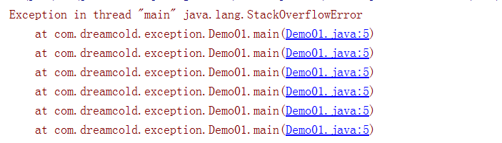

# 异常处理

## 异常概述和异常体系结构

在使用计算机语育进行项目开发的过程中，即使程序员把代码写得尽善尽美，在系统的运行过程中仍然会遇到一些问题，因为很多问题不是靠代码能够避免的，比如:客户输入数据的格式，读取文件是否存在，网络是否始终保持通畅等等。

- 异常:在Java语言中，将程序执行中发生的不正常情况称为“异常”。(开发过程中的语法错误和逻辑错误不是异常)
- Java程序在执行过程中所发生的异常事件可分为两类:
  - Error: Java慮拟机无法解决的严重问题。如: JVM系统内部错误、资源耗尽等严重情况。比如: StackOverflowError和OOM(内存耗尽). 一般不编写针对性的代码进行处理。
  - Exception: 其它因编程错误或偶然的外在因素导致的一一般性问题，可以使用针对性的代码进行处理。例如:
    - 空指针访问
    - 试图读取不存在的文件
    - 网络连接中断
    - 数组角标越界

### Error的例子

#### 栈溢出

```java
package com.dreamcold.exception;

public class Demo01 {
    public static void main(String[] args) {
        main(args);
    }
}

```

结果



一直递归调用，而不弹栈，就会导致栈的溢出错误

#### 堆溢出

```java
package com.dreamcold.exception;

public class Demo01 {
    public static void main(String[] args) {
        int[] arr=new int[1024*1024*1024];
    }
}
```

结果：new关键字申请内存在堆中，堆中没有那么多的内存，内存不够，简称OOM


### 如何处理这些异常

- 对于这些错误，一般有两种解决方法:一是遇到错误就终止程序的运行。另一种方法是由程序员在编写程序时，就考虑到错误的检测、错误消息的提示，以及错误的处理。
- 捕获错误最理想的是在编译期间， 但有的错误只有在运行时才会发生。例如:除数为0，数组下标越界等，捕捉异常可以分为
  - 编译时异常
  - 运行时异常


- Throwable作为异常的顶级父类
- 程序运行过程包含了两个过程分别是编译和运行，编译时候出现异常了就叫做编译时异常，否则就叫做运行时异常
- 当执行java.exe的时候出现的异常叫做运行时异常
- 上图中红色的时候就叫做编译时异常，蓝色的就叫做运行时异常
- 红色的异常叫做受检异常，蓝色的叫做非受检异常
- 最顶层的异常是java.lang.Throwable，以下两个类继承了该父类
  - java.lang.Exception:一般不编写代码进行处理
  - java.lang.Error：可以进行异常梳理
    - 编译时异常(checked)(受检异常)
      - IOException
        - FileNotFoundException
      - ClassNotFoundException
    - 运行时异常(unchecked)
      - NullPointerException
      - ArrayIndexOutOfBoundException
      - ClassCastException
      - NumberFormatException
      - InputMissMatchException
      - ArithmeticException


## 常见异常

### 运行时异常

#### 空指针异常

```java
package com.dreamcold.exception;

public class Demo02 {
    public static void main(String[] args) {
        int[] arr=null;
        System.out.println(arr[3]);
    }
}

```

结果:


#### 数组越界

```java
package com.dreamcold.exception;

public class Demo02 {
    public static void main(String[] args) {
        int[] arr=new int[10];
        System.out.println(arr[10]);
    }
}
```

结果


#### 类型转换异常

```java
package com.dreamcold.exception;

import java.util.Date;

public class Demo02 {
    public static void main(String[] args) {
        Object date=new Date();
        String str=(String)date;
    }
}
```

结果


#### 数字格式异常

```java
package com.dreamcold.exception;

import java.util.Date;

public class Demo02 {
    public static void main(String[] args) {
        String numbers="abcdefg";
        Integer i=Integer.parseInt(numbers);
    }
}
```

结果


#### 输入匹配异常

```java
package com.dreamcold.exception;

import java.util.Date;
import java.util.Scanner;

public class Demo02 {
    public static void main(String[] args) {
        Scanner scanner=new Scanner(System.in);
        int a=scanner.nextInt();
        System.out.println(a);
    }
}

```

测试结果：


#### 算数异常

```java
package com.dreamcold.exception;

import java.util.Date;
import java.util.Scanner;

public class Demo02 {
    public static void main(String[] args) {
        int a=10;
        int b=0;
        System.out.println(a/b);
    }
}

```

结果


### 编译时异常

比如我们逐个字符读取文件的例子

```java
package com.dreamcold.exception;

import java.io.File;
import java.io.FileInputStream;
import java.util.Date;
import java.util.Scanner;

public class Demo02 {
    public static void main(String[] args) {
        File file=new File("hello.txt");
        FileInputStream fs=new FileInputStream(file);
        int data=fs.read();
        while (data!=-1){
            System.out.println((char)data);
            data=fs.read();
        }
        fs.close();
    }
}

```

编译器提示我们没有处理对应的IOException


## 异常处理机制：try-catch-finally


## 异常处理机制:throws


## 手动抛出异常:throw


## 用户自定义异常


