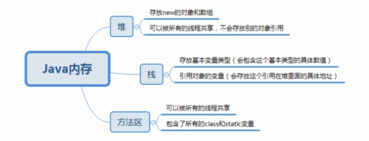

# 数组

## 数组的定义

1. 数组是相同类型数据的有序集合.
2. 数组描述的是相同类型的若干个数据,按照一定的先后次序排列组合而成。
3. 其中每一个数据称作-个数组元素,每个数组元素可以通过- 个下标来访问它们.

## 数组定义三种方式

```java
int[] arr = {1,2,3};
int[] arr = new int[]{1,2,3};
int[] arr = new int[3];
arr[0]=1; arr[1]=2; arr[2]=3;
int arr[];//定义方式但是不建议
```

## 动态确定数组

```java
int length = ... ;//根据条件计算判定
int arr = new int[length];
```
- 数组长度定下来后不可以变
- 不可在给定初值的情况下，给定长度
```java
int[] arr = new int[3]{1,2,3};
```


## 数组类型的内存表示

两部分组成

- 存储数据内容本身
- 存储数组的第一个元素的首地址


## 数组工具类Arrays的一些常见方法

- 数组的工具类java.util.Arrays
- 由于数组对象本身并没有什么方法可以供我们调用，但是API中提供了一个工具类Arrays供我们使用，从而可以对数据存储对象进行一些基本的操作
- 查看JDK帮助文档
- Arrays类中的方法都是static修饰的静态方法，在使用的时候可以直接使用类名进行调用，而不是“不用”使用对象来调用

- 具有以下常用的功能
  - 给数组赋值:fill方法
  - 数据排序：sort方法
  - 比较数组：equals方法
  - 查找数组元素:binarySearch(注意在数组有序状态)


## 数组的常见操作

###  获取数组的长度

```java
int[] arr=new int[10];
int len=arr.length;
```


### 声明并遍历数组

```java
int[] arr;// 定义数组
arr=new int[10];//开辟内存空间
for(int i=0;i<10;i++){//遍历赋值
	arr[i]=i;
}
```


### 赋值

```Java
int[] arr=new int[10];
arr[0]=100;//赋值
```


### 取值

```java
int[] arr=new int[10];
int n=arr[3];
```


## 三种初始化以及内存分析

### 内存分析





1. 当声明一个数组，在栈中声明空间，此时堆为空


2. 创建数组，new的数组存放在堆中，在堆中开辟一块连续的内存空间，内存空间中依次按顺序放n个int大小的元素，栈中的数组引用指向堆中开辟的数组内存空间


3. 给数组中的元素依次进行赋值


4. 我们开辟的数组大小为10个元素，假如我们要取第11个元素，就会弹出数组越界异常


### 三种初始化

1. 静态初始化

```java
        //静态初始化
        int[] arr={1,2,3,4,5,6,7,8,9};
```

根据初始化数组的数字个数来决定数组大小，但是一旦确定就不可以改变


2. 动态初始化

首先要开辟数组大小的空间,开辟的空间的默认值都是0，我们需要给它手动赋值

```java
     //动态初始化
     int[] b=new int[10];
```


3. 数组的默认初始化

数组是引用类型，它的元素相当于类的实例变量，因此数组一经过分配空间，其中每一个元素也会按照实例变量同样的方式被初始化


## 数组的四个基本特点

1. 数组的长度是确定的，数组一旦被创建，它的大小就是不可以改变的
2. 其长度必须是相同的类型，不允许出现混合类型
3. 数组中的元素可以是任何类型，包括了基本类型和引用类型
4. 数组变量属于引用类型，数组也可以被看成是对象，数组中的每个元素相当于该元素的成员变量
5. 数组本身就是对象，Java对象是在堆中的，因此数组无论保存在原始类型还是其他对象类型，数组对象本身都是在堆中的


## 数组的边界问题

1. 下标的合法区间是[0,length-1],如果越界就会报错
2. ArrayIndexOutOfBoundsException:数组下标越界异常
3. 小结
   - 数组是相同数据类型（数据类型可以为任何的类型）的有序集合
   - 数组也是对象，数组元素相当于对象的成员变量
   - 数组的长度是确定的不可以变的，如果越界，就会报ArrayIndexOutOfBoundsException

## 数组的使用

1. For-Each循环

通过下标遍历

```java
        int[] arr=new int[10];
        //循环遍历
        for (int i=0;i<arr.length;i++){
            System.out.println(arr[i]);
        }
```

通过计算元素之和

```java
        int[] arr={1,2,3,4,5,6,7,8};
        int sum=0;
        //计算元素之和
        for (int i=0;i<arr.length;i++){
            sum+=arr[i];
        }
        System.out.println(sum);
```

查找最大值

```java
        int[] arr={1,2,3,4,5,6,7,8};
        int max=arr[0];
        //计算元素之和
        for (int i=0;i<arr.length;i++){
            max=Math.max(max,arr[i]);
        }
        System.out.println(max);
```

使用for-each循环

```java
        int[] arr={1,2,3,4,5,6,7,8};
        for (int item : arr) {
            System.out.println(item);
        }
```


2. 数组作为方法入参


打印数组

```java
package com.dreamcold.array;

public class ArrayDemo02 {
    public static void main(String[] args) {
        int[] arr={1,2,3,4,5,6,7,8};
        printArray(arr);
    }
    
    private static void printArray(int[] arr){
        for (int i = 0; i < arr.length; i++) {
            System.out.println(arr[i]);
        }
    }
}
```


3. 数组作为返回值

反转数组

```java
 private static int[] reverse(int[] arr){
        int[] ret=new int[arr.length];
        for(int i=0,j=arr.length-1;i<arr.length;i++,j--){
            ret[j]=arr[i];
        }
        return ret;

}
```


## 多维数组

- 多维数组可以看成是数组的数组，比如二维数组就是一个特殊的一维数组，其中每一个元素又是一个一维数组
- 二维数组

```java
int[][] a=new int[4][2];
```

- 解析：以上的二维数组可以看成是一个两行五列的数组

例子：

```java
		int[][] array={{1,2},{3,4},{5,6},{7,8}};
        /**
         * 四行两列的数组
         * [4][2]
         * 1,2 array[0]
         * 3,4 array[1]
         * 5,6 array[2]
         * 7,8 array[3]
         */
```


以前arr中的每一个元素存储的是一个数，现在arr的每一个元素存储的是一个数组的引用

遍历二维数组

```java
        for (int i = 0; i < array.length; i++) {
            for (int j=0;j<array[0].length;j++){
                System.out.println(array[i][j]);
            }
        }
```


## 冒泡排序

冒泡排序无疑是最出名的排序算法之一，一共有八大排序


1. 冒泡排序算法的代码相对简单，外层是冒泡轮数，里层是依次比较，江湖人尽皆知
2. 当我们看到两层嵌套循环的时候，我们理当想到可能时间复杂度是O(n^2)


**思路**

1. 比较数据中，两个相邻的元素如果第一个数比第二个数大，我们就交换他们的位置
2. 每一次比较，都会产生一个最大，或者最小的数字
3. 下一轮可以少一次排序
4. 依次循环直到结束


```java
   public static void bubbleSort(int[] array){
        //临时变量
        int temp=0;
        //最外层循环，判断要走多少轮
        for(int i=0;i<array.length-1;i++){
            boolean flag=false; //判断当前轮是否交换过元素，如果没有交换过元素，那么就直接结束
            //内层循环比较判断两个数，如果后一个数比前一个数小，那么就交换两个数
            for(int j=0;j<array.length-1-i;j++){
                if(array[j+1]<array[j]){
                   temp=array[j];
                   array[j]=array[j+1];
                   array[j+1]=temp;
                   flag=true;
                }
            }
            if(!flag){
                break;
            }
        }
}
```

