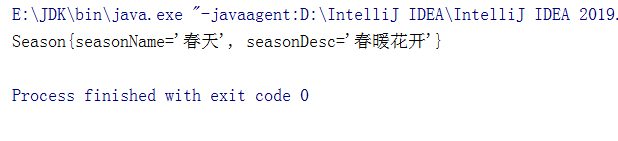
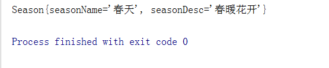
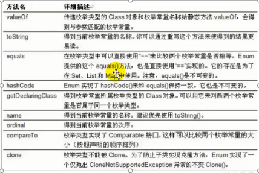
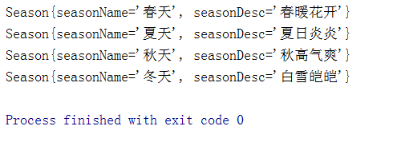
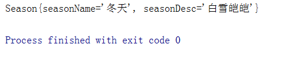
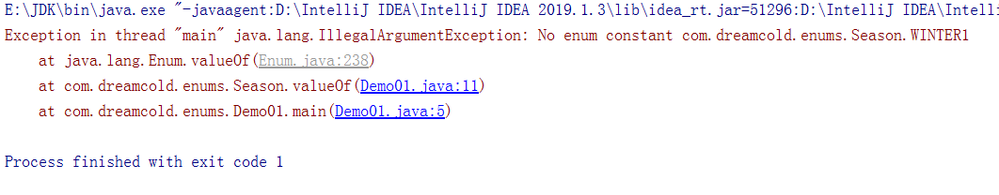
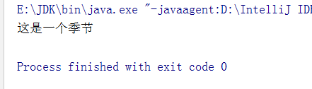
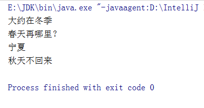

# 枚举

## 什么是枚举类

类的对象只有有限个，确定的。举例如下:

- 星期: Monday(星期一) .... Sunday(星 期天)
- 性别: Man(男 )、Woman(女)
- 季节: Spring(春 ....winer(冬天)
- 支付方式: Cash (现金)、WeChatPay (微信)、Alipay(支 付宝)、BankCard(银行卡)、CreditCard(信用卡)
- 就职状态: Busy、 Free、 Vocation、 Dimission
- 订单状态: Nonpayment (未付款)、Paid (已付款)、Fulilld (已配货)
- Delivered (已发货)、Return (退货)、Checked ( 已确认)
- 线程状态:创建、就绪、运行、阻塞、死亡
- 当需要定义一组常量时，强烈建议使用枚举类

## 定义枚举类

###  枚举类的使用

1. 枚举类的理解:类的对象只有有限个，确定的。我们称此类为枚举类

2. 当需要定义一组常量时，强烈建议使用枚举类

3. 如果枚举类中只有一个对象，则可以作为单例模式的实现方式。

### 如何定义枚举类

- 枚举类的实现
  - JDK1.5之前需要自定义枚举类
  - JDK 1.5新增的
  - enum关键字用于定义枚举类

- 枚举类的属性
  - 枚举类对象的属性不应允许被改动，所以应该使用private final 修饰
  - 枚举类的使用privatefinal修饰的属性应该在构造器中为其赋值
  - 若枚举类显式的定义了带参数的构造器,则在列出枚举值时也必须对应的传入参数


方式一: jdk5.0之前，自定义枚举类

定义：

```java
class  Season{
    //声明Season对象的属性priavte final修饰
    private final String seasonName;
    private final String seasonDesc;

    //私有化的构造器,并给对象属性赋值
    private Season(String seasonName,String seasonDesc){
        this.seasonName=seasonName;
        this.seasonDesc=seasonDesc;
    }

    //提供当前枚举类的多个对象: public static final的
    public static final Season SPRING=new Season("春天","春暖花开");
    public static final Season SUMMER=new Season("夏天","夏日炎炎");
    public static final Season AUTUMN=new Season("秋天","秋高气爽");
    public static final Season WINTER=new Season("冬天","白雪皑皑");

    //其他诉求:获取枚举类对象的属性
    public String getSeasonName() {
        return seasonName;
    }

    public String getSeasonDesc() {
        return seasonDesc;
    }

    //4.其他诉灭1:提供toString()

    @Override
    public String toString() {
        return "Season{" +
                "seasonName='" + seasonName + '\'' +
                ", seasonDesc='" + seasonDesc + '\'' +
                '}';
    }
}
```


使用效果：



方式二: jdk5.0，可以使用enum关键字定义枚举类

第二种定义方式：

```java
enum  Season{

    //提供当前枚举类的多个对象: public static final的
    SPRING("春天","春暖花开"),
    SUMMER("夏天","夏日炎炎"),
    AUTUMN("秋天","秋高气爽"),
    WINTER("冬天","白雪皑皑");
    //声明Season对象的属性priavte final修饰
    private final String seasonName;
    private final String seasonDesc;

    //私有化的构造器,并给对象属性赋值
    private Season(String seasonName,String seasonDesc){
        this.seasonName=seasonName;
        this.seasonDesc=seasonDesc;
    }


    //其他诉求:获取枚举类对象的属性
    public String getSeasonName() {
        return seasonName;
    }

    public String getSeasonDesc() {
        return seasonDesc;
    }

    //4.其他诉灭1:提供toString()

    @Override
    public String toString() {
        return "Season{" +
                "seasonName='" + seasonName + '\'' +
                ", seasonDesc='" + seasonDesc + '\'' +
                '}';
    }
}
```

效果：



## Enum类的主要方法

主要方法列表：



Enum类的主要方法:

- values()方法:返回枚举类型的对象数组。该方法可以很方便地遍历所有的枚举值。
- valueOf(String str):可以把- - 个字符串转为对应的枚举类对象。要求字符串必须是枚举类对象的“名字”。如不是，会有运行时异常:，IllegalArgumentException。
- toString():返回当前枚举类对象常量的名称

示例一：values方法

```java
package com.dreamcold.enums;

public class Demo01 {
    public static void main(String[] args) {
        Season[] values = Season.values();
        for (int i=0;i<values.length;i++){
            System.out.println(values[i]);
        }
    }
}
```

效果：



示例二：valueOf方法

1. 正常情况下

```java
package com.dreamcold.enums;

public class Demo01 {
    public static void main(String[] args) {
      Season winter=Season.valueOf("WINTER");
      System.out.println(winter);
    }
}
```

效果：



2. 在找不到对应的枚举类型的时候，会报`java.lang.IllegalArgumentException`



## 实现接口的枚举类

情况一:实现接口，在enum类中实现抽象方法

```java
package com.dreamcold.enums;

public class Demo01 {
    public static void main(String[] args) {
      Season winter=Season.valueOf("WINTER");
      winter.show();
    }
}

interface Info{
    void show();
}

enum  Season implements Info{
    //提供当前枚举类的多个对象: public static final的
    SPRING("春天","春暖花开"),
    SUMMER("夏天","夏日炎炎"),
    AUTUMN("秋天","秋高气爽"),
    WINTER("冬天","白雪皑皑");
    //声明Season对象的属性priavte final修饰
    private final String seasonName;
    private final String seasonDesc;

    //私有化的构造器,并给对象属性赋值
    private Season(String seasonName,String seasonDesc){
        this.seasonName=seasonName;
        this.seasonDesc=seasonDesc;
    }


    //其他诉求:获取枚举类对象的属性
    public String getSeasonName() {
        return seasonName;
    }

    public String getSeasonDesc() {
        return seasonDesc;
    }

    //4.其他诉灭1:提供toString()

    @Override
    public String toString() {
        return "Season{" +
                "seasonName='" + seasonName + '\'' +
                ", seasonDesc='" + seasonDesc + '\'' +
                '}';
    }


    @Override
    public void show() {
        System.out.println("这是一个季节");
    }
}
```

效果：



情况二:让枚举类的对象分别实现接口中的抽象方法

```java
package com.dreamcold.enums;

public class Demo01 {
    public static void main(String[] args) {
      Season winter=Season.WINTER;
      winter.show();
      Season spring=Season.SPRING;
      spring.show();
      Season summer=Season.SUMMER;
      summer.show();
      Season autumn=Season.AUTUMN;
      autumn.show();

    }
}

interface Info{
    void show();
}

enum  Season implements Info{
    //提供当前枚举类的多个对象: public static final的
    SPRING("春天","春暖花开"){
        @Override
        public void show() {
            System.out.println("春天再哪里？");
        }
    },
    SUMMER("夏天","夏日炎炎"){
        @Override
        public void show() {
            System.out.println("宁夏");
        }
    },
    AUTUMN("秋天","秋高气爽"){
        @Override
        public void show() {
            System.out.println("秋天不回来");
        }
    },
    WINTER("冬天","白雪皑皑"){
        @Override
        public void show() {
            System.out.println("大约在冬季");
        }
    };
    //声明Season对象的属性priavte final修饰
    private final String seasonName;
    private final String seasonDesc;

    //私有化的构造器,并给对象属性赋值
    private Season(String seasonName,String seasonDesc){
        this.seasonName=seasonName;
        this.seasonDesc=seasonDesc;
    }


    //其他诉求:获取枚举类对象的属性
    public String getSeasonName() {
        return seasonName;
    }

    public String getSeasonDesc() {
        return seasonDesc;
    }

    //4.其他诉灭1:提供toString()

    @Override
    public String toString() {
        return "Season{" +
                "seasonName='" + seasonName + '\'' +
                ", seasonDesc='" + seasonDesc + '\'' +
                '}';
    }


}
```

效果：

