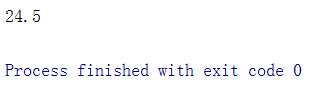
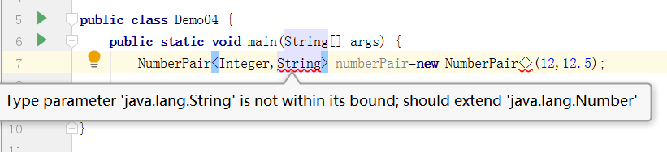
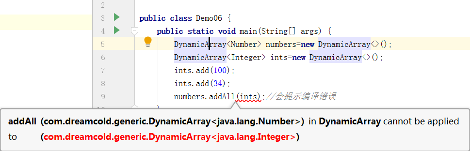

# 泛型

## 什么是泛型

泛型将接口的概念进一步延伸， “泛型”的字面意思就是广泛的类型。类、接口和方法代码可以应用于
非常广泛的类型，代码与它们能够操作的数据类型不再绑定在一起，同一套代码可以用于多种数据类型,
这样，不仅可以复用代码，降低耦合，而且可以提高代码的可读性和安全性。

示例1

```java
class Pair<T>{
    T first;
    T second;

    public Pair(T first, T second) {
        this.first = first;
        this.second = second;
    }

    public T getFirst() {
        return first;
    }

    public T getSecond() {
        return second;
    }

    public void setFirst(T first) {
        this.first = first;
    }

    public void setSecond(T second) {
        this.second = second;
    }
}
```

Pair就是一一个泛型类，与普通类的区别体现在:

- 类名后面多了一个`T`
- first和second的类型都是T

T是什么呢? T表示类型参数，泛型就是类型参数化，处理的数据类型不是固定的，而是可以作为参数传入。怎么用这个泛型类，并传递类型参数呢?看代码: 

```java
package com.dreamcold.generic;

public class Demo01 {
    public static void main(String[] args) {
        Pair<Integer> minmax=new Pair<>(1,100);
        Integer min=minmax.getFirst();
        Integer max=minmax.getSecond();
        System.out.println(min);
        System.out.println(max);
    }
}

class Pair<T>{
    T first;
    T second;

    public Pair(T first, T second) {
        this.first = first;
        this.second = second;
    }

    public T getFirst() {
        return first;
    }

    public T getSecond() {
        return second;
    }

    public void setFirst(T first) {
        this.first = first;
    }

    public void setSecond(T second) {
        this.second = second;
    }
}

```


结果


Pair`<Integer>`中的Integer就是传递的实际类型参数。Pair类的 代码和它处理的数据类型不是绑定的，
具体类型可以变化。上面是Integer, 也可以是String,比如:

```java
 Pair<String> pair=new Pair<>("name","dreamcold");
```

类型参数可以有多个，Pair类中的first和second可以是不同的类型，多个类型之间以逗号分隔，来看改
进后的Pair类定义:

示例二

```java
package com.dreamcold.generic;

public class Demo01 {
    public static void main(String[] args) {
        Pair<String,Integer> pair=new Pair<>("id",123);
        System.out.println(pair.getFirst());
        System.out.println(pair.getSecond());
    }
}

class Pair<U,V>{
    U first;
    V second;

    public Pair(U first, V second) {
        this.first = first;
        this.second = second;
    }

    public U getFirst() {
        return first;
    }

    public V getSecond() {
        return second;
    }

    public void setFirst(U first) {
        this.first = first;
    }

    public void setSecond(V second) {
        this.second = second;
    }
}

```

结果


`<String，Integer> `既出现在了声明变量时，也出现在了new后面，比较烦琐，从Java 7开始，支持省略
后面的类型参数，可以如下使用:

```java
Pair<String,Integer> pair=new Pair<>("id",123);
```


## 泛型的基本原理

泛型类型参数到底是什么呢?为什么一-定要定 义类型参数呢?定义普通类，直接使用Object不就行了吗?比如，Pair类可以写为:

```java
package com.dreamcold.generic;

public class Demo01 {
    public static void main(String[] args) {
        Pair pair=new Pair("123",5);
        System.out.println(pair.getFirst());
        System.out.println(pair.getSecond());
    }
}

class Pair{
   Object first;
   Object second;

    public Pair(Object first, Object second) {
        this.first = first;
        this.second = second;
    }

    public Object getFirst() {
        return first;
    }

    public Object getSecond() {
        return second;
    }

    public void setFirst(Object first) {
        this.first = first;
    }

    public void setSecond(Object second) {
        this.second = second;
    }
}

```

结果


使用Pair的代码可以为:

```java
package com.dreamcold.generic;

public class Demo01 {
    public static void main(String[] args) {
        Pair pair=new Pair(1,100);
        Integer min=(Integer)pair.getFirst();
        Integer max=(Integer)pair.getSecond();
        System.out.println(min);
        System.out.println(max);
        Pair kv=new Pair("123",3);
        String first=(String)kv.getFirst();
        Integer second=(Integer)kv.getSecond();
        System.out.println(first);
        System.out.println(second);

    }
}
```

结果


这样是可以的。实际上，Java泛型的内部原理就是这样的。

我们知道，Java 有Java编译器和Java虚拟机，编译器将Java源代码转换为.class文件，虚拟机加载并运
行.class文件。对于泛型类，Java编译器会将泛型代码转换为普通的非泛型代码，就像上面的普通Pair类代
码及其使用代码一样，将类型参数T擦除，替换为Object,插入必要的强制类型转换。Java虚拟机实际执
行的时候，它是不知道泛型这回事的，只知道普通的类及代码。


再强调一~下，Java泛型是通过擦除实现的，类定义中的类型参数如T会被替换为Object,在程序运行
过程中，不知道泛型的实际类型参数，比如Pair`<Integer>`，运行中只知道Pair,而不知道Integer。认识到
这一点是非常重要的，它有助于我们理解Java泛型的很多限制。

Java为什么要这么设计呢?泛型是Java 5以后才支持的，这么设计是为了兼容性而不得已的一个选
择。

## 泛型的好处

既然只使用普通类和Object就可以，而且泛型最后也转换为了普通类，那为什么还要用泛型呢?或者
说，泛型到底有什么好处呢?泛型主要有两个好处:

- 更好的安全性
- 更好的可读性

语言和程序设计的一个重要目标是将bug尽量消灭在摇篮里，能消灭在写代码的时候，就不要等到代
码写完程序运行的时候。只使用Object， 代码写错的时候，开发环境和编译器不能帮我们发现问题，看代
码:


编译器并没有给我报错，但是实际运行，类型转换出错


看出问题了吗?写代码时不小心把类型弄错了，不过，代码编译时是没有任何问题的，但运行时程
序抛出了类型转换异常ClassCastException。 如果使用泛型，则不可能犯这个错误，比如下面的代码:

```java
package com.dreamcold.generic;

public class Demo01 {
    public static void main(String[] args) {
       Pair<String ,Integer> pair=new Pair<>("id",5);
       Integer id=pair.getFirst();
       String number=pair.getSecond();
    }
}

class Pair<U,V>{
    U first;
    V second;

    public Pair(U first, V second) {
        this.first = first;
        this.second = second;
    }

    public U getFirst() {
        return first;
    }

    public void setFirst(U first) {
        this.first = first;
    }

    public void setSecond(V second) {
        this.second = second;
    }

    public V getSecond() {
        return second;
    }
}
```


IDEA会为我们报这样一个错误的同时编译会报错


开发环境(如Eclipse) 会提示类型错误，即使没有好的开发环境，编译时Java编译器也会提示。这称
之为类型安全，也就是说，通过使用泛型，开发环境和编译器能确保不会用错类型，为程序多设置一道安
全防护网。使用泛型，还可以省去烦琐的强制类型转换，再加上明确的类型信息，代码可读性也会更好。


## 泛型实现容器类

泛型类最常见的用途是作为容器类。所谓容器类，简单地说，就是容纳并管理多项数据的类。数组
就是用来管理多项数据的，但数组有很多限制，比如，长度固定，插入、删除操作效率比较低。计算机技
术有一门课程叫数据结构，专门讨论管理数据的各种方式。

我们来实现一个简单的动态数组容器。所谓动态数组，就是长度可变的数组。底层数组的长度当然是不可变的，但我们提供一一个类，对这个类的使用者而言，好像就是一一个长度可变的数组。Java容 器中有一个对应的类ArrayList,本节我们来实现一个 简化版

示例一

```java
package com.dreamcold.generic;

import java.util.Arrays;

public class DynamicArray<E> {
    private static final int DEDAULT_CAPACITY=10;

    private int size;

    private  Object[] elementData;

    public  DynamicArray(){
        this.elementData=new Object[DEDAULT_CAPACITY];
    }

    private void ensureCapacity(int minCapacity){
        int oldCapacity=elementData.length;
        if(oldCapacity>=minCapacity){
            return;
        }
        int newCapacity=oldCapacity*2;
        if(newCapacity<minCapacity){
            newCapacity =minCapacity;
        }
        this.elementData= Arrays.copyOf(elementData,newCapacity);
    }

    public  void add(E e){
        ensureCapacity(size+1);
        elementData[size++]=e;
    }

    public E get(int index){
        return (E)elementData[index];
    }

    public int size(){
        return this.size;
    }

    public  E set(int index,E element){
        E oldVaue=get(index);
        this.elementData[index]=element;
        return  oldVaue;
    }


}

```

DynamicArray就是一一个动态数组，内部代码与我们之前分析过的StringBuilder类似，通过
ensureCapacity方法来根据需要扩展数组。作为一一个 容器类，它容纳的数据类型是作为参数传递过来的,
比如，存放Double类型: 

测试

```java
package com.dreamcold.generic;

import java.util.Random;

public class Demo02 {
    public static void main(String[] args) {
        DynamicArray<Double> arr=new DynamicArray<Double>();
        Random rnd=new Random();
        int size=1+rnd.nextInt(100);
        for (int i=0;i<size;i++){
            arr.add(Math.random());
        }
        Double d=arr.get(rnd.nextInt(size));
        System.out.println(d);
    }
}

```


这就是一一个简单的容器类，适用于各种数据类型，且类型安全。后文还会以Dynamic-Array为例进行扩展，以解释泛型概念。具体的类型还可以是一一个泛型类，比如，可以这样写:

```java
   DynamicArray<Pair<String,Integer>> array=new DynamicArray<>();
```

arr表示一一个动态数组，每个元素是Pair<Integer, String>类型 。


## 泛型方法

除了泛型类，方法也可以是泛型的，而且，-一个方法是不是泛型的，与它所在的类是不是泛型没有
什么关系。我们看个例子:

示例一

```java
   public static <T> int indexOf(T[] arr,T elem){
        for (int i=0;i<arr.length;i++){
            if(arr[i].equals(elem)){
                return i;
            }
        }
        return -1;
    }
```

这个方法就是一一个泛型方法，类型参数为T,放在返回值前面，它可以如下调用:

```java
    public static void main(String[] args) {
        Integer[] arr=new Integer[]{1,2,3,4,5};
        Integer elem=5;
        int index=indexOf(arr,elem);
        System.out.println(index);
    }

```

结果


indexOf表示一一个算法，在给定数组中寻找某个元素，这个算法的基本过程与具体数据类型没有什么
关系，通过泛型，它可以方便地应用于各种数据类型，且由编译器保证类型安全。

```java
public static <U,V> Pair<U,V> makePair(U first,V second){
        Pair<U,V> pair=new Pair<>(first,second);
        return pair;
}
```

**与泛型类不同，调用方法时一般并不需要特意指定类型参数的实际类型，比如调用makePair:**

```java
 Pair<String, Integer> pair = makePair("dreamcold", 2);
```

并不需要告诉编译器U的类型是Integer，V的类型是String, Java编译器可以自动推断出来。

## 泛型接口

接口也可以是泛型的，我们之前介绍过的Comparable和Comparator接口都是泛型的，它们的代码如
下:

示例一

Comparable.java

```java
public interface Comparable<T> {
    public int compareTo(T o);
}
```


示例二

Comparator.java

```java
public interface Comparator<T> {
    int compare(T o1, T o2);
    boolean equals(Object obj);
}
```

与前面一-样，T是类型参数。实现接口时，应该指定具体的类型，比如，对Integer类， 实现代码是:


```java
 public int compareTo(Integer anotherInteger) {
        return compare(this.value, anotherInteger.value);
 }
```

通过implements Comparable`<Integer>`，Integer实现 了Comparable接口，指定了实际类型参数为
Integer，表示Integer只能与Integer对象进行比较。

再看Comparator的一一个 例子，String类 内部一个Comparator的接口实现为:


## 类型参数的限定

### 上界为某个具体的类

在之前的介绍中，无论是泛型类、泛型方法还是泛型接口，关于类型参数，我们都知之甚少，只能
把它当作Object,但Java支 持限定这个参数的-一个上界，也就是说，参数必须为给定的上界类型或其子类
型，这个限定是通过extends关键字来表示的。这个上界可以是某个具体的类或者某个具体的接口，也可
以是其他的类型参数，我们逐个介绍其应用。


比如，.上面的Pair类， 可以定义一个子类NumberPair，限定两个类型参数必须为Number，代码如下:

```java
class NumberPair<U extends Number,V extends Number> extends Pair<U,V>{
    
    public  NumberPair(U first,V second){
        super(first,second);
    }
    
}
```

1. U必须是Number的子类
2. V也必须是Number的子类
3. 继承了泛型类Pair

**限定类型后，就可以使用该类型的方法了**。比如，对于NumberPair类，first和second变 量就可以当作
Number进行处理了。比如可以定义一一个求和方法，如下所示:

```java
    public double sum(){
        return getFirst().doubleValue()+getSecond().doubleValue();
    }
```

可以这么用:

```java
    public static void main(String[] args) {
        NumberPair<Integer,Double> numberPair=new NumberPair<>(12,12.5);
        double sum=numberPair.sum();
        System.out.println(sum);
    }
```

结果



限定类型后，如果类型使用错误，编译器会提示。指定边界后，类型擦除时就不会转换为Object了，
而是会转换为它的边界类型，这也是容易理解的。




### 上界为某个接口

在泛型方法中，一种常 见的场景是限定类型必须实现Comparable接口，我们来看代码: .

```java
    public static <T extends Comparable> T max(T[] arr){
        T max=arr[0];
        for (int i=0;i<arr.length;i++){
            if(arr[i].compareTo(max)>0){
                max=arr[i];
            }
        }
        return max;
    }
```

max方法计算一一个 泛型数组中的最大值。计算最大值需要进行元素之间的比较，要求元素实现
Comparable接口，所以给类型参数设置了-一个上边界Comparable, T必须实现Comparable接口。


不过，直接这么编写代码，Java中 会给一一个 警告信息，因为Comparable是一一个 泛型接口，它也需要一
个类型参数，所以完整的方法声明应该是:

```java
 public static <T extends Comparable<T>> T max(T[] arr){
      //code ...
    }
```

`<T extends Comparable<T>>`是-种令人费解的语法形式，这种形式称为递归类型限制，可以这么解
读: T表示一种数据类型，必须实现Comparable接口，且必须可以与相同类型的元素进行比较。


### 上界为其他类型参数

. 上面的限定都是指定了一一个明确的类或接口，Java支持- 一个类型参数以另- 一个类型参数作为上界。为
什么需要这个呢?我们看个例子，给上面的DynamicArray类增加一-个实例方法addAll,这个方法将参数容
器中的所有元素都添加到当前容器里来，直觉上，代码可以如下书写:

```java
public void addAll(DynamicArray<E> c){
        for (int i = 0; i < c.size; i++) {
            add(c.get(i));
        }
    }
```

但这么写有一些局限性，我们看使用它的代码:



numbers是一个Number类型的容器，ints 是一一个Integer类型的容器，我们希望将ints添加到numbers中，
因为Integer是Number的子类，应该说，这是-一个合理的需求和操作。


但Java会在numbers addAll (ints) 这行代码上提示编译错误: addAll需 要的参数类型为DynamicArray`<Number>`，而传递过来的参数类型为DynamicArray`<Integer>`，不适用。Integer 是Number的子类，怎么会不适用呢?


事实就是这样，确实不适用，而且是很有道理的，假设适用，我们看下会发生什么。

```java
      DynamicArray<Integer> ints=new DynamicArray<>();
      DynamicArray<Number> numbers=ints;
      numbers.add(new Double(12.34));
```

那最后一行就是合法的，这时，DynamicArray<Integer>中 就会出现Double类型的值，而这显然破坏了
Java泛型关于类型安全的保证。


我们强调一下， 虽然Integer是Number的子类，但DynamicArray`<Integer> `并不是DynamicArray`<Number>`的子类，DynamicArray`<Integer>`的对 象也不能赋值给Dynamic-Array`<Number>`的
变量，这一点初看上去是违反直觉的，但这是事实，必须要理解这一点。

不过，我们的需求是合理的，将Integer添 加到Number容器中并没有问题。这个问题可以通过类型限
定来解决:

```java
  public  <T extends E > void addAll(DynamicArray<T> c){
        for (int i = 0; i < c.size; i++) {
            add(c.get(i));
        }
    }
```

E是DynamicArray的类型参数，T是addAll的类型参数，T的上界限定为E，这样，下面的代码就没有问题了:

```java
  		DynamicArray<Number> numbers=new DynamicArray<>();
        DynamicArray<Integer> ints=new DynamicArray<>();
        ints.add(100);
        ints.add(50);
        numbers.addAll(ints);
```

## 小结

泛型是计算机程序中一种重要的思维方式，它将数据结构和算法与数据类型相分离，使得同一套数
据结构和算法能够应用于各种数据类型，而且可以保证类型安全，提高可读性。在Java中，泛型广泛应用
于各种容器类中，理解泛型是深刻理解容器的基础。


本节介绍了泛型的基本概念，包括泛型类、泛型方法和泛型接口，关于类型参数，我们介绍了多种
.上界限定，限定为某具体类、某具体接口或其他类型参数。泛型类最常见的用途是容器类，我们实现了一
个简单的容器类DynamicArray，以解释泛型概念。


在Java中，泛型是通过类型擦除来实现的，它是Java编译器的概念，Java虚拟机运行时对泛型基本一
无所知，理解这一点是很重要的，它有助于我们理解Java泛型的很多局限性。


## 通配符的解析

### 更简洁的关系限定

为了将Integer对象添加到Number容器中，我们的类型参数使用其他参数作为上界，这种写法略有繁琐，我们可以采用更为简洁的通配符的写法。

原来的写法为:

```java
    public  <T extends E > void addAll(DynamicArray<T> c){
        for (int i = 0; i < c.size; i++) {
            add(c.get(i));
        }
    }

```

现在使用通配符可以改为如下的形式:

```java
public void addAll(DynamicArray<? extends E> c){
        for (int i = 0; i < c.size; i++) {
            add(c.get(i));
        }
}
```

这个方法没有定义类型参数，c的类型是`DynamicArray<? extends E>`,其中`?`代表了通配符，`<? extends E>`表示的是有限通配符,匹配E或者E的某个子类型，具体是什么子类型是位置的，使用这个方法不需要做任何的改动。

```java
 public static void main(String[] args) {
        DynamicArray<Number> numbers=new DynamicArray<>();
        DynamicArray<Integer> ints=new DynamicArray<>();
        ints.add(100);
        ints.add(12);
        numbers.addAll(ints);
    }
```

这里E是Number类型，而`DynamicArray<? extends E>`则可以匹配`DynamicArray<Integer>`，那么会产生一个问题？同样是泛型`<T extends E>`和`<? extends E>`有什么关系和区别呢？

- `<T extends E>`用于**定义**类型参数，它声明了一个类型参数T，可以放在泛型类型定义中的类名后面，泛型方法返回值前面
- `? extends E`用于**实例化**类型参数，它用于实例化泛型宾亮中的类型参数，只是这个具体类型是未知的，只知道它是E或者E的某个子类型。

虽然它们不同，但是两者写法可以达到共同的目标，比如之前两种写法

```java
 public  <T extends E > void addAll(DynamicArray<T> c)
 public void addAll(DynamicArray<? extends E> c)
```

那么到底使用哪种通配符呢？我们先进一步的理解通配符再解释。


