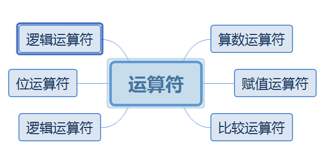
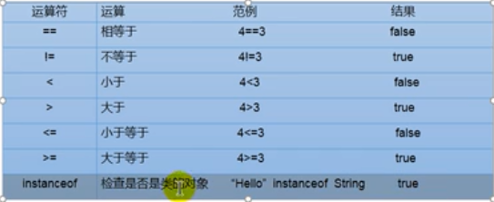
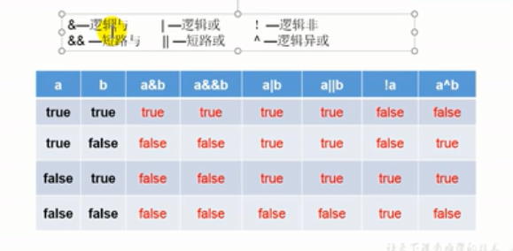

# 运算符

## 运算符的分类




## 算数运算符


算数运算符可以分为+、-、*、/、(前)++、(后)++、(前)--、(后)--

### 除号

```java
package day01;

public class CountTest {
    public static void main(String[] args) {
        int num1=12;
        int num2=5;
        int result1=num1/num2;
        System.out.println(result1);//2
        int result2=num1/num2*num2;
        System.out.println(result2);//10
        double result3=num1/num2;
        System.out.println(result3);//2.0

        double result4=num1/(num2+0.0);//2.4
        System.out.println(result4);

        double result5=(double)num1/num2;//2.4
        System.out.println(result5);

    }
}

```


### 取模

取模的结果的正负号和被模数是一样的,开发中经常需要通过该方式判断能否将该数值除尽。

```java
package day01;

public class CountTest {
    public static void main(String[] args) {
      int m=12;
      int n=5;
      System.out.println("m1 % n1 ="+m%n);//2


      int m1=-12;
      int n1=5;
      System.out.println("m1 % n1 ="+m1%n1);//-2

      int m2=12;
      int n2=-5;
      System.out.println("m1 % n1 ="+m2%n2);//2

      int m3=-12;
      int n3=-5;
      System.out.println("m1 % n1 ="+m3%n3);//-2
      
    }
}

```

### (前)++、(后)++

- (前)++:先自增1，后运算
- (后)++:先运算，后自增1

```java
package day01;

public class CountTest {
    public static void main(String[] args) {
        int a1=10;
        int b1=++a1;
        System.out.println("a1 = "+a1+" b1 ="+b1); // a1=11, b1=11

        int a2=10;
        int b2=a2++;
        System.out.println("a2 = "+a2+" b2 ="+b2); // a2=11, b2=10

    }
}

```

注意：short直接加一的话，会导致的得到的是一个int类型的变量，直接再赋值给short类型的话，会导致因为精度丢失，进而报错

```java
short s1=10;
s1=(short) (s1+1); //正确，强制类型转换
```

相应的如果我们采用自增运算符就不会报错,除此之外自增一的操作的效率更高

```java
s1++;
```

溢出的情况下

```java
byte b=127;
b++;
System.out.println(b); //-128
```
与之对应的--的规律如下
- (前)--,先自减1，后运算
- (后)--，先运算，后自减1

## 赋值

```java
//赋值符号
int i1=10;
int j1=10;
//连续赋值

int i2,j2;
i2=j2=10;

int i3=10,j3=20;

```

扩展运算符

```java
x=10;
x+=1;//x=x+1;
x*=1;//x=x*1;
x/=1;//x=x/1;
x-=1;//x=x-1;
```

特殊性情况

```java
short s1=10;
s1=s1+2;//编译不通过
s1+=2;//编译通过

```

- 开发中希望变量实现+2的操作，有几种方法？前提(int num=10;)
    - num=num+2
    - num+=2(推荐不会改变数据类型)

- 开发中如果想要实现+1的操作，有几种方法？
    - num=num+1;
    - num+=1;
    - num++(推荐);

## 比较运算符




- 比较运算符的结果都是Boolean类型的，也就是要么是true、要么是false
- 比较运算符==不可以误写成=

```java
package day01;

public class CountTest {
    public static void main(String[] args) {
        int i=10;
        int j=20;
        System.out.println(i==j);//true
        System.out.println(i=j);//20

    }
}

```

## 逻辑运算符


布尔运算是一种关系运算，包括以下几类：

- 比较运算符：>，>=，<，<=，==，!=
- 与运算 &&
- 或运算 ||
- 非运算 !




关系运算符的优先级

- !
- `>，>=，<，<=`
- ==，!=
- &&
- ||

短路运算

布尔运算的一个重要特点是短路运算。如果一个布尔运算的表达式能提前确定结果，则后续的计算不再执行，直接返回结果。

```java
    public static void main(String[] args) {
        boolean b=5<3;
        boolean result=b&&(5/0>0);//本来这里要报错但是，由于前部分就可以判断该式为假，所有后部分除零就不计算了
        System.out.println(result);

    }
```

## 位运算符

### 移位运算

在计算机中，整数总是以二进制的形式表示。例如，int类型的整数7使用4字节表示的二进制如下：
```
00000000 0000000 0000000 00000111
```
可以对整数进行移位运算。对整数7左移1位将得到整数14，左移两位将得到整数28：
```
int n = 7;       // 00000000 00000000 00000000 00000111 = 7
int a = n << 1;  // 00000000 00000000 00000000 00001110 = 14
int b = n << 2;  // 00000000 00000000 00000000 00011100 = 28
int c = n << 28; // 01110000 00000000 00000000 00000000 = 1879048192
int d = n << 29; // 11100000 00000000 00000000 00000000 = -536870912
```
左移29位时，由于最高位变成1，因此结果变成了负数。

类似的，对整数28进行右移，结果如下：
```
int n = 7;       // 00000000 00000000 00000000 00000111 = 7
int a = n >> 1;  // 00000000 00000000 00000000 00000011 = 3
int b = n >> 2;  // 00000000 00000000 00000000 00000001 = 1
int c = n >> 3;  // 00000000 00000000 00000000 00000000 = 0
```
如果对一个负数进行右移，最高位的1不动，结果仍然是一个负数：
```
int n = -536870912;
int a = n >> 1;  // 11110000 00000000 00000000 00000000 = -268435456
int b = n >> 2;  // 11111000 00000000 00000000 00000000 = -134217728
int c = n >> 28; // 11111111 11111111 11111111 11111110 = -2
int d = n >> 29; // 11111111 11111111 11111111 11111111 = -1
```
还有一种无符号的右移运算，使用>>>，它的特点是不管符号位，右移后高位总是补0，因此，对一个负数进行>>>右移，它会变成正数，原因是最高位的1变成了0：
```
int n = -536870912;
int a = n >>> 1;  // 01110000 00000000 00000000 00000000 = 1879048192
int b = n >>> 2;  // 00111000 00000000 00000000 00000000 = 939524096
int c = n >>> 29; // 00000000 00000000 00000000 00000111 = 7
int d = n >>> 31; // 00000000 00000000 00000000 00000001 = 1
```
对byte和short类型进行移位时，会首先转换为int再进行位移。

仔细观察可发现，左移实际上就是不断地×2，右移实际上就是不断地÷2。

### 位运算

位运算是按位进行与、或、非和异或的运算。

与运算的规则是，必须两个数同时为1，结果才为1：
```
n = 0 & 0; // 0
n = 0 & 1; // 0
n = 1 & 0; // 0
n = 1 & 1; // 1
```
或运算的规则是，只要任意一个为1，结果就为1：
```
n = 0 | 0; // 0
n = 0 | 1; // 1
n = 1 | 0; // 1
n = 1 | 1; // 1
```
非运算的规则是，0和1互换：
```
n = ~0; // 1
n = ~1; // 0
```
异或运算的规则是，如果两个数不同，结果为1，否则为0：
```
n = 0 ^ 0; // 0
n = 0 ^ 1; // 1
n = 1 ^ 0; // 1
n = 1 ^ 1; // 0
```

### 三元运算符
```java
public class Main {
    public static void main(String[] args) {
        int n = -100;
        int x = n >= 0 ? n : -n;
        /*
        if(n>=0){
            x=n;
        }else{
            x=-n;
        }
        */
        System.out.println(x);
    }
}
```

- 上述语句的意思是，判断n >= 0是否成立，如果为true，则返回n，否则返回-n。这实际上是一个求绝对值的表达式。

- 注意到三元运算b ? x : y会首先计算b，如果b为true，则只计算x，否则，只计算y。此外，x和y的类型必须相同，因为返回值不是boolean，而是x和y之一。