# 面向对象

Java的核心思想就是OOP

## 初识面向对象

### 面向过程

1. 步骤清晰简单，第一步做什么，第二步做什么.... .
2. 面对过程适合处理一些较为简单的问题

### 面向对象

1. 物以类聚，分类的思维模式，思考问题首先会解决问题需要哪些分类,然后对这些分类进行单独思考。最后，才对某个分类下的细节进行面向过程的思索。
2. 面向对象适合处理复杂的问题，适合处理需要多人协作的问题!

对于描述复杂的事物，为了从宏观上把握、从整体上合理分析，我们需要使用面向对象的思路来分析整个系统。但是，具体到微观操作,仍然需要面向过程的思路去处理。

### 什么是面向对象

面向对象编程(Object-Oriented Programming, OOP)
面向对象编程的本质就是:以类的方式组织代码，以对象的组织(封装)数据。


抽象：比如要设计一个学生管理系统，我们要将学生的共性抽离出来，比如年龄、性别、班级等等


三大特性:

- 封装：将数据包装起来，仅仅提供接口来访问数据
- 继承：儿子会继承父亲的所有东西，有子类和父类，子类通过继承父类可以得到父类的所有东西
- 多态：都是学习的方法，人可以学习，假如小明学习比较好，小红学习比较差，两者都会执行学习的方法，但是学出来的东西完全不同，同一事物多种形态

人认识论角度考虑是先有对象后有类。对象，是具体的事物。类,是抽象的，是对对象的抽象
人代码运行角度考虑是先有类后有对象。类是对象的模板。

## 方法回顾和加深

### 方法的定义

- 方法就是我们在面向过程语言中学过的函数，但是将函数写在类中就叫做方法
- main方法是整个程序的启动入口，一个真正的程序中仅仅有一个main方法

``` 
访问修饰符 返回值 函数名（...方法参数）{
	//方法体
	//返回值
}
```


#### 修饰符

Java中，可以使用访问控制符来保护对类、变量、方法和构造方法的访问。Java 支持 4 种不同的访问权限。

- **default** (即默认，什么也不写）: 在同一包内可见，不使用任何修饰符。使用对象：类、接口、变量、方法。
- **private** : 在同一类内可见。使用对象：变量、方法。 **注意：不能修饰类（外部类）**
- **public** : 对所有类可见。使用对象：类、接口、变量、方法
- **protected** : 对同一包内的类和所有子类可见。使用对象：变量、方法。 **注意：不能修饰类（外部类）**。

| 修饰符      | 当前类 | 同一包内 | 子孙类(同一包) | 子孙类(不同包)                                               | 其他包 |
| :---------- | :----- | :------- | :------------- | :----------------------------------------------------------- | :----- |
| `public`    | Y      | Y        | Y              | Y                                                            | Y      |
| `protected` | Y      | Y        | Y              | Y/N（[说明](https://www.runoob.com/java/java-modifier-types.html#protected-desc)） | N      |
| `default`   | Y      | Y        | Y              | N                                                            | N      |
| `private`   | Y      | N        | N              | N                                                            | N      |

#### 返回类型

```java
public int max(int a,int b){
    return a>b?a:b;
}
```

声明的返回类型与实际的返回类型要一致

#### break和return的区别

| break      | return   |
| ---------- | -------- |
| 跳出switch | 结束方法 |
| 结束循环   | 返回结果 |

#### 方法名

注意规范、见名知意

#### 参数列表

1. （参数类型，参数名）...
2. 通过...来声明可变长参数

#### 方法的重载

1. 方法重载是指多个方法的方法名相同，但各自的参数不同；

2. 重载方法应该完成类似的功能，参考`String`的`indexOf()`；

3. 重载方法返回值类型应该相同。
4. 重载的方法会根据传入的参数来匹配决定究竟调用哪一个方法

### 方法的调用

#### 静态方法

即加了static的方法，假如学生类中定义说话方法

```java
package com.dreamcold.oop;

public class Student {
    public static void say(){
        System.out.println("say...");
    }
}
```

通过类名.方法名调用

```java
package com.dreamcold.oop;

public class Demo01 {
    public static void main(String[] args) {
        Student.say();
    }
}
```


#### 非静态方法

没有加static的方法,例子如下：

```java
package com.dreamcold.oop;

public class Student {
    public  void say(){
        System.out.println("say...");
    }
}

```

通过类实例化对象，再通过对象调用该方法

1. 对象类型 对象名称=new 对象名()
2. 对象名称.调用方法

```java
package com.dreamcold.oop;

public class Demo01 {
    public static void main(String[] args) {
        Student student=new Student();
        student.say();
    }
}
```

**注意**

1. 静态方法（Static Method）与静态成员变量一样，属于类本身，在类装载的时候被装载到内存（Memory），不自动进行销毁，会一直存在于内存中，直到`JVM`关闭。
2. 非静态方法（Non-Static Method）又叫实例化方法，属于实例对象，实例化后才会分配内存，必须通过类的实例来引用。不会常驻内存，当实例对象被`JVM` 回收之后，也跟着消失。
3. 静态方法只能访问静态成员和方法，非静态方法都可以访问；
4. 静态方法不能标记为override，导致派生类不能重写，但是可以访问；
5. 静态方法不能（直接）调用非静态变量，非静态方法可以引用静态变量。
6. 静态方法不属于对象，是属于类的，不需要实例化；
7. 而非静态变量是属于对象的，需要先实例化。
8. 静态方法不可以调用非静态方法

#### 形参和实参

1. 实际参数和形式参数要一一对应
2. 形式参数仅仅是参数的名字，实际参数才是真正的值

#### 值传递和引用传递

值传递

```java
package com.dreamcold.oop;

public class Demo01 {
    public static void main(String[] args) {
        int a=5;
        System.out.println("begin...");
        System.out.println(a);
        change(a);
        System.out.println("afetr...");
        System.out.println(a);
    }

    public static void change(int a){
        System.out.println(a);
    }
}

```

结果


引用传递：传递的是对象，本质还是值传递

```java
package com.dreamcold.oop;

public class Demo01 {
    public static void main(String[] args) {
       Person person=new Person();
        System.out.println(person.name);
        System.out.println("before...");
        change(person);
        System.out.println("afetr...");
        System.out.println(person.name);
    }

    public static void change(Person person){
        person.name="dreamcold";
    }


}

class Person{
    String name;
}
```

结果：


引用传递传递的实际上是对象的地址


## 类和对象的创建

### 类和对象的区别

类是一种抽象的数据类型,它是对某一类事物整体描述/定义,但是并不能代表某一个具体的事物.

- 动物、植物、手机、电脑....
- Person类. Pet类、 Car类等, 这些类都是用来描述/定义某-类具体的事物应该具备的特
  点和行为

对象是抽象概念的具体实例

- 张三就是人的一个具体实例，张三家里的旺财就是狗的一个具体实例。
- 能够体现出特点展现出功能的是具体的实例,而不是抽象的概念


### 创建和初始化对象

#### 使用new来创建对象

1. 使用new关键字创建的时候，除了分配内存空间之外，还会给创建好的对象进行默认的初始化
   以及对类中构造器的调用。
2. 类中的构造器也称为构造方法，是在进行创建对象的时候必须要调用的。并且构造器有以下俩
   个特点:

- 必须和类的名字相同

- 必须没有返回类型,也不能写void

### 构造器详解

1. 一个类即使什么都不写，也会生成一个构造器
2. 一旦你自己定义了构造方法，那么系统就不会为你自动生成构造器
3. 构造器可以初始化对象
4. 一旦构造看了有参数构造器，但是系统就不会为你生成无参数构造器，需要你自己去定义无参数的构造器
5. 建议一旦定义有参构造器，同时也要写无参数构造器
6. 使用new关键字本质是在调用构造器，构造器是用来对对象来进行初始化的
7. IDEA中alt+insert可以快速生成构造器和getter和setter方法


### 创建对象的内存分析

1. 创建宠物类

```java
package com.dreamcold.oop;

public class Pet {
    public String name;
    public int age;

    public void shout(){
        System.out.println("shout .....");
    }
}
```

2. 创建宠物对象，调用各种方法

```java
package com.dreamcold.oop;
public class Demo02 {
    public static void main(String[] args) {
        Pet dog=new Pet();
        dog.name="wangcai";
        dog.age=12;
        dog.shout();
        System.out.println(dog.name);
        System.out.println(dog.age);
    }
}
```

3. 内存区可以分为堆、栈、方法区

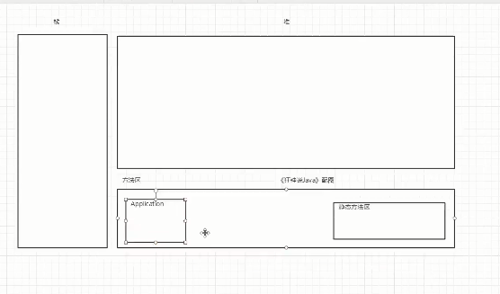

4. 调用main方法压栈

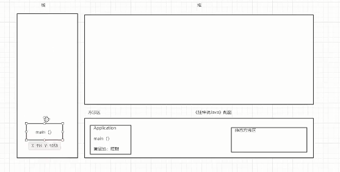

5. 创建pet类加载pet类，同时加载它的属性方法

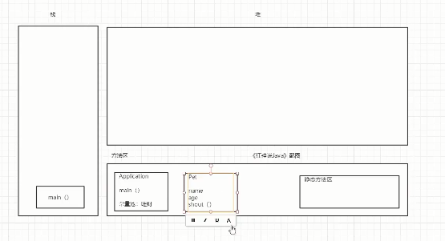

6. 栈中生成dog变量，指向堆中的Pet()对象

   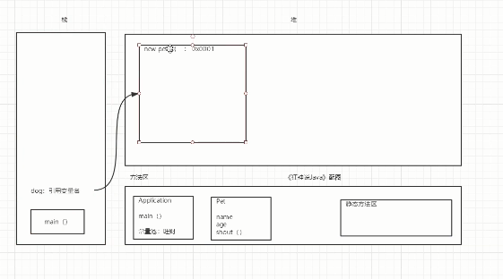

7. 对堆中的对象进行值的初始化

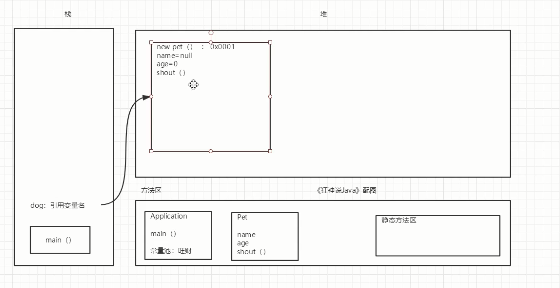

8. 使用常量池中的常量对其进行赋值

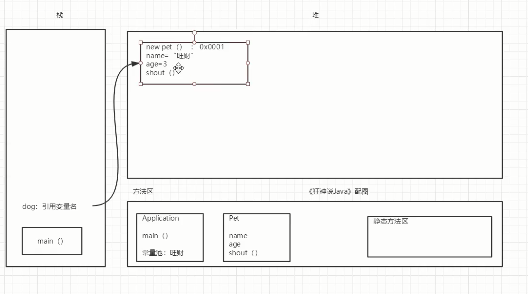

9. 假如我们再创建一个对象猫，那么在内存中，栈中生成变量cat,指向堆中的cat对象

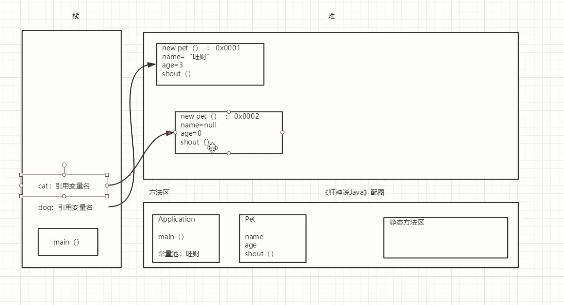

引用对象在栈中仅仅是变量名，实际指向的是堆中的对象

10. static修饰的变量放在静态方法区，和类一起进行加载，无论哪个对象想使用静态的变量，都是可以的

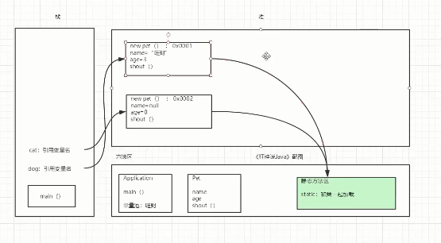


### 简单小结面向对象

1. 类是一个模板是抽象的，而对象是一个具体的实例是具体
3. 方法主要包含方法的定义以及调用
4. 对象的引用，引用类型对应的是基本类型（基本类型是八大基础类型），对象是通过引用来操作的，引用就是对象所放在的地址
5. 对象的属性就是字段或者说成员变量，其包含默认初始化的机制

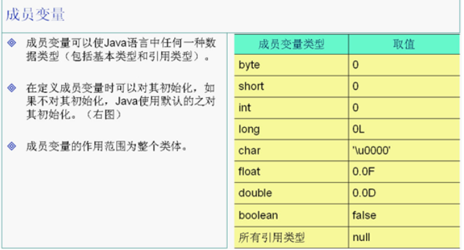

　在JAVA里面的任何变量首先应该要声明，然后再赋值，然后再使用。**成员变量和局部变量有一个重要区别：**成员变量在类里面声明时如果不进行初始化，那么JAVA会默认给它初始化，而局部变量JAVA不会默认给它初始化，所以在方法里面声明一个局部变量如果不给它初始化时就会出错。默认初始化大多数都是0，boolean类型的为false，引用类型的为null，如过不记得JAVA对成员变量默认的初始化是多少的话，那就这样做，定义一个成员变量，不给它初始化，然后直接打印这个成员变量，打印出来的结果就是JAVA默认的初始化的值。

6. 对象的创建和使用必须要使用new关键字，需要调用构造器
7. 类中包含静态的属性和动态的行为，也就是属性和方法


## 封装详解

例子：看电视的时候，我们仅仅需要知道电视上的按钮的功能就可以了，而不用管电视内部是如何实现


**该露的露，该藏的藏**
我们程序设计要追求“高内聚，低耦合”。高内聚就是类的内部数据操作细节自己完成，不允许外部干涉;低耦合:仅暴露少量的方法给外部使用。


**封装(数据的隐藏)|**
通常,应禁止直接访问一个对象中数据的实际表示，而应通过操作接口来访问，这称为信息隐藏，


记住这句话就够了:属性私有，get/set

```java
package com.dreamcold.oop;

public class Student {
   private String name;
   private Integer age;
   private Boolean sex;

    public Student() {

    }

    public Student(String name, Integer age, Boolean sex) {
        this.name = name;
        this.age = age;
        this.sex = sex;
    }


    public String getName() {
        return name;
    }

    public Integer getAge() {
        return age;
    }

    public Boolean getSex() {
        return sex;
    }

    public void setName(String name) {
        this.name = name;
    }

    public void setAge(Integer age) {
        this.age = age;
    }

    public void setSex(Boolean sex) {
        this.sex = sex;
    }
}
```

- get是获得属性
- set是为属性设置值
- IDEA中alt+insert可以生成getter和setter方法
- 使用set可以规避不合法的数据

```java
 public void setAge(Integer age) {
        if(age<0||age>120){
            this.age=3;
        }else{
            this.age=age;
        }
}
```

**封装的作用**

1. 提高程序的安全性，保护数据
2. 隐藏代码的实现细节
3. 统一接口
4. 系统可维护增加了


## 继承详解

- 继承的本质是对某一批类的抽象， 从而实现对现实世界更好的建模。
- extands的意思是“扩展”。子类是父类的扩展。
- JAVA中类只有单继承，没有多继承!
- 继承是类和类之间的一种关系。除此之外,类和类之间的关系还有依赖、组合、聚合等。
- 继承关系的俩个类，一个为子类(派生类),一个为父类(基类)。子类继承父类,使用关键字extends来表示。
- 子类和父类之间,从意义.上讲应该具有"is a"的关系.

人类

```java
package com.dreamcold.oop;
//父类
public class Person {
}

```


学生类

```java
package com.dreamcold.oop;
//子类，派生类
public class Student extends Person {
}

```

老师类

```java
package com.dreamcold.oop;
//子类，派生类
public class Teacher extends Person {
}
```


### 子类可以继承得到父类的方法

父类中有say方法

```java
package com.dreamcold.oop;

public class Person {
    public void say(){
        System.out.println("say a word...");
    }
}
```

子类中没有方法

```java
package com.dreamcold.oop;

public class Student extends Person {

}
```

创建子类对象，调用父类中的say方法

```java
package com.dreamcold.oop;

public class Main {
    public static void main(String[] args) {
        Student student=new Student();
        student.say();
    }
}
```

1. 子类继承父类就会得到父类全部的方法
2. 父类私有的属性和方法子类是无法继承得到的
3. IDEA中ctrl+h就可以查看继承关系

### Object类

在Java中所有的类默认继承Object类

在Java中，即使没有声明父类，也有一个隐含的父类，这个父类叫Object。Object没有定 义属性，但
定义了一些方法，

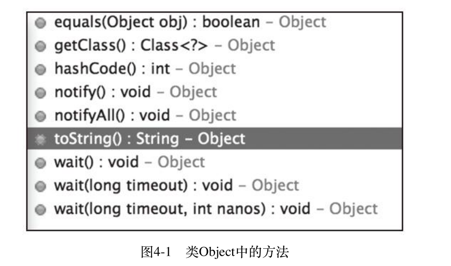


[Object类中的方法详解](https://www.cnblogs.com/zhangyinhua/p/7715486.html#_label0)


### super关键字

父类Person类中定义name属性,protected为了可以被子类继承

```java
package com.dreamcold.oop;

public class Person {
   protected String name="person";
}
```


子类中也定义name属性，定义方法sayName传入name参数

```java
package com.dreamcold.oop;

public class Student extends Person {

    private String name="student";

    public void sayName(String name){
        System.out.println(name);
        System.out.println(this.name);
        System.out.println(super.name);
    }
}
```

为了区分这三个不同的name，我们分别使用this、super关键字

```java
package com.dreamcold.oop;

public class Main {
    public static void main(String[] args) {
        Student student=new Student();
        student.sayName("canshu name");
    }
}
```

结果


在父类中加入print方法，也在子类中加入print方法，为了测试，在子类中加入test方法

```java
package com.dreamcold.oop;

public class Person {
   protected String name="person";

   public void print(){
       System.out.println("Person");
   }
}

package com.dreamcold.oop;

public class Student extends Person {

    private String name="student";

    public void sayName(String name){
        System.out.println(name);
        System.out.println(this.name);
        System.out.println(super.name);
    }

    public void print(){
        System.out.println("Student");
    }

    public void test(){
        print();
        this.print();
        super.print();
    }
}

package com.dreamcold.oop;

public class Main {
    public static void main(String[] args) {
        Student student=new Student();
        student.test();
    }
}

```

结果


我们现在给父类和子类都加上无参数构造器

```java
package com.dreamcold.oop;

public class Person {

    public Person() {
        System.out.println("Person constructure...");
    }

    protected String name="person";

   public void print(){
       System.out.println("Person");
   }
}

package com.dreamcold.oop;

public class Student extends Person {

    private String name="student";

    public Student() {
        System.out.println("Student constructure....");
    }

    public void sayName(String name){
        System.out.println(name);
        System.out.println(this.name);
        System.out.println(super.name);
    }

    public void print(){
        System.out.println("Student");
    }

    public void test(){
        print();
        this.print();
        super.print();
    }
}

package com.dreamcold.oop;

public class Main {
    public static void main(String[] args) {
        Student student=new Student();
    }
}

```

结果


我们发现在创建子类对象的时候，先调用父类的构造器，再调用子类的构造，实际上在子类的构造器中相当于发生了

```java
    public Person() {
        super();
        System.out.println("Person constructure...");
    }
```

子类的构造器中必须第一行调用父类的构造器，否则会报错

```java
  public Person() {
        System.out.println("Person constructure...");
        super();//这样会报错，必须放在第一行
    }
```

假设父类中没有无参构造函数的话，子类构造器不在第一行调用父类的有参数构造器就会从报错

```java
package com.dreamcold.oop;

public class Person {

    public Person(String name) {//父类写了有参数构造器，就不会生成无参数的构造器了

        System.out.println("Person constructure...");
     
    }

    protected String name="person";

   public void print(){
       System.out.println("Person");
   }
}


package com.dreamcold.oop;

public class Student extends Person {

    private String name="student";

    public Student() {//子类这里调用默认的父类无参构造器就会报错
        System.out.println("Student constructure....");
    }

    public void sayName(String name){
        System.out.println(name);
        System.out.println(this.name);
        System.out.println(super.name);
    }

    public void print(){
        System.out.println("Student");
    }

    public void test(){
        print();
        this.print();
        super.print();
    }
}

```

**小结**

super注意点:
1. super调用父类的构造方法，必须在构造方法的第一个
2. super 必须只能出现在子类的方法或者构造方法中!
3. super和this 不能同时调用构造方法!

对比this关键字

1. 代表的对象不同
   - this：本身调用这个对象
   - super：代表父类对象1的应用
2. 前提
   - this:没有继承也可以使用
   - super:只能在继承的条件下使用
3. 构造方法
   - this();本类的构造
   - super();父类的构造


### 方法的重写

重写都是方法的重写和属性无关

父类B类定义test方法

```java
package com.dreamcold.oop;

public class B {

    public static void test(){
        System.out.println("B->test()");
    }
}
```

子类A类，重写B类方法

```java
package com.dreamcold.oop;

public class A  extends B{
    public static void test(){
        System.out.println("A->test()");
    }
}

```

测试

```java
package com.dreamcold.oop;

public class Main {
    public static void main(String[] args) {
        A a=new A();
        a.test();
    }
}
```

结果


定义父类引用，指向子类

```java
package com.dreamcold.oop;

public class Main {
    public static void main(String[] args) {
        A a=new A();
        a.test();
        B b=new B();
        b.test();
    }
}

```

结果

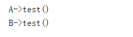

方法的调用只和左边定义的类型有关，当我们去掉static关键字后，我们发现在IDEA中出现圆圈标志

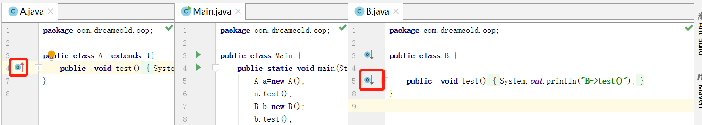

圆圈的意思就是子类重写了父类的方法，静态的方法个非静态的方法差别很大，重写仅仅可以重写公有的方法


**总结**

1. 重写需要有继承关系，子类重写父类的方法
2. 方法名必须相同
3. 参数列表必须相同
4. 修饰符范围可以扩大，但是不可以缩小 public>protected>default>private
5. 抛出异常的范围可以被缩小，但是不可以扩大
6. 重写就是子类和父类声明必须一致，但是方法体不同
7. 为什么需要重写呢？父类的功能不一定需要或者不一定满足
8. alt+insert选中override来重写父类方法


### 什么是多态

**什么是多态**

- 即同一方法可以根据发送对象的不同而采用多种不同的行为方式，
- 一个对象的实际类型是确定的，但可以指向对象的引用的类型有很多

**多态实现的条件**

- 有继承关系
- 子类重写父类方法
- 父类引用指向子类对象

**注意**:多态是方法的多态，属性没有多态性。

创建父类Person类

```java
package com.dreamcold.oop;

public class Person {
}
```

创建子类Student类

```java
package com.dreamcold.oop;

public class Student extends Person{

}
```

一个对象的实际类型总是确定的,你使用new关键字创建了什么类型，实际类型就是什么类型

```java
package com.dreamcold.oop;

public class Main {
    public static void main(String[] args) {
        Person p=new Person();
        Student s=new Student();
    }
}
```

但是它可以指向的引用类型是不确定的，父类的引用可以指向子类的类型

```java
package com.dreamcold.oop;

public class Main {
    public static void main(String[] args) {
        Person p=new Person();
        //父类的引用可以指向子类的类型
        Person s=new Student();
        //由于Obeject类是所有类的父类
         Object o=new Student();
    }
}
```

现在我们在父类中加入一个方法run

Person.java

```java
package com.dreamcold.oop;

public class Person {

    public void run(){
        System.out.println("Person run...");
    }
}
```

Student.java，子类重写父类的方法

```java
package com.dreamcold.oop;

public class Student extends Person{

}
```

Main.java

```java
package com.dreamcold.oop;

public class Main {
    public static void main(String[] args) {
        Person s=new Student();

    }
}
```

结果


当父类定义了public方法，子类没有重写父类的方法，父类引用指向子类对象，调用run方法时候会调用父类方法

当子类重写父类方法的时候

Person.java

```java
package com.dreamcold.oop;

public class Person {

    public void run(){
        System.out.println("Person run...");
    }
}
```

Student.java

```java
package com.dreamcold.oop;

public class Student extends Person{

    @Override
    public void run() {
        System.out.println("Student run...");
    }
}
```

Main.java

```java
package com.dreamcold.oop;

public class Main {
    public static void main(String[] args) {

        Person p=new Student();
        p.run();
        Student s=new Student();//子类重写了父类方法执行子类的方法
        s.run();

    }
}
```

结果

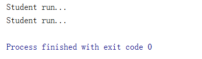

父类引用指向子类对象，如果子类重写了父类的方法，那么父类引用在调用被子类重写的方法的时候，会根据子类的实际类型来调用子类的方法。


现在我们在子类中加上一个方法，eat方法，而我们尝试用父类的引用来调用子类的方法，会发现提示报错

```java
package com.dreamcold.oop;

public class Main {
    public static void main(String[] args) {

        Person p=new Student();
        p.run();
        Student s=new Student();//子类重写了父类方法执行子类的方法
        s.run();
        //报错
        p.eat();
    }
}
```

报错


我们得到以下结论

```java
package com.dreamcold.oop;

public class Main {
    public static void main(String[] args) {

        //父类型引用可以指向子类，但是无法调用子类独有的方法
        Person p=new Student();
        p.run();
        //子类型引用能调用的方法都是自己的或者父类的方法
        Student s=new Student();
        s.run();
    }
}
```

- 父类型引用可以指向子类，但是无法调用子类独有的方法
- 子类型引用能调用的方法都是自己的或者父类的方法


**多态的注意事项**

1. 多态是方法的多态，属性是没有多态的
2. 父类和子类之间才有可能进行类型转换，否则会报转换异常错误
3. 多态的存在条件，首先要具有继承关系，父类引用要可以指向子类对象
4. 静态方法不可以被重写，因为它属于类，不属于实例
5. final修饰的不可以被重写
6. private修饰的不可以被重写


### instanceof关键词和类型转换

#### instanceof

instanceof关键字可以判断两类之间是否具有父子关系

Perso.java

```java
package com.dreamcold.oop;

public class Person {
}

```

Student.java

```java
package com.dreamcold.oop;

public class Student extends  Person {
}

```

Teacher.java

```java
package com.dreamcold.oop;

public class Teacher extends Person {
}

```

Main.java测试

```java
package com.dreamcold.oop;

public class Main {
    public static void main(String[] args) {

        Object object=new Student();
        System.out.println(object instanceof Student);
        System.out.println(object instanceof  Person);
        System.out.println(object instanceof Object);
        System.out.println(object instanceof Teacher);
        System.out.println(object instanceof String);
    }
}

```

结果

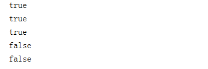

该例子由继承链为Object->Person->Student

Obejct引用类型转化为Person类型再次测试

```java
package com.dreamcold.oop;

public class Main {
    public static void main(String[] args) {

        Person person=new Student();
        System.out.println(person instanceof Student);
        System.out.println(person instanceof  Person);
        System.out.println(person instanceof Object);
        System.out.println(person instanceof Teacher);
       // System.out.println(person instanceof String);//编译报错
    }
}
```

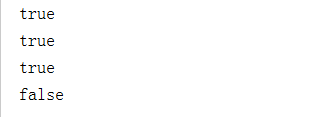

Obejct引用类型转化为Student类型再次测试

```java
package com.dreamcold.oop;

public class Main {
    public static void main(String[] args) {

        Student student=new Student();
        System.out.println(student instanceof Student);
        System.out.println(student instanceof  Person);
        System.out.println(student instanceof Object);
        //System.out.println(student instanceof Teacher);//编译报错
        //System.out.println(student instanceof String);//编译报错
}

```

测试结果


- ```
  System.out.println( X instanceof Y);//如果X和Y之间存在父子的关系那么就可以编译通过
  ```

- 实际上返回的True或者False主要看X指向的实际类型是不是Y的子类型


#### 类型转换

Person.java中添加run方法

```java
package com.dreamcold.oop;

public class Person {

    public void run(){
        System.out.println("Person run...");
    }
}
```

Student.java中添加go方法

```java
package com.dreamcold.oop;

public class Student extends  Person {

    public void go(){
        System.out.println("Student go....");
    }
}
```

我们创建一个父类类型的引用指向子类类型的对象

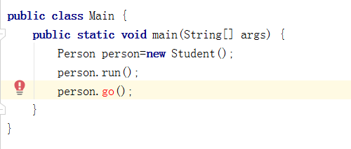

虽然我们指向了一个实际类型是Student类型的对象，但是我们没办法调用其的go方法，编译报错

需要通过强制类型转换来转换且Student类型

```java
package com.dreamcold.oop;

public class Main {
    public static void main(String[] args) {
        Person person=new Student();
        person.run();
        ((Student)person).run();
    }
}
```

结果


**转换的条件**

1. 父类的引用指向子类的对象
2. 子类对象转换为父类对象就是向上转型
3. 父类转化为子类对象，成为向下转型，强制转换
4. 方便方法的调用，减少重复的代码


## static详解

### static变量

```java
package com.dreamcold.oop;

public class Student  {

    private static  String name; //静态变量

    private int age;//非静态变量

    public static void main(String[] args) {
        Student student=new Student();
        System.out.println(Student.name);
        System.out.println(student.age);
    }

}

```

运行结果

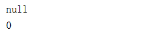


### static方法


```java
package com.dreamcold.oop;

public class Student  {

    private static  String name; //静态变量

    private int age;//非静态变量


    //非静态方法
    public void run(){
        System.out.println("run...");
    }
    
    //静态方法
    public static void go(){
        System.out.println("go...");
    }

    public static void main(String[] args) {
        Student.go();//通过类名.方法调用
        go();//静态方法之间可以相互调用
        Student student=new Student();//必须先创建对象通过对象进行调用
        student.run();
    }

}
```

运行结果


### 静态代码块

```java
package com.dreamcold.oop;

public class Student  {
    {
        //匿名代码块，创建对象的时候执行，在构造器执行之前

    }

    static {
        //静态代码块类加载直接执行，仅仅就执行一次
    }
}
```

- 匿名代码块，创建对象的时候执行，在构造器执行之前
- 静态代码块类加载直接执行，仅仅就执行一次


```java
package com.dreamcold.oop;

public class Student  {
    {
        //匿名代码块，创建对象的时候执行，在构造器执行之前
        System.out.println("匿名代码块");

    }

    static {
        //静态代码块类加载直接执行，仅仅就执行一次
        System.out.println("静态代码块");
    }

    public Student(){
        System.out.println("构造器");
    }

    public static void main(String[] args) {
        Student student=new Student();
    }
}

```

结果


1. static代码块仅仅只执行一次，在类加载的时候，其他的比如构造器、匿名代码块在每次创建对象的时候都要执行
2. 匿名代码块一般会用来赋一些初始的值
3. 执行顺序一次是静态代码块、匿名代码块和构造器


### static导入包

Java想输出随机数可以用Math.random方法

```java
package com.dreamcold.oop;

public class Student  {

    public static void main(String[] args) {
        System.out.println(Math.random());
    }
}

```

输出


假如每次我不希望写Math.random,而是random，可以静态导入包

```java
package com.dreamcold.oop;

import static java.lang.Math.random;

public class Student  {

    public static void main(String[] args) {
        System.out.println(random());
    }
}
```


## 抽象类

- abstract修饰符可以用来修饰方法也可以修饰类,如果修饰方法，那么该方法就是抽象方法;如果
- 修饰类,那么该类就是抽象类
- 抽象类中可以没有抽象方法但是有抽象方法的类一定要声明为抽象类。
- 抽象类,不能使用new关键字来创建对象,它是用来让子类继承的。
- 抽象方法，只有方法的声明，没有方法的实现,它是用来让子类实现的

声明的类前面加上abstact，那么该类就变成了抽象类

```java
package com.dreamcold.oop;

public abstract class Action {
}
```

假设我们要写一个方法，叫做doSomething，但是仅仅定义约束而不想定义实现，那么我们定义如下

```java
package com.dreamcold.oop;

public abstract class Action {

    public void doSomeThing(){
        //我们仅仅向定义约束，而不想在这里写对应的实现
    }
}
```

那么我们可以将其改为抽象方法

```java
package com.dreamcold.oop;

public abstract class Action {

    public abstract void doSomeThing();
}

```

现在我们写一个新的类叫做A类，用A类去继承Action类，IDE会提示我们必须要去重写抽象类的抽象方法,抽象类的所有方法，继承了它的子类都要去实现它的方法，除非子类也是abstract的

```java
package com.dreamcold.oop;

public class A extends Action {
    @Override
    public void doSomeThing() {
        
    }
}
```

**抽象类的特点**

1. 不可以new出来这个抽象类，仅仅只能靠子类去实现它，相当于一种约束
2. 抽象类仅仅可以单继承
3. 接口可以多继承


## 接口

- 普通类:只有具体实现
- 抽象类:具体实现和规范(抽象方法)都有!
- 接口:只有规范!自己无法写方法~

1. 接口就是规范，定义的是一组规则，体现了现实世界中“如果你...则必须.."的思想。如果你是天使，
   则必须能飞。如果你是汽车，则必须能跑。如果你好人，则必须干掉坏人:如果你是坏人，则必须欺负好人。
2. 接口的本质是契约，就像我们人间的法律-样。制定好后大家都遵守
3. OO的精髓，是对对象的抽象，最能体现这一点的就是接口，为什么我们讨论设计模式都只针对具备了抽象
   能力的语言(比如C++. java, c#等) .就是因为设计模式所研究的，实际上就是如何合理的去抽象。
4. 声明类的关键字是class,声明接口的关键字是interface

定义接口

```java
package com.dreamcold.oop;

public interface UserService {
    //接口里面的所有定义方法都是public abstrct
    public void run();
}
```

我们定义一个改查增删的接口

```java
package com.dreamcold.oop;

public interface UserService {
    
    public void update();
    
    public void find();
    
    public void insert();
    
    public void delete();
}
```

接口往往都需要有实现类，一个类可以通过implements来实现接口，实现了接口的类一定要实现接口的方法

```java
package com.dreamcold.oop;

public class UserServiceImpl implements  UserService{
    @Override
    public void update() {
        
    }

    @Override
    public void find() {

    }

    @Override
    public void insert() {

    }

    @Override
    public void delete() {

    }
}
```

一个类可以实现多个接口，假设我们定义一个新的接口TimeService

```java
package com.dreamcold.oop;

public interface TimeService {
    public void timer();
}
```

UserService实现类可以实现多个接口,可以利用接口来实现多继承

```java
package com.dreamcold.oop;

public class UserServiceImpl implements  UserService,TimeService{
    @Override
    public void update() {

    }

    @Override
    public void find() {

    }

    @Override
    public void insert() {

    }

    @Override
    public void delete() {

    }

    @Override
    public void timer() {

    }
}

```

在接口里面定义的属性都是常量修饰都是 public static final

```java
package com.dreamcold.oop;

public class UserServiceImpl implements  UserService,TimeService{
    public static final int COUNT=0;
}

```

**接口的作用**

1. Java的接口是约束，可以定义一些方法让不同的人实现
2. 其中定义的方法都是public abstract
3. 其中属性都是public static final
4. 接口不可以被实例化，接口中无构造方法
5. 一个类可以实现多个接口
6. 实现接口必须要重写里面的方法

