# ArrayDeque剖析

## ArrayDeque介绍

- 前面我们介绍了队列Queue的两个实现类LinkedList和PriorityQueue，LinkedList还实现了双端队列接口Deque，Java容器类中还有一个双端队列的实现类ArrayDeque，它是基于数组实现的。
- 我们知道，一般而言，由于需要移动元素，数组的插入和删除效率比较低，但ArrayDeque的效率却非常高
- Java中不存在Queue这个类，这是一个接口，虽然存在Stack类，但是Java官方已不建议使用。所以在操作栈和队列时 ，**首选ArrayDeque,其次是LinkedList**
- ArrayDeque底层是通过循环数组实现的额，但是不是线程安全
- Deque接口是Queue接口的子接口，它代表一个双端队列，该队列允许从两端来操作队列中的元素。Deque不仅可以当成双端队列使用，而且可以当成栈来使用。
- ArrayDeque集合是Deque接口的实现类，它是一个基于数组的双端队列，创建Deque时同样可以指定一个numElements参数，该参数用于指定Object[]数组的长度；如果不指定该参数，Deque底层数组长度为16。
- ArrayDeque集合既可当队列使用，也可当栈使用


## ArrayDeque的继承关系

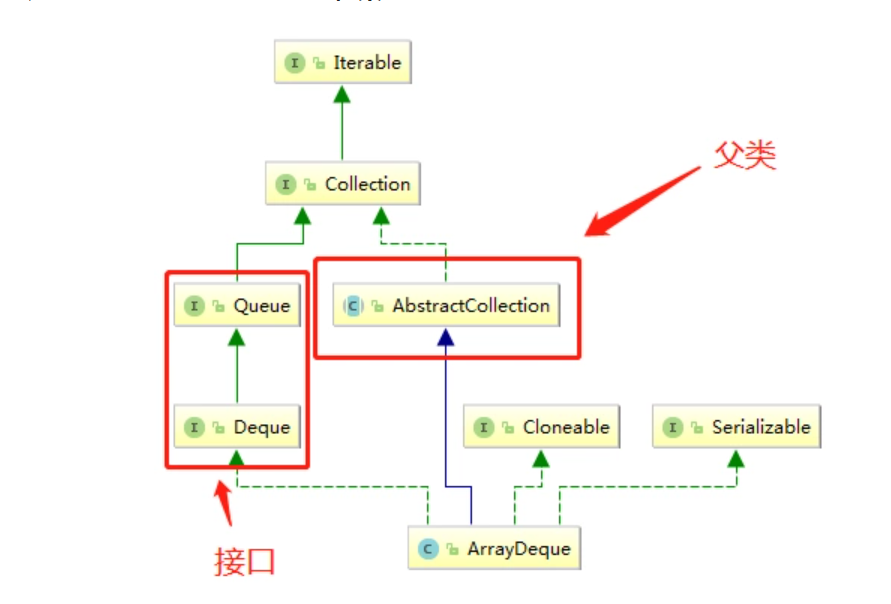

不着急分析该类的核心方法，先看一下该类的父类和接口，以便在Java的Collection接口周边找到它的位置，顺便从宏观的角度窥探一下**Java Collection架构**的设计。

### 父类

父类是AbstractCollection ,看下它的方法：

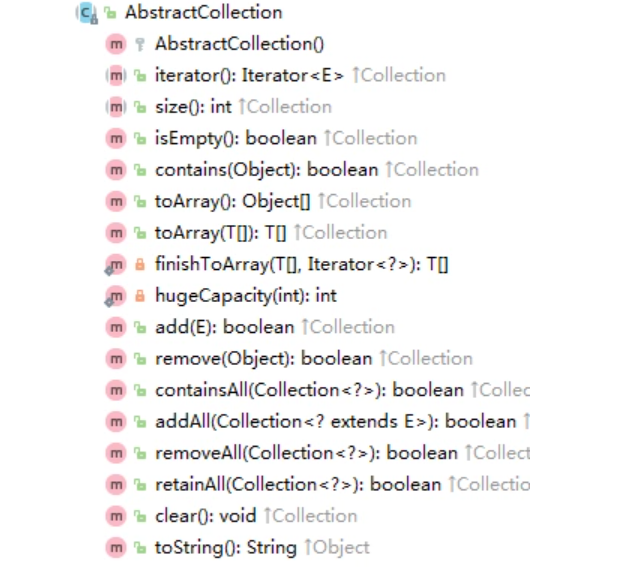

add、addAll、 remove、 clear、 iterator、 size.....不是都很常见 ?你常用的xxList中,经常会看到这些万
法吧?可以说, AbstractCollection这个抽象类,是这种结构(数组、链表等等)的骨架!

### 接口

首先是Queue接口,定义出了最基本的队列功能:

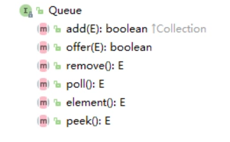

 java中的队列利用的是java提供的Queue接口，该接口代表了一个队列。包含了三个标志性的方法：

插入：在队列的rear端插入数据。
删除：在队列的front端删除数据。
访问：访问front端的数据元素。

**方法对比**

|      | 抛出异常版本 | 返回特殊值版本 |
| ---- | ------------ | -------------- |
| 插入 | add(element) | offer(element) |
| 移除 | remove()     | poll()         |
| 检查 | element()    | peek()         |

那么Deque接口呢? 

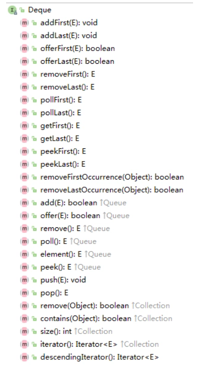

**双向队列**

双向队列（deque）是一种可以在两端均进行插入删除操作的队列。

**方法对比:**

前者表示从头部操作， 后者（即红色部分）表示从尾部进行操作：

|      | 抛出异常          | 特殊值              | 抛出异常         | 特殊值              |
| ---- | ----------------- | ------------------- | ---------------- | ------------------- |
| 插入 | addFirst(element) | offerFirst(element) | addLast(element) | offerFirst(element) |
| 移除 | removeFirst()     | pollFirst()         | removeLast()     | pollLast()          |
| 检查 | getFirst()        | peekFirst()         | getLast()        | peekLast()          |

与Queue中的方法对比（继承Queue接口中的方法）：

| Queue          | Deque              |
| -------------- | ------------------ |
| add(element)   | addLast(element)   |
| offer(element) | offerLast(element) |
| remove()       | removeFirst()      |
| poll()         | pollFirst()        |
| element()      | getFirst()         |
| peek()         | peekFirst()        |

只需要引用Deque接口即可：

对比引用Queue接口中的代码（修改为如下即可）：

```java
Deque<Integer> dq = new LinkedList<Integer>();
```

而双向队列也可以用作FILO的堆栈，此时元素被推入双向队列的头并从头弹出。方法等效：

| Stack         | Deque             |
| ------------- | ----------------- |
| push(element) | addFirst(element) |
| pop()         | removeFirst()     |
| peek()        | peekFirst()       |

此时使用Deque中的三种方法，参考如下：

```java
public static void main(String[] args) {
		Deque<Integer> dq = new LinkedList<Integer>();
		dq.addFirst(1);
		dq.addFirst(2);
		dq.addFirst(3);
		dq.addFirst(4);
		System.out.println(dq.toString());
		System.out.println("调用移除方法：" + dq.removeFirst());
		System.out.println("移除后的队列：" + dq.toString());
		System.out.println("检查返回此时的第一个值：" + dq.peekFirst());

	}
```

结果：

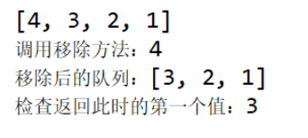

## 用法

ArrayDeque实现了Deque接口，同LinkedList一样，它的队列长度也是没有限制的，在[LinkedList一节](http://mp.weixin.qq.com/s?__biz=MzIxOTI1NTk5Nw==&mid=2650047277&idx=1&sn=648419ba6c79d862d229ff49c5c76394&chksm=8fde26ffb8a9afe9a1b1c2d78498f16e30d42976eb39610795a549e15aac32d4dca9f8e43ab9&scene=21#wechat_redirect)我们介绍过Deque接口，这里简要回顾一下。

Deque扩展了Queue，有队列的所有方法，还可以看做栈，有栈的基本方法push/pop/peek，还有明确的操作两端的方法如addFirst/removeLast等。

ArrayDeque有如下构造方法：

```java
public ArrayDeque()
public ArrayDeque(int numElements)
public ArrayDeque(Collection<? extends E> c)
```

numElements表示元素个数，初始分配的空间会至少容纳这么多元素，但空间不是正好numElements这么大，待会我们会看其实现细节。

ArrayDeque可以看做一个先进先出的队列，比如：

```java
package com.dreamcold.container;

import java.util.ArrayDeque;
import java.util.Queue;

public class Demo09 {
    public static void main(String[] args){
        Queue<String> queue=new ArrayDeque<>();
        queue.offer("a");
        queue.offer("b");
        queue.offer("c");
        while(queue.peek()!=null){
            System.out.println(queue.poll());
        }

    }
}
```

结果

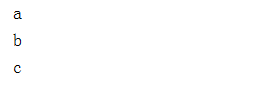

也可以将ArrayDeque看做一个先进后出、后进先出的栈，比如：

```java
package com.dreamcold.container;

import java.util.ArrayDeque;
import java.util.Deque;

public class Demo10 {
    public static void main(String[] args) {
        Deque<String> stack=new ArrayDeque<>();
        stack.push("a");
        stack.push("b");
        stack.push("c");
        while (stack.peek()!=null){
            System.out.println(stack.pop()+" ");
        }
    }
}
```

结果

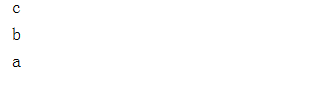

 还可以使用其通用的操作两端的方法，比如：

```java
package com.dreamcold.container;

import java.util.ArrayDeque;
import java.util.Deque;

public class Demo11 {
    public static void main(String[] args) {
        Deque<String> deque = new ArrayDeque<>();

        deque.addFirst("a");
        deque.offerLast("b");
        deque.addLast("c");
        deque.addFirst("d");

        System.out.println(deque.getFirst()); //d
        System.out.println(deque.peekLast()); //c
        System.out.println(deque.removeFirst()); //d
        System.out.println(deque.pollLast()); //c 
    }
}

```

结果

```java
d
c
d
c
```

## 实现原理

### 内部组成

ArrayDeque内部主要有如下实例变量：

```java
private transient E[] elements;
private transient int head;
private transient int tail;
```

elements就是存储元素的数组。ArrayDeque的高效来源于head和tail这两个变量，它们使得物理上简单的从头到尾的数组变为了一个逻辑上循环的数组，避免了在头尾操作时的移动。我们来解释下循环数组的概念。

### 循环数组

对于一般数组，比如arr，第一个元素为arr[0]，最后一个为arr[arr.length-1]。但对于ArrayDeque中的数组，它是一个逻辑上的循环数组，所谓循环是指元素到数组尾之后可以接着从数组头开始，数组的长度、第一个和最后一个元素都与head和tail这两个变量有关，具体来说：

1. 如果head和tail相同，则数组为空，长度为0。
2. 如果tail大于head，则第一个元素为elements[head]，最后一个为elements[tail-1]，长度为tail-head，元素索引从head到tail-1。
3. 如果tail小于head，且为0，则第一个元素为elements[head]，最后一个为elements[elements.length-1]，元素索引从head到elements.length-1。
4. 如果tail小于head，且大于0，则会形成循环，第一个元素为elements[head]，最后一个是elements[tail-1]，元素索引从head到elements.length-1，然后再从0到tail-1。

我们来看一些图示。

第一种情况，数组为空，head和tail相同，如下所示：

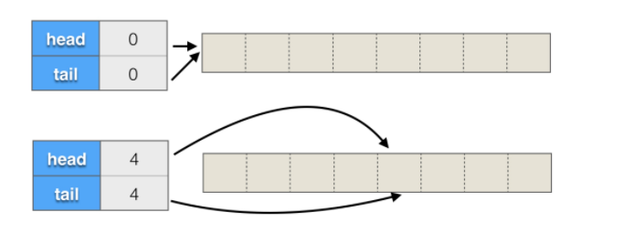

第二种情况，tail大于head，如下所示，都包含三个元素：

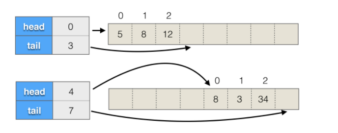

第三种情况，tail为0，如下所示：

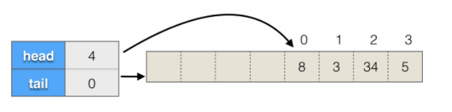

第四情况，tail不为0，且小于head，如下所示：

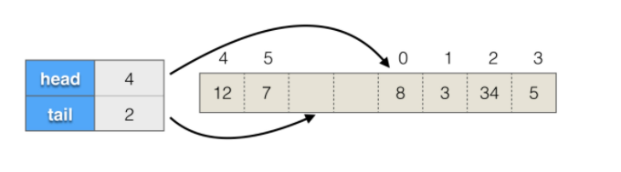

理解了循环数组的概念，我们来看ArrayDeque一些主要操作的代码，先来看构造方法。

### 构造函数

默认构造方法的代码为：

```java
public ArrayDeque() {
    elements = (E[]) new Object[16];
}
```

分配了一个长度为16的数组。

如果有参数numElements，代码为：

```java
public ArrayDeque(int numElements) {
    allocateElements(numElements);
}
```

不是简单的分配给定的长度，而是调用了allocateElements，代码为：

```java
private void allocateElements(int numElements) {
    int initialCapacity = MIN_INITIAL_CAPACITY;
    // Find the best power of two to hold elements.
    // Tests "<=" because arrays aren't kept full.
    if (numElements >= initialCapacity) {
        initialCapacity = numElements;
        initialCapacity |= (initialCapacity >>>  1);
        initialCapacity |= (initialCapacity >>>  2);
        initialCapacity |= (initialCapacity >>>  4);
        initialCapacity |= (initialCapacity >>>  8);
        initialCapacity |= (initialCapacity >>> 16);
        initialCapacity++;

        if (initialCapacity < 0)   // Too many elements, must back off
            initialCapacity >>>= 1;// Good luck allocating 2 ^ 30 elements
    }
    elements = (E[]) new Object[initialCapacity];
}
```

这段代码看上去比较复杂，但主要就是在计算应该分配的数组的长度initialCapacity，计算逻辑是这样的：

- 如果numElements小于MIN_INITIAL_CAPACITY，则分配的数组长度就是MIN_INITIAL_CAPACITY，它是一个静态常量，值为8。
- 在numElements大于等于8的情况下，分配的实际长度是严格大于numElements并且为2的整数次幂的最小数。比如，如果numElements为10，则实际分配16，如果numElements为32，则为64。

为什么要为2的幂次数呢？我们待会会看到，这样会使得很多操作的效率很高。

为什么要严格大于numElements呢？因为循环数组必须时刻至少留一个空位，tail变量指向下一个空位，为了容纳numElements个元素，至少需要numElements+1个位置。

这段代码的晦涩之处在于：

```java
initialCapacity |= (initialCapacity >>>  1);
initialCapacity |= (initialCapacity >>>  2);
initialCapacity |= (initialCapacity >>>  4);
initialCapacity |= (initialCapacity >>>  8);
initialCapacity |= (initialCapacity >>> 16);

initialCapacity++;
```

这究竟在干什么？其实，它是在将initialCapacity左边最高位的1复制到右边的每一位，这种复制类似于病毒复制，是1传2、2传4、4传8式的指数级复制，最后再执行initialCapacity++就可以得到比initialCapacity大且为2的幂次方的最小的数。我们在[剖析包装类(中)一节](http://mp.weixin.qq.com/s?__biz=MzIxOTI1NTk5Nw==&mid=2650047233&idx=1&sn=584dd4dd5b2beb295b91271ed97c481f&scene=21#wechat_redirect)介绍过Integer的一些二进制操作，其中就有非常类似的代码：

```java
public static int highestOneBit(int i) {
    // HD, Figure 3-1
    i |= (i >>  1);
    i |= (i >>  2);
    i |= (i >>  4);
    i |= (i >>  8);
    i |= (i >> 16);
    return i - (i >>> 1);
}
```

算法描述都在Hacker's Delight这本书中。

看最后一个构造方法：

```
public ArrayDeque(Collection<? extends E> c) {
    allocateElements(c.size());
    addAll(c);
}
```

同样调用allocateElements分配数组，随后调用了addAll，而addAll只是循环调用了add，下面我们来看add的实现。

### 尾部添加

add方法的代码为：

```java
public boolean add(E e) {
    addLast(e);
    return true;
}
```

addLast的代码为：

```java
public void addLast(E e) {
    if (e == null)
        throw new NullPointerException();
    elements[tail] = e;
    if ( (tail = (tail + 1) & (elements.length - 1)) == head)
        doubleCapacity();
}
```

- 将元素添加到tail处，然后tail指向下一个位置，如果队列满了，则调用doubleCapacity扩展数组。tail的下一个位置是：(tail + 1) & (elements.length - 1)，如果与head相同，则队列就满了。

- 需要进行与操作是要保证索引在正确范围，与(elements.length - 1)相与就可以得到下一个正确位置，是因为elements.length是2的幂次方，(elements.length - 1)的后几位全是1，无论是正数还是负数，与(elements.length - 1)相与都能得到期望的下一个正确位置。

- 比如说，如果elements.length为8，则(elements.length - 1)为7，二进制为0111，对于负数-1，与7相与，结果为7，对于正数8，与7相与，结果为0，都能达到循环数组中找下一个正确位置的目的。

- 这种位操作是循环数组中一种常见的操作，效率也很高，后续代码中还会看到。

- doubleCapacity将数组扩大为两倍，代码为：

```java
private void doubleCapacity() {
    assert head == tail;
    int p = head;
    int n = elements.length;
    int r = n - p; // number of elements to the right of p
    int newCapacity = n << 1;
    if (newCapacity < 0)
        throw new IllegalStateException("Sorry, deque too big");
    Object[] a = new Object[newCapacity];
    System.arraycopy(elements, p, a, 0, r);
    System.arraycopy(elements, 0, a, r, p);
    elements = (E[])a;
    head = 0;
    tail = n;
}
```

分配一个长度翻倍的新数组a，将head右边的元素拷贝到新数组开头处，再拷贝左边的元素到新数组中，最后重新设置head和tail，head设为0，tail设为n。

我们来看一个例子，假设原长度为8，head和tail为4，现在开始扩大数组，扩大前后的结构如下图所示：

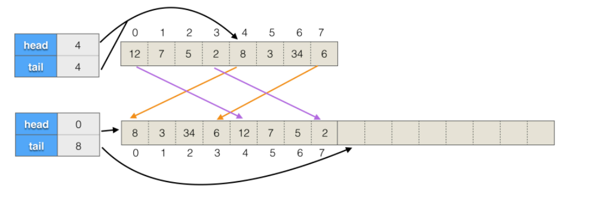

add是在末尾添加，我们再看在头部添加的代码。

### 头部添加

addFirst方法的代码为：

```java
public void addFirst(E e) {
    if (e == null)
        throw new NullPointerException();
    elements[head = (head - 1) & (elements.length - 1)] = e;
    if (head == tail)
        doubleCapacity();
}
```

在头部添加，要先让head指向前一个位置，然后再赋值给head所在位置。head的前一个位置是：(head - 1) & (elements.length - 1)。刚开始head为0，如果elements.length为8，则(head - 1) & (elements.length - 1)的结果为7。比如说，执行如下代码：

```java
Deque<String> queue = new ArrayDeque<>(7);
queue.addFirst("a");
queue.addFirst("b"); 
```

执行完后，内部结构会如下图所示：

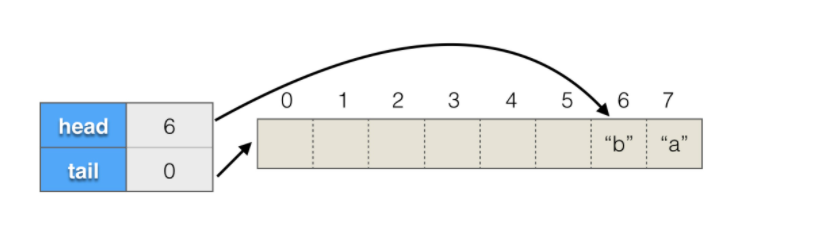

 介绍完了添加，下面来看删除。

**从头部删除**

removeFirst方法的代码为：

```java
public E removeFirst() {
    E x = pollFirst();
    if (x == null)
        throw new NoSuchElementException();
    return x;
}
```

pollFirst的代码为：

```java
public E pollFirst() {
    int h = head;
    E result = elements[h]; // Element is null if deque empty
    if (result == null)
        return null;
    elements[h] = null;     // Must null out slot
    head = (h + 1) & (elements.length - 1);
    return result;
}
```

代码比较简单，将原头部位置置为null，然后head置为下一个位置，下一个位置为：(h + 1) & (elements.length - 1)。

### 从尾部删除

removeLast方法的代码为：

```java
public E removeLast() {
    E x = pollLast();
    if (x == null)
        throw new NoSuchElementException();
    return x;
}
```

pollLast的代码为：

```java
public E pollLast() {
    int t = (tail - 1) & (elements.length - 1);
    E result = elements[t];
    if (result == null)
        return null;
    elements[t] = null;
    tail = t;
    return result;
}
```

t为最后一个位置，result为最后一个元素，将该位置置为null，然后修改tail指向前一个位置，最后返回原最后一个元素。

### 查看长度

ArrayDeque没有单独的字段维护长度，其size方法的代码为：

```java
public int size() {
    return (tail - head) & (elements.length - 1);
}
```

通过该方法即可计算出size。

### 检查元素是否存在

contains方法的代码为：

```java
public boolean contains(Object o) {
    if (o == null)
        return false;
    int mask = elements.length - 1;
    int i = head;
    E x;
    while ( (x = elements[i]) != null) {
        if (o.equals(x))
            return true;
        i = (i + 1) & mask;
    }
    return false;
}
```

就是从head开始遍历并进行对比，循环过程中没有使用tail，而是到元素为null就结束了，这是因为在ArrayDeque中，有效元素不允许为null。

### 转化为数组

toArray方法的代码为：

```java
public Object[] toArray() {
    return copyElements(new Object[size()]);
}
```

copyElements的代码为：

```java
private <T> T[] copyElements(T[] a) {
    if (head < tail) {
        System.arraycopy(elements, head, a, 0, size());
    } else if (head > tail) {
        int headPortionLen = elements.length - head;
        System.arraycopy(elements, head, a, 0, headPortionLen);
        System.arraycopy(elements, 0, a, headPortionLen, tail);
    }
    return a;
}
```

如果head小于tail，就是从head开始拷贝size()个，否则，拷贝逻辑与doubleCapacity方法中的类似，先拷贝从head到末尾的部分，然后拷贝从0到tail的部分。

**原理小结**

以上就是ArrayDeque的基本原理，内部它是一个动态扩展的循环数组，通过head和tail变量维护数组的开始和结尾，数组长度为2的幂次方，使用高效的位操作进行各种判断，以及对head和tail的维护。


## ArrayDeque分析

ArrayDeque实现了双端队列，内部使用循环数组实现，这决定了它有如下特点：

- 在两端添加、删除元素的效率很高，动态扩展需要的内存分配以及数组拷贝开销可以被平摊，具体来说，添加N个元素的效率为O(N)。
- 根据元素内容查找和删除的效率比较低，为O(N)。
- 与ArrayList和LinkedList不同，没有索引位置的概念，不能根据索引位置进行操作。

ArrayDeque和LinkedList都实现了Deque接口，应该用哪一个呢？如果只需要Deque接口，从两端进行操作，一般而言，ArrayDeque效率更高一些，应该被优先使用，不过，如果同时需要根据索引位置进行操作，或者经常需要在中间进行插入和删除，则应该选LinkedList。


## 总结

本节介绍了ArrayDeque的用法和实现原理，用法上，它实现了双端队列接口，可以作为队列、栈、或双端队列使用，相比LinkedList效率要更高一些，实现原理上，它采用动态扩展的循环数组，使用高效率的位操作。

## 参考

1. 《Java编程的逻辑》
2. https://blog.csdn.net/kobe_jr/article/details/79733621
3. https://blog.csdn.net/qq_39396275/article/details/75638942?utm_medium=distribute.pc_relevant_t0.none-task-blog-OPENSEARCH-1.control&depth_1-utm_source=distribute.pc_relevant_t0.none-task-blog-OPENSEARCH-1.control
4. https://segmentfault.com/a/1190000017480142?utm_source=tag-newest

注意：本文大量使用他人博客内容，仅仅作为个人学习使用，向原作者致敬!