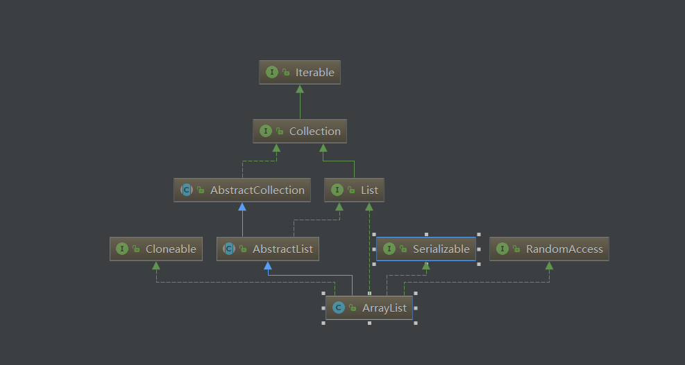
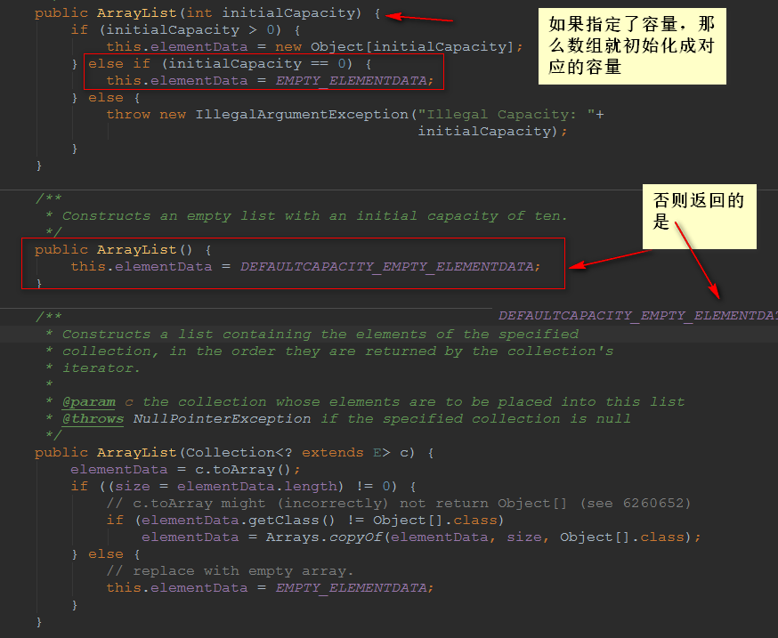
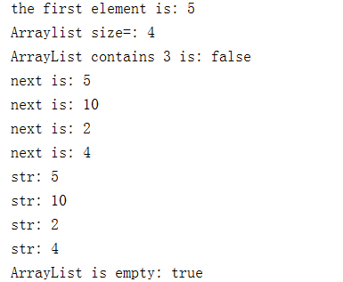

# ArrayList剖析


## ArrayList简介



- ArrayList 是一个**数组队列**，相当于 **动态数组**。与Java中的数组相比，它的容量能动态增长。它继承于AbstractList，实现了List, RandomAccess, Cloneable, java.io.Serializable这些接口。
- ArrayList *继承了AbstractList，实现了List*。它是一个数组队列，提供了相关的添加、删除、修改、遍历等功能。
- ArrayList *实现了RandmoAccess接口，即提供了随机访问功能。*RandmoAccess是java中用来被List实现，为List提供快速访问功能的。在ArrayList中，我们即可以通过元素的序号快速获取元素对象；这就是快速随机访问。稍后，我们会比较List的“快速随机访问”和“通过Iterator迭代器访问”的效率。
- ArrayList 实现了Cloneable接口，即覆盖了函数clone()，能被克隆。
- ArrayList 实现java.io.Serializable接口，这意味着ArrayList支持序列化，能通过序列化去传输。
- ArrayList与Vector的区别:
  - `ArrayList` 是 `List` 的主要实现类，底层使用 `Object[]`存储，适用于频繁的查找工作，线程不安全 
  - `Vector` 是 `List` 的古老实现类，底层使用` Object[]` 存储，线程安全的。
  - 所以，建议在单线程中才使用ArrayList，而在多线程中可以选择Vector或者CopyOnWriteArrayList。
  - ArrayList在底层数组不够用时在原来的基础上扩展0.5倍，Vector是扩展1倍。


## ArrayList的属性

```java
 private static final long serialVersionUID = 8683452581122892189L;
	//初始化容量为10
    private static final int DEFAULT_CAPACITY = 10;

   	//指定ArrayList容量为0的时候返回该空数组
    private static final Object[] EMPTY_ELEMENTDATA = {};

  	//用于默认大小的空实例的共享空数组实例。我们将其与空的元素数据区分开来，以了解添加第一个元素时要膨胀多少。
    private static final Object[] DEFAULTCAPACITY_EMPTY_ELEMENTDATA = {};

	//存放被操作的数据
    transient Object[] elementData; // non-private to simplify nested class access

   	//数组中包含的元素的个数
    private int size;

```

- ArrayList底层其实就是个数组，ArrayList中有扩容这么个概念，正因为它扩容，所以它能够实现“动态”增张

- ArrayList包含了两个重要的对象：elementData 和 size。

- elementData 是"Object[]类型的数组"，它保存了添加到ArrayList中的元素。实际上，elementData是个动态数组，我们能通过构造函数 ArrayList(int initialCapacity)来执行它的初始容量为initialCapacity
- 如果通过不含参数的构造函数ArrayList()来创建ArrayList，则elementData的容量默认是10。elementData数组的大小会根据ArrayList容量的增长而动态的增长，具体的增长方式，请参考源码分析中的ensureCapacity()函数。
- size 则是动态数组的实际大小。

## ArrayList构造函数



```java
// 默认构造函数
ArrayList()

// capacity是ArrayList的默认容量大小。当由于增加数据导致容量不足时，容量会添加上一次容量大小的一半。
ArrayList(int capacity)

// 创建一个包含collection的ArrayList
ArrayList(Collection<? extends E> collection)
```

## ArrayList中的API

```java
// Collection中定义的API
boolean             add(E object)
boolean             addAll(Collection<? extends E> collection)
void                clear()
boolean             contains(Object object)
boolean             containsAll(Collection<?> collection)
boolean             equals(Object object)
int                 hashCode()
boolean             isEmpty()
Iterator<E>         iterator()
boolean             remove(Object object)
boolean             removeAll(Collection<?> collection)
boolean             retainAll(Collection<?> collection)
int                 size()
<T> T[]             toArray(T[] array)
Object[]            toArray()
// AbstractCollection中定义的API
void                add(int location, E object)
boolean             addAll(int location, Collection<? extends E> collection)
E                   get(int location)
int                 indexOf(Object object)
int                 lastIndexOf(Object object)
ListIterator<E>     listIterator(int location)
ListIterator<E>     listIterator()
E                   remove(int location)
E                   set(int location, E object)
List<E>             subList(int start, int end)
// ArrayList新增的API
Object               clone()
void                 ensureCapacity(int minimumCapacity)
void                 trimToSize()
void                 removeRange(int fromIndex, int toIndex)
```

## ArrayList源代码解析（基于JDK1.8）

```java
import sun.misc.SharedSecrets;

import java.util.BitSet;
import java.util.Collections;
import java.util.ListIterator;


public class ArrayList<E> extends AbstractList<E>
        implements List<E>, RandomAccess, Cloneable, java.io.Serializable
{
    private static final long serialVersionUID = 8683452581122892189L;

    /**
     * Default initial capacity.
     * 默认初始容量
     */
    private static final int DEFAULT_CAPACITY = 10;

    /**
     * Shared empty array instance used for empty instances.
     * 用于有参数的空实例的共享空数组实例。
     */
    private static final Object[] EMPTY_ELEMENTDATA = {};//该数组长度为 0

    /**
     * Shared empty array instance used for default sized empty instances. We
     * distinguish this from EMPTY_ELEMENTDATA to know how much to inflate when
     * first element is added.
     * 用于无参数的空实例的共享空数组实例。
     */
    private static final Object[] DEFAULTCAPACITY_EMPTY_ELEMENTDATA = {};//该数组长度为 10

    /**
     * The array buffer into which the elements of the ArrayList are stored.
     * The capacity of the ArrayList is the length of this array buffer. Any
     * empty ArrayList with elementData == DEFAULTCAPACITY_EMPTY_ELEMENTDATA
     * will be expanded to DEFAULT_CAPACITY when the first element is added.
     */
    //该数组 elementData 就是用来存放数据的
    transient Object[] elementData; // non-private to simplify nested class access

    //1）一旦变量被transient修饰，变量将不再是对象持久化的一部分，该变量内容在序列化后无法获得访问。
    //2）transient关键字只能修饰变量，而不能修饰方法和类。注意，本地变量是不能被transient关键字修饰的。变量如果是用户自定义类变量，则该类需要实现Serializable接口。
    //3）被transient关键字修饰的变量不再能被序列化，一个静态变量不管是否被transient修饰，均不能被序列化。


    /**
     * The size of the ArrayList (the number of elements it contains).
     *
     * @serial
     */
    //使用 size 来标记元素的个数
    private int size;

    /**
     * Constructs an empty list with the specified initial capacity.
     *
     * @param  initialCapacity  the initial capacity of the list
     * @throws IllegalArgumentException if the specified initial capacity
     *         is negative
     */
    // 有参的构造函数 initialCapacity 指定一个初始容量进行构造
    public ArrayList(int initialCapacity) {
        if (initialCapacity > 0) {//initialCapacity >0 时，创建一个大小为 initialCapacity 的 Object 数组并且将其引用给 elementData
            this.elementData = new Object[initialCapacity];
        } else if (initialCapacity == 0) {//initialCapacity == 0 时，直接使用 EMPTY_ELEMENTDATA 进行初始化
            this.elementData = EMPTY_ELEMENTDATA;
        } else {//EMPTY_ELEMENTDATA < 0,直接报异常
            throw new IllegalArgumentException("Illegal Capacity: "+
                    initialCapacity);
        }
    }

    /**
     * Constructs an empty list with an initial capacity of ten.
     */
    //有参的构造函数，直接使用 DEFAULTCAPACITY_EMPTY_ELEMENTDATA 进行初始化
    public ArrayList() {
        this.elementData = DEFAULTCAPACITY_EMPTY_ELEMENTDATA;
    }

    /**
     * Constructs a list containing the elements of the specified
     * collection, in the order they are returned by the collection's
     * iterator.
     *
     * @param c the collection whose elements are to be placed into this list
     * @throws NullPointerException if the specified collection is null
     */
    //使用一个集合来构造 ArrayList
    public ArrayList(Collection<? extends E> c) {
        elementData = c.toArray();//将 c 集合 转化为数组赋值给 elementData
        if ((size = elementData.length) != 0) {//此时 size 的大小 即为 elementData 的长度，且判断是否为 0
            // c.toArray might (incorrectly) not return Object[] (see 6260652) --> c.toArray 返回的可能不是 Object 类型的数组
            if (elementData.getClass() != Object[].class)//若返回的类型不是 Object 类型的数组
                elementData = Arrays.copyOf(elementData, size, Object[].class);//复制一个新的数组，并且类型设置为 Object
        } else {//如果 数组长度 == 0，则直接使用 EMPTY_ELEMENTDATA 来进行初始化
            // replace with empty array.
            this.elementData = EMPTY_ELEMENTDATA;
        }
    }

    /**
     * Trims the capacity of this <tt>ArrayList</tt> instance to be the
     * list's current size.  An application can use this operation to minimize
     * the storage of an <tt>ArrayList</tt> instance.
     */
    //对数组进行修剪 --> 如果 size < length 则将多出的部分裁掉以节省空间
    public void trimToSize() {
        //AbstractList 中的属性，用来记录 ArrayList 修改的次数;
        modCount++;//modCount 默认值为 0
        if (size < elementData.length) {
            elementData = (size == 0)//判断数组的元素个数是否为 0
                    ? EMPTY_ELEMENTDATA//为 0 直接使用 EMPTY_ELEMENTDATA 处理
                    : Arrays.copyOf(elementData, size);//不为 0 ，创建新数组(只改变数组长度，其余都不改变)
        }
    }

    /**
     * Increases the capacity of this <tt>ArrayList</tt> instance, if
     * necessary, to ensure that it can hold at least the number of elements
     * specified by the minimum capacity argument.
     *
     * @param   minCapacity   the desired minimum capacity
     */
    //确保数组的最小容量
    public void ensureCapacity(int minCapacity) {
        //确定数组当前的默认容量
        int minExpand = (elementData != DEFAULTCAPACITY_EMPTY_ELEMENTDATA)
                // any size if not default element table
                ? 0
                // larger than default for default empty table. It's already
                // supposed to be at default size.
                : DEFAULT_CAPACITY;
        //如果所需的容量大于默认的容量，则进行扩容
        if (minCapacity > minExpand) {
            ensureExplicitCapacity(minCapacity);
        }
    }

    //只被 ensureCapacityInternal 调用，用来计算内部所需容量
    private static int calculateCapacity(Object[] elementData, int minCapacity) {
        if (elementData == DEFAULTCAPACITY_EMPTY_ELEMENTDATA) {
            return Math.max(DEFAULT_CAPACITY, minCapacity);
        }
        return minCapacity;
    }
    //用来确保内部所需的容量
    private void ensureCapacityInternal(int minCapacity) {
        ensureExplicitCapacity(calculateCapacity(elementData, minCapacity));
        //用计算出的结果，使用 ensureExplicitCapacity 来判断是否进行扩容
    }

    //用来确定是否扩容
    private void ensureExplicitCapacity(int minCapacity) {
        modCount++;//记录 ArrayList 修改的次数

        // overflow-conscious code
        if (minCapacity - elementData.length > 0)//minCapacity > 数组的长度,直接进行扩容
            grow(minCapacity);//扩容的方法
    }

    /**
     * The maximum size of array to allocate.
     * Some VMs reserve some header words in an array.
     * Attempts to allocate larger arrays may result in
     * OutOfMemoryError: Requested array size exceeds VM limit
     */
    private static final int MAX_ARRAY_SIZE = Integer.MAX_VALUE - 8;

    /**
     * Increases the capacity to ensure that it can hold at least the
     * number of elements specified by the minimum capacity argument.
     *
     * @param minCapacity the desired minimum capacity
     */
    //扩容的方法
    private void grow(int minCapacity) {
        // overflow-conscious code
        int oldCapacity = elementData.length;//旧的容量

        //确定新的容量，扩容一半
        int newCapacity = oldCapacity + (oldCapacity >> 1);//右移的操作就是除2
        if (newCapacity - minCapacity < 0)//如果扩容一半后仍然小于所需要的容量
            newCapacity = minCapacity;//则直接使用所需的容量
        if (newCapacity - MAX_ARRAY_SIZE > 0)//判断所需的容量是否会超过最大值导致内存溢出
            newCapacity = hugeCapacity(minCapacity);//hugeCapacity()返回的一般都是 MAX_ARRAY_SIZE
        // minCapacity is usually close to size, so this is a win:
        elementData = Arrays.copyOf(elementData, newCapacity);//创建新数组进项扩容
    }

    //判断是否溢出，这个方法基本上返回的都是Integer.MAX_VALUE
    private static int hugeCapacity(int minCapacity) {
        if (minCapacity < 0) // overflow
            throw new OutOfMemoryError();
        return (minCapacity > MAX_ARRAY_SIZE) ?
                Integer.MAX_VALUE :
                MAX_ARRAY_SIZE;
    }

    /**
     * Returns the number of elements in this list.
     *
     * @return the number of elements in this list
     */
    //返回 ArrayList 的元素个数
    public int size() {
        return size;
    }

    /**
     * Returns <tt>true</tt> if this list contains no elements.
     *
     * @return <tt>true</tt> if this list contains no elements
     */
    //判断 ArrayList 是否为空
    public boolean isEmpty() {
        return size == 0;
    }

    /**
     * Returns <tt>true</tt> if this list contains the specified element.
     * More formally, returns <tt>true</tt> if and only if this list contains
     * at least one element <tt>e</tt> such that
     * <tt>(o==null&nbsp;?&nbsp;e==null&nbsp;:&nbsp;o.equals(e))</tt>.
     *
     * @param o element whose presence in this list is to be tested
     * @return <tt>true</tt> if this list contains the specified element
     */
    //判断是否包含某个元素
    public boolean contains(Object o) {
        return indexOf(o) >= 0;//通过返回的下标来进行确认是否包含，如果包含下标一定 >= 0
    }

    /**
     * Returns the index of the first occurrence of the specified element
     * in this list, or -1 if this list does not contain the element.
     * More formally, returns the lowest index <tt>i</tt> such that
     * <tt>(o==null&nbsp;?&nbsp;get(i)==null&nbsp;:&nbsp;o.equals(get(i)))</tt>,
     * or -1 if there is no such index.
     */
    public int indexOf(Object o) {
        //首先判断 o 是否为 null
        if (o == null) {
            for (int i = 0; i < size; i++)//遍历数组，寻找 null
                if (elementData[i]==null)
                    return i;
        } else {//如果 o 不为 null
            for (int i = 0; i < size; i++)//遍历数组寻找，与 o 相等的值
                if (o.equals(elementData[i]))
                    return i;
        }
        /**
         * 这里使用两中方式循环遍历主要原因：
         * 1.ArraysList 某个位置上可以存储 null；
         * 2.且 o 的值也可能时 null；
         * 3.null 调用equals()方法，会出现空指针异常，所以 null 只能使用 == 来比较，第一中循环就必须存在；
         * 4.非 null 元素一般使用equals()方法来进行值比较，所以第二中循环也必须存在
         */

        return -1;//如果不存在，即返回 -1
    }


    /**
     * Returns the index of the last occurrence of the specified element
     * in this list, or -1 if this list does not contain the element.
     * More formally, returns the highest index <tt>i</tt> such that
     * <tt>(o==null&nbsp;?&nbsp;get(i)==null&nbsp;:&nbsp;o.equals(get(i)))</tt>,
     * or -1 if there is no such index.
     */
    //返回指定元素最后一次出现的位置的索引(从后向前遍历)
    public int lastIndexOf(Object o) {
        if (o == null) {
            for (int i = size-1; i >= 0; i--)
                if (elementData[i]==null)
                    return i;
        } else {
            for (int i = size-1; i >= 0; i--)
                if (o.equals(elementData[i]))
                    return i;
        }
        return -1;
    }

    /**
     * Returns a shallow copy of this <tt>ArrayList</tt> instance.  (The
     * elements themselves are not copied.)
     *
     * @return a clone of this <tt>ArrayList</tt> instance
     */
    //克隆一个新的 ArrayList
    public Object clone() {
        try {
            ArrayList<?> v = (ArrayList<?>) super.clone();//调用 Object 的 clone() 方法
            v.elementData = Arrays.copyOf(elementData, size);
            v.modCount = 0;
            return v;
        } catch (CloneNotSupportedException e) {
            // this shouldn't happen, since we are Cloneable
            throw new InternalError(e);
        }
    }

    /**
     * Returns an array containing all of the elements in this list
     * in proper sequence (from first to last element).
     *
     * <p>The returned array will be "safe" in that no references to it are
     * maintained by this list.  (In other words, this method must allocate
     * a new array).  The caller is thus free to modify the returned array.
     *
     * <p>This method acts as bridge between array-based and collection-based
     * APIs.
     *
     * @return an array containing all of the elements in this list in
     *         proper sequence
     */
    //将 ArrayList 整合为一个 数组
    public Object[] toArray() {
        return Arrays.copyOf(elementData, size);
    }

    /**
     * Returns an array containing all of the elements in this list in proper
     * sequence (from first to last element); the runtime type of the returned
     * array is that of the specified array.  If the list fits in the
     * specified array, it is returned therein.  Otherwise, a new array is
     * allocated with the runtime type of the specified array and the size of
     * this list.
     *
     * <p>If the list fits in the specified array with room to spare
     * (i.e., the array has more elements than the list), the element in
     * the array immediately following the end of the collection is set to
     * <tt>null</tt>.  (This is useful in determining the length of the
     * list <i>only</i> if the caller knows that the list does not contain
     * any null elements.)
     *
     * @param a the array into which the elements of the list are to
     *          be stored, if it is big enough; otherwise, a new array of the
     *          same runtime type is allocated for this purpose.
     * @return an array containing the elements of the list
     * @throws ArrayStoreException if the runtime type of the specified array
     *         is not a supertype of the runtime type of every element in
     *         this list
     * @throws NullPointerException if the specified array is null
     */
    @SuppressWarnings("unchecked")
    //返回一个运行时确定类型的数组(包含ArrayList的所有元素)
    public <T> T[] toArray(T[] a) {
        if (a.length < size)//a的长度小于 ArrayList 元素的个数，即 a 数组中装不完 ArrayList
            // Make a new array of a's runtime type, but my contents:
            return (T[]) Arrays.copyOf(elementData, size, a.getClass());//重新创建一个数组，并且类型被设置为 a的类型
        System.arraycopy(elementData, 0, a, 0, size);//如果可以装的下，则直接将 ArrayList 中的值复制给 a
        if (a.length > size)//如果 a 中还有剩余部分，则直接设置为 null
            a[size] = null;
        return a;
    }

    // Positional Access Operations

    @SuppressWarnings("unchecked")
    E elementData(int index) {
        return (E) elementData[index];//访问对应下标的元素
    }

    /**
     * Returns the element at the specified position in this list.
     *
     * @param  index index of the element to return
     * @return the element at the specified position in this list
     * @throws IndexOutOfBoundsException {@inheritDoc}
     */
    //返回指定位置的元素
    public E get(int index) {
        rangeCheck(index);//检查 index 的合法性

        return elementData(index);
    }

    /**
     * Replaces the element at the specified position in this list with
     * the specified element.
     *
     * @param index index of the element to replace
     * @param element element to be stored at the specified position
     * @return the element previously at the specified position
     * @throws IndexOutOfBoundsException {@inheritDoc}
     */
    //替换某位置的元素，并且返回原始数据
    public E set(int index, E element) {
        rangeCheck(index);//检查 index 的合法性

        E oldValue = elementData(index);
        elementData[index] = element;
        return oldValue;
    }

    /**
     * Appends the specified element to the end of this list.
     *
     * @param e element to be appended to this list
     * @return <tt>true</tt> (as specified by {@link Collection#add})
     */
    //添加元素(尾部插入)
    public boolean add(E e) {
        //检查是否扩容
        ensureCapacityInternal(size + 1);  // Increments modCount!!
        elementData[size++] = e;//将元素插入到尾部
        return true;
    }

    /**
     * Inserts the specified element at the specified position in this
     * list. Shifts the element currently at that position (if any) and
     * any subsequent elements to the right (adds one to their indices).
     *
     * @param index index at which the specified element is to be inserted
     * @param element element to be inserted
     * @throws IndexOutOfBoundsException {@inheritDoc}
     */
    //在指定位置添加元素
    public void add(int index, E element) {
        rangeCheckForAdd(index);//检查 index 的合法性
        //判断是否需要扩容
        ensureCapacityInternal(size + 1);  // Increments modCount!!
        System.arraycopy(elementData, index, elementData, index + 1,
                size - index);
        /**
         *System.arraycopy() 将 index 位置及以后的所有元素统一向后移动一格
         */
        elementData[index] = element;//将 index 的位置数据设置为 element
        size++;

    }

    /**
     * Removes the element at the specified position in this list.
     * Shifts any subsequent elements to the left (subtracts one from their
     * indices).
     *
     * @param index the index of the element to be removed
     * @return the element that was removed from the list
     * @throws IndexOutOfBoundsException {@inheritDoc}
     */
    //删除指定位置的元素，并且返回他的值
    public E remove(int index) {
        rangeCheck(index);//判断下标合法性

        modCount++;
        E oldValue = elementData(index);//记录 index 位置的元素

        int numMoved = size - index - 1;
        if (numMoved > 0)
            System.arraycopy(elementData, index+1, elementData, index,
                    numMoved);
        /**
         *System.arraycopy() 将 index+1 位置及以后的所有元素统一向前移动一格
         */

        elementData[--size] = null; // clear to let GC do its work 将原来最后的一个元素设置为 null

        return oldValue;
    }

    /**
     * Removes the first occurrence of the specified element from this list,
     * if it is present.  If the list does not contain the element, it is
     * unchanged.  More formally, removes the element with the lowest index
     * <tt>i</tt> such that
     * <tt>(o==null&nbsp;?&nbsp;get(i)==null&nbsp;:&nbsp;o.equals(get(i)))</tt>
     * (if such an element exists).  Returns <tt>true</tt> if this list
     * contained the specified element (or equivalently, if this list
     * changed as a result of the call).
     *
     * @param o element to be removed from this list, if present
     * @return <tt>true</tt> if this list contained the specified element
     */
    //删除第一次出现的某个元素(找下标，然后删除)
    public boolean remove(Object o) {
        if (o == null) {
            for (int index = 0; index < size; index++)
                if (elementData[index] == null) {
                    fastRemove(index);//不用检查index合法性的remove()
                    return true;
                }
        } else {
            for (int index = 0; index < size; index++)
                if (o.equals(elementData[index])) {
                    fastRemove(index);
                    return true;
                }
        }
        return false;
    }

    /*
     * Private remove method that skips bounds checking and does not
     * return the value removed.
     */
    private void fastRemove(int index) {
        modCount++;
        int numMoved = size - index - 1;
        if (numMoved > 0)
            System.arraycopy(elementData, index+1, elementData, index,
                    numMoved);
        elementData[--size] = null; // clear to let GC do its work
    }

    /**
     * Removes all of the elements from this list.  The list will
     * be empty after this call returns.
     */
    //清空列表中的所有元素
    public void clear() {
        modCount++;

        // clear to let GC do its work --> 明确让GC开始工作
        for (int i = 0; i < size; i++)
            elementData[i] = null;

        size = 0;
    }

    /**
     * Appends all of the elements in the specified collection to the end of
     * this list, in the order that they are returned by the
     * specified collection's Iterator.  The behavior of this operation is
     * undefined if the specified collection is modified while the operation
     * is in progress.  (This implies that the behavior of this call is
     * undefined if the specified collection is this list, and this
     * list is nonempty.)
     *
     * @param c collection containing elements to be added to this list
     * @return <tt>true</tt> if this list changed as a result of the call
     * @throws NullPointerException if the specified collection is null
     */
    //将指定集合中的所有元素添加到列表末尾
    public boolean addAll(Collection<? extends E> c) {
        Object[] a = c.toArray();//将c变成Object类型的数组
        int numNew = a.length;//确定a的长度
        ensureCapacityInternal(size + numNew);  // 判断是否需要扩容，并且执行
        System.arraycopy(a, 0, elementData, size, numNew);//将a数组中的元素全部复制到 elementData 中
        size += numNew;//更新size 的值
        return numNew != 0;//返回是否添加元素
    }

    /**
     * Inserts all of the elements in the specified collection into this
     * list, starting at the specified position.  Shifts the element
     * currently at that position (if any) and any subsequent elements to
     * the right (increases their indices).  The new elements will appear
     * in the list in the order that they are returned by the
     * specified collection's iterator.
     *
     * @param index index at which to insert the first element from the
     *              specified collection
     * @param c collection containing elements to be added to this list
     * @return <tt>true</tt> if this list changed as a result of the call
     * @throws IndexOutOfBoundsException {@inheritDoc}
     * @throws NullPointerException if the specified collection is null
     */
    //将指定集合中的所有元素添加到列表中的指定位置
    public boolean addAll(int index, Collection<? extends E> c) {
        rangeCheckForAdd(index);//判断下标的合法性

        Object[] a = c.toArray();
        int numNew = a.length;
        ensureCapacityInternal(size + numNew);  // 判断是否需要扩容，并且执行

        int numMoved = size - index;//需要向右移动的步数
        if (numMoved > 0)
            System.arraycopy(elementData, index, elementData, index + numNew,
                    numMoved);

        System.arraycopy(a, 0, elementData, index, numNew);
        /**
         * 1.先将elementData中 index 后面的元素全部向后挪动nemNew个位置
         * 2.再将 a 数组中的元素覆盖elementData中 index -- index+numNew-1 的元素
         */
        size += numNew;//更新size 的值
        return numNew != 0;//返回是否添加元素
    }

    /**
     * Removes from this list all of the elements whose index is between
     * {@code fromIndex}, inclusive, and {@code toIndex}, exclusive.
     * Shifts any succeeding elements to the left (reduces their index).
     * This call shortens the list by {@code (toIndex - fromIndex)} elements.
     * (If {@code toIndex==fromIndex}, this operation has no effect.)
     *
     * @throws IndexOutOfBoundsException if {@code fromIndex} or
     *         {@code toIndex} is out of range
     *         ({@code fromIndex < 0 ||
     *          fromIndex >= size() ||
     *          toIndex > size() ||
     *          toIndex < fromIndex})
     */
    //删除某个区间段内的元素 --> [x,y)
    protected void removeRange(int fromIndex, int toIndex) {
        modCount++;
        int numMoved = size - toIndex;//需要挪动后面元素的步数
        System.arraycopy(elementData, toIndex, elementData, fromIndex,
                numMoved);
        /**
         * 将toIndex及后面的所有元素向做移动 numMoved 个单位
         */
        // clear to let GC do its work
        int newSize = size - (toIndex-fromIndex);//删除后的元素的数量
        for (int i = newSize; i < size; i++) {
            elementData[i] = null;//将多出来的位置 置为 null
        }
        size = newSize;//更新 size 的值
    }

    /**
     * Checks if the given index is in range.  If not, throws an appropriate
     * runtime exception.  This method does *not* check if the index is
     * negative: It is always used immediately prior to an array access,
     * which throws an ArrayIndexOutOfBoundsException if index is negative.
     */
    //检查给定的索引是否在范围内
    private void rangeCheck(int index) {
        if (index >= size)
            throw new IndexOutOfBoundsException(outOfBoundsMsg(index));
    }

    /**
     * A version of rangeCheck used by add and addAll.
     */
    //添加元素时专用的检查下标合法性的方法
    private void rangeCheckForAdd(int index) {
        if (index > size || index < 0)
            throw new IndexOutOfBoundsException(outOfBoundsMsg(index));
    }

    /**
     * Constructs an IndexOutOfBoundsException detail message.
     * Of the many possible refactorings of the error handling code,
     * this "outlining" performs best with both server and client VMs.
     */
    //返回下标越界时的异常信息
    private String outOfBoundsMsg(int index) {
        return "Index: "+index+", Size: "+size;
    }

    /**
     * Removes from this list all of its elements that are contained in the
     * specified collection.
     *
     * @param c collection containing elements to be removed from this list
     * @return {@code true} if this list changed as a result of the call
     * @throws ClassCastException if the class of an element of this list
     *         is incompatible with the specified collection
     * (<a href="Collection.html#optional-restrictions">optional</a>)
     * @throws NullPointerException if this list contains a null element and the
     *         specified collection does not permit null elements
     * (<a href="Collection.html#optional-restrictions">optional</a>),
     *         or if the specified collection is null
     * @see Collection#contains(Object)
     */
    //删除数组中所包含的c集合中的元素
    public boolean removeAll(Collection<?> c) {
        Objects.requireNonNull(c);//检查 c 是否为 null
        return batchRemove(c, false);
    }

    /**
     * Retains only the elements in this list that are contained in the
     * specified collection.  In other words, removes from this list all
     * of its elements that are not contained in the specified collection.
     *
     * @param c collection containing elements to be retained in this list
     * @return {@code true} if this list changed as a result of the call
     * @throws ClassCastException if the class of an element of this list
     *         is incompatible with the specified collection
     * (<a href="Collection.html#optional-restrictions">optional</a>)
     * @throws NullPointerException if this list contains a null element and the
     *         specified collection does not permit null elements
     * (<a href="Collection.html#optional-restrictions">optional</a>),
     *         or if the specified collection is null
     * @see Collection#contains(Object)
     */
    //保留数组中所包含的c集合中的元素
    public boolean retainAll(Collection<?> c) {
        Objects.requireNonNull(c);//检查 c 是否为 null
        return batchRemove(c, true);
    }

    /**
     * 根据标记 complement 来判断删除数据还是保留数据:
     * 1.complement == true 保留 elementData 中包含的 c 中的数据
     * 2.complement == false 删除 elementData 中包含的 c 中的数据
     */
    private boolean batchRemove(Collection<?> c, boolean complement) {
        final Object[] elementData = this.elementData;
        int r = 0, w = 0;
        boolean modified = false;
        try {
            for (; r < size; r++)
                if (c.contains(elementData[r]) == complement)
                    elementData[w++] = elementData[r];
                    //删除重复数据时：elementData 中保存 c 中没有的数据
                    //保留重复数据时：elementData 中保存 c 中有的数据

        } finally {
            // Preserve behavioral compatibility with AbstractCollection,
            // even if c.contains() throws.
            if (r != size) {
                System.arraycopy(elementData, r,
                        elementData, w,
                        size - r);//若正在操作时出异常，则把未处理的部分移动到已经处理好的部分后面
                w += size - r;//给W加上移动的个数
            }
            if (w != size) {//若w等于size，则说明根本没有进行删除或者保留操作就会返回false
                // clear to let GC do its work
                for (int i = w; i < size; i++)
                    elementData[i] = null;//若w不等于size个数，则将W后的残余元素剔除
                modCount += size - w;//增加修改次数
                size = w;//修改元素个数
                modified = true;//返回true则说明成功操作
            }
        }
        return modified;
    }
}
```

**总结**

1.  ArrayList 实际上是**通过一个数组去保存数据的**。当我们构造ArrayList时；若使用默认构造函数，则ArrayList的**默认容量大小是10**。
2. 当ArrayList容量不足以容纳全部元素时，ArrayList会重新设置容量：**新的容量=“(原始容量x3)/2 + 1”**。
3.  ArrayList的克隆函数，即是将全部元素克隆到一个数组中。
4.  ArrayList实现java.io.Serializable的方式。当写入到输出流时，先写入“容量”，再依次写入“每一个元素”；当读出输入流时，先读取“容量”，再依次读取“每一个元素”。
5.  采用1.5倍扩容，如果扩容后仍然不够用则会直接使用所需容量，不过容量最大不超过 **Integer.MAX_VALUE - 8**

 

## ArrayList的遍历方式

**ArrayList支持3种遍历方式**

(01) 第一种，**通过迭代器遍历**。即通过Iterator去遍历。

```java
Integer value = null;
Iterator iter = list.iterator();
while (iter.hasNext()) {
    value = (Integer)iter.next();
}
```

(02) 第二种，**随机访问，通过索引值去遍历。**
由于ArrayList实现了RandomAccess接口，它支持通过索引值去随机访问元素。

```java
Integer value = null;
int size = list.size();
for (int i=0; i<size; i++) {
    value = (Integer)list.get(i);        
}
```

(03) 第三种，**for循环遍历**。如下：

```java
Integer value = null;
for (Integer integ:list) {
    value = integ;
}
```

 **遍历ArrayList时，使用随机访问(即，通过索引序号访问)效率最高，而使用迭代器的效率最低！**

## ArrayList使用示例

```java
package com.dreamcold.container;

import java.util.ArrayList;
import java.util.Iterator;

public class Demo05 {
    public static void main(String[] args) {
               // 创建ArrayList
        ArrayList list = new ArrayList();

        // 将“”
        list.add("1");
        list.add("2");
        list.add("3");
        list.add("4");
        // 将下面的元素添加到第1个位置
        list.add(0, "5");

        // 获取第1个元素
        System.out.println("the first element is: "+ list.get(0));
        // 删除“3”
        list.remove("3");
        // 获取ArrayList的大小
        System.out.println("Arraylist size=: "+ list.size());
        // 判断list中是否包含"3"
        System.out.println("ArrayList contains 3 is: "+ list.contains(3));
        // 设置第2个元素为10
        list.set(1, "10");

        // 通过Iterator遍历ArrayList
        for(Iterator iter = list.iterator(); iter.hasNext(); ) {
            System.out.println("next is: "+ iter.next());
        }

        // 将ArrayList转换为数组
        String[] arr = (String[])list.toArray(new String[0]);
        for (String str:arr)
            System.out.println("str: "+ str);

        // 清空ArrayList
        list.clear();
        // 判断ArrayList是否为空
        System.out.println("ArrayList is empty: "+ list.isEmpty());
    }

}

```

结果



## 参考

- Java核心技术卷
- Java编程的逻辑
- 如果天空不死博客:https://www.cnblogs.com/skywang12345/p/3308556.html
- csdn博客：https://blog.csdn.net/weixin_45814219/article/details/107252142
- Java3y:https://github.com/ZhongFuCheng3y