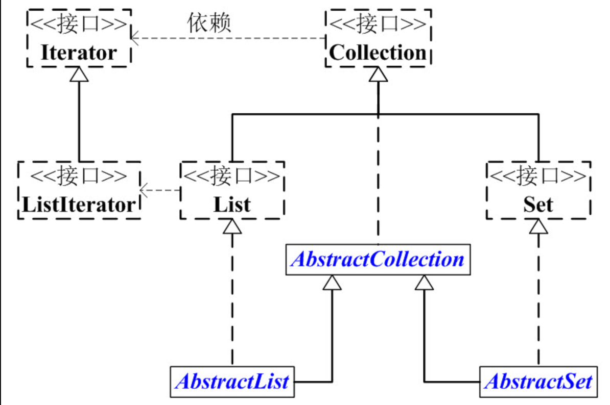
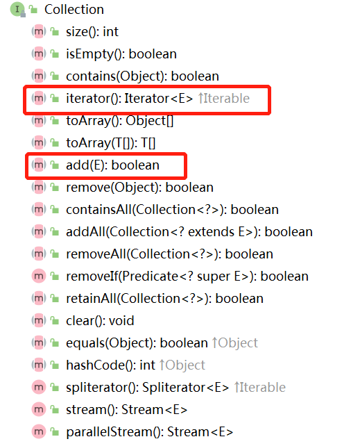

# Collection接口架构

## Collection 接口概述

Collection是一个接口，它主要的两个分支是：**List** 和 **Set**。



List和Set都是接口，它们继承于Collection。

- **List是有序的队列，List中可以有重复的元素**
- **Set是数学概念中的集合，Set中没有重复元素**！
- List和Set都有它们各自的实现类。

为了方便，我们抽象出了AbstractCollection抽象类，它实现了Collection中的绝大部分函数；这样，在Collection的实现类中，我们就可以通过继承AbstractCollection省去重复编码。AbstractList和AbstractSet都继承于AbstractCollection，具体的List实现类继承于AbstractList，而Set的实现类则继承于AbstractSet。

另外，Collection中有一个iterator()函数，它的作用是返回一个Iterator接口。通常，我们通过Iterator迭代器来遍历集合。ListIterator是List接口所特有的，在List接口中，通过ListIterator()返回一个ListIterator对象。

接下来，我们看看各个接口和抽象类的介绍；然后，再对实现类进行详细的了解。,Collection接口与其他类或者接口之间的代码关系描述如下：

```java
public interface Collection<E> extends Iterable<E> 
public interface Iterable<T> {
    Iterator<T> iterator();
}
public interface Iterator<E> {
    
    boolean hasNext();
    
    E next();
    
    default void remove() {
        throw new UnsupportedOperationException("remove");
    }
    
    default void forEachRemaining(Consumer<? super E> action) {
        Objects.requireNonNull(action);
        while (hasNext())
            action.accept(next());
    }
}
public interface List<E> extends Collection<E>{
    ListIterator<E> listIterator();
}
public interface Set<E> extends Collection<E>
```


## Collection简介

在 Java 类库中， 集合类的基本接口是 Collection 接口 。 这个接口有两个基本方法分别是add和iterator



- add 方法用于向集合中添加元素。 如果添加元素确实改变了集合就返回true , 如果集合没有发生变化就返回 false
  。 例如 ， 如果试图向集中添加一个对象 ， 而这个对象在集中已经存在， 这个添加请求就没有实效 ， 因为集中不允许有重复的对象 。
- iterator 方法用于返回一个实现了 Iterator 接口的对象。 可以使用这个迭代器对象依次访问集合中的元素

