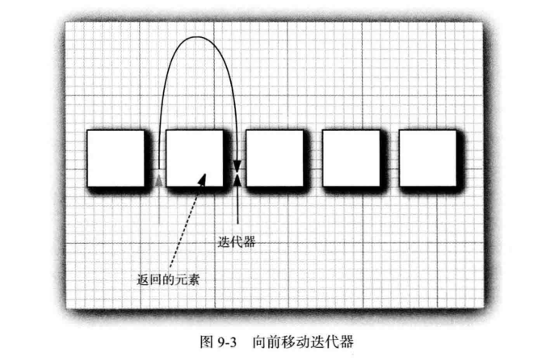

# Collection接口架构

## Collection 接口概述

Collection是一个接口，它主要的两个分支是：**List** 和 **Set**。


List和Set都是接口，它们继承于Collection。

- **List是有序的队列，List中可以有重复的元素**
- **Set是数学概念中的集合，Set中没有重复元素**！
- List和Set都有它们各自的实现类。

为了方便，我们抽象出了AbstractCollection抽象类，它实现了Collection中的绝大部分函数；这样，在Collection的实现类中，我们就可以通过继承AbstractCollection省去重复编码。AbstractList和AbstractSet都继承于AbstractCollection，具体的List实现类继承于AbstractList，而Set的实现类则继承于AbstractSet。

另外，Collection中有一个iterator()函数，它的作用是返回一个Iterator接口。通常，我们通过Iterator迭代器来遍历集合。ListIterator是List接口所特有的，在List接口中，通过ListIterator()返回一个ListIterator对象。

接下来，我们看看各个接口和抽象类的介绍；然后，再对实现类进行详细的了解。,Collection接口与其他类或者接口之间的代码关系描述如下：

```java
public interface Collection<E> extends Iterable<E> 
public interface Iterable<T> {
    Iterator<T> iterator();
}
public interface Iterator<E> {
    
    boolean hasNext();
    
    E next();
    
    default void remove() {
        throw new UnsupportedOperationException("remove");
    }
    
    default void forEachRemaining(Consumer<? super E> action) {
        Objects.requireNonNull(action);
        while (hasNext())
            action.accept(next());
    }
}
public interface List<E> extends Collection<E>{
    ListIterator<E> listIterator();
}
public interface Set<E> extends Collection<E>
```

## Collection简介

在 Java 类库中， 集合类的基本接口是 Collection 接口 。 这个接口有两个基本方法分别是add和iterator


- add 方法用于向集合中添加元素。 如果添加元素确实改变了集合就返回true , 如果集合没有发生变化就返回 false
  。 例如 ， 如果试图向集中添加一个对象 ， 而这个对象在集中已经存在， 这个添加请求就没有实效 ， 因为集中不允许有重复的对象 。
- iterator 方法用于返回一个实现了 Iterator 接口的对象。 可以使用这个迭代器对象依次访问集合中的元素

## 迭代器

Iterator 接口包含 4 个方法 ：

```java
public interface Iterator <E>
{
    E next ( ) ;
    boolean hasNextO ;
    void remove 0 ;
    default void forEachRemaining ( Consumer < ? super E > action ) ;
}
```

- 通过反复调用 next 方法， 可以逐个访问集合中的每个元素 。
-  但是 ， 如果到达了集合的末尾， next 方法将抛出一个 NoSuchElementException 。
-  因此 ， 需要在调用 next 之前调用 hasNext方法
-  如果迭代器对象还有多个供访问的元素 ，这个方法就返回 true
-  如果想要査看集合中的所有元素， 就请求一个迭代器 ， 并在 hasNext 返回 true 时反复地调用 next 方法 。

**示例1**：使用iterator遍历集合

```java
  public static void main(String[] args) {
        Collection<String> c=new ArrayList<>();
        c.add("a");
        c.add("b");
        c.add("c");
        c.add("d");
        Iterator<String> iterator=c.iterator();
        while (iterator.hasNext()){
            String item=iterator.next();
            System.out.println(item);
        }
    }
```

结果


**示例2：**使用for-each来简化循环操作

```java
    public static void main(String[] args) {
        Collection<String> c=new ArrayList<>();
        c.add("a");
        c.add("b");
        c.add("c");
        c.add("d");
        for (String str:c) {
            System.out.println(str);
        }
    }
```

- “ for each ” 循环可以与任何实现了 Iterable 接口的对象一起工作 ， 这个接口只包含一个抽象方法 ：

```java
public interface Iterable<T> {
    Iterator<T> iterator();
}
```

- Collection 接口扩展了 Iterable 接口。 因此 ， 对于标准类库中的任何集合都可以使用 “ for-each ” 循环 。

```java
public interface Collection<E> extends Iterable<E> 
```

- Java8中，在 Java SE 8 中， 甚至不用写循环 。 可以调用 forEachRemaining 方法并提供一lambda表达式 （ 它会处理一个元素 ）。 将对迭代器的每一个元素调用这个 lambda表达式， 直到再没有元素为止。

```java
    public static void main(String[] args) {
        Collection<String> c=new ArrayList<>();
        c.add("a");
        c.add("b");
        c.add("c");
        c.add("d");
        Iterator<String> iterator=c.iterator();
        iterator.forEachRemaining(x->{
            System.out.println(x);
        });
    }
```

- 元素被访问的顺序取决于集合类型。 如果对 ArrayList 进行迭代 ， 迭代器将从索引0 开始， 每迭代一次 ， 索引值加
  1。
-  如果访问HashSet 中的元素 ， 每个元素将会按照某种随机的次序出现。 虽然可以确定在迭代过程中能够遍历到集合中的所有元素 ， 但却无法预知元素被访问的次序。
- Java迭代器查找操作与位置的变更紧密结合，查找一个元素的唯一方法是调用 next ,而在执行查找操作的同时， 迭代器的
  位置随之向前移动。
-  应该将 Java 迭代器认为是位于两个元素之间 。 当调用 next 时 ， 迭代器就越过下一个元素 ， 并返回刚刚越过的那个元素的引用 



- Iterator 接口的 remove 方法将会删除上次调用 next 方法时返回的元素。 在大多数情况下， 在决定删除某个元素之前应该先看一下这个元素是很具有实际意义的 。 然而 ，如果想要删除指定位置上的元素 ， 仍然需要越过这个元素 。 

**示例三**：使用迭代器来实现边遍历边删除的操作

```java
    public static void main(String[] args) {
        Collection<String> c=new ArrayList<>();
        c.add("a");
        c.add("b");
        c.add("c");
        c.add("d");
        Iterator<String> iterator=c.iterator();
        while(iterator.hasNext()){
            String item=iterator.next();
            if(item.equals("a")){
                iterator.remove();
            }
        }
        for (String str:c) {
            System.out.println(str);
        }
    }
```

结果


第一次的时候，迭代器指向"a"的前面，调用next方法返回"a"的引用，"a"的引用调用迭代器方法的remove()方法删除掉"a",反之就会报错，错误示例如下：

```java
    public static void main(String[] args) {
        Collection<String> c=new ArrayList<>();
        c.add("a");
        c.add("b");
        c.add("c");
        c.add("d");
        Iterator<String> iterator=c.iterator();
        while(iterator.hasNext()){
           iterator.remove();
           iterator.next();
        }
        for (String str:c) {
            System.out.println(str);
        }
    }
```

报错如下：


**注意：**更重要的是， 对next 方法和 remove 方法的调用具有互相依赖性。 如果调用remove 之前没有调用 next 将是不合法的 。 如果这样做 ， 将会抛出一个 IllegalStateException 异常。

如果想删除两个相邻的元素 ， 不能直接地这样调用 ：

```java
it.remove ( ) ；
it.remove 0 ； // Error 
```

相反地， 必须先调用 next 越过将要删除的元素 。

```java
it.remove() ;
it.next();
it.remove(); // OK
```

## Colleaction中的实用方法

Collection 接口声明了很多有用的方法 ， 所有的实现类都必须提供这些方法 。 

```java
// Collection的API
abstract boolean         add(E object)
abstract boolean         addAll(Collection<? extends E> collection)
abstract void            clear()
abstract boolean         contains(Object object)
abstract boolean         containsAll(Collection<?> collection)
abstract boolean         equals(Object object)
abstract int             hashCode()
abstract boolean         isEmpty()
abstract Iterator<E>     iterator()
abstract boolean         remove(Object object)
abstract boolean         removeAll(Collection<?> collection)
abstract boolean         retainAll(Collection<?> collection)
abstract int             size()
abstract <T> T[]         toArray(T[] array)
abstract Object[]        toArray()
```

当然 ， 如果实现 Collection 接口的每一个类都要提供如此多的例行方法将是一件很烦人的事情。 为了能够让实现者更容易地实现这个接口 ， Java 类库提供了一个类 AbstractCollection ，它将基础方法 size 和 iterator 抽象化了 ， 但是在此提供了例行方法。 例如 ：

```java
public abstract class AbstractCollection<E> implements Collection<E>
```


此时 ， 一个具体的集合类可以扩展 AbstractCollection 类了。 现在要由具体的集合类提供iterator 方法 ， 而 contains 方法已由 AbstractCollection 超类提供了 。 然而 ， 如果子类有更加有效的方式实现 contains 方法 ， 也可以由子类提供 ， 就这点而言， 没有什么限制 。

## 集合框架中的接口

Java 集合框架为不同类型的集合定义了大量接口


- 集合有两个基本接口 ： Collection 和 Map 。 我们已经看到 ， 可以用以下方法在集合中插入元素 ：

```java
boolean add ( E element )
```

- 不过， 由于映射包含键/ 值对 ， 所以要用 put 方法来插人 ：

```java
V put ( K key , V value )
```

- 要从集合读取元素 ， 可以用迭代器访问元素 。 不过 ， 从映射中读取值则要使用 get 方法 ：

```java
V get ( K key )
```

### List接口

- List 是一个有序集合 ，元 素会增加到容器中的特定位置 。 
-  可以采用两种方式访问元素 ： 
  -  使用迭代器访问 ，必须顺序的访问元素
  - 使用一个整数索引来访问(又称随机访问，可以按照任意的顺序进行访问)
- List 接口定义了多个用于随机访问的方法 ：

```java
void add ( int index , E element )
void remove ( int index )
E get ( int index )
E set ( int index , E element )
```

-  为了避免对链表完成随机访问操作， JavaSE 1.4 引入了一个标记接口 RandomAccess。这个接口不包含任何方法， 不过可以用它来测试一个特定的集合是否支持高效的随机访问

```java
if ( c instanceof RandomAccess )
{
	//use random access algorithm
}
else
{
	//use sequential access algorithm
}
```

比如ArrayList中就实现了标记接口 RandomAccess


- 关于API方面。既然List是继承于Collection接口，它自然就包含了Collection中的全部函数接口；由于List是有序队列，它也额外的有自己的API接口。主要有“添加、删除、获取、修改指定位置的元素”、“获取List中的子队列”等。

```java
// Collection的API
abstract boolean         add(E object)
abstract boolean         addAll(Collection<? extends E> collection)
abstract void            clear()
abstract boolean         contains(Object object)
abstract boolean         containsAll(Collection<?> collection)
abstract boolean         equals(Object object)
abstract int             hashCode()
abstract boolean         isEmpty()
abstract Iterator<E>     iterator()
abstract boolean         remove(Object object)
abstract boolean         removeAll(Collection<?> collection)
abstract boolean         retainAll(Collection<?> collection)
abstract int             size()
abstract <T> T[]         toArray(T[] array)
abstract Object[]        toArray()
// 相比与Collection，List新增的API：
abstract void                add(int location, E object)
abstract boolean             addAll(int location, Collection<? extends E> collection)
abstract E                   get(int location)
abstract int                 indexOf(Object object)
abstract int                 lastIndexOf(Object object)
abstract ListIterator<E>     listIterator(int location)
abstract ListIterator<E>     listIterator()
abstract E                   remove(int location)
abstract E                   set(int location, E object)
abstract List<E>             subList(int start, int end)
```

### Set接口

- Set 接口等同于 Collection 接口， 不过其方法的行为有更严谨的定义 。

-  集 （ set )的 add 方法**不允许增加重复的元素**

-  要适当地**定义集的 equals 方法**

- 只要两个集包含同样的元素就认为是相等的， 而**不要求这些元素有同样的顺序** 

-  hashCode 方法的定义要**保证包含相同元素的两个集会得到相同的散列码**。

- **Set是一个继承于Collection的接口，即Set也是集合中的一种。Set是没有重复元素的集合。**

  关于API方面。Set的API和Collection完全一样。

```java
// Set的API
abstract boolean         add(E object)
abstract boolean         addAll(Collection<? extends E> collection)
abstract void             clear()
abstract boolean         contains(Object object)
abstract boolean         containsAll(Collection<?> collection)
abstract boolean         equals(Object object)
abstract int             hashCode()
abstract boolean         isEmpty()
abstract Iterator<E>     iterator()
abstract boolean         remove(Object object)
abstract boolean         removeAll(Collection<?> collection)
abstract boolean         retainAll(Collection<?> collection)
abstract int             size()
abstract <T> T[]         toArray(T[] array)
abstract Object[]         toArray()
```

## 具体的集合


