# HashMap剖析

## Map接口

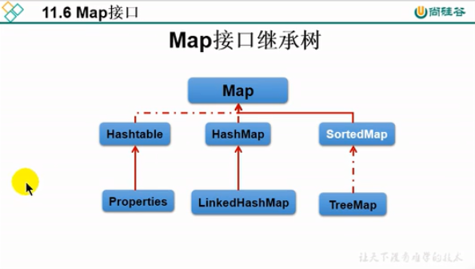

- Map是双列数据，存储key-value对的数据，类似于高中的y=f(x)
- HashMap是Map的最主要的实现类，线程不安全，效率高，可以存储null的key和value
  - 底层最初就是数组加链表实现（JDK7之前）
  - 数组+链表+红黑树（JDK8之后）
- Hashtable作为最古老的实现类，起源于JDK1.0，线程安全效率低
- LinkedHashMap：保证在遍历Map元素的时候，可以按照添加的顺序实现遍历，原理是在原有的HashMap底层原理基础上，添加了一对指针指向了前一元素和后一个元素，对于频繁的遍历操作，LinkedHashMap效率要高于HashMap
- TreeMap:保证按照添加的key-value对进行排序，实现排序遍历，此时考虑key的自然排序或者定制排序，底层使用的是红黑树
- properties：常常用来处理配置文件，key和value都是String类型

**注意：**

1. 典型面试题HashMap的底层实现源代码？
2. HashMap和Hashtable的异同？
3. ConcurrentHashMap与Hashtable的区别？

## Map结构的理解

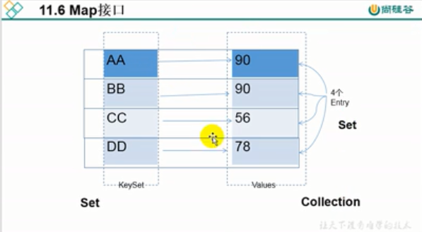

- Map中的key是无序的、不可重复的，使用Set存储所有的key，**key所在的类要重写hashCode()和equals()方法**（HashMap为例）
- Map中的value是无序的、可重复的，使用Collection存储所有的value，**value所在的类要重写equals()**
- 一个键值对：key-value构成一个Entry对象
- Map中的Entry：无序的不可重复的，使用Set存储所有entry


## Has和Map的API

| 方法摘要              |                                                              |
| :-------------------- | ------------------------------------------------------------ |
| `void`                | `clear()`  从此映射中移除所有映射关系（可选操作）。          |
| `boolean`             | `containsKey(Object key)`  如果此映射包含指定键的映射关系，则返回 `true`。 |
| `boolean`             | `containsValue(Object value)`  如果此映射将一个或多个键映射到指定值，则返回 `true`。 |
| `Set<Map.Entry<K,V>>` | `entrySet()`  返回此映射中包含的映射关系的 [`Set`](http://www.cnblogs.com/) 视图。 |
| `boolean`             | `equals(Object o)`  比较指定的对象与此映射是否相等。         |
| `V`                   | `get(Object key)`  返回指定键所映射的值；如果此映射不包含该键的映射关系，则返回 `null`。 |
| `int`                 | `hashCode()`  返回此映射的哈希码值。                         |
| `boolean`             | `isEmpty()`  如果此映射未包含键-值映射关系，则返回 `true`。  |
| `Set<K>`              | `keySet()`  返回此映射中包含的键的 [`Set`](http://www.cnblogs.com/) 视图。 |
| `V`                   | `put(K key, V value)`  将指定的值与此映射中的指定键关联（可选操作）。 |
| `void`                | `putAll(Map<? extends K,? extends V> m)`  从指定映射中将所有映射关系复制到此映射中（可选操作）。 |
| `V`                   | `remove(Object key)`  如果存在一个键的映射关系，则将其从此映射中移除（可选操作）。 |
| `int`                 | `size()`  返回此映射中的键-值映射关系数。                    |
| `Collection<V>`       | `values()`  返回此映射中包含的值的 [`Collection`](http://www.cnblogs.com/) 视图。 |

## HashMap的底层实现原理

### 以JDK7说明

```java
Map<Integer,Integer> map=new HashMap<>();
```

1. 实例化之后，底层创建了长度为16的一维数组，数组的类型是Entry ,数组的名称叫做table

```java
map.put(key1,value1);
```

2. 首先调用key1所在类的hashCode()方法，计算key1的哈希值，此哈希值经过某种算法计算以后，得到在Entry数组中的存放位置
   - 情况一，如果此位置上的数据为空此时key1-value1添加成功
   - 如果此位置上的数据不为空（意味着此位置上存放着一个或者多个数据(以链表的形式存在)），比较key1与已经存在的一个或者多个数据的哈希值
     - 如果key1的哈希值与已经存在的数据的哈希值都不相同，key1和value1的键值对添加成功
     - key1哈希值与已经存在的某一个某一个数据(key2-value2)的哈希值相同，继续比较，调用key1所在类的equals(key2)方法，比较
       - 如果equals返回为false:此时key1-value1添加成功(情况2)
       - 如果equals返回true:使用value1替换value2,起到了一个修改的功能(情况3)
   - 补充：关于情况2和情况3：此时key1和value1和原来的数据以链表的形式来存储
3. 在不断的添加过程中会不断的涉及到扩容的问题，默认的扩容方式扩容为原来的2倍，并将原有的数据复制过来

### 以JDK8说明

1. new HashMap():底层没有创建一个长度为16的数组
2. JDK8底层的数组是Node类型的数组，而非Entry数据
3. 首次调用put方法的时候，底层创建长度为16的数组
4. JDK7底层结构只有数组+链表，JDK8中底层结构为：数组+链表+红黑树
5. 当数组某一个索引位置上的元素以链表形式存在的数据个数>8,且当前数据的长度>64,此时此索引位置上的所有数据采用红黑树存储，主要为了提升查找效率

## HashMap1.7源码阅读

### HashMap的结构图示

 jdk1.7的HashMap采用数组+单链表实现，尽管定义了hash函数来避免冲突，但因为数组长度有限，还是会出现两个不同的Key经过计算后在数组中的位置一样，1.7版本中采用了链表来解决。

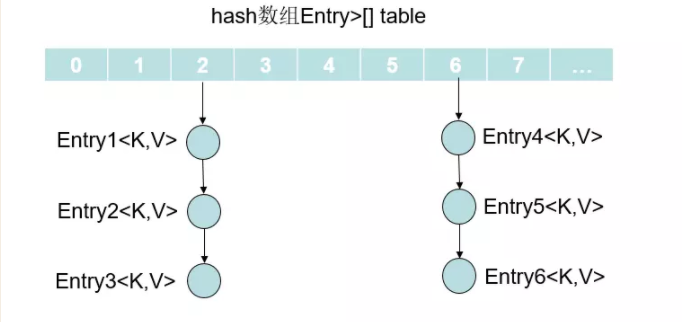

从上面的简易示图中也能发现，如果位于链表中的结点过多，那么很显然通过key值依次查找效率太低，所以**在1.8中对其进行了改良，采用数组+链表+红黑树来实现，当链表长度超过阈值8时，将链表转换为红黑树.**

 从上面图中也知道实际上每个元素都是Entry类型，所以下面再来看看Entry中有哪些属性(在1.8中Entry改名为Node，同样实现了Map.Entry)。

```java
//hash标中的结点Node,实现了Map.Entry
static class Entry<K,V> implements Map.Entry<K,V> {
    final K key;
    V value;
    Entry<K,V> next;
    int hash;
	//Entry构造器，需要key的hash，key，value和next指向的结点
    Entry(int h, K k, V v, Entry<K,V> n) {
        value = v;
        next = n;
        key = k;
        hash = h;
    }

    public final K getKey() { return key; }

    public final V getValue() { return value; }

    public final V setValue(V newValue) {
        V oldValue = value;
        value = newValue;
        return oldValue;
    }
    //equals方法
    public final boolean equals(Object o) {
        if (!(o instanceof Map.Entry))
            return false;
        Map.Entry e = (Map.Entry)o;
        Object k1 = getKey();
        Object k2 = e.getKey();
        if (k1 == k2 || (k1 != null && k1.equals(k2))) {
            Object v1 = getValue();
            Object v2 = e.getValue();
            if (v1 == v2 || (v1 != null && v1.equals(v2)))
                return true;
        }
        return false;
    }
	//重写Object的hashCode
    public final int hashCode() {
        return Objects.hashCode(getKey()) ^ Objects.hashCode(getValue());
    }

    public final String toString() {
        return getKey() + "=" + getValue();
    }

	//调用put（k，v）方法时候，如果key相同即Entry数组中的值会被覆盖，就会调用此方法。
    void recordAccess(HashMap<K,V> m) {
    }

    //只要从表中删除entry，就会调用此方法
    void recordRemoval(HashMap<K,V> m) {
    }
}
```

### HashMap中的成员变量以及含义

```java
//默认初始化容量初始化=16
static final int DEFAULT_INITIAL_CAPACITY = 1 << 4; // aka 16

//最大容量 = 1 << 30
static final int MAXIMUM_CAPACITY = 1 << 30;

//默认加载因子.一般HashMap的扩容的临界点是当前HashMap的大小 > DEFAULT_LOAD_FACTOR * 
//DEFAULT_INITIAL_CAPACITY = 0.75F * 16
static final float DEFAULT_LOAD_FACTOR = 0.75f;

//默认是空的table数组
static final Entry<?,?>[] EMPTY_TABLE = {};

//table[]默认也是上面给的EMPTY_TABLE空数组，所以在使用put的时候必须resize长度为2的幂次方值
transient Entry<K,V>[] table = (Entry<K,V>[]) EMPTY_TABLE;

//map中的实际元素个数 != table.length
transient int size;

//扩容阈值，当size大于等于其值，会执行resize操作
//一般情况下threshold=capacity*loadFactor
int threshold;

//hashTable的加载因子
final float loadFactor;

/**
     * The number of times this HashMap has been structurally modified
     * Structural modifications are those that change the number of mappings in
     * the HashMap or otherwise modify its internal structure (e.g.,
     * rehash).  This field is used to make iterators on Collection-views of
     * the HashMap fail-fast.  (See ConcurrentModificationException).
     */
transient int modCount;

//hashSeed用于计算key的hash值，它与key的hashCode进行按位异或运算
//hashSeed是一个与实例相关的随机值，用于解决hash冲突
//如果为0则禁用备用哈希算法
transient int hashSeed = 0;
```

### HashMap的构造方法

#### 无参构造器

```java
//构造一个空的table，其中初始化容量为DEFAULT_INITIAL_CAPACITY=16。加载因子为DEFAULT_LOAD_FACTOR=0.75F
public HashMap() {
    this(DEFAULT_INITIAL_CAPACITY, DEFAULT_LOAD_FACTOR);
}
```

#### 指定初始化容量的构造器

```java
//构造一个空的table，其中初始化容量为传入的参数initialCapacity。加载因子为DEFAULT_LOAD_FACTOR=0.75F
public HashMap(int initialCapacity) {
    this(initialCapacity, DEFAULT_LOAD_FACTOR);
}
```

#### 指定初始化容量和加载因子的构造器

```java
public HashMap(int initialCapacity, float loadFactor) {
    //对传入初始化参数进行合法性检验，<0就抛出异常
    if (initialCapacity < 0)
        throw new IllegalArgumentException("Illegal initial capacity: " +
                                           initialCapacity);
    //如果initialCapacity大于最大容量，那么容量=MAXIMUM_CAPACITY
    if (initialCapacity > MAXIMUM_CAPACITY)
        initialCapacity = MAXIMUM_CAPACITY;
    //对传入加载因子参数进行合法检验，
    if (loadFactor <= 0 || Float.isNaN(loadFactor))
        //<0或者不是Float类型的数值，抛出异常
        throw new IllegalArgumentException("Illegal load factor: " +
                                           loadFactor);
	//两个参数检验完了，就给本map实例的属性赋值
    this.loadFactor = loadFactor;
    threshold = initialCapacity;
    //init是一个空的方法，模板方法，如果有子类需要扩展可以自行实现
    init();
}
```

 从上面的这3个构造方法中我们可以发现虽然指定了初始化容量大小，但此时的table还是空，是一个空数组，且扩容阈值threshold为给定的容量或者默认容量(前两个构造方法实际上都是通过调用第三个来完成的)。在其put操作前，会创建数组（跟jdk8中使用无参构造时候类似）.

#### 参数为一个map映射集合

```java
//构造一个新的map映射，使用默认加载因子，容量为参数map大小除以默认负载因子+1与默认容量的最大值
public HashMap(Map<? extends K, ? extends V> m) {
    //容量：map.size()/0.75+1 和 16两者中更大的一个
    this(Math.max(
        	(int) (m.size() / DEFAULT_LOAD_FACTOR) + 1,
                  DEFAULT_INITIAL_CAPACITY), 
         DEFAULT_LOAD_FACTOR);
    inflateTable(threshold);
    //把传入的map里的所有元素放入当前已构造的HashMap中
    putAllForCreate(m);
}
```

#### (1)inflateTable方法说明

 这个方法比较重要，在第四种构造器中调用了这个方法。而如果创建集合对象的时候使用的是前三种构造器的话会在调用put方法的时候调用该方法对table进行初始化

```java
private void inflateTable(int toSize) {
    //返回不小于number的最小的2的幂数，最大为MAXIMUM_CAPACITY,类比jdk8的实现中的tabSizeFor的作用
    int capacity = roundUpToPowerOf2(toSize);
	//扩容阈值为：(容量*加载因子)和(最大容量+1)中较小的一个
    threshold = (int) Math.min(capacity * loadFactor, MAXIMUM_CAPACITY + 1);
    //创建table数组
    table = new Entry[capacity];
    initHashSeedAsNeeded(capacity);
}
```

#### (2)roundUpToPowerOf方法说明

```java
private static int roundUpToPowerOf2(int number) {
    //number >= 0，不能为负数，
    //(1)number >= 最大容量：就返回最大容量
    //(2)0 =< number <= 1：返回1
    //(3)1 < number < 最大容量：
    return number >= MAXIMUM_CAPACITY
        ? MAXIMUM_CAPACITY
        : (number > 1) ? Integer.highestOneBit((number - 1) << 1) : 1;
}
//该方法和jdk8中的tabSizeFor实现基本差不多
public static int highestOneBit(int i) {
    //因为传入的i>0,所以i的高位还是0，这样使用>>运算符就相当于>>>了，高位0。
    //还是举个例子，假设i=5=0101
    i |= (i >>  1); //（1）i>>1=0010；（2）i= 0101 | 0010 = 0111
    i |= (i >>  2); //（1）i>>2=0011；（2）i= 0111 | 0011 = 0111
    i |= (i >>  4); //（1）i>>4=0000；（2）i= 0111 | 0000 = 0111
    i |= (i >>  8); //（1）i>>8=0000；（2）i= 0111 | 0000 = 0111
    i |= (i >> 16); //（1）i>>16=0000；（2）i= 0111 | 0000 = 0111
    return i - (i >>> 1); //（1）0111>>>1=0011（2）0111-0011=0100=4
    //所以这里返回4。
    //而在上面的roundUpToPowerOf2方法中，最后会将highestOneBit的返回值进行 << 1 操作，即最后的结果为4<<1=8.就是返回大于number的最小2次幂
}
```

#### (3)putAllForCreate方法说明

 该方法就是遍历传入的map集合中的元素，然后加入本map实例中。下面我们来看看该方法的实现细节

```java
private void putAllForCreate(Map<? extends K, ? extends V> m) {
    //实际上就是遍历传入的map，将其中的元素添加到本map实例中（putForCreate方法实现）
    for (Map.Entry<? extends K, ? extends V> e : m.entrySet())
        putForCreate(e.getKey(), e.getValue());
}
```

 putForCreate方法原理实现

```java
private void putForCreate(K key, V value) {
    //判断key是否为null，如果为null那么对应的hash为0，否则调用刚刚上面说到的hash()方法计算hash值
    int hash = null == key ? 0 : hash(key); 
    //根据刚刚计算得到的hash值计算在table数组中的下标
    int i = indexFor(hash, table.length);
    for (Entry<K,V> e = table[i]; e != null; e = e.next) {
        Object k;
        //hash相同，key也相同，直接用旧的值替换新的值
        if (e.hash == hash &&
            ((k = e.key) == key || (key != null && key.equals(k)))) {
            e.value = value;
            return;
        }
    }
	//这里就是：要插入的元素的key与前面的链表中的key都不相同，所以需要新加一个结点加入链表中
    createEntry(hash, key, value, i);
}
```

#### (4)createEntry方法实现

```java
void createEntry(int hash, K key, V value, int bucketIndex) {
    //这里说的是，前面的链表中不存在相同的key，所以调用这个方法创建一个新的结点，并且结点所在的桶
    //bucket的下标指定好了
    Entry<K,V> e = table[bucketIndex];
    /*Entry(int h, K k, V v, Entry<K,V> n) {value = v;next = n;key = k;hash = h;}*/
    table[bucketIndex] = new Entry<>(hash, key, value, e);//Entry的构造器，创建一个新的结点作为头节点（头插法）
    size++;//将当前hash表中的数量加1
}
```

### HashMap确定元素在数组中的位置

 1.7中的计算hash值的算法和1.8的实现是不一样的，而hash值又关系到我们put新元素的位置、get查找元素、remove删除元素的时候去通过indexFor查找下标。所以我们来看看这两个方法

#### (1)hash方法

```java
final int hash(Object k) {
    int h = hashSeed;
    //默认是0，不是0那么需要key是String类型才使用stringHash32这种hash方法
    if (0 != h && k instanceof String) {
        return sun.misc.Hashing.stringHash32((String) k);
    }
    //这段代码是为了对key的hashCode进行扰动计算，防止不同hashCode的高位不同但低位相同导致的hash冲突。简单点
    //说，就是为了把高位的特征和低位的特征组合起来，降低哈希冲突的概率，也就是说，尽量做到任何一位的变化都能对
    //最终得到的结果产生影响
    h ^= k.hashCode();
    h ^= (h >>> 20) ^ (h >>> 12);
    return h ^ (h >>> 7) ^ (h >>> 4);
}
```

 我们通过下面的例子来说明对于key的hashCode进行扰动处理的重要性，我们现在想向一个map中put一个Key-Value对，Key的值为“fsmly”，不进行任何的扰动处理知识单纯的经过简单的获取hashcode后，得到的值为“**0000_0000_0011_0110_0100_0100_1001_0010**”，如果当前map的中的table数组长度为16，最终得到的index结果值为10。由于15的二进制扩展到32位为“00000000000000000000000000001111”，所以，一个数字在和他进行按位与操作的时候，前28位无论是什么，计算结果都一样（因为0和任何数做与，结果都为0，那这样的话一个put的Entry结点就太过依赖于key的hashCode的低位值，产生冲突的概率也会大大增加）。如下图所示

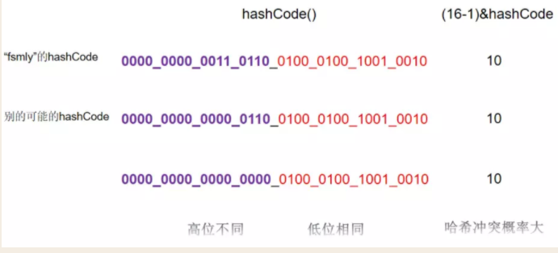

 因为map的数组长度是有限的，这样冲突概率大的方法是不适合使用的，所以需要对hashCode进行扰动处理降低冲突概率，而JDK7中对于这个处理使用了四次位运算，还是通过下面的简单例子看一下这个过程.可以看到，刚刚不进行扰动处理的hashCode在进行处理后就没有产生hash冲突了。

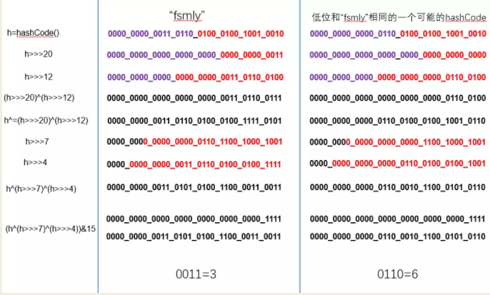

总结一下：我们会首先计算传入的key的hash值然后通过下面的indexFor方法确定在table中的位置，具体实现就是通过一个计算出来的hash值和length-1做位运算，那么对于2^n来说，长度减一转换成二进制之后就是低位全一（长度16，len-1=15,二进制就是1111）。上面四次扰动的这种设定的好处就是，对于得到的hashCode的每一位都会影响到我们索引位置的确定，其目的就是为了能让数据更好的散列到不同的桶中，降低hash冲突的发生。关于Java集合中存在hash方法的更多原理和细节，请参考这篇[hash()方法分析](https://www.hollischuang.com/archives/2091)

#### (2)indexFor方法

```java
static int indexFor(int h, int length) {
    //还是使用hash & (n - 1)计算得到下标
    return h & (length-1);
}
```

主要实现就是将计算的key的hash值与map中数组长度length-1进行按位与运算，得到put的Entry在table中的数组下标。具体的计算过程在上面hash方法介绍的时候也有示例，这里就不赘述了。

### HashMap的put方法分析

#### (1)put方法

```java
public V put(K key, V value) {
    //我们知道Hash Map有四中构造器，而只有一种(参数为map的)初始化了table数组，其余三个构造器只
    //是赋值了阈值和加载因子，所以使用这三种构造器创建的map对象，在调用put方法的时候table为{}，
    //其中没有元素，所以需要对table进行初始化
    if (table == EMPTY_TABLE) {
        //调用inflateTable方法，对table进行初始化，table的长度为：
        //不小于threshold的最小的2的幂数，最大为MAXIMUM_CAPACITY
        inflateTable(threshold);
    }
    //如果key为null，表示插入一个键为null的K-V对，需要调用putForNullKey方法
    if (key == null)
        return putForNullKey(value);
    
    //计算put传入的key的hash值
    int hash = hash(key);
    //根据hash值和table的长度计算所在的下标
    int i = indexFor(hash, table.length);
    //从数组中下标为indexFor(hash, table.length)处开始（1.7中是用链表解决hash冲突的，这里就
    //是遍历链表），实际上就是已经定位到了下标i，这时候就需要处理可能出现hash冲突的问题
    for (Entry<K,V> e = table[i]; e != null; e = e.next) {
        Object k;
        //hash值相同，key相同，替换该位置的oldValue为value
        if (e.hash == hash && ((k = e.key) == key || key.equals(k))) {
            V oldValue = e.value;
            e.value = value;
            //空方法，让其子类重写
            e.recordAccess(this);
            return oldValue;
        }
    }
	//如果key不相同，即在链表中没有找到相同的key，那么需要将这个结点加入table[i]这个链表中
    
    //修改modCount值（后续总结文章会说到这个问题）
    modCount++;
    //遍历没有找到该key，就调用该方法添加新的结点
    addEntry(hash, key, value, i);
    return null;
}
```

#### (2)putForNullKey方法分析

 这个方法是处理key为null的情况的，当传入的key为null的时候，会在table[0]位置开始遍历，遍历的实际上是当前以table[0]为head结点的链表，如果找到链表中结点的key为null，那么就直接替换掉旧值为传入的value。否则创建一个新的结点并且加入的位置为table[0]位置处。

```java
//找到table数组中key为null的那个Entry对象，然后将其value进行替换
private V putForNullKey(V value) {
    //从table[0]开始遍历
    for (Entry<K,V> e = table[0]; e != null; e = e.next) {
        //key为null
        if (e.key == null) {
            //将value替换为传递进来的value
            V oldValue = e.value;
            e.value = value;
            e.recordAccess(this);
            return oldValue; //返回旧值
        }
    }
    modCount++;
    //若不存在，0位置桶上的链表中添加新结点
    addEntry(0, null, value, 0);
    return null;
}
```

#### (3)addEntry方法分析

 addEntry方法的主要作用就是判断当前的size是否大于阈值，然后根据结果判断是否扩容，最终创建一个新的结点插入在链表的头部（实际上就是table数组中的那个指定下标位置处）

```java
/*
	hashmap采用头插法插入结点，为什么要头插而不是尾插，因为后插入的数据被使用的频次更高，而单链表无法随机访问只能从头开始遍历查询，所以采用头插.突然又想为什么不采用二维数组的形式利用线性探查法来处理冲突，数组末尾插入也是O(1)，可数组其最大缺陷就是在于若不是末尾插入删除效率很低，其次若添加的数据分布均匀那么每个桶上的数组都需要预留内存.
*/
void addEntry(int hash, K key, V value, int bucketIndex) {
    //这里有两个条件
    //①size是否大于阈值
    //②当前传入的下标在table中的位置不为null
    if ((size >= threshold) && (null != table[bucketIndex])) {
        //如果超过阈值需要进行扩容
        resize(2 * table.length);
        //下面是扩容之后的操作
        //计算不为null的key的hash值，为null就是0
        hash = (null != key) ? hash(key) : 0;
        //根据hash计算下标
        bucketIndex = indexFor(hash, table.length);
    }
    //执行到这里表示（可能已经扩容也可能没有扩容），创建一个新的Entry结点
    createEntry(hash, key, value, bucketIndex);
}
```

#### (4)总结put方法的执行流程

1. 首先判断数组是否为空，若为空调用inflateTable进行扩容.
2. 接着判断key是否为null，若为null就调用putForNullKey方法进行put.（这里也说明HashMap允许key为null，默认插入在table中位置为0处）
3. 调用hash()方法，将key进行一次哈希计算，得到的hash值和当前数组长度进行&计算得到数组中的索引
4. 然后遍历该数组索引下的链表，若key的hash和传入key的hash相同且key的equals放回true，那么直接覆盖 value
5. 最后若不存在，那么在此链表中头插创建新结点

### HashMap的resize方法分析

#### (1)resize的大体流程

```java
void resize(int newCapacity) {
    //获取map中的旧table数组暂存起来
    Entry[] oldTable = table;
    //获取原table数组的长度暂存起来
    int oldCapacity = oldTable.length;
    //如果原table的容量已经超过了最大值，旧直接将阈值设置为最大值
    if (oldCapacity == MAXIMUM_CAPACITY) {
        threshold = Integer.MAX_VALUE;
        return;
    }
	//以传入的新的容量长度为新的哈希表的长度，创建新的数组
    Entry[] newTable = new Entry[newCapacity];
    //调用transfer
    transfer(newTable, initHashSeedAsNeeded(newCapacity));
    //table指向新的数组
    table = newTable;
    //更新阈值
    threshold = (int)Math.min(newCapacity * loadFactor, MAXIMUM_CAPACITY + 1);
}
```

#### (2)transfer方法分析

 transfer方法遍历旧数组所有Entry，根据新的容量逐个重新计算索引头插保存在新数组中。

```java
void transfer(Entry[] newTable, boolean rehash) {
    //新数组的长度
    int newCapacity = newTable.length;
    //遍历旧数组
    for (Entry<K,V> e : table) {
        while(null != e) {
            Entry<K,V> next = e.next;
            if (rehash) {
                //重新计算hash值
                e.hash = null == e.key ? 0 : hash(e.key);
            }
            //这里根据刚刚得到的新hash重新调用indexFor方法计算下标索引
            int i = indexFor(e.hash, newCapacity);
            //假设当前数组中某个位置的链表结构为a->b->c;women 
            //（1）当为原链表中的第一个结点的时候：e.next=null;newTable[i]=e;e=e.next
            //（2）当遍历到原链表中的后续节点的时候：e.next=head;newTable[i]=e（这里将头节点设置为新插入的结点，即头插法）;e=e.next
            //（3）这里也是导致扩容后，链表顺序反转的原理（代码就是这样写的，链表反转，当然前提是计算的新下标还是相同的）
            e.next = newTable[i]; 
            newTable[i] = e;
            e = next;
        }
    }
}
```

 这个方法的主要部分就是，在重新计算hash之后对于原链表和新table中的链表结构的差异，我们通过下面这个简单的图理解一下，假设原table中位置为4处为一个链表entry1->entry2->entry3,三个结点在新数组中的下标计算还是4，那么这个流程大概如下图所示

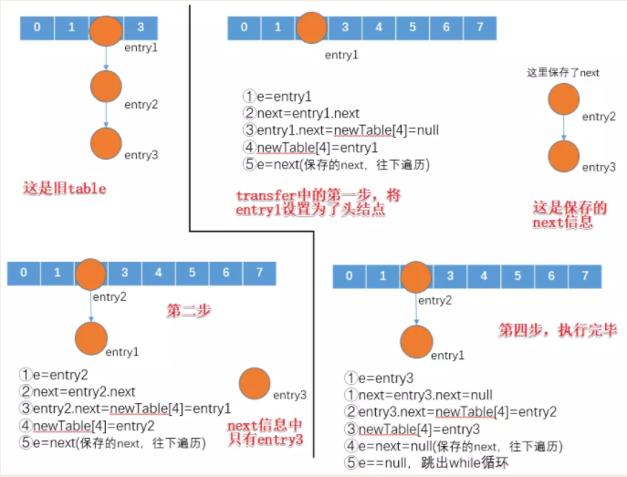

#### (3)resize扩容方法总结

1.  创建一个新的数组（长度为原长度为2倍，如果已经超过最大值就设置为最大值）
2. 调用transfer方法将entry从旧的table中移动到新的数组中，具体细节如上所示
3. 将table指向新的table，更新阈值

### HashMap的get方法分析

```java
//get方法，其中调用的是getEntry方法没如果不为null就返回对应entry的value
public V get(Object key) {
    if (key == null)
        return getForNullKey();
    Entry<K,V> entry = getEntry(key);
    return null == entry ? null : entry.getValue();
}
```

 可以看到，get方法中是调用getEntry查询到Entry对象，然后返回Entry的value的。所以下面看看getEntry方法的实现

#### getEntry方法

```java
//这是getEntry的实现
final Entry<K,V> getEntry(Object key) {
    //没有元素自然返回null
    if (size == 0) {
        return null;
    }
	//通过传入的key值调用hash方法计算哈希值
    int hash = (key == null) ? 0 : hash(key);
    //计算好索引之后，从对应的链表中遍历查找Entry
    for (Entry<K,V> e = table[indexFor(hash, table.length)];
         e != null;
         e = e.next) {
        Object k;
        //hash相同，key相同就返回
        if (e.hash == hash &&
            ((k = e.key) == key || (key != null && key.equals(k))))
            return e;
    }
    return null;
}
```

#### getForNullKey方法

```java
//这个方法是直接查找key为null的
private V getForNullKey() {
    if (size == 0) {
        return null;
    }
    //直接从table中下标为0的位置处的链表（只有一个key为null的）开始查找
    for (Entry<K,V> e = table[0]; e != null; e = e.next) {
        //key为null，直接返回对应的value
        if (e.key == null)
            return e.value;
    }
    return null;
}
```

### jdk7版本的实现简单总结

 (1)因为其put操作对key为null场景使用putForNullKey方法做了单独处理，HashMap允许null作为Key

 (2)在计算table的下标的时候，是根据key的hashcode值调用hash()方法之后获取hash值与数组length-1进行&运算，length-1的二进制位全为1，这是为了能够均匀分布，避免冲突（长度要求为2的整数幂次方）
 (3)不管是get还是put以及resize，执行过程中都会对key的hashcode进行hash计算，而可变对象其hashcode很容易变化，所以HashMap建议用不可变对象(如String类型)作为Key.
 (4)HashMap是线程不安全的，在多线程环境下扩容时候可能会导致环形链表死循环，所以若需要多线程场景下操作可以使用ConcurrentHashMap（下面我们通过图示简单演示一下这个情况）
 (5)当发生冲突时，HashMap采用链地址法处理冲突
 (6)HashMap初始容量定为16，简单认为是8的话扩容阈值为6，阈值太小导致扩容频繁;而32的话可能空间利用率低。

### jdk7中并发情况下的环形链表问题

 上面在说到resize方法的时候，我们也通过图示实例讲解了一个resize的过程，所以这里我们就不再演示单线程下面的执行流程了。我们首先记住resize方法中的几行核心代码

```java
Entry<K,V> next = e.next;
//省略重新计算hash和index的两个过程...
e.next = newTable[i]; 
newTable[i] = e;
e = next;
```

 resize方法中调用的transfer方法的主要几行代码就是上面的这四行，下来简单模拟一下假设两个线程thread1和thread2执行了resize的过程.

 (1)resize之前，假设table长度为2,假设现在再添加一个entry4，就需要扩容了

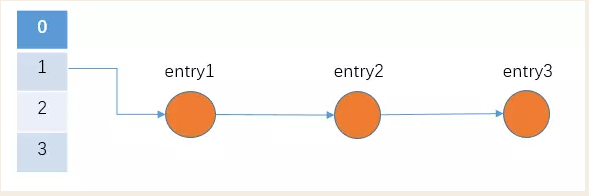

 (2)假设现在thread1执行到了 **Entry<K,V> next = e.next;**这行代码处，那么根据上面几行代码，我们简单做个注释

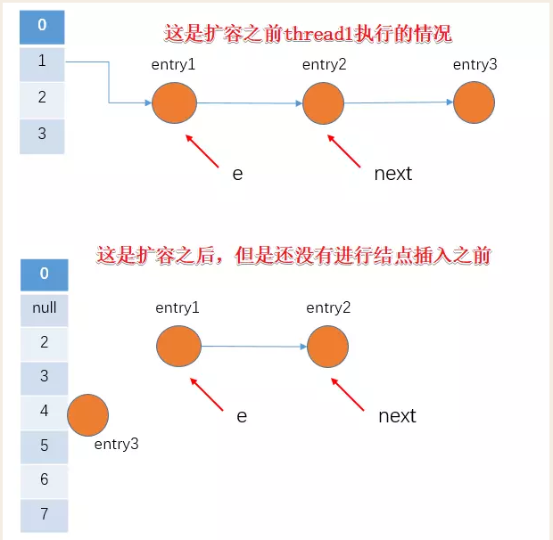

 (3)然后由于线程调度轮到thread2执行，假设thread2执行完transfer方法（假设entry3和entry4在扩容后到了如下图所示的位置，这里我们主要关注entry1和entry2两个结点），那么得到的结果为

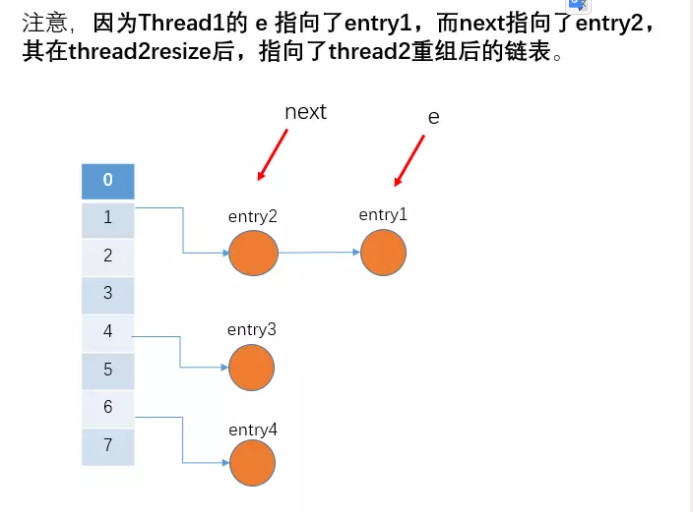

(4)此时thread1被调度继续执行，将entry1插入到新数组中去，然后e为Entry2，轮到下次循环时next由于Thread2的操作变为了Entry1

- **先是执行 newTalbe[i] = e;**在thread1执行时候，e指向的是entry1
- **然后是e = next，导致了e指向了entry2**（next指向的是entry2）
- **而下一次循环的next = e.next，（即next=entry2.next=entry1这是thread2执行的结果）导致了next指向了entry1**

如下图所示

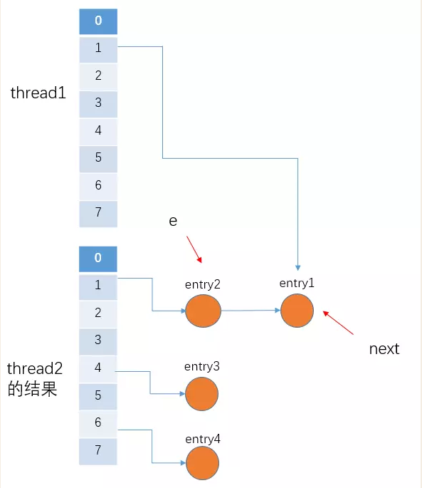

 (5)thread1继续执行，将entry2拿下来，放在newTable[1]这个桶的第一个位置，然后移动e和next

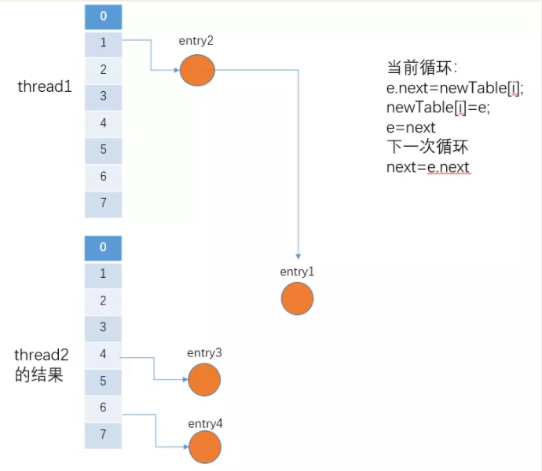

（6）**e.next = newTable[1] 导致 entry1.next 指向了 entry2**,也要注意，**此时的entry2.next 已经指向了entry1(thread2执行的结果就是entry2->entry1,看上面的thread2执行完的示意图)， 环形链表就这样出现了。**

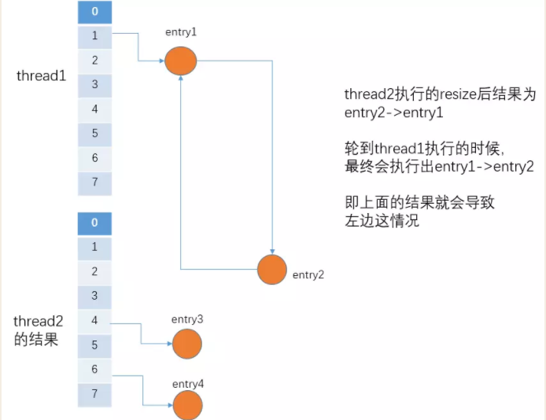

## HashMap1.8源代码阅读

### 哈希表

　　Hash表也称为散列表，也有直接译作哈希表，Hash表是一种根据关键字值（key - value）而直接进行访问的数据结构。也就是说它通过把关键码值映射到表中的一个位置来访问记录，以此来加快查找的速度。在链表、数组等数据结构中，查找某个关键字，通常要遍历整个数据结构，也就是O(N)的时间级，但是对于哈希表来说，只是O(1)的时间级。

　如果我们要查找这两个集合中的某个元素，通常是通过遍历整个集合，需要**O(N)**的时间级。

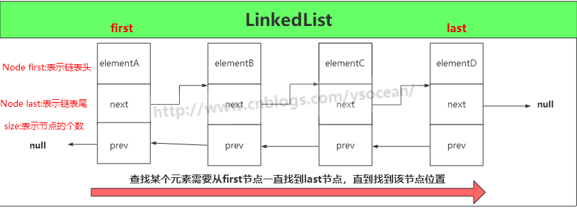

如果是哈希表，它是通过把关键码值映射到表中一个位置来访问记录，以加快查找的速度。这个映射函数叫做**散列函数**，存放记录的数组叫做**散列表，**只需要**O(1)**的时间级。

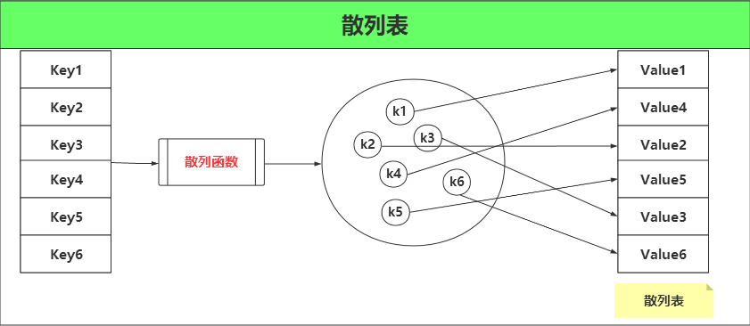

①、存放在哈希表中的数据是key-value 键值对，比如存放哈希表的数据为:

　　**{Key1-Value1,Key2-Value2,Key3-Value3,Key4-Value4,Key5-Value5,Key6-Value6}**

　　如果我们想查找是否存在键值对 Key3-Value3，首先通过 Key3 经过散列函数，得到值 k3，然后通过 k3 和散列表对应的值找到是 Value3。

②、当然也有可能存放哈希表的值只是 Value1,Value2,Value3这种类型：

　　**{Value1,Value2,Value3,Value4,Value5,Value6}**

　　这时候我们可以假设 Value1 是等于 Key1的，也就是{Value1-Value1,Value2-Value2,Value3-Value3,Value4-Value4,Value5-Value5,Value6-Value6}可以将 Value1经过散列函数转换成与散列表对应的值。

```
大家都用过汉语字典吧，汉语字典的优点是我们可以通过前面的拼音目录快速定位到所要查找的汉字。当给定我们某个汉字时，大脑会自动将汉字转换成拼音（如果我们认识，不认识可以通过偏旁部首），这个转换的过程我们可以看成是一个散列函数，之后在根据转换得到的拼音找到该字所在的页码，从而找到该汉字。
```

汉语字典是哈希表的典型实现，但是我们仔细思考，会发现这样几个问题？

　　**①、为什么要有散列函数？**

　　**②、多个 key 通过散列函数会得到相同的值，这时候怎么办？**

　　对于第一个问题，散列函数的存在能够帮助我们更快的确定key和value的映射关系，试想一下，如果没有汉字和拼音的转换规则（或者汉字和偏旁部首的），给你一个汉字，你该如何从字典中找到该汉字？我想除了遍历整部字典，你没有什么更好的办法。

　　对于第二个问题，多个 key 通过散列函数得到相同的值，这其实也是哈希表最大的问题——**冲突**。比如同音字汉字，我们得到的拼音就会是相同的，那么我们该如何在字典中存放同音字汉字呢？有两种做法：

　　第一种是**开放地址法**，当我们遇到冲突了，这时候通过另一种函数再计算一遍，得到相应的映射关系。比如对于汉语字典，一个字 “余”，拼音是“yu”，我们将其放在页码为567(假设在该位置)，这时候又来了一个汉字“于”，拼音也是“yu”，那么这时候我们要是按照转换规则，也得将其放在页码为567的位置，但是我们发现这个页码已经被占用了，这时候怎么办？我们可以在通过另一种函数，得到的值加1。那么汉字"于"就会被放在576+1=577的位置。

　　第二种是**链地址法**，我们可以将字典的每一页都看成是一个子数组或者子链表，当遇到冲突了，直接往当前页码的子数组或者子链表里面填充即可。那么我们进行同音字查找的时候，可能需要遍历其子数组或者子链表。如下图所示：

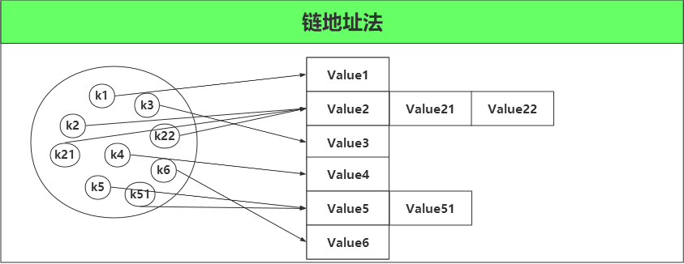

对于开放地址法，可能会遇到二次冲突，三次冲突，所以需要良好的散列函数，分布的越均匀越好。对于链地址法，虽然不会造成二次冲突，但是如果一次冲突很多，那么会造成子数组或者子链表很长，那么我们查找所需遍历的时间也会很长。

### JDK8中HashMap底层结构

　听名字就知道，HashMap 是一个利用哈希表原理来存储元素的集合。遇到冲突时，HashMap 是采用的链地址法来解决，在 JDK1.7 中，HashMap 是由 数组+链表构成的。但是在 JDK1.8 中，HashMap 是由 数组+链表+红黑树构成，新增了红黑树作为底层数据结构，结构变得复杂了，但是效率也变的更高效。下面我们来具体介绍在 JDK1.8 中 HashMap 是如何实现的。

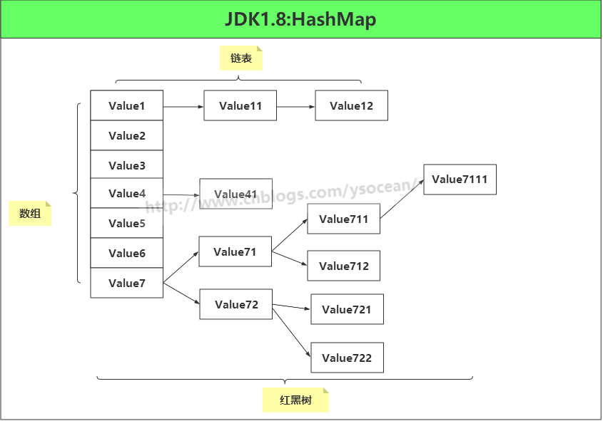

### HashMap的定义

HashMap 是一个散列表，它存储的内容是键值对(key-value)映射，而且 key 和 value 都可以为 null。

```java
public class HashMap<K,V> extends AbstractMap<K,V>
     implements Map<K,V>, Cloneable, Serializable {
```

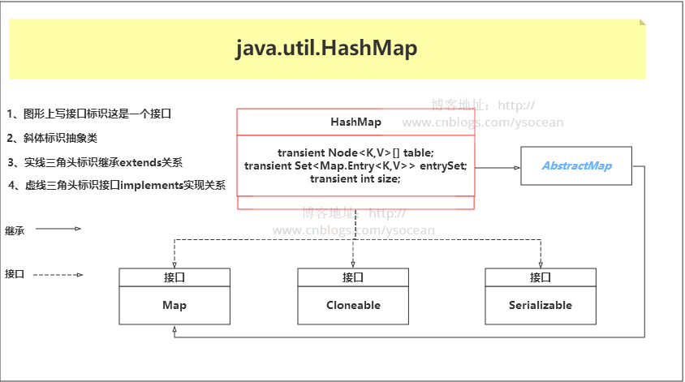

　首先该类实现了一个 Map 接口，该接口定义了一组键值对映射通用的操作。储存一组成对的键-值对象，提供key（键）到value（值）的映射，Map中的key不要求有序，不允许重复。value同样不要求有序，但可以重复。但是我们发现该接口方法有很多，我们设计某个键值对的集合有时候并不像实现那么多方法，那该怎么办？

　　JDK 还为我们提供了一个抽象类 AbstractMap ，该抽象类继承 Map 接口，所以如果我们不想实现所有的 Map 接口方法，就可以选择继承抽象类 AbstractMap 。

　　**但是我们发现 HashMap 类即继承了 AbstractMap 接口，也实现了 Map 接口，这样做难道不是多此一举？后面我们会讲的 LinkedHashSet 集合也有这样的写法。**

　　毕竟 JDK 经过这么多年的发展维护，博主起初也是认为这样是有具体的作用的，后来找了很多资料，发现这其实完全没有任何作用，[具体出处](https://stackoverflow.com/questions/2165204/why-does-linkedhashsete-extend-hashsete-and-implement-sete)。

```java
据 java 集合框架的创始人Josh Bloch描述，这样的写法是一个失误。在java集合框架中，类似这样的写法很多，最开始写java集合框架的时候，他认为这样写，在某些地方可能是有价值的，直到他意识到错了。显然的，JDK的维护者，后来不认为这个小小的失误值得去修改，所以就这样存在下来了。
```

HashMap 集合还实现了 Cloneable 接口以及 Serializable 接口，分别用来进行对象克隆以及将对象进行序列化。

### 字段属性

```java
//序列化和反序列化时，通过该字段进行版本一致性验证
    private static final long serialVersionUID = 362498820763181265L;
    //默认 HashMap 集合初始容量为16（必须是 2 的倍数）
    static final int DEFAULT_INITIAL_CAPACITY = 1 << 4; // aka 16
    //集合的最大容量，如果通过带参构造指定的最大容量超过此数，默认还是使用此数
    static final int MAXIMUM_CAPACITY = 1 << 30;
    //默认的填充因子
    static final float DEFAULT_LOAD_FACTOR = 0.75f;
    //当桶(bucket)上的结点数大于这个值时会转成红黑树(JDK1.8新增)
    static final int TREEIFY_THRESHOLD = 8;
    //当桶(bucket)上的节点数小于这个值时会转成链表(JDK1.8新增)
    static final int UNTREEIFY_THRESHOLD = 6;
    /**(JDK1.8新增)
     * 当集合中的容量大于这个值时，表中的桶才能进行树形化 ，否则桶内元素太多时会扩容，
     * 而不是树形化 为了避免进行扩容、树形化选择的冲突，这个值不能小于 4 * TREEIFY_THRESHOLD
     */
    static final int MIN_TREEIFY_CAPACITY = 64;
```

**注意：后面三个字段是 JDK1.8 新增的，主要是用来进行红黑树和链表的互相转换。**

```java
/**
     * 初始化使用，长度总是 2的幂
     */
    transient Node<K,V>[] table;

    /**
     * 保存缓存的entrySet（）
     */
    transient Set<Map.Entry<K,V>> entrySet;

    /**
     * 此映射中包含的键值映射的数量。（集合存储键值对的数量）
     */
    transient int size;

    /**
     * 跟前面ArrayList和LinkedList集合中的字段modCount一样，记录集合被修改的次数
     * 主要用于迭代器中的快速失败
     */
    transient int modCount;

    /**
     * 调整大小的下一个大小值（容量*加载因子）。capacity * load factor
     */
    int threshold;

    /**
     * 散列表的加载因子。
     */
    final float loadFactor;
```

下面我们重点介绍上面几个字段：

　　**①、Node<K,V>[] table**

　　我们说 HashMap 是由数组+链表+红黑树组成，这里的数组就是 table 字段。后面对其进行初始化长度默认是 DEFAULT_INITIAL_CAPACITY= 16。而且 JDK 声明数组的长度总是 2的n次方(一定是合数)，为什么这里要求是合数，一般我们知道哈希算法为了避免冲突都要求长度是质数，这里要求是合数，下面在介绍 HashMap 的hashCode() 方法(散列函数)，我们再进行讲解。

　　②**、size**

　　集合中存放key-value 的实时对数。

　　**③、loadFactor**

　　装载因子，是用来衡量 HashMap 满的程度，计算HashMap的实时装载因子的方法为：size/capacity，而不是占用桶的数量去除以capacity。capacity 是桶的数量，也就是 table 的长度length。

　　默认的负载因子0.75 是对空间和时间效率的一个平衡选择，建议大家不要修改，除非在时间和空间比较特殊的情况下，如果内存空间很多而又对时间效率要求很高，可以降低负载因子loadFactor 的值；相反，如果内存空间紧张而对时间效率要求不高，可以增加负载因子 loadFactor 的值，这个值可以大于1。

　　**④、threshold**

　　计算公式：capacity * loadFactor。这个值是当前已占用数组长度的最大值。过这个数目就重新resize(扩容)，扩容后的 HashMap 容量是之前容量的两倍

### 构造函数

#### 默认构造函数

无参构造器，初始化散列表的加载因子为0.75

```java
/**
     * 默认构造函数，初始化加载因子loadFactor = 0.75
     */
    public HashMap() {
        this.loadFactor = DEFAULT_LOAD_FACTOR; 
    }
```

#### 指定初始容量的构造函数

```java
/**
     *
     * @param initialCapacity 指定初始化容量
     * @param loadFactor 加载因子 0.75
     */
    public HashMap(int initialCapacity, float loadFactor) {
        //初始化容量不能小于 0 ，否则抛出异常
        if (initialCapacity < 0)
            throw new IllegalArgumentException("Illegal initial capacity: " +
                                               initialCapacity);
        //如果初始化容量大于2的30次方，则初始化容量都为2的30次方
        if (initialCapacity > MAXIMUM_CAPACITY)
            initialCapacity = MAXIMUM_CAPACITY;
        //如果加载因子小于0，或者加载因子是一个非数值，抛出异常
        if (loadFactor <= 0 || Float.isNaN(loadFactor))
            throw new IllegalArgumentException("Illegal load factor: " +
                                               loadFactor);
        this.loadFactor = loadFactor;
        this.threshold = tableSizeFor(initialCapacity);
    }
    // 返回大于等于initialCapacity的最小的二次幂数值。
    // >>> 操作符表示无符号右移，高位取0。
    // | 按位或运算
    static final int tableSizeFor(int cap) {
        int n = cap - 1;
        n |= n >>> 1;
        n |= n >>> 2;
        n |= n >>> 4;
        n |= n >>> 8;
        n |= n >>> 16;
        return (n < 0) ? 1 : (n >= MAXIMUM_CAPACITY) ? MAXIMUM_CAPACITY : n + 1;
    }
```

#### 确定哈希桶数组索引位置

　前面我们讲解哈希表的时候，我们知道是用散列函数来确定索引的位置。散列函数设计的越好，使得元素分布的越均匀。HashMap 是数组+链表+红黑树的组合，我们希望在有限个数组位置时，尽量每个位置的元素只有一个，那么当我们用散列函数求得索引位置的时候，我们能马上知道对应位置的元素是不是我们想要的，而不是要进行链表的遍历或者红黑树的遍历，这会大大优化我们的查询效率。我们看 HashMap 中的哈希算法：

```java
static final int hash(Object key) {
        int h;
        return (key == null) ? 0 : (h = key.hashCode()) ^ (h >>> 16);
    }
    
    i = (table.length - 1) & hash;//这一步是在后面添加元素putVal()方法中进行位置的确定
```

　主要分为三步：

　　①、取 hashCode 值： key.hashCode()

　　②、高位参与运算：h>>>16

　　③、取模运算：(n-1) & hash

　　这里获取 hashCode() 方法的值是变量，但是我们知道，对于任意给定的对象，只要它的 hashCode() 返回值相同，那么程序调用 hash(Object key) 所计算得到的 hash码 值总是相同的。

　　为了让数组元素分布均匀，我们首先想到的是把获得的 hash码对数组长度取模运算( hash%length)，但是计算机都是二进制进行操作，取模运算相对开销还是很大的，那该如何优化呢？

　　HashMap 使用的方法很巧妙，它通过 hash & (table.length -1)来得到该对象的保存位，前面说过 HashMap 底层数组的长度总是2的n次方，这是HashMap在速度上的优化。当 length 总是2的n次方时，hash & (length-1)运算等价于对 length 取模，也就是 hash%length，但是&比%具有更高的效率。比如 n % 32 = n & (32 -1)

　　**这也解释了为什么要保证数组的长度总是2的n次方。**

　　再就是在 JDK1.8 中还有个高位参与运算，hashCode() 得到的是一个32位 int 类型的值，通过hashCode()的高16位 **异或** 低16位实现的：(h = k.hashCode()) ^ (h >>> 16)，主要是从速度、功效、质量来考虑的，这么做可以在数组table的length比较小的时候，也能保证考虑到高低Bit都参与到Hash的计算中，同时不会有太大的开销。

　　下面举例说明下，n为table的长度：

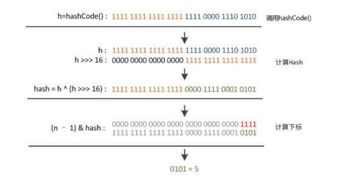

### 添加元素

```java
//hash(key)就是上面讲的hash方法，对其进行了第一步和第二步处理
    public V put(K key, V value) {
        return putVal(hash(key), key, value, false, true);
    }
    /**
     *
     * @param hash 索引的位置
     * @param key  键
     * @param value  值
     * @param onlyIfAbsent true 表示不要更改现有值
     * @param evict false表示table处于创建模式
     * @return
     */
    final V putVal(int hash, K key, V value, boolean onlyIfAbsent,
            boolean evict) {
         Node<K,V>[] tab; Node<K,V> p; int n, i;
         //如果table为null或者长度为0，则进行初始化
         //resize()方法本来是用于扩容，由于初始化没有实际分配空间，这里用该方法进行空间分配，后面会详细讲解该方法
         if ((tab = table) == null || (n = tab.length) == 0)
             n = (tab = resize()).length;
         //注意：这里用到了前面讲解获得key的hash码的第三步，取模运算，下面的if-else分别是 tab[i] 为null和不为null
         if ((p = tab[i = (n - 1) & hash]) == null)
             tab[i] = newNode(hash, key, value, null);//tab[i] 为null，直接将新的key-value插入到计算的索引i位置
         else {//tab[i] 不为null，表示该位置已经有值了
             Node<K,V> e; K k;
             if (p.hash == hash &&
                 ((k = p.key) == key || (key != null && key.equals(k))))
                 e = p;//节点key已经有值了，直接用新值覆盖
             //该链是红黑树
             else if (p instanceof TreeNode)
                 e = ((TreeNode<K,V>)p).putTreeVal(this, tab, hash, key, value);
             //该链是链表
             else {
                 for (int binCount = 0; ; ++binCount) {
                     if ((e = p.next) == null) {
                         p.next = newNode(hash, key, value, null);
                         //链表长度大于8，转换成红黑树
                         if (binCount >= TREEIFY_THRESHOLD - 1) // -1 for 1st
                             treeifyBin(tab, hash);
                         break;
                     }
                     //key已经存在直接覆盖value
                     if (e.hash == hash &&
                         ((k = e.key) == key || (key != null && key.equals(k))))
                         break;
                     p = e;
                 }
             }
             if (e != null) { // existing mapping for key
                 V oldValue = e.value;
                 if (!onlyIfAbsent || oldValue == null)
                     e.value = value;
                 afterNodeAccess(e);
                 return oldValue;
             }
         }
         ++modCount;//用作修改和新增快速失败
         if (++size > threshold)//超过最大容量，进行扩容
             resize();
         afterNodeInsertion(evict);
         return null;
    }
```

　   ①、判断键值对数组 table 是否为空或为null，否则执行resize()进行扩容；

　　②、根据键值key计算hash值得到插入的数组索引i，如果table[i]==null，直接新建节点添加，转向⑥，如果table[i]不为空，转向③；

　　③、判断table[i]的首个元素是否和key一样，如果相同直接覆盖value，否则转向④，这里的相同指的是hashCode以及equals；

　　④、判断table[i] 是否为treeNode，即table[i] 是否是红黑树，如果是红黑树，则直接在树中插入键值对，否则转向⑤；

　　⑤、遍历table[i]，判断链表长度是否大于8，大于8的话把链表转换为红黑树，在红黑树中执行插入操作，否则进行链表的插入操作；遍历过程中若发现key已经存在直接覆盖value即可；

　　⑥、插入成功后，判断实际存在的键值对数量size是否超过了最大容量threshold，如果超过，进行扩容。

　　⑦、如果新插入的key不存在，则返回null，如果新插入的key存在，则返回原key对应的value值（注意新插入的value会覆盖原value值）

**注意1：看第 58,59 行代码：**

```java
if (++size > threshold)//超过最大容量，进行扩容
    resize();
```

　这里有个考点，我们知道 HashMap 是由数组+链表+红黑树（JDK1.8）组成，如果在添加元素时，发生冲突，会将冲突的数放在链表上，当链表长度超过8时，会自动转换成红黑树。

　　那么有如下问题：**数组上有5个元素，而某个链表上有3个元素，问此HashMap的 size 是多大？**

　　我们分析第58,59 行代码，很容易知道，**只要是调用put() 方法添加元素，那么就会调用 ++size(这里有个例外是插入重复key的键值对，不会调用，但是重复key元素不会影响size),所以，上面的答案是 7。**

　　**注意2：看第 53 、 60 行代码：**

```java
 afterNodeAccess(e);
 afterNodeInsertion(evict);
```

　　这里调用的该方法，其实是调用了如下实现方法：

```java
void afterNodeAccess(Node<K,V> p) { }
void afterNodeInsertion(boolean evict) { }
```

　　这都是一个空的方法实现，我们在这里可以不用管，但是在后面介绍 LinkedHashMap 会用到，LinkedHashMap 是继承的 HashMap，并且重写了该方法，后面我们会详细介绍。

### 扩容机制

扩容（resize），我们知道集合是由数组+链表+红黑树构成，向 HashMap 中插入元素时，如果HashMap 集合的元素已经大于了最大承载容量threshold（capacity * loadFactor），这里的threshold不是数组的最大长度。那么必须扩大数组的长度，Java中数组是无法自动扩容的，我们采用的方法是用一个更大的数组代替这个小的数组，就好比以前是用小桶装水，现在小桶装不下了，我们使用一个更大的桶。

　　JDK1.8融入了红黑树的机制，比较复杂，这里我们先介绍 JDK1.7的扩容源码，便于理解，然后在介绍JDK1.8的源码。

```java
//参数 newCapacity 为新数组的大小
    void resize(int newCapacity) {
        Entry[] oldTable = table;//引用扩容前的 Entry 数组
        int oldCapacity = oldTable.length;
        if (oldCapacity == MAXIMUM_CAPACITY) {//扩容前的数组大小如果已经达到最大(2^30)了
            threshold = Integer.MAX_VALUE;///修改阈值为int的最大值(2^31-1)，这样以后就不会扩容了
            return;
        }

        Entry[] newTable = new Entry[newCapacity];//初始化一个新的Entry数组
        transfer(newTable, initHashSeedAsNeeded(newCapacity));//将数组元素转移到新数组里面
        table = newTable;
        threshold = (int)Math.min(newCapacity * loadFactor, MAXIMUM_CAPACITY + 1);//修改阈值
    }
    void transfer(Entry[] newTable, boolean rehash) {
        int newCapacity = newTable.length;
        for (Entry<K,V> e : table) {//遍历数组
            while(null != e) {
                Entry<K,V> next = e.next;
                if (rehash) {
                    e.hash = null == e.key ? 0 : hash(e.key);
                }
                int i = indexFor(e.hash, newCapacity);//重新计算每个元素在数组中的索引位置
                e.next = newTable[i];//标记下一个元素，添加是链表头添加
                newTable[i] = e;//将元素放在链上
                e = next;//访问下一个 Entry 链上的元素
            }
        }
    }
```

　通过方法我们可以看到，JDK1.7中首先是创建一个新的大容量数组，然后依次重新计算原集合所有元素的索引，然后重新赋值。如果数组某个位置发生了hash冲突，使用的是单链表的头插入方法，同一位置的新元素总是放在链表的头部，这样与原集合链表对比，扩容之后的可能就是倒序的链表了。

下面我们在看看JDK1.8的。

```java
final Node<K,V>[] resize() {
        Node<K,V>[] oldTab = table;
        int oldCap = (oldTab == null) ? 0 : oldTab.length;//原数组如果为null，则长度赋值0
        int oldThr = threshold;
        int newCap, newThr = 0;
        if (oldCap > 0) {//如果原数组长度大于0
            if (oldCap >= MAXIMUM_CAPACITY) {//数组大小如果已经大于等于最大值(2^30)
                threshold = Integer.MAX_VALUE;//修改阈值为int的最大值(2^31-1)，这样以后就不会扩容了
                return oldTab;
            }
            //原数组长度大于等于初始化长度16，并且原数组长度扩大1倍也小于2^30次方
            else if ((newCap = oldCap << 1) < MAXIMUM_CAPACITY &&
                     oldCap >= DEFAULT_INITIAL_CAPACITY)
                newThr = oldThr << 1; // 阀值扩大1倍
        }
        else if (oldThr > 0) //旧阀值大于0，则将新容量直接等于就阀值
            newCap = oldThr;
        else {//阀值等于0，oldCap也等于0（集合未进行初始化）
            newCap = DEFAULT_INITIAL_CAPACITY;//数组长度初始化为16
            newThr = (int)(DEFAULT_LOAD_FACTOR * DEFAULT_INITIAL_CAPACITY);//阀值等于16*0.75=12
        }
        //计算新的阀值上限
        if (newThr == 0) {
            float ft = (float)newCap * loadFactor;
            newThr = (newCap < MAXIMUM_CAPACITY && ft < (float)MAXIMUM_CAPACITY ?
                      (int)ft : Integer.MAX_VALUE);
        }
        threshold = newThr;
        @SuppressWarnings({"rawtypes","unchecked"})
            Node<K,V>[] newTab = (Node<K,V>[])new Node[newCap];
        table = newTab;
        if (oldTab != null) {
            //把每个bucket都移动到新的buckets中
            for (int j = 0; j < oldCap; ++j) {
                Node<K,V> e;
                if ((e = oldTab[j]) != null) {
                    oldTab[j] = null;//元数据j位置置为null，便于垃圾回收
                    if (e.next == null)//数组没有下一个引用（不是链表）
                        newTab[e.hash & (newCap - 1)] = e;
                    else if (e instanceof TreeNode)//红黑树
                        ((TreeNode<K,V>)e).split(this, newTab, j, oldCap);
                    else { // preserve order
                        Node<K,V> loHead = null, loTail = null;
                        Node<K,V> hiHead = null, hiTail = null;
                        Node<K,V> next;
                        do {
                            next = e.next;
                            //原索引
                            if ((e.hash & oldCap) == 0) {
                                if (loTail == null)
                                    loHead = e;
                                else
                                    loTail.next = e;
                                loTail = e;
                            }
                            //原索引+oldCap
                            else {
                                if (hiTail == null)
                                    hiHead = e;
                                else
                                    hiTail.next = e;
                                hiTail = e;
                            }
                        } while ((e = next) != null);
                        //原索引放到bucket里
                        if (loTail != null) {
                            loTail.next = null;
                            newTab[j] = loHead;
                        }
                        //原索引+oldCap放到bucket里
                        if (hiTail != null) {
                            hiTail.next = null;
                            newTab[j + oldCap] = hiHead;
                        }
                    }
                }
            }
        }
        return newTab;
    }
```

该方法分为两部分，首先是计算新桶数组的容量 newCap 和新阈值 newThr，然后将原集合的元素重新映射到新集合中。

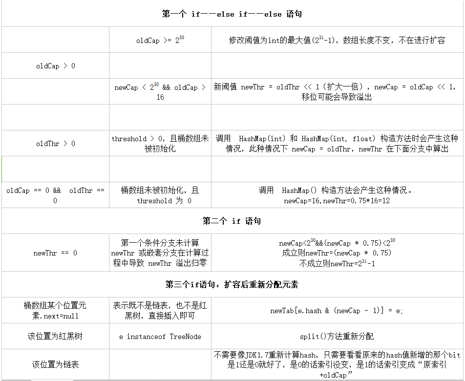

相比于JDK1.7，1.8使用的是2次幂的扩展(指长度扩为原来2倍)，所以，元素的位置要么是在原位置，要么是在原位置再移动2次幂的位置。我们在扩充HashMap的时候，不需要像JDK1.7的实现那样重新计算hash，只需要看看原来的hash值新增的那个bit是1还是0就好了，是0的话索引没变，是1的话索引变成“原索引+oldCap”。

### 删除元素

　HashMap 删除元素首先是要找到 桶的位置，然后如果是链表，则进行链表遍历，找到需要删除的元素后，进行删除；如果是红黑树，也是进行树的遍历，找到元素删除后，进行平衡调节，注意，当红黑树的节点数小于 6 时，会转化成链表。

```java
public V remove(Object key) {
        Node<K,V> e;
        return (e = removeNode(hash(key), key, null, false, true)) == null ?
            null : e.value;
    }

    final Node<K,V> removeNode(int hash, Object key, Object value,
            boolean matchValue, boolean movable) {
        Node<K,V>[] tab; Node<K,V> p; int n, index;
        //(n - 1) & hash找到桶的位置
        if ((tab = table) != null && (n = tab.length) > 0 &&
        (p = tab[index = (n - 1) & hash]) != null) {
        Node<K,V> node = null, e; K k; V v;
        //如果键的值与链表第一个节点相等，则将 node 指向该节点
        if (p.hash == hash &&
        ((k = p.key) == key || (key != null && key.equals(k))))
        node = p;
        //如果桶节点存在下一个节点
        else if ((e = p.next) != null) {
            //节点为红黑树
        if (p instanceof TreeNode)
         node = ((TreeNode<K,V>)p).getTreeNode(hash, key);//找到需要删除的红黑树节点
        else {
         do {//遍历链表，找到待删除的节点
             if (e.hash == hash &&
                 ((k = e.key) == key ||
                  (key != null && key.equals(k)))) {
                 node = e;
                 break;
             }
             p = e;
         } while ((e = e.next) != null);
        }
        }
        //删除节点，并进行调节红黑树平衡
        if (node != null && (!matchValue || (v = node.value) == value ||
                      (value != null && value.equals(v)))) {
        if (node instanceof TreeNode)
         ((TreeNode<K,V>)node).removeTreeNode(this, tab, movable);
        else if (node == p)
         tab[index] = node.next;
        else
         p.next = node.next;
        ++modCount;
        --size;
        afterNodeRemoval(node);
        return node;
        }
        }
        return null;
    }
```

　注意第 46 行代码

```java
afterNodeRemoval(node);
```

　　这也是为实现 LinkedHashMap 做准备的，在这里和上面一样，是一个空方法实现，可以不用管。而在 LinkedHashMap 中进行了重写，用来维护删除节点后，链表的前后关系。

### 查找元素

①、通过 key 查找 value

　　首先通过 key 找到计算索引，找到桶位置，先检查第一个节点，如果是则返回，如果不是，则遍历其后面的链表或者红黑树。其余情况全部返回 null。

```java
public V get(Object key) {
        Node<K,V> e;
        return (e = getNode(hash(key), key)) == null ? null : e.value;
    }

    final Node<K,V> getNode(int hash, Object key) {
        Node<K,V>[] tab; Node<K,V> first, e; int n; K k;
        if ((tab = table) != null && (n = tab.length) > 0 &&
            (first = tab[(n - 1) & hash]) != null) {
            //根据key计算的索引检查第一个索引
            if (first.hash == hash && // always check first node
                ((k = first.key) == key || (key != null && key.equals(k))))
                return first;
            //不是第一个节点
            if ((e = first.next) != null) {
                if (first instanceof TreeNode)//遍历树查找元素
                    return ((TreeNode<K,V>)first).getTreeNode(hash, key);
                do {
                    //遍历链表查找元素
                    if (e.hash == hash &&
                        ((k = e.key) == key || (key != null && key.equals(k))))
                        return e;
                } while ((e = e.next) != null);
            }
        }
        return null;
    }
```

②、判断是否存在给定的 key 或者 value

```java
public boolean containsKey(Object key) {
        return getNode(hash(key), key) != null;
    }
    public boolean containsValue(Object value) {
        Node<K,V>[] tab; V v;
        if ((tab = table) != null && size > 0) {
            //遍历桶
            for (int i = 0; i < tab.length; ++i) {
                //遍历桶中的每个节点元素
                for (Node<K,V> e = tab[i]; e != null; e = e.next) {
                    if ((v = e.value) == value ||
                        (value != null && value.equals(v)))
                        return true;
                }
            }
        }
        return false;
    }
```

### 遍历集合

　首先构造一个 HashMap 集合：

```java
 HashMap<String,Object> map = new HashMap<>();
 map.put("A","1");
 map.put("B","2");
 map.put("C","3");
```

　　①、分别获取 key 集合和 value 集合。

```java
//1、分别获取key和value的集合
for(String key : map.keySet()){
    System.out.println(key);
}
for(Object value : map.values()){
    System.out.println(value);
}
```

　　②、获取 key 集合，然后遍历key集合，根据key分别得到相应value

```java
 //2、获取key集合，然后遍历key，根据key得到 value
 Set<String> keySet = map.keySet();
 for(String str : keySet){
     System.out.println(str+"-"+map.get(str));
 }
```

　　③、得到 Entry 集合，然后遍历 Entry

```java
 //3、得到 Entry 集合，然后遍历 Entry
 Set<Map.Entry<String,Object>> entrySet = map.entrySet();
 for(Map.Entry<String,Object> entry : entrySet){
     System.out.println(entry.getKey()+"-"+entry.getValue());
 }
```

　　④、迭代

```java
 //4、迭代
 Iterator<Map.Entry<String,Object>> iterator = map.entrySet().iterator();
 while(iterator.hasNext()){
     Map.Entry<String,Object> mapEntry = iterator.next();
     System.out.println(mapEntry.getKey()+"-"+mapEntry.getValue());
 }
```

- 基本上使用第三种方法是性能最好的，
- 第一种遍历方法在我们只需要 key 集合或者只需要 value 集合时使用；
- 第二种方法效率很低，不推荐使用；
- 第四种方法效率也挺好，关键是在遍历的过程中我们可以对集合中的元素进行删除。

#### 总结

　①、基于JDK1.8的HashMap是由数组+链表+红黑树组成，当链表长度超过 8 时会自动转换成红黑树，当红黑树节点个数小于 6 时，又会转化成链表。相对于早期版本的 JDK HashMap 实现，新增了红黑树作为底层数据结构，在数据量较大且哈希碰撞较多时，能够极大的增加检索的效率。

　　②、允许 key 和 value 都为 null。key 重复会被覆盖，value 允许重复。

　　③、非线程安全

　　④、无序（遍历HashMap得到元素的顺序不是按照插入的顺序）


## 参考

1. 尚硅谷Java视频:https://www.bilibili.com/video/BV1Kb411W75N?from=search&seid=4033513390247100548
2. 如果天空不死博客:https://www.cnblogs.com/skywang12345/p/3310835.html
3. YSOcean博客:https://www.cnblogs.com/ysocean/p/8711071.html
4. 风沙迷了眼:https://www.cnblogs.com/fsmly/p/11278561.html

注意：本文大量使用他人博客内容，仅仅作为个人学习使用，向原作者致敬!

