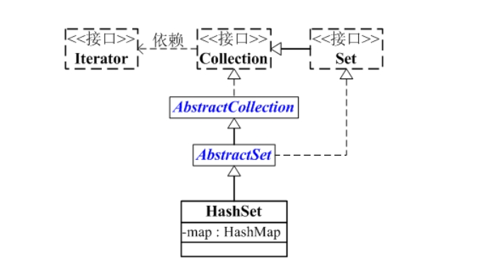
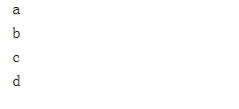

# HashSet剖析

## HashSet简介

- HashSet 是一个**没有重复元素的集合**。
- 它是由HashMap实现的，**不保证元素的顺序**，而且**HashSet允许使用 null 元素**。
- HashSet是**非同步的**。如果多个线程同时访问一个哈希 set，而其中至少一个线程修改了该 set，那么它必须 保持外部同步。这通常是通过对自然封装该 set 的对象执行同步操作来完成的。如果不存在这样的对象，则应该使用 Collections.synchronizedSet 方法来“包装” set。最好在创建时完成这一操作，以防止对该 set 进行意外的不同步访问：

```java
Set s = Collections.synchronizedSet(new HashSet(...));
```

HashSet通过iterator()返回的**迭代器是fail-fast的。**

 

### HashSet的构造函数

```java
// 默认构造函数
public HashSet() 

// 带集合的构造函数
public HashSet(Collection<? extends E> c) 

// 指定HashSet初始容量和加载因子的构造函数
public HashSet(int initialCapacity, float loadFactor) 

// 指定HashSet初始容量的构造函数
public HashSet(int initialCapacity) 

// 指定HashSet初始容量和加载因子的构造函数,dummy没有任何作用
HashSet(int initialCapacity, float loadFactor, boolean dummy)
```

## HashSet的主要API

```java
boolean         add(E object)
void            clear()
Object          clone()
boolean         contains(Object object)
boolean         isEmpty()
Iterator<E>     iterator()
boolean         remove(Object object)
int             size()
```

## HashSet的数据结构

HashSet的继承关系如下：



从图中可以看出：
(01) HashSet继承于AbstractSet，并且实现了Set接口。
(02) HashSet的本质是一个"没有重复元素"的集合，它是通过[HashMap](http://www.cnblogs.com/skywang12345/p/3310835.html)实现的。HashSet中含有一个"HashMap类型的成员变量"map，HashSet的操作函数，实际上都是通过map实现的。

## HashSet源代码

```java
package java.util;

public class HashSet<E>
    extends AbstractSet<E>
    implements Set<E>, Cloneable, java.io.Serializable
{
    static final long serialVersionUID = -5024744406713321676L;

    // HashSet是通过map(HashMap对象)保存内容的
    private transient HashMap<E,Object> map;

    // PRESENT是向map中插入key-value对应的value
    // 因为HashSet中只需要用到key，而HashMap是key-value键值对；
    // 所以，向map中添加键值对时，键值对的值固定是PRESENT
    private static final Object PRESENT = new Object();

    // 默认构造函数
    public HashSet() {
        // 调用HashMap的默认构造函数，创建map
        map = new HashMap<E,Object>();
    }

    // 带集合的构造函数
    public HashSet(Collection<? extends E> c) {
        // 创建map。
        // 为什么要调用Math.max((int) (c.size()/.75f) + 1, 16)，从 (c.size()/.75f) + 1 和 16 中选择一个比较大的树呢？
        // 首先，说明(c.size()/.75f) + 1
        //   因为从HashMap的效率(时间成本和空间成本)考虑，HashMap的加载因子是0.75。
        //   当HashMap的“阈值”(阈值=HashMap总的大小*加载因子) < “HashMap实际大小”时，
        //   就需要将HashMap的容量翻倍。
        //   所以，(c.size()/.75f) + 1 计算出来的正好是总的空间大小。
        // 接下来，说明为什么是 16 。
        //   HashMap的总的大小，必须是2的指数倍。若创建HashMap时，指定的大小不是2的指数倍；
        //   HashMap的构造函数中也会重新计算，找出比“指定大小”大的最小的2的指数倍的数。
        //   所以，这里指定为16是从性能考虑。避免重复计算。
        map = new HashMap<E,Object>(Math.max((int) (c.size()/.75f) + 1, 16));
        // 将集合(c)中的全部元素添加到HashSet中
        addAll(c);
    }

    // 指定HashSet初始容量和加载因子的构造函数
    public HashSet(int initialCapacity, float loadFactor) {
        map = new HashMap<E,Object>(initialCapacity, loadFactor);
    }

    // 指定HashSet初始容量的构造函数
    public HashSet(int initialCapacity) {
        map = new HashMap<E,Object>(initialCapacity);
    }

    HashSet(int initialCapacity, float loadFactor, boolean dummy) {
        map = new LinkedHashMap<E,Object>(initialCapacity, loadFactor);
    }

    // 返回HashSet的迭代器
    public Iterator<E> iterator() {
        // 实际上返回的是HashMap的“key集合的迭代器”
        return map.keySet().iterator();
    }

    public int size() {
        return map.size();
    }

    public boolean isEmpty() {
        return map.isEmpty();
    }

    public boolean contains(Object o) {
        return map.containsKey(o);
    }

    // 将元素(e)添加到HashSet中
    public boolean add(E e) {
        return map.put(e, PRESENT)==null;
    }

    // 删除HashSet中的元素(o)
    public boolean remove(Object o) {
        return map.remove(o)==PRESENT;
    }

    public void clear() {
        map.clear();
    }

    // 克隆一个HashSet，并返回Object对象
    public Object clone() {
        try {
            HashSet<E> newSet = (HashSet<E>) super.clone();
            newSet.map = (HashMap<E, Object>) map.clone();
            return newSet;
        } catch (CloneNotSupportedException e) {
            throw new InternalError();
        }
    }

    // java.io.Serializable的写入函数
    // 将HashSet的“总的容量，加载因子，实际容量，所有的元素”都写入到输出流中
    private void writeObject(java.io.ObjectOutputStream s)
        throws java.io.IOException {
        // Write out any hidden serialization magic
        s.defaultWriteObject();

        // Write out HashMap capacity and load factor
        s.writeInt(map.capacity());
        s.writeFloat(map.loadFactor());

        // Write out size
        s.writeInt(map.size());

        // Write out all elements in the proper order.
        for (Iterator i=map.keySet().iterator(); i.hasNext(); )
            s.writeObject(i.next());
    }


    // java.io.Serializable的读取函数
    // 将HashSet的“总的容量，加载因子，实际容量，所有的元素”依次读出
    private void readObject(java.io.ObjectInputStream s)
        throws java.io.IOException, ClassNotFoundException {
        // Read in any hidden serialization magic
        s.defaultReadObject();

        // Read in HashMap capacity and load factor and create backing HashMap
        int capacity = s.readInt();
        float loadFactor = s.readFloat();
        map = (((HashSet)this) instanceof LinkedHashSet ?
               new LinkedHashMap<E,Object>(capacity, loadFactor) :
               new HashMap<E,Object>(capacity, loadFactor));

        // Read in size
        int size = s.readInt();

        // Read in all elements in the proper order.
        for (int i=0; i<size; i++) {
            E e = (E) s.readObject();
            map.put(e, PRESENT);
        }
    }
}
```

**说明**： HashSet的代码实际上非常简单，通过上面的注释应该很能够看懂。它是通过HashMap实现的，若对HashSet的理解有困难，建议先学习以下HashMap；学完HashMap之后，在学习HashSet就非常容易了。

## HashSet的遍历方式

**通过Iterator遍历HashSet**

第一步：**根据iterator()获取HashSet的迭代器。**
第二步：**遍历迭代器获取各个元素**。

```java
package com.dreamcold.container;

import java.util.HashSet;
import java.util.Iterator;
import java.util.LinkedHashMap;
import java.util.Set;

public class Demo17 {
    public static void main(String[] args) {
        Set<String> set=new HashSet<>();
        set.add("a");
        set.add("b");
        set.add("c");
        set.add("a");
        set.add("d");
        for (Iterator<String> iterator=set.iterator();iterator.hasNext();){
            System.out.println(iterator.next());
        }
    }
}

```

结果



**通过for-each遍历HashSet**

第一步：**根据toArray()获取HashSet的元素集合对应的数组。**
第二步：**遍历数组，获取各个元素。**

```java
package com.dreamcold.container;

import java.util.HashSet;
import java.util.Set;

public class Demo18 {
    public static void main(String[] args) {
        Set<String> set=new HashSet<>();
        set.add("a");
        set.add("b");
        set.add("c");
        set.add("a");
        set.add("d");
        String[] arr=(String[])set.toArray(new String[0]);
        for(String ch:arr){
            System.out.println(ch);
        }
    }
}

```

结果：

```java
a
b
c
d
```

## 引用

1. 《Java编程的逻辑》：https://www.cnblogs.com/swiftma/p/5958979.html
2. 如果天空不死博客：https://www.cnblogs.com/skywang12345/p/3311252.html
3. 工匠初心博客：https://www.cnblogs.com/LiaHon/p/11257805.html
4. chenssy博客：https://www.cnblogs.com/chenssy/p/3621851.html