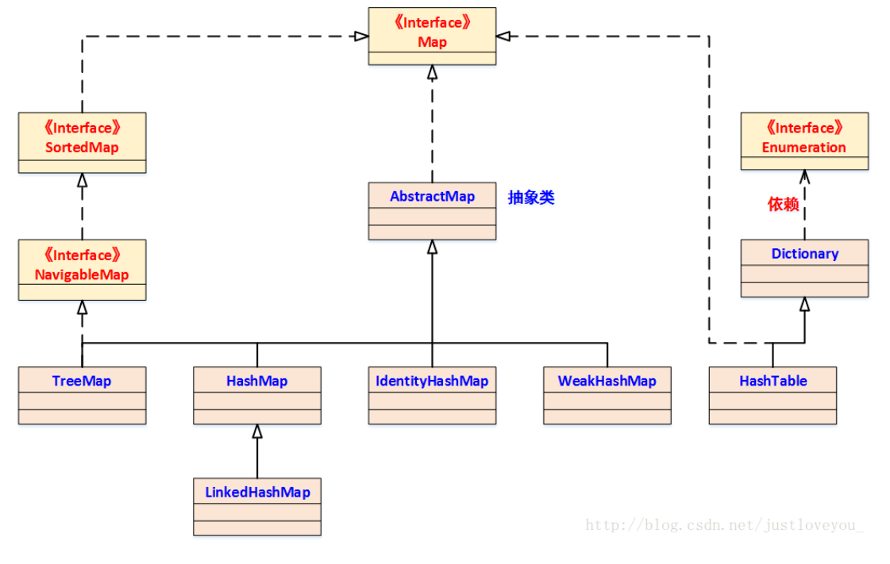
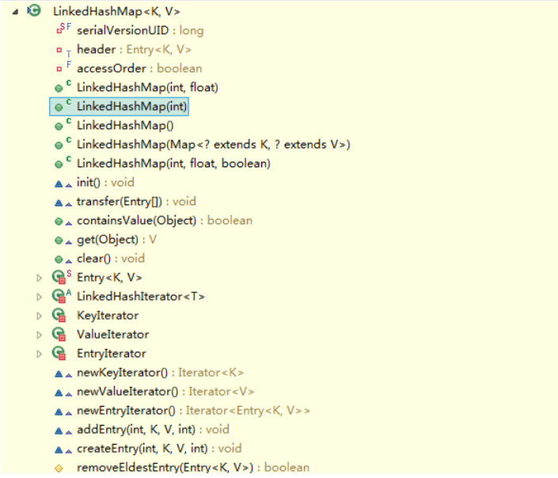

# LinkedHashMap

## LinkedHashMap简介



- HashMap是一种非常常见、非常有用的集合，但在多线程情况下使用不当会有线程安全问题。

- 大多数情况下，只要不涉及线程安全问题，Map基本都可以使用HashMap，不过HashMap有一个问题，就是**迭代HashMap的顺序并不是HashMap放置的顺序**，也就是无序。HashMap的这一缺点往往会带来困扰，因为有些场景，我们期待一个有序的Map。

- 这个时候，LinkedHashMap就闪亮登场了，它虽然增加了时间和空间上的开销，但是**通过维护一个运行于所有条目的双向链表，LinkedHashMap保证了元素迭代的顺序**。**该迭代顺序可以是插入顺序或者是访问顺序。**

## LinkedHashMap上的关注点

| **关  注  点**                | **结    论**                 |
| ----------------------------- | ---------------------------- |
| LinkedHashMap是否允许空       | Key和Value都允许空           |
| LinkedHashMap是否允许重复数据 | Key重复会覆盖、Value允许重复 |
| LinkedHashMap是否有序         | **有序**                     |
| LinkedHashMap是否线程安全     | 非线程安全                   |

关于LinkedHashMap，先提两点：

1、LinkedHashMap可以认为是**HashMap+LinkedList**，即它既使用HashMap操作数据结构，又使用LinkedList维护插入元素的先后顺序。

2、LinkedHashMap的基本实现思想就是----**多态**。可以说，理解多态，再去理解LinkedHashMap原理会事半功倍；反之也是，对于LinkedHashMap原理的学习，也可以促进和加深对于多态的理解。

为什么可以这么说，首先看一下，LinkedHashMap的定义： 

```java
public class LinkedHashMap<K,V>
    extends HashMap<K,V>
    implements Map<K,V>
{
    ...
}
```

看到，LinkedHashMap是HashMap的子类，自然LinkedHashMap也就继承了HashMap中所有非private的方法。再看一下LinkedHashMap中本身的方法：


看到LinkedHashMap中并没有什么操作数据结构的方法，也就是说LinkedHashMap操作数据结构（比如put一个数据），和HashMap操作数据的方法完全一样，无非就是细节上有一些的不同罢了。

## LinkedHashMap实现LRU

以下是使用 LinkedHashMap 实现的一个 LRU 缓存：

- 设定最大缓存空间 MAX_ENTRIES 为 3；
- 使用 LinkedHashMap 的构造函数将 accessOrder 设置为 true，开启 LRU 顺序；
- 覆盖 removeEldestEntry() 方法实现，在节点多于 MAX_ENTRIES 就会将最近最久未使用的数据移除。

```java
class LRUCache<K, V> extends LinkedHashMap<K, V> {
    private static final int MAX_ENTRIES = 3;

    protected boolean removeEldestEntry(Map.Entry eldest) {
        return size() > MAX_ENTRIES;
    }

    LRUCache() {
        super(MAX_ENTRIES, 0.75f, true);
    }
}
```

```java
public static void main(String[] args) {
    LRUCache<Integer, String> cache = new LRUCache<>();
    cache.put(1, "a");
    cache.put(2, "b");
    cache.put(3, "c");
    cache.get(1);
    cache.put(4, "d");
    System.out.println(cache.keySet());
}
```

```
[3, 1, 4]
```

## 参考学习

1. 平凡希的博客源码：https://www.cnblogs.com/xiaoxi/p/6170590.html
2. 书呆子Rico的博客：https://blog.csdn.net/justloveyou_/article/details/71713781
3. CS-Note:https://blog.csdn.net/justloveyou_/article/details/71713781
4. Java3y:https://zhuanlan.zhihu.com/p/35559602