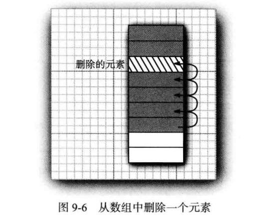
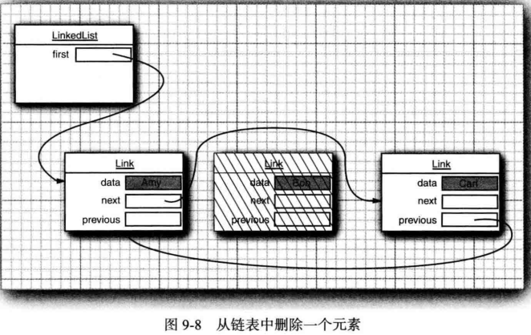
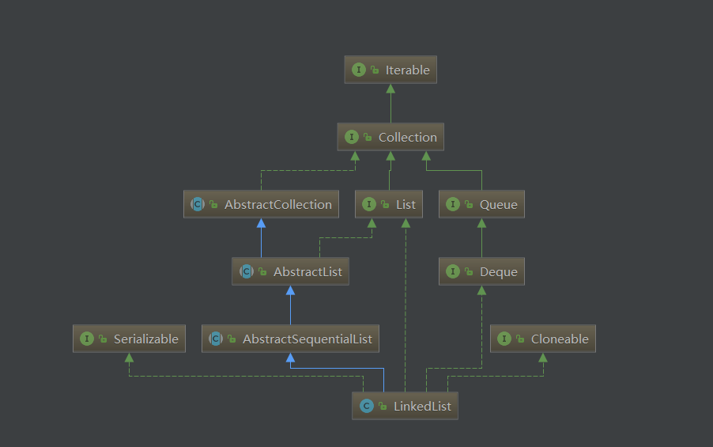
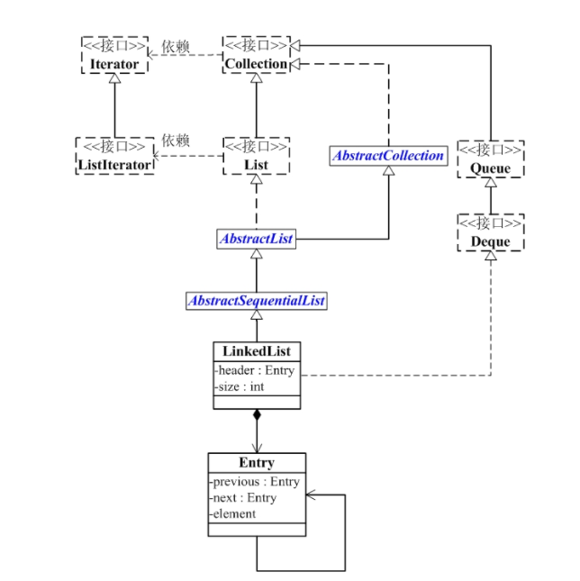
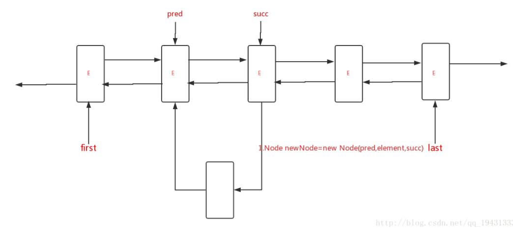
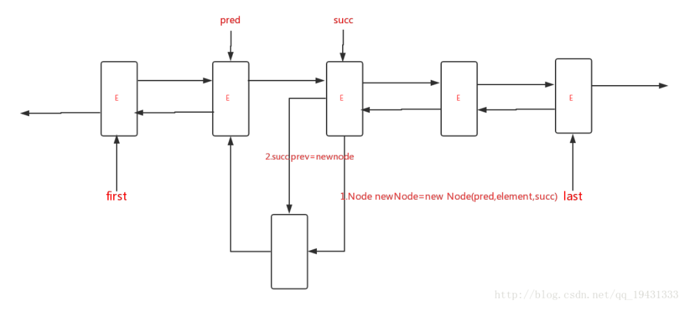
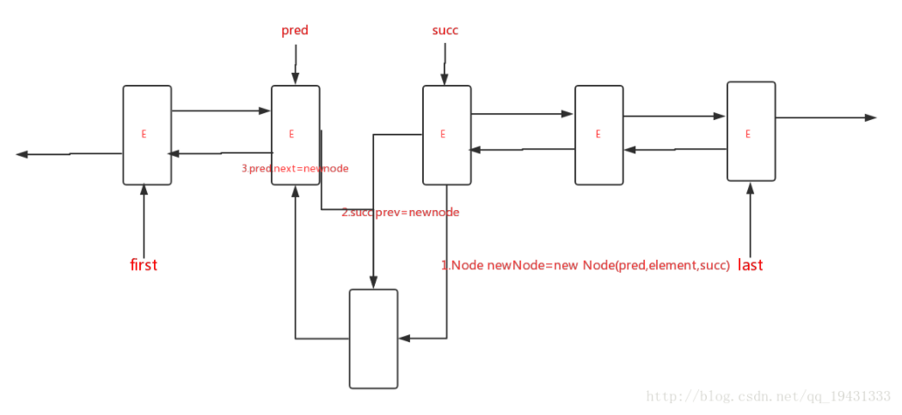

# LinkedList剖析

## 为什么要使用LinkedList？

1. 从数组的中间位置删除一个元素要付出很大的代价
2. 其原因是数组中处于被删除元素之后的所有元素都要向数组的前端移动
3.  在数组中间的位置上插入一个元素也是如此



4. LinkedList是由双链表实现的，删除和插入元素仅仅需要改变指针的指向


5. 以下是双向链表删除一个节点的过程



## LinkedList与ArrayList的区别

`ArrayList`、`LinkedList` 是 `List` 最常用的实现。

- `ArrayList` 基于动态数组实现，存在容量限制，当元素数超过最大容量时，会自动扩容；`LinkedList` 基于双向链表实现，不存在容量限制。
- `ArrayList` 随机访问速度较快，随机插入、删除速度较慢；`LinkedList` 随机插入、删除速度较快，随机访问速度较慢。
- `ArrayList` 和 `LinkedList` 都不是线程安全的。

## LinkedList的介绍

### LinkedList简介



- LinkedList 是一个继承于AbstractSequentialList的双向链表。它也可以被当作堆栈、队列或双端队列进行操作。
- LinkedList 实现 List 接口，能对它进行队列操作。
- LinkedList 实现 Deque 接口，即能将LinkedList当作双端队列使用。
- LinkedList 实现了Cloneable接口，即覆盖了函数clone()，能克隆。
- LinkedList 实现java.io.Serializable接口，这意味着LinkedList支持序列化，能通过序列化去传输。
- LinkedList 是非同步的。

### LinkedList构造函数

```java
// 默认构造函数
LinkedList()

// 创建一个LinkedList，保护Collection中的全部元素。
LinkedList(Collection<? extends E> collection)
```

### LinkedList的API

```java
LinkedList的API
boolean       add(E object)
void          add(int location, E object)
boolean       addAll(Collection<? extends E> collection)
boolean       addAll(int location, Collection<? extends E> collection)
void          addFirst(E object)
void          addLast(E object)
void          clear()
Object        clone()
boolean       contains(Object object)
Iterator<E>   descendingIterator()
E             element()
E             get(int location)
E             getFirst()
E             getLast()
int           indexOf(Object object)
int           lastIndexOf(Object object)
ListIterator<E>     listIterator(int location)
boolean       offer(E o)
boolean       offerFirst(E e)
boolean       offerLast(E e)
E             peek()
E             peekFirst()
E             peekLast()
E             poll()
E             pollFirst()
E             pollLast()
E             pop()
void          push(E e)
E             remove()
E             remove(int location)
boolean       remove(Object object)
E             removeFirst()
boolean       removeFirstOccurrence(Object o)
E             removeLast()
boolean       removeLastOccurrence(Object o)
E             set(int location, E object)
int           size()
<T> T[]       toArray(T[] contents)
Object[]     toArray()
```


### AbstractSequentialList简介

- LinkedList是AbstractSequentialList的子类。
- AbstractSequentialList 实现了get(int index)、set(int index, E element)、add(int index, E element) 和 remove(int index)这些函数。**这些接口都是随机访问List的**，LinkedList是双向链表；既然它继承于AbstractSequentialList，就相当于已经实现了“get(int index)这些接口”。
- 此外，我们若需要通过AbstractSequentialList自己实现一个列表，只需要扩展此类，并提供 listIterator() 和 size() 方法的实现即可。若要实现不可修改的列表，则需要实现列表迭代器的 hasNext、next、hasPrevious、previous 和 index 方法即可。

## LinkedList数据结构

### LinkedList的继承关系

```java
java.lang.Object
   ↳     java.util.AbstractCollection<E>
         ↳     java.util.AbstractList<E>
               ↳     java.util.AbstractSequentialList<E>
                     ↳     java.util.LinkedList<E>

public class LinkedList<E>
    extends AbstractSequentialList<E>
    implements List<E>, Deque<E>, Cloneable, java.io.Serializable {}
```

### LinkedList与Collection关系



LinkedList的本质是双向链表。

- LinkedList继承于AbstractSequentialList，并且实现了Dequeue接口。
-  LinkedList包含两个重要的成员：header 和 size。
  - header是双向链表的表头，它是双向链表节点所对应的类Entry的实例。Entry中包含成员变量： previous, next, element。其中，previous是该节点的上一个节点，next是该节点的下一个节点，element是该节点所包含的值。
  - size是双向链表中节点的个数。

## LinkedList源码分析

###  类的继承关系

```java
public class LinkedList<E>
    extends AbstractSequentialList<E>
    implements List<E>, Deque<E>, Cloneable, java.io.Serializable
```

说明：LinkedList的类继承结构很有意思，我们着重要看是Deque接口，Deque接口表示是一个双端队列，那么也意味着LinkedList是双端队列的一种实现，所以，基于双端队列的操作在LinkedList中全部有效。

### 类的内部类

```java
private static class Node<E> {
        E item; // 数据域
        Node<E> next; // 后继
        Node<E> prev; // 前驱
        
        // 构造函数，赋值前驱后继
        Node(Node<E> prev, E element, Node<E> next) {
            this.item = element;
            this.next = next;
            this.prev = prev;
        }
    }
```

说明：内部类Node就是实际的结点，用于存放实际元素的地方。

### 类的属性

```java
public class LinkedList<E>
    extends AbstractSequentialList<E>
    implements List<E>, Deque<E>, Cloneable, java.io.Serializable
{
    // 实际元素个数
    transient int size = 0;
    // 头结点
    transient Node<E> first;
    // 尾结点
    transient Node<E> last;
}
```

说明：LinkedList的属性非常简单，一个头结点、一个尾结点、一个表示链表中实际元素个数的变量。注意，头结点、尾结点都有transient关键字修饰，这也意味着在序列化时该域是不会序列化的。

### 类的构造函数

1.  LinkedList()型构造函数　

```java
public LinkedList() {
}
```

2. LinkedList(Collection<? extends E>)型构造函数　

```java
public LinkedList(Collection<? extends E> c) {
        // 调用无参构造函数
        this();
        // 添加集合中所有的元素
        addAll(c);
    }
```

说明：会调用无参构造函数，并且会把集合中所有的元素添加到LinkedList中。

### List接口的添加操作

#### add(E e)

```java
public boolean add(E e) {
        linkLast(e);
        return true;
    }

void linkLast(E e) {
        final Node<E> l = last;//指向链表尾部
        final Node<E> newNode = new Node<>(l, e, null);//以尾部为前驱节点创建一个新节点
        last = newNode;//将链表尾部指向新节点
        if (l == null)//如果链表为空，那么该节点既是头节点也是尾节点
            first = newNode;
        else//链表不为空，那么将该结点作为原链表尾部的后继节点
            l.next = newNode;
        size++;//增加尺寸
        modCount++;
    }
```

从上面代码可以看到，linkLast方法中就是一个链表尾部添加一个双端节点的操作，但是需要注意对链表为空时头节点的处理。

#### add(int index,E e)

add(int index,E e)用于在指定位置添加元素。实现如下：

```java
public void add(int index, E element) {
        checkPositionIndex(index); //检查索引是否处于[0-size]之间

        if (index == size)//添加在链表尾部
            linkLast(element);
        else//添加在链表中间
            linkBefore(element, node(index));
    }
```

从上面代码可以看到，主要分为3步：

1. 检查index的范围，否则抛出异常
2. 如果插入位置是链表尾部，那么调用linkLast方法
3. 如果插入位置是链表中间，那么调用linkBefore方法

linkLast方法前面已经讨论了，下面看一下linkBefore的实现。在看linkBefore之前，先看一下node(int index)方法，该方法返回指定位置的节点，实现如下：

```java
 Node<E> node(int index) {
        // assert isElementIndex(index);

        //如果索引位置靠链表前半部分，从头开始遍历
        if (index < (size >> 1)) {
            Node<E> x = first;
            for (int i = 0; i < index; i++)
                x = x.next;
            return x;
        }
        //否则，从尾开始遍历
        else {
            Node<E> x = last;
            for (int i = size - 1; i > index; i--)
                x = x.prev;
            return x;
        }
    }
```

从上面可以看到，node(int index)方法将根据index是靠近头部还是尾部选择不同的遍历方向。一旦得到了指定索引位置的节点，再看linkBefore()方法，实现如下：

```java
void linkBefore(E e, Node<E> succ) {
        // assert succ != null;
        final Node<E> pred = succ.prev;
        final Node<E> newNode = new Node<>(pred, e, succ);
        succ.prev = newNode;
        if (pred == null)
            first = newNode;
        else
            pred.next = newNode;
        size++;
        modCount++;
    }
```

linkBefore()方法在第二个参数节点之前插入一个新节点。示意图如下：







从上图以及代码可以看到linkBefore主要分三步：

1. 创建newNode节点，将newNode的后继指针指向succ，前驱指针指向pred
2. 将succ的前驱指针指向newNode
3. 根据pred是否为null，进行不同操作。
   - 如果pred为null，说明该节点插入在头节点之前，要重置firs头节点
   -  如果pred不为null，那么直接将pred的后继指针指向newNode即可

#### addAll方法

addAll有两个重载方法，一个参数的方法表示将集合元素添加到链表尾部，而两个参数的方法指定了开始插入的位置。实现如下：

```java
//将集合插入到链表尾部，即开始索引位置为size
public boolean addAll(Collection<? extends E> c) {
        return addAll(size, c);
    }

//将集合从指定位置开始插入
public boolean addAll(int index, Collection<? extends E> c) {
        //Step 1:检查index范围
        checkPositionIndex(index);

        //Step 2:得到集合的数据
        Object[] a = c.toArray();
        int numNew = a.length;
        if (numNew == 0)
            return false;

        //Step 3：得到插入位置的前驱节点和后继节点
        Node<E> pred, succ;
        //如果插入位置为尾部，前驱节点为last，后继节点为null
        if (index == size) {
            succ = null;
            pred = last;
        }
        //否则，调用node()方法得到后继节点，再得到前驱节点
        else {
            succ = node(index);
            pred = succ.prev;
        }

        //Step 4：遍历数据将数据插入
        for (Object o : a) {
            @SuppressWarnings("unchecked") E e = (E) o;
            //创建新节点
            Node<E> newNode = new Node<>(pred, e, null);
            //如果插入位置在链表头部
            if (pred == null)
                first = newNode;
            else
                pred.next = newNode;
            pred = newNode;
        }

        //如果插入位置在尾部，重置last节点
        if (succ == null) {
            last = pred;
        }
        //否则，将插入的链表与先前链表连接起来
        else {
            pred.next = succ;
            succ.prev = pred;
        }

        size += numNew;
        modCount++;
        return true;
    }    
```

从上面的代码可以看到，addAll方法主要分为4步：

- 检查index索引范围
- 得到集合数据
- 得到插入位置的前驱和后继节点
- 遍历数据，将数据插入到指定位置

### Deque接口操作

