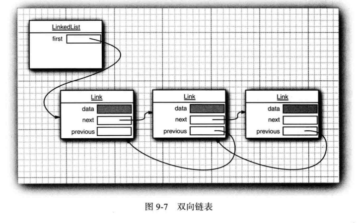

# LinkedList剖析

## 为什么要使用LinkedList？

1. 从数组的中间位置删除一个元素要付出很大的代价
2. 其原因是数组中处于被删除元素之后的所有元素都要向数组的前端移动
3.  在数组中间的位置上插入一个元素也是如此


4. LinkedList是由双链表实现的，删除和插入元素仅仅需要改变指针的指向



5. 以下是双向链表删除一个节点的过程


## LinkedList与ArrayList的区别

`ArrayList`、`LinkedList` 是 `List` 最常用的实现。

- `ArrayList` 基于动态数组实现，存在容量限制，当元素数超过最大容量时，会自动扩容；`LinkedList` 基于双向链表实现，不存在容量限制。
- `ArrayList` 随机访问速度较快，随机插入、删除速度较慢；`LinkedList` 随机插入、删除速度较快，随机访问速度较慢。
- `ArrayList` 和 `LinkedList` 都不是线程安全的。

## LinkedList的介绍

### LinkedList简介


- LinkedList 是一个继承于AbstractSequentialList的双向链表。它也可以被当作堆栈、队列或双端队列进行操作。
- LinkedList 实现 List 接口，能对它进行队列操作。
- LinkedList 实现 Deque 接口，即能将LinkedList当作双端队列使用。
- LinkedList 实现了Cloneable接口，即覆盖了函数clone()，能克隆。
- LinkedList 实现java.io.Serializable接口，这意味着LinkedList支持序列化，能通过序列化去传输。
- LinkedList 是非同步的。

### LinkedList构造函数

```java
// 默认构造函数
LinkedList()

// 创建一个LinkedList，保护Collection中的全部元素。
LinkedList(Collection<? extends E> collection)
```

### LinkedList的API

```java
LinkedList的API
boolean       add(E object)
void          add(int location, E object)
boolean       addAll(Collection<? extends E> collection)
boolean       addAll(int location, Collection<? extends E> collection)
void          addFirst(E object)
void          addLast(E object)
void          clear()
Object        clone()
boolean       contains(Object object)
Iterator<E>   descendingIterator()
E             element()
E             get(int location)
E             getFirst()
E             getLast()
int           indexOf(Object object)
int           lastIndexOf(Object object)
ListIterator<E>     listIterator(int location)
boolean       offer(E o)
boolean       offerFirst(E e)
boolean       offerLast(E e)
E             peek()
E             peekFirst()
E             peekLast()
E             poll()
E             pollFirst()
E             pollLast()
E             pop()
void          push(E e)
E             remove()
E             remove(int location)
boolean       remove(Object object)
E             removeFirst()
boolean       removeFirstOccurrence(Object o)
E             removeLast()
boolean       removeLastOccurrence(Object o)
E             set(int location, E object)
int           size()
<T> T[]       toArray(T[] contents)
Object[]     toArray()
```


### AbstractSequentialList简介

- LinkedList是AbstractSequentialList的子类。
- AbstractSequentialList 实现了get(int index)、set(int index, E element)、add(int index, E element) 和 remove(int index)这些函数。**这些接口都是随机访问List的**，LinkedList是双向链表；既然它继承于AbstractSequentialList，就相当于已经实现了“get(int index)这些接口”。
- 此外，我们若需要通过AbstractSequentialList自己实现一个列表，只需要扩展此类，并提供 listIterator() 和 size() 方法的实现即可。若要实现不可修改的列表，则需要实现列表迭代器的 hasNext、next、hasPrevious、previous 和 index 方法即可。

## LinkedList数据结构

### LinkedList的继承关系

```java
java.lang.Object
   ↳     java.util.AbstractCollection<E>
         ↳     java.util.AbstractList<E>
               ↳     java.util.AbstractSequentialList<E>
                     ↳     java.util.LinkedList<E>

public class LinkedList<E>
    extends AbstractSequentialList<E>
    implements List<E>, Deque<E>, Cloneable, java.io.Serializable {}
```

### LinkedList与Collection关系


LinkedList的本质是双向链表。

- LinkedList继承于AbstractSequentialList，并且实现了Dequeue接口。
-  LinkedList包含两个重要的成员：header 和 size。
  - header是双向链表的表头，它是双向链表节点所对应的类Entry的实例。Entry中包含成员变量： previous, next, element。其中，previous是该节点的上一个节点，next是该节点的下一个节点，element是该节点所包含的值。
  - size是双向链表中节点的个数。

## LinkedList源码分析

###  类的继承关系

```java
public class LinkedList<E>
    extends AbstractSequentialList<E>
    implements List<E>, Deque<E>, Cloneable, java.io.Serializable
```

说明：LinkedList的类继承结构很有意思，我们着重要看是Deque接口，Deque接口表示是一个双端队列，那么也意味着LinkedList是双端队列的一种实现，所以，基于双端队列的操作在LinkedList中全部有效。

### 类的内部类

```java
private static class Node<E> {
        E item; // 数据域
        Node<E> next; // 后继
        Node<E> prev; // 前驱
        
        // 构造函数，赋值前驱后继
        Node(Node<E> prev, E element, Node<E> next) {
            this.item = element;
            this.next = next;
            this.prev = prev;
        }
    }
```

说明：内部类Node就是实际的结点，用于存放实际元素的地方。

### 类的属性

```java
public class LinkedList<E>
    extends AbstractSequentialList<E>
    implements List<E>, Deque<E>, Cloneable, java.io.Serializable
{
    // 实际元素个数
    transient int size = 0;
    // 头结点
    transient Node<E> first;
    // 尾结点
    transient Node<E> last;
}
```

说明：LinkedList的属性非常简单，一个头结点、一个尾结点、一个表示链表中实际元素个数的变量。注意，头结点、尾结点都有transient关键字修饰，这也意味着在序列化时该域是不会序列化的。

### 类的构造函数

1.  LinkedList()型构造函数　

```java
public LinkedList() {
}
```

2. LinkedList(Collection<? extends E>)型构造函数　

```java
public LinkedList(Collection<? extends E> c) {
        // 调用无参构造函数
        this();
        // 添加集合中所有的元素
        addAll(c);
    }
```

说明：会调用无参构造函数，并且会把集合中所有的元素添加到LinkedList中。

### 添加操作

#### List接口的添加操作

##### add(E e)

```java
public boolean add(E e) {
        linkLast(e);
        return true;
    }

void linkLast(E e) {
        final Node<E> l = last;//指向链表尾部
        final Node<E> newNode = new Node<>(l, e, null);//以尾部为前驱节点创建一个新节点
        last = newNode;//将链表尾部指向新节点
        if (l == null)//如果链表为空，那么该节点既是头节点也是尾节点
            first = newNode;
        else//链表不为空，那么将该结点作为原链表尾部的后继节点
            l.next = newNode;
        size++;//增加尺寸
        modCount++;
    }
```

从上面代码可以看到，linkLast方法中就是一个链表尾部添加一个双端节点的操作，但是需要注意对链表为空时头节点的处理。

##### add(int index,E e)

add(int index,E e)用于在指定位置添加元素。实现如下：

```java
public void add(int index, E element) {
        checkPositionIndex(index); //检查索引是否处于[0-size]之间

        if (index == size)//添加在链表尾部
            linkLast(element);
        else//添加在链表中间
            linkBefore(element, node(index));
    }
```

从上面代码可以看到，主要分为3步：

1. 检查index的范围，否则抛出异常
2. 如果插入位置是链表尾部，那么调用linkLast方法
3. 如果插入位置是链表中间，那么调用linkBefore方法

linkLast方法前面已经讨论了，下面看一下linkBefore的实现。在看linkBefore之前，先看一下node(int index)方法，该方法返回指定位置的节点，实现如下：

```java
 Node<E> node(int index) {
        // assert isElementIndex(index);

        //如果索引位置靠链表前半部分，从头开始遍历
        if (index < (size >> 1)) {
            Node<E> x = first;
            for (int i = 0; i < index; i++)
                x = x.next;
            return x;
        }
        //否则，从尾开始遍历
        else {
            Node<E> x = last;
            for (int i = size - 1; i > index; i--)
                x = x.prev;
            return x;
        }
    }
```

从上面可以看到，node(int index)方法将根据index是靠近头部还是尾部选择不同的遍历方向。一旦得到了指定索引位置的节点，再看linkBefore()方法，实现如下：

```java
void linkBefore(E e, Node<E> succ) {
        // assert succ != null;
        final Node<E> pred = succ.prev;
        final Node<E> newNode = new Node<>(pred, e, succ);
        succ.prev = newNode;
        if (pred == null)
            first = newNode;
        else
            pred.next = newNode;
        size++;
        modCount++;
    }
```

linkBefore()方法在第二个参数节点之前插入一个新节点。示意图如下：


从上图以及代码可以看到linkBefore主要分三步：

1. 创建newNode节点，将newNode的后继指针指向succ，前驱指针指向pred
2. 将succ的前驱指针指向newNode
3. 根据pred是否为null，进行不同操作。
   - 如果pred为null，说明该节点插入在头节点之前，要重置firs头节点
   -  如果pred不为null，那么直接将pred的后继指针指向newNode即可

##### addAll方法

addAll有两个重载方法，一个参数的方法表示将集合元素添加到链表尾部，而两个参数的方法指定了开始插入的位置。实现如下：

```java
//将集合插入到链表尾部，即开始索引位置为size
public boolean addAll(Collection<? extends E> c) {
        return addAll(size, c);
    }

//将集合从指定位置开始插入
public boolean addAll(int index, Collection<? extends E> c) {
        //Step 1:检查index范围
        checkPositionIndex(index);

        //Step 2:得到集合的数据
        Object[] a = c.toArray();
        int numNew = a.length;
        if (numNew == 0)
            return false;

        //Step 3：得到插入位置的前驱节点和后继节点
        Node<E> pred, succ;
        //如果插入位置为尾部，前驱节点为last，后继节点为null
        if (index == size) {
            succ = null;
            pred = last;
        }
        //否则，调用node()方法得到后继节点，再得到前驱节点
        else {
            succ = node(index);
            pred = succ.prev;
        }

        //Step 4：遍历数据将数据插入
        for (Object o : a) {
            @SuppressWarnings("unchecked") E e = (E) o;
            //创建新节点
            Node<E> newNode = new Node<>(pred, e, null);
            //如果插入位置在链表头部
            if (pred == null)
                first = newNode;
            else
                pred.next = newNode;
            pred = newNode;
        }

        //如果插入位置在尾部，重置last节点
        if (succ == null) {
            last = pred;
        }
        //否则，将插入的链表与先前链表连接起来
        else {
            pred.next = succ;
            succ.prev = pred;
        }

        size += numNew;
        modCount++;
        return true;
    }    
```

从上面的代码可以看到，addAll方法主要分为4步：

- 检查index索引范围
- 得到集合数据
- 得到插入位置的前驱和后继节点
- 遍历数据，将数据插入到指定位置

#### Deque接口操作

##### addFirst(E e)方法

addFirst()方法用于将元素添加到链表头部，其实现如下:

```java
public void addFirst(E e) {
        linkFirst(e);
    }

private void linkFirst(E e) {
        final Node<E> f = first;
        final Node<E> newNode = new Node<>(null, e, f);//新建节点，以头节点为后继节点
        first = newNode;
        //如果链表为空，last节点也指向该节点
        if (f == null)
            last = newNode;
        //否则，将头节点的前驱指针指向新节点
        else
            f.prev = newNode;
        size++;
        modCount++;
 }
```

从上面的代码看到，实现就是在头节点插入一个节点使新节点成为新节点，但是和linkLast一样需要注意当链表为空时，对last节点的设置。

##### addLast(E e)方法

```java
public void addLast(E e) {
        linkLast(e);
    }
```

##### offer(E e)方法

offer(E e)方法用于将数据添加到链表尾部，其内部调用了add(E e)方法，如下：

```java
  public boolean offer(E e) {
        return add(e);
    }
```

##### offerFirst(E e)方法

offerFirst()方法用于将数据插入链表头部，与addFirst的区别在于该方法可以返回特定的返回值，而addFirst的返回值为void。

```java
 public boolean offerFirst(E e) {
        addFirst(e);
        return true;
    }
```

##### offerLast(E e)方法

offerLast()与addLast()的区别和offerFirst()和addFirst()的区别一样，所以这儿就不多说了。

### 检索操作

#### 根据位置取数据

##### 获取任意位置的get(int index)方法

get(int index)方法根据指定索引返回数据，如果索引越界，那么会抛出异常。实现如下：

```java
public E get(int index) {
        //检查边界
        checkElementIndex(index);
        return node(index).item;
    }
```

从上面的代码可以看到分为2步：

1. 检查index边界，index>=0&&index
2. 返回链表在该位置的值

##### 获得位置为0的头节点数据

LinkedList中有多种方法可以获得头节点的数据，实现大同小异，区别在于对链表为空时的处理，是抛出异常还是返回null。主要方法有getFirst()、element()、peek()、peekFirst()、方法。其中getFirst()和element()方法将会在链表为空时，抛出异常，它们的实现如下：

```java
public E getFirst() {
        final Node<E> f = first;
        if (f == null)
            throw new NoSuchElementException();
        return f.item;
    }
public E element() {
        return getFirst();
    }
```

从代码可以看到，element()方法的内部就是使用getFirst()实现的。它们会在链表为空时，抛出NoSuchElementException。下面再看peek()和peekFirst()的实现：

```java
 public E peek() {
        final Node<E> f = first;
        return (f == null) ? null : f.item;
    }

public E peekFirst() {
        final Node<E> f = first;
        return (f == null) ? null : f.item;
     }
```

从代码可以看到，当链表为空时，peek()和peekFirst()方法返回null。

##### 获得位置为size-1的尾节点数据

获得尾节点数据的方法有getLast()和peekLast()。getLast()的实现如下：

```java
 public E getLast() {
        final Node<E> l = last;
        if (l == null)
            throw new NoSuchElementException();
        return l.item;
    }
```

可以看到，getLast()方法在链表为空时，会抛出NoSuchElementException，而peekLast()则不会，只是会返回null。实现如下：

```java
public E peekLast() {
        final Node<E> l = last;
        return (l == null) ? null : l.item;
    }
```

#### 根据对象得到索引

根据对象得到索引分为两种，一种是第一个匹配的索引，一个是最后一个匹配的索引，实现的在于一个从前往后遍历，一个从后往前遍历。下面先看idnexOf()方法的实现：

```java
//返回第一个匹配的索引
public int indexOf(Object o) {
        int index = 0;
        if (o == null) {
            //从头往后遍历
            for (Node<E> x = first; x != null; x = x.next) {
                if (x.item == null)
                    return index;
                index++;
            }
        } else {
            //从头往后遍历
            for (Node<E> x = first; x != null; x = x.next) {
                if (o.equals(x.item))
                    return index;
                index++;
            }
        }
        return -1;
    }
```

从上面的代码可以看到，LinkedList可以包含null元素，遍历方式都是从前往后，一旦匹配了，就返回索引。
lastIndexOf()方法返回最后一个匹配的索引，实现为从后往前遍历，源码如下：

```java
//返回最后一个匹配的索引
public int lastIndexOf(Object o) {
        int index = size;
        if (o == null) {
            //从后向前遍历
            for (Node<E> x = last; x != null; x = x.prev) {
                index--;
                if (x.item == null)
                    return index;
            }
        } else {
            //从后向前遍历
            for (Node<E> x = last; x != null; x = x.prev) {
                index--;
                if (o.equals(x.item))
                    return index;
            }
        }
        return -1;
    }
```

#### 检查链表是否包含某对象

contains(Object o)方法检查对象o是否存在于链表中，其实现如下：

```java
 public boolean contains(Object o) {
        return indexOf(o) != -1;
    }
```

从代码可以看到contains()方法调用了indexOf()方法，只要返回结果不是-1，那就说明该对象存在于链表中

#### 检索操作总结

检索操作分为按照位置得到对象以及按照对象得到位置两种方式，其中按照对象得到位置的方法有indexOf()和lastIndexOf()；按照位置得到对象有如下方法：

- 根据任意位置得到数据的get(int index)方法，当index越界会抛出异常
- 获得头节点数据
- getFirst()和element()方法在链表为空时会抛出NoSuchElementException
- peek()和peekFirst()方法在链表为空时会返回null
-  获得尾节点数据
-  getLast()在链表为空时会抛出NoSuchElementException
- peekLast()在链表为空时会返回null

### 删除操作

删除操作分为按照位置删除和按照对象删除，其中按照位置删除的方法又有区别，有的只是返回是否删除成功的标志，有的还需要返回被删除的元素。下面分别讨论。

#### 删除指定对象

当删除指定对象时，只需调用remove(Object o)即可，不过该方法一次只会删除一个匹配的对象，如果删除了匹配对象，返回true，否则false。其实现如下：

```java
public boolean remove(Object o) {
        //如果删除对象为null
        if (o == null) {
            //从前向后遍历
            for (Node<E> x = first; x != null; x = x.next) {
                //一旦匹配，调用unlink()方法和返回true
                if (x.item == null) {
                    unlink(x);
                    return true;
                }
            }
        } else {
            //从前向后遍历
            for (Node<E> x = first; x != null; x = x.next) {
                //一旦匹配，调用unlink()方法和返回true
                if (o.equals(x.item)) {
                    unlink(x);
                    return true;
                }
            }
        }
        return false;
    }
```

从代码可以看到，由于LinkedList可以存储null元素，所以对删除对象以是否为null做区分。然后从链表头开始遍历，一旦匹配，就会调用unlink()方法将该节点从链表中移除。下面是unlink()方法的实现：

```java
 E unlink(Node<E> x) {
        // assert x != null;
        final E element = x.item;
        final Node<E> next = x.next;//得到后继节点
        final Node<E> prev = x.prev;//得到前驱节点

        //删除前驱指针
        if (prev == null) {
            first = next;如果删除的节点是头节点,令头节点指向该节点的后继节点
        } else {
            prev.next = next;//将前驱节点的后继节点指向后继节点
            x.prev = null;
        }

        //删除后继指针
        if (next == null) {
            last = prev;//如果删除的节点是尾节点,令尾节点指向该节点的前驱节点
        } else {
            next.prev = prev;
            x.next = null;
        }

        x.item = null;
        size--;
        modCount++;
        return element;
    }
```

上面的代码可以用如下示意图来解释：


第一步：得到待删除节点的前驱节点和后继节点


第二步：删除前驱节点


第三步：删除后继节点
经过三步，待删除的结点就从链表中脱离了。需要注意的是删除位置是头节点或尾节点时候的处理，上面的示意图没有特别指出。

#### 按照位置删除对象

##### 删除任意位置的对象

boolean remove(int index)方法用于删除任意位置的元素，如果删除成功将返回true，否则返回false。实现如下：

```java
public E remove(int index) {
        //检查index范围
        checkElementIndex(index);
        //将节点删除
        return unlink(node(index));
    }
```

从上面可以看到remove(int index)操作有两步：

1. 检查index范围，属于[0,size）
2. 将索引出节点删除

##### 删除头节点的对象

删除头节点的对象的方法有很多，包括remove()、removeFirst()、pop()、poll()、pollFirst()，其中前三个方法在链表为空时将抛出NoSuchElementException，后两个方法在链表为空时将返回null。
remove()、pop()、removeFirst()的实现如下：

```java
public E remove() {
        return removeFirst();
    }

public E pop() {
        return removeFirst();
    }

public E removeFirst() {
        final Node<E> f = first;
        if (f == null)
            throw new NoSuchElementException();
        return unlinkFirst(f);
    }
```

从上面代码可以看到，remove()和pop()内部调用了removeFirst()方法，而removeFirst()在链表为空时将抛出NoSuchElementException。
下面是poll()和pollFirst()的实现：

```java
public E poll() {
        final Node<E> f = first;
        return (f == null) ? null : unlinkFirst(f);
    }

public E pollFirst() {
        final Node<E> f = first;
        return (f == null) ? null : unlinkFirst(f);
    }
```

可以看到poll()和pollFirst()的实现代码是相同的，在链表为空时将返回null。

##### 删除尾节点的对象

删除尾节点的对象的方法有removeLast()和pollLast()。removeLast的实现如下：

```java
public E removeLast() {
        final Node<E> l = last;
        if (l == null)
            throw new NoSuchElementException();
        return unlinkLast(l);
    }
```

可以看到removeLast()在链表为空时将抛出NoSuchElementException。而pollLast()方法则不会，如下：

```java
public E pollLast() {
        final Node<E> l = last;
        return (l == null) ? null : unlinkLast(l);
    }
```

可以看到pollLast()在链表为空时会返回null，而不是抛出异常。

#### 删除操作的总结

删除操作由很多种方法，有：

- 按照指定对象删除：boolean remove(Object o)，一次只会删除一个匹配的对象
- 按照指定位置删除
-  删除任意位置的对象：E remove(int index),当index越界时会抛出异常
-  删除头节点位置的对象
- 在链表为空时抛出异常：E remove()、E removeFirst()、E pop()
- 在链表为空时返回null：E poll()、E pollFirst()
-  删除尾节点位置的对象
- 在链表为空时抛出异常：E removeLast()
- 在链表为空时返回null：E pollLast()

### 迭代器操作

LinkedList的iterator()方法内部调用了其listIterator()方法，所以可以只分析listIterator()方法。listIterator()提供了两个重载方法。iterator()方法和listIterator()方法的关系如下：

```java
public Iterator<E> iterator() {
        return listIterator();
    }

public ListIterator<E> listIterator() {
        return listIterator(0);
    }

 public ListIterator<E> listIterator(int index) {
        checkPositionIndex(index);
        return new ListItr(index);
    }
```

从上面可以看到三者的关系是iterator()——>listIterator(0)——>listIterator(int index)。最终都会调用listIterator(int index)方法，其中参数表示迭代器开始的位置。ListIterator是一个可以指定任意位置开始迭代，并且有两个遍历方法。下面直接看ListItr的实现：

```java
private class ListItr implements ListIterator<E> {
        private Node<E> lastReturned;
        private Node<E> next;
        private int nextIndex;
        private int expectedModCount = modCount;//保存当前modCount，确保fail-fast机制

        ListItr(int index) {
            // assert isPositionIndex(index);
            next = (index == size) ? null : node(index);//得到当前索引指向的next节点
            nextIndex = index;
        }

        public boolean hasNext() {
            return nextIndex < size;
        }

        //获取下一个节点
        public E next() {
            checkForComodification();
            if (!hasNext())
                throw new NoSuchElementException();

            lastReturned = next;
            next = next.next;
            nextIndex++;
            return lastReturned.item;
        }

        public boolean hasPrevious() {
            return nextIndex > 0;
        }

        //获取前一个节点，将next节点向前移
        public E previous() {
            checkForComodification();
            if (!hasPrevious())
                throw new NoSuchElementException();

            lastReturned = next = (next == null) ? last : next.prev;
            nextIndex--;
            return lastReturned.item;
        }

        public int nextIndex() {
            return nextIndex;
        }

        public int previousIndex() {
            return nextIndex - 1;
        }

        public void remove() {
            checkForComodification();
            if (lastReturned == null)
                throw new IllegalStateException();

            Node<E> lastNext = lastReturned.next;
            unlink(lastReturned);
            if (next == lastReturned)
                next = lastNext;
            else
                nextIndex--;
            lastReturned = null;
            expectedModCount++;
        }

        public void set(E e) {
            if (lastReturned == null)
                throw new IllegalStateException();
            checkForComodification();
            lastReturned.item = e;
        }

        public void add(E e) {
            checkForComodification();
            lastReturned = null;
            if (next == null)
                linkLast(e);
            else
                linkBefore(e, next);
            nextIndex++;
            expectedModCount++;
        }

        public void forEachRemaining(Consumer<? super E> action) {
            Objects.requireNonNull(action);
            while (modCount == expectedModCount && nextIndex < size) {
                action.accept(next.item);
                lastReturned = next;
                next = next.next;
                nextIndex++;
            }
            checkForComodification();
        }

        final void checkForComodification() {
            if (modCount != expectedModCount)
                throw new ConcurrentModificationException();
        }
    }
```

在ListIterator的构造器中，得到了当前位置的节点，就是变量next。next()方法返回当前节点的值并将next指向其后继节点，previous()方法返回当前节点的前一个节点的值并将next节点指向其前驱节点。由于Node是一个双端节点，所以这儿用了一个节点就可以实现从前向后迭代和从后向前迭代。另外在ListIterator初始时，exceptedModCount保存了当前的modCount，如果在迭代期间，有操作改变了链表的底层结构，那么再操作迭代器的方法时将会抛出ConcurrentModificationException。

### 总结

- LinkedList是基于双端链表的List，其内部的实现源于对链表的操作，所以适用于频繁增加、删除的情况
- 该类不是线程安全的；另外，由于LinkedList实现了Queue接口，所以LinkedList不止有队列的接口，还有栈的接口
- 可以使用LinkedList作为队列和栈的实现。

## LinkedList的遍历方式

LinkedList支持多种遍历方式。建议不要采用随机访问的方式去遍历LinkedList，而采用逐个遍历的方式。
(01) 第一种，通过**迭代器**遍历。即通过Iterator去遍历。

```java
for(Iterator iter = list.iterator(); iter.hasNext();)
    iter.next();
```

(02) 通过**快速随机**访问遍历LinkedList

```java
int size = list.size();
for (int i=0; i<size; i++) {
    list.get(i);        
}
```

(03) 通过**另外一种for循环**来遍历LinkedList

```
for (Integer integ:list) 
    ;
```

(04) 通过**pollFirst()**来遍历LinkedList

```java
while(list.pollFirst() != null)
    ;
```

(05) 通过**pollLast()**来遍历LinkedList

```java
while(list.pollLast() != null)
    ;
```

(06) 通过**removeFirst()**来遍历LinkedList

```java
try {
    while(list.removeFirst() != null)
        ;
} catch (NoSuchElementException e) {
}
```

(07) 通过**removeLast()**来遍历LinkedList

```java
try {
    while(list.removeLast() != null)
        ;
} catch (NoSuchElementException e) {
}
```

**测试这些遍历方式效率的代码如下**：

```java
import java.util.List;
import java.util.Iterator;
import java.util.LinkedList;
import java.util.NoSuchElementException;

/*
 * @desc 测试LinkedList的几种遍历方式和效率
 *
 * @author skywang
 */
public class LinkedListThruTest {
    public static void main(String[] args) {
        // 通过Iterator遍历LinkedList
        iteratorLinkedListThruIterator(getLinkedList()) ;

        // 通过快速随机访问遍历LinkedList
        iteratorLinkedListThruForeach(getLinkedList()) ;

        // 通过for循环的变种来访问遍历LinkedList
        iteratorThroughFor2(getLinkedList()) ;

        // 通过PollFirst()遍历LinkedList
        iteratorThroughPollFirst(getLinkedList()) ;

        // 通过PollLast()遍历LinkedList
        iteratorThroughPollLast(getLinkedList()) ;

        // 通过removeFirst()遍历LinkedList
        iteratorThroughRemoveFirst(getLinkedList()) ;

        // 通过removeLast()遍历LinkedList
        iteratorThroughRemoveLast(getLinkedList()) ;
    }

    private static LinkedList getLinkedList() {
        LinkedList llist = new LinkedList();
        for (int i=0; i<100000; i++)
            llist.addLast(i);

        return llist;
    }
    /**
     * 通过快迭代器遍历LinkedList
     */
    private static void iteratorLinkedListThruIterator(LinkedList<Integer> list) {
        if (list == null)
            return ;

        // 记录开始时间
        long start = System.currentTimeMillis();

        for(Iterator iter = list.iterator(); iter.hasNext();)
            iter.next();

        // 记录结束时间
        long end = System.currentTimeMillis();
        long interval = end - start;
        System.out.println("iteratorLinkedListThruIterator：" + interval+" ms");
    }

    /**
     * 通过快速随机访问遍历LinkedList
     */
    private static void iteratorLinkedListThruForeach(LinkedList<Integer> list) {
        if (list == null)
            return ;

        // 记录开始时间
        long start = System.currentTimeMillis();

        int size = list.size();
        for (int i=0; i<size; i++) {
            list.get(i);
        }
        // 记录结束时间
        long end = System.currentTimeMillis();
        long interval = end - start;
        System.out.println("iteratorLinkedListThruForeach：" + interval+" ms");
    }

    /**
     * 通过另外一种for循环来遍历LinkedList
     */
    private static void iteratorThroughFor2(LinkedList<Integer> list) {
        if (list == null)
            return ;

        // 记录开始时间
        long start = System.currentTimeMillis();

        for (Integer integ:list)
            ;

        // 记录结束时间
        long end = System.currentTimeMillis();
        long interval = end - start;
        System.out.println("iteratorThroughFor2：" + interval+" ms");
    }

    /**
     * 通过pollFirst()来遍历LinkedList
     */
    private static void iteratorThroughPollFirst(LinkedList<Integer> list) {
        if (list == null)
            return ;

        // 记录开始时间
        long start = System.currentTimeMillis();
        while(list.pollFirst() != null)
            ;

        // 记录结束时间
        long end = System.currentTimeMillis();
        long interval = end - start;
        System.out.println("iteratorThroughPollFirst：" + interval+" ms");
    }

    /**
     * 通过pollLast()来遍历LinkedList
     */
    private static void iteratorThroughPollLast(LinkedList<Integer> list) {
        if (list == null)
            return ;

        // 记录开始时间
        long start = System.currentTimeMillis();
        while(list.pollLast() != null)
            ;

        // 记录结束时间
        long end = System.currentTimeMillis();
        long interval = end - start;
        System.out.println("iteratorThroughPollLast：" + interval+" ms");
    }

    /**
     * 通过removeFirst()来遍历LinkedList
     */
    private static void iteratorThroughRemoveFirst(LinkedList<Integer> list) {
        if (list == null)
            return ;

        // 记录开始时间
        long start = System.currentTimeMillis();
        try {
            while(list.removeFirst() != null)
                ;
        } catch (NoSuchElementException e) {
        }

        // 记录结束时间
        long end = System.currentTimeMillis();
        long interval = end - start;
        System.out.println("iteratorThroughRemoveFirst：" + interval+" ms");
    }

    /**
     * 通过removeLast()来遍历LinkedList
     */
    private static void iteratorThroughRemoveLast(LinkedList<Integer> list) {
        if (list == null)
            return ;

        // 记录开始时间
        long start = System.currentTimeMillis();
        try {
            while(list.removeLast() != null)
                ;
        } catch (NoSuchElementException e) {
        }

        // 记录结束时间
        long end = System.currentTimeMillis();
        long interval = end - start;
        System.out.println("iteratorThroughRemoveLast：" + interval+" ms");
    }

}
```

**执行结果**：

```
iteratorLinkedListThruIterator：8 ms
iteratorLinkedListThruForeach：3724 ms
iteratorThroughFor2：5 ms
iteratorThroughPollFirst：8 ms
iteratorThroughPollLast：6 ms
iteratorThroughRemoveFirst：2 ms
iteratorThroughRemoveLast：2 ms
```

由此可见，遍历LinkedList时，使用removeFist()或removeLast()效率最高。但用它们遍历时，会删除原始数据；若单纯只读取，而不删除，应该使用第3种遍历方式。
**无论如何，千万不要通过随机访问去遍历LinkedList！**

## LinkedList与ArrayList对比

|                     | ArrayList    | LinkedList           |
| :------------------ | :----------- | :------------------- |
| 获取指定元素        | 速度很快     | 需要从头开始查找元素 |
| 添加元素到末尾      | 速度很快     | 速度很快             |
| 在指定位置添加/删除 | 需要移动元素 | 不需要移动元素       |
| 内存占用            | 少           | 较大                 |

## 参考

1. 廖雪峰Java教程：https://www.liaoxuefeng.com/wiki/1252599548343744/1265112034799552
2. Java核心技术卷
3. Java编程的逻辑
4. 如果天空不死博客：https://www.cnblogs.com/skywang12345/p/3308807.html
5. xingfeng_coder的博客:https://xingfeng.blog.csdn.net/article/details/54572876?utm_medium=distribute.pc_relevant_t0.none-task-blog-BlogCommendFromBaidu-1.control&depth_1-utm_source=distribute.pc_relevant_t0.none-task-blog-BlogCommendFromBaidu-1.control
6. Java3y:https://github.com/ZhongFuCheng3y/3y
7. https://www.cnblogs.com/leesf456/p/5308843.html

