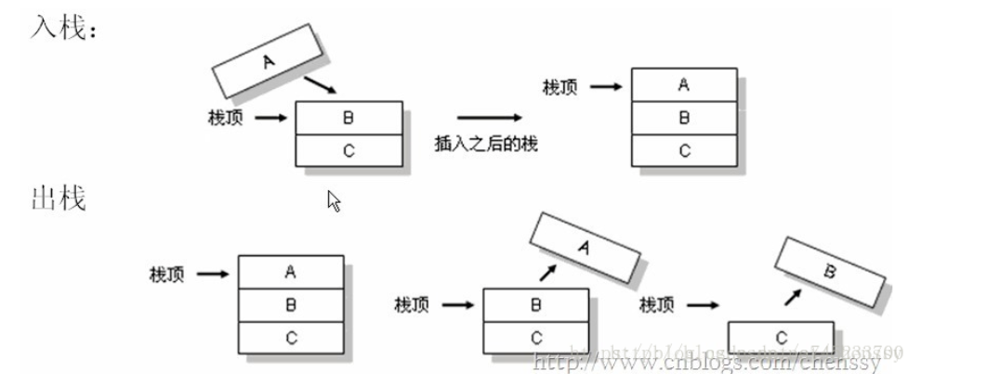
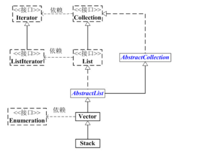

# Stack剖析

## 什么是栈？

在Java中Stack类表示后进先出（LIFO）的对象堆栈。栈是一种非常常见的数据结构，它采用典型的先进后出的操作方式完成的。每一个栈都包含一个栈顶，每次出栈是将栈顶的数据取出，如下：



 Stack通过五个操作对Vector进行扩展，允许将向量视为堆栈。这个五个操作如下：

| **操作**             | **操作**                                         |
| -------------------- | ------------------------------------------------ |
| **empty**()          | 测试堆栈是否为空。                               |
| **peek**()           | 查看堆栈顶部的对象，但不从堆栈中移除它。         |
| **pop**()            | 移除堆栈顶部的对象，并作为此函数的值返回该对象。 |
| **push**(E item)     | 把项压入堆栈顶部。                               |
| **search**(Object o) | 返回对象在堆栈中的位置，以 1 为基数。            |


## 栈的介绍

**Stack简介**

Stack是栈。它的特性是：**先进后出**(FILO, First In Last Out)。

java工具包中的Stack是继承于[Vector](http://www.cnblogs.com/skywang12345/p/3308833.html)(矢量队列)的，由于Vector是通过数组实现的，这就意味着，**Stack也是通过数组实现的**，**而非链表**。当然，我们也可以将LinkedList当作栈来使用！在“[Java 集合系列06之 Vector详细介绍(源码解析)和使用示例](http://www.cnblogs.com/skywang12345/p/3308833.html)”中，已经详细介绍过Vector的数据结构，这里就不再对Stack的数据结构进行说明了。

**:注：Stack类的设计是有缺陷的，在《Java编程思想》中明确提出了不应该使用Stack类，而是使用LinkedList该构建栈。**

## 栈的继承关系

```java
java.lang.Object
↳     java.util.AbstractCollection<E>
   ↳     java.util.AbstractList<E>
       ↳     java.util.Vector<E>
           ↳     java.util.Stack<E>

public class Stack<E> extends Vector<E> {}
```



## Stack构造函数

Stack**只有一个默认构造函数**，如下：

```java
Stack()
```

**Stack的API**

Stack是栈，它**常用的API**如下：

```java
             boolean       empty()
synchronized E             peek()
synchronized E             pop()
             E             push(E object)
synchronized int           search(Object o)
```

由于Stack和继承于Vector，因此**它也包含Vector中的全部API**。

## Stack源代码解析

```java
package java.util;

public
class Stack<E> extends Vector<E> {
    // 版本ID。这个用于版本升级控制，这里不须理会！
    private static final long serialVersionUID = 1224463164541339165L;

    // 构造函数
    public Stack() {
    }

    // push函数：将元素存入栈顶
    public E push(E item) {
        // 将元素存入栈顶。
        // addElement()的实现在Vector.java中
        addElement(item);

        return item;
    }

    // pop函数：返回栈顶元素，并将其从栈中删除
    public synchronized E pop() {
        E    obj;
        int    len = size();

        obj = peek();
        // 删除栈顶元素，removeElementAt()的实现在Vector.java中
        removeElementAt(len - 1);

        return obj;
    }

    // peek函数：返回栈顶元素，不执行删除操作
    public synchronized E peek() {
        int    len = size();

        if (len == 0)
            throw new EmptyStackException();
        // 返回栈顶元素，elementAt()具体实现在Vector.java中
        return elementAt(len - 1);
    }

    // 栈是否为空
    public boolean empty() {
        return size() == 0;
    }

    // 查找“元素o”在栈中的位置：由栈底向栈顶方向数
    public synchronized int search(Object o) {
        // 获取元素索引，elementAt()具体实现在Vector.java中
        int i = lastIndexOf(o);

        if (i >= 0) {
            return size() - i;
        }
        return -1;
    }
}
```

**总结**：

(01) Stack实际上也是通过数组去实现的。
    执行**push**时(即，**将元素推入栈中**)，是通过将元素追加的数组的末尾中。
    执行**peek**时(即，**取出栈顶元素，不执行删除**)，是返回数组末尾的元素。
    执行**pop**时(即，**取出栈顶元素，并将该元素从栈中删除**)，是取出数组末尾的元素，然后将该元素从数组中删除。
(02) Stack继承于Vector，意味着Vector拥有的属性和功能，Stack都拥有。

 

## Vector示例

下面我们通过实例学习如何使用Stack

```java
import java.util.Stack;
import java.util.Iterator;
import java.util.List;

/**
 * @desc Stack的测试程序。测试常用API的用法
 *
 * @author skywang
 */
public class StackTest {

    public static void main(String[] args) {
        Stack stack = new Stack();
        // 将1,2,3,4,5添加到栈中
        for(int i=1; i<6; i++) {
            stack.push(String.valueOf(i));
        }

        // 遍历并打印出该栈
        iteratorThroughRandomAccess(stack) ;

        // 查找“2”在栈中的位置，并输出
        int pos = stack.search("2");
        System.out.println("the postion of 2 is:"+pos);

        // pup栈顶元素之后，遍历栈
        stack.pop();
        iteratorThroughRandomAccess(stack) ;

        // peek栈顶元素之后，遍历栈
        String val = (String)stack.peek();
        System.out.println("peek:"+val);
        iteratorThroughRandomAccess(stack) ;

        // 通过Iterator去遍历Stack
        iteratorThroughIterator(stack) ;
    }

    /**
     * 通过快速访问遍历Stack
     */
    public static void iteratorThroughRandomAccess(List list) {
        String val = null;
        for (int i=0; i<list.size(); i++) {
            val = (String)list.get(i);
            System.out.print(val+" ");
        }
        System.out.println();
    }

    /**
     * 通过迭代器遍历Stack
     */
    public static void iteratorThroughIterator(List list) {

        String val = null;
        for(Iterator iter = list.iterator(); iter.hasNext(); ) {
            val = (String)iter.next();
            System.out.print(val+" ");
        }
        System.out.println();
    }

}
```

**运行结果**： 

```
1 2 3 4 5 
the postion of 2 is:4
1 2 3 4 
peek:4
1 2 3 4 
1 2 3 4 
```

## 源自

1. 如果天空不死博客：https://www.cnblogs.com/skywang12345/p/3308852.html
2. 张维鹏博客：https://blog.csdn.net/a745233700/article/details/83241217

注意：本文大量使用他人博客内容，仅仅作为个人学习使用，向原作者致敬!