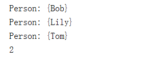

# TreeMap剖析

## TreeMap简介

- `HashMap`是一种以空间换时间的映射表，它的实现原理决定了内部的Key是无序的，即遍历`HashMap`的Key时，其顺序是不可预测的（但每个Key都会遍历一次且仅遍历一次）
- 还有一种`Map`，它在内部会对Key进行排序，这种`Map`就是`SortedMap`。注意到`SortedMap`是接口，它的实现类是`TreeMap`。
- TreeMap的继承关系图


## TreeMap使用样例

**样例一**

放入的Key是`"apple"`、`"pear"`、`"orange"`，遍历的顺序一定是`"apple"`、`"orange"`、`"pear"`，因为`String`默认按字母排序：

```java
package com.dreamcold.container;

import java.util.Map;
import java.util.TreeMap;

public class Demo12 {
    public static void main(String[] args) {
        Map<String,Integer> map=new TreeMap<>();
        map.put("orange",1);
        map.put("apple",2);
        map.put("pear",3);
        for (String key :map.keySet()){
            System.out.println(key);
        }
        
    }
}

```

结果


**样例二**

使用`TreeMap`时，放入的Key必须实现`Comparable`接口。`String`、`Integer`这些类已经实现了`Comparable`接口，因此可以直接作为Key使用。作为Value的对象则没有任何要求。如果作为Key的class没有实现`Comparable`接口，那么，必须在创建`TreeMap`时同时指定一个自定义排序算法：

```java
package com.dreamcold.container;

import java.util.Comparator;
import java.util.Map;
import java.util.TreeMap;

public class Demo13 {
    public static void main(String[] args) {
        Map<Person,Integer> map=new TreeMap<>(new Comparator<Person>() {
            @Override
            public int compare(Person o1, Person o2) {
                return o1.name.compareTo(o2.name);
            }
        });
        map.put(new Person("Tom"), 1);
        map.put(new Person("Bob"), 2);
        map.put(new Person("Lily"), 3);
        for (Person key : map.keySet()) {
            System.out.println(key);
        }
        // {Person: Bob}, {Person: Lily}, {Person: Tom}
        System.out.println(map.get(new Person("Bob"))); // 2
    }
}

class Person{
    public String name;
    Person(String name){
        this.name=name;
    }

    public String toString(){
        return "Person: {"+name+"}";
    }


}

```

结果




**样例三**

注意到`Comparator`接口要求实现一个比较方法，它负责比较传入的两个元素`a`和`b`，如果`a<b`，则返回负数，通常是`-1`，如果`a==b`，则返回`0`，如果`a>b`，则返回正数，通常是`1`。`TreeMap`内部根据比较结果对Key进行排序。

从上述代码执行结果可知，打印的Key确实是按照`Comparator`定义的顺序排序的。如果要根据Key查找Value，我们可以传入一个`new Person("Bob")`作为Key，它会返回对应的`Integer`值`2`。

另外，注意到`Person`类并未覆写`equals()`和`hashCode()`，因为`TreeMap`不使用`equals()`和`hashCode()`。

我们来看一个稍微复杂的例子：这次我们定义了`Student`类，并用分数`score`进行排序，高分在前：

```java
package com.dreamcold.container;

import java.util.Comparator;
import java.util.Map;
import java.util.TreeMap;

public class Demo14 {
    public static void main(String[] args) {
        Map<Student,Integer> map=new TreeMap<>(new Comparator<Student>() {
            @Override
            public int compare(Student o1, Student o2) {
                return o1.score>o2.score?-1:1;
            }
        });
        map.put(new Student("tom",77),1);
        map.put(new Student("Bob",66),2);
        map.put(new Student("alice",55),3);
        for (Student key : map.keySet()) {
            System.out.println(key);
        }
        System.out.println(map.get(new Student("Bob", 66))); // null


    }
}

class Student{
    public String name;
    public int score;

    Student(String name,int score){
        this.name=name;
        this.score=score;
    }

    @Override
    public String toString(){
        return  String.format("{%s:score=%d}",name,score);
    }
}
```

结果


在`for`循环中，我们确实得到了正确的顺序。但是，且慢！根据相同的Key：`new Student("Bob", 66)`进行查找时，结果为`null`！

这是怎么肥四？难道`TreeMap`有问题？遇到`TreeMap`工作不正常时，我们首先回顾Java编程基本规则：出现问题，不要怀疑Java标准库，要从自身代码找原因。

在这个例子中，`TreeMap`出现问题，原因其实出在这个`Comparator`上：

```java
public int compare(Student p1, Student p2) {
    return p1.score > p2.score ? -1 : 1;
}
```

在`p1.score`和`p2.score`不相等的时候，它的返回值是正确的，但是，在`p1.score`和`p2.score`相等的时候，它并没有返回`0`！这就是为什么`TreeMap`工作不正常的原因：`TreeMap`在比较两个Key是否相等时，依赖Key的`compareTo()`方法或者`Comparator.compare()`方法。在两个Key相等时，必须返回`0`。因此，修改代码如下：

```java
  Map<Student,Integer> map=new TreeMap<>(new Comparator<Student>() {
            @Override
            public int compare(Student o1, Student o2) {
                if(o1.score==o2.score){
                    return 0;
                }
                return o1.score>o2.score?-1:1;
            }
        });
```

或者直接借助`Integer.compare(int, int)`也可以返回正确的比较结果。

```java
 Map<Student,Integer> map=new TreeMap<>(new Comparator<Student>() {
            @Override
            public int compare(Student o1, Student o2) {
                return Integer.compare(o1.score,o2.score);
            }
        });
```

结果


## 小结

- `SortedMap`在遍历时严格按照Key的顺序遍历，最常用的实现类是`TreeMap`；

- 作为`SortedMap`的Key必须实现`Comparable`接口，或者传入`Comparator`；

- 要严格按照`compare()`规范实现比较逻辑，否则，`TreeMap`将不能正常工作。


## 引用

- 廖雪峰官网:https://www.liaoxuefeng.com/wiki/1252599548343744/1265117109276544

- 如果天空不死博客：https://www.cnblogs.com/skywang12345/p/3310928.html#a4

  