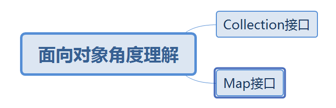
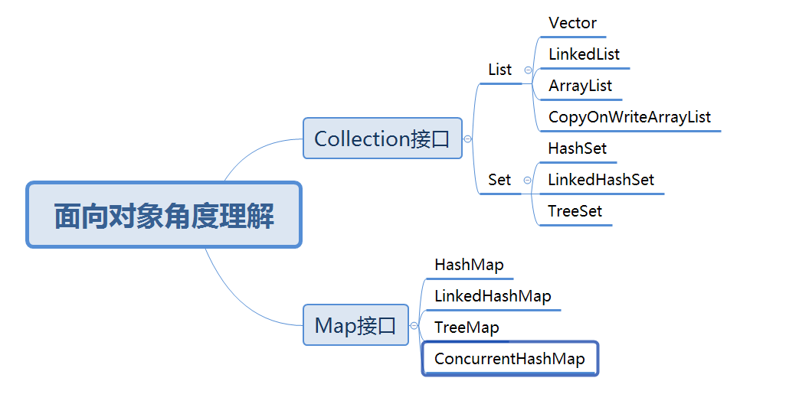
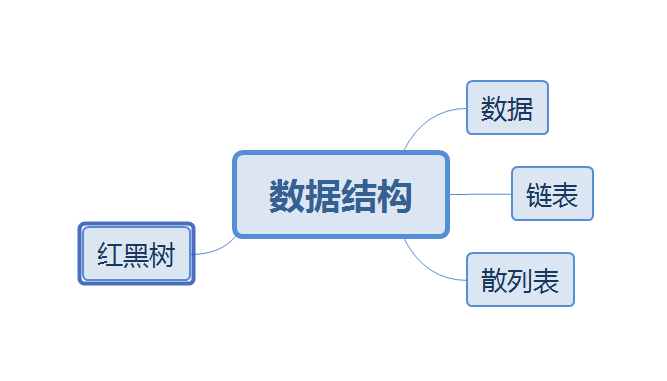
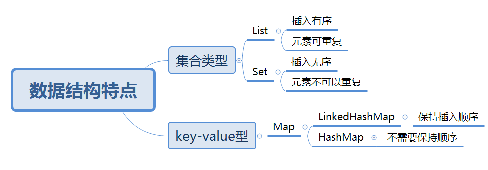
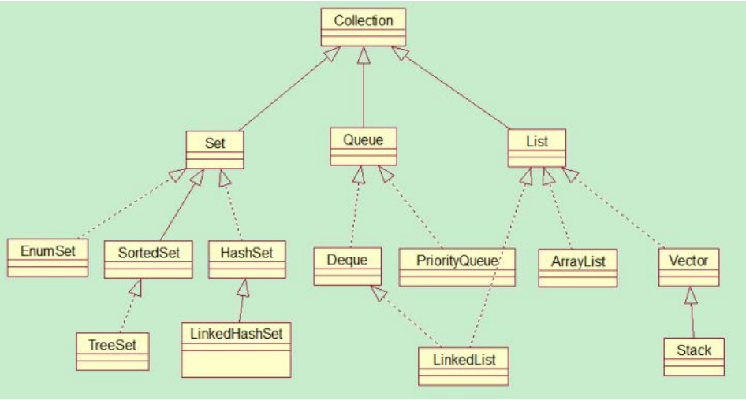
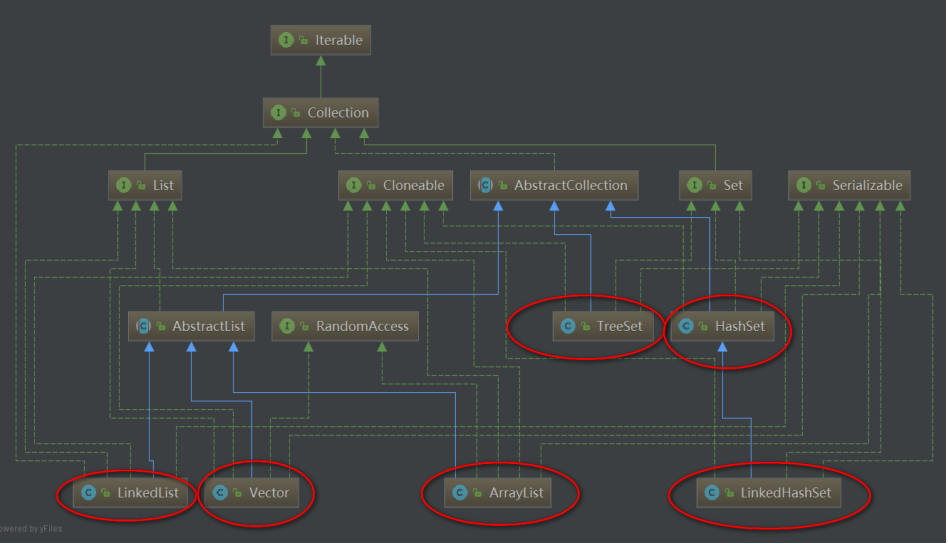
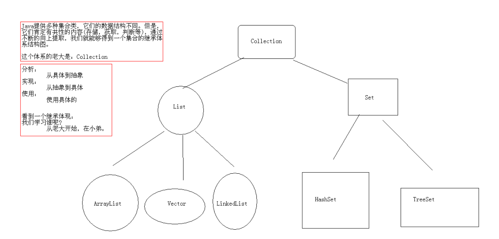
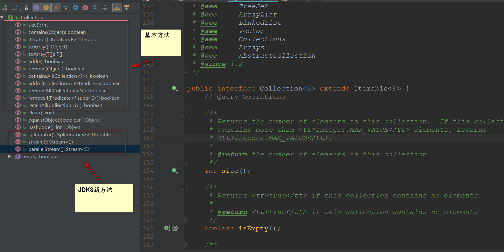
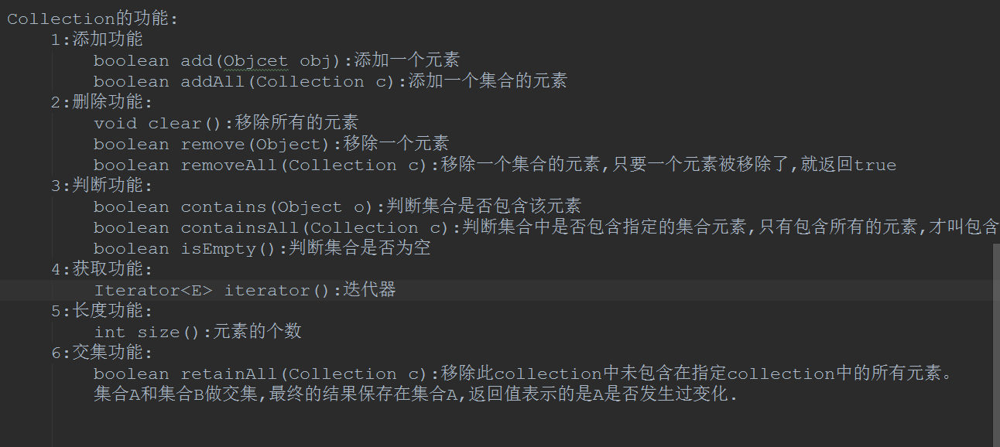

本文章参考学习了(Java3y公众号电子书)
# 为什么要学习集合框架？

在学习集合之前已经学过数组，为何不用数组反而使用集合？

- 由于Java是一门面向对象的语言，就免不了要处理对象，为了方便操作多个对象，那么我们就得把这多个对象存储起来，想要存储多和对象，很容易就想到一个容器来装载

- Java给我们提供了工具去方便我们去操作多和Java对象

# 如何学习Java集合？

- 学习Java集合的目的是方便操作多个对象，而Java给我们提供了一系列的API供我们操作
- 对于Java的API使用有一定的了解后，我们要从面向对象的角度去理解它

- 需要对底层的数据结构有一定的了解

# 常见数据结构对应的特点

# Collection介绍

## 为什么需要Collection
1. Java是一门面向对象语言，就免不了处理对象
2. 为了处理多和对象，那么我们就得吧这多个容器存储起来
3. 想要存储多个对象，很容易就会想到一个容器
4. 常用的容器我们知道有StringBuffer，数组(数组的缺点是长度不可以变)
5. Java提供了集合

## 数组和集合的区别

|数组集合对比| 集合|数组|
|---|---|---|
|长度|长度可变|长度固定|
|元素的数据类型|集合仅仅存储引用类型|数组可以存储基本的数据类型，也可以存储引用类型|

## Collection的由来与功能

* 集合可以存储多个元素，但是对于多个元素我们有不同的需求
    - 多个元素，不能够相同的
    - 多个元素，能够按照某个规则排序

* 针对不同的需求：Java就提供了很多的集合类，多和集合类的数据结构不用。但是结构不重要，重要的是能够存储东西，能够判断、获取
* 将集合共性的东西不断向上提取，最终形成了集合的继承体系Collection

Collection的大致结构体系是这样的：

但是，一般我们要掌握的并不需要那么多，只需要掌握一些常用的集合类就可以了。

再次精减

Collection的基础功能：

Collection功能

