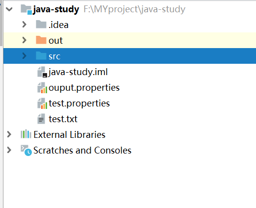
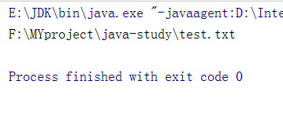
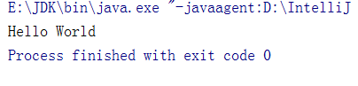
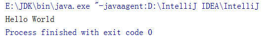
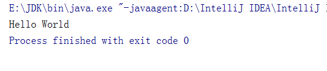
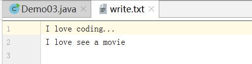

# FileReader读取文件

## 查看文件的相对路径



示例一：查看文件的相对路径

```java
package com.dreamcold.io;

import java.io.File;

public class Demo01 {
    public static void main(String[] args) {
        File file=new File("test.txt");
        System.out.println(file.getAbsolutePath());
    }
}

```

输出:




## 读取txt文件

### 写法一

1. 实例化File类的对象， 指明要操作的文件

2. 提供具体的源

3. 数据的读入，read():返回读入的一个字符，如果达到文件末尾返回-1

4. 关闭流

```java
package com.dreamcold.io;

import java.io.File;
import java.io.FileNotFoundException;
import java.io.FileReader;
import java.io.IOException;

public class Demo01 {
    public static void main(String[] args) throws IOException {
        // 1.实例化File类的对象， 指明要操作的文件
        File file=new File("test.txt");
       //2.提供具体的源

        FileReader fr=new FileReader(file);
        //3.数据的读入，
        //read():返回读入的一个字符，如果达到文件末尾返回-1

        int data=fr.read();
        while (data!=-1){
            System.out.print((char)data);
            data=fr.read();
        }

        //关闭流

        fr.close();

    }
}
```


结果



### 写法二

```java
package com.dreamcold.io;

import java.io.File;
import java.io.FileNotFoundException;
import java.io.FileReader;
import java.io.IOException;

public class Demo01 {
    public static void main(String[] args) throws IOException {
        // 1.实例化File类的对象， 指明要操作的文件
        File file=new File("test.txt");
       //2.提供具体的源

        FileReader fr=new FileReader(file);
        //3.数据的读入，
        //read():返回读入的一个字符，如果达到文件末尾返回-1

        int data;
        while((data=fr.read())!=-1){
            System.out.print((char)data);
        }
        //关闭流

        fr.close();

    }
}
```

输出:



### 写法三-加异常处理

```java
package com.dreamcold.io;

import java.io.File;
import java.io.FileNotFoundException;
import java.io.FileReader;
import java.io.IOException;

public class Demo01 {
    public static void main(String[] args)  {
        FileReader fr=null;
        try {
            // 1.实例化File类的对象， 指明要操作的文件
            File file=new File("test.txt");
            //2.提供具体的源

            fr=new FileReader(file);
            //3.数据的读入，
            //read():返回读入的一个字符，如果达到文件末尾返回-1

            int data;
            while((data=fr.read())!=-1){
                System.out.print((char)data);
            }
            //关闭流
        }catch (IOException e){
            e.printStackTrace();
        }finally {
            try {
                if (fr!=null){
                    fr.close();
                }
            } catch (IOException e) {
                e.printStackTrace();
            }
        }
    }
}

```

**说明点:**

1. read()的理解:返回读入的一一个字符。如果达到文件末尾，返回-1
2. 异常的处理:为了保证流资源-定可以执行关闭操作。需要使用try-catch-finally处理
3. 读入的文件一定要存在，否则就会报FileNotFoundException. |


## FileReader的重载方法read

```java
package com.dreamcold.io;

import java.io.File;
import java.io.FileReader;
import java.io.IOException;

public class Demo02 {
    public static void main(String[] args) {
        FileReader fr=null;
        try {
            File file=new File("test.txt");
            fr=new FileReader(file);
            char[] cbuf=new char[5];
            int len;
            while((len=fr.read(cbuf))!=-1){
                for (int i=0;i<len;i++){
                    System.out.print(cbuf[i]);
                }
            }
        }catch (IOException e){
            e.printStackTrace();
        }finally {
            try {
                if (fr!=null){
                    fr.close();
                }
            }catch (IOException e){
                e.printStackTrace();
            }
        }
    }
}

```

结果:



**注意:**

1. 每次读取5个字符数据大小
2. 读取到末尾的时候，可能不够5个字符了，那么我们要确定这次读取有几个字符，用字符数len循环


## FileReader写出

1. 提供File类的对象，指明写出到的文件
2. 提供FileWriter的对象， 用于数据的写出
3. 写出的操作
4. 流资源的关闭

```java
package com.dreamcold.io;

import java.io.File;
import java.io.FileWriter;
import java.io.IOException;

public class Demo03 {
    public static void main(String[] args) throws IOException {
        //创建文件
        File file=new File("write.txt");
        //创建FileWriter
        FileWriter fw=new FileWriter(file);
        //写入文字
        fw.write("I love coding...\n");
        fw.write("I love see a movie\n");
        //关闭
        fw.close();

    }
}
```

效果:



**注意：**

说明:
1.输出操作，对应的File可以不存在的。并不会报异常
2.File对应的硬盘中的文件

- 如果不存在，在输出的过程中，会自动创建此文件。
- File,对应的硬盘中的文件如果存在:
  - 如果流使用的构造器是: FileWriter(file, false) / FileWriter(file):原有文件的覆盖
  - 如果使用的构造器是: FileWriter(file, true):不会对原有文件覆盖，而是在原有文件基础上追加内容


## 文件的复制操作

1. 创建File类的对象，指明读入和写出的文件
2. 创建输入流和输出流的对象
3. 数据的读入和写出操作
4. 关闭流资源

```java
package com.dreamcold.io;

import java.io.File;
import java.io.FileReader;
import java.io.FileWriter;
import java.io.IOException;

public class Demo04 {
    public static void main(String[] args) {
        FileReader fr=null;
        FileWriter fw=null;
        try {
            File srcFile=new File("test.txt");
            File destFile=new File("test1.txt");

            fr=new FileReader(srcFile);
            fw=new FileWriter(destFile);

            char[] buf=new char[5];
            int len;
            while((len=fr.read(buf))!=-1){
                fw.write(buf,0,len);
            }
        }catch (IOException e){
            e.printStackTrace();
        }finally {
            try {
                if (fr!=null){
                    fr.close();
                }

            } catch (IOException e) {
                e.printStackTrace();
            }
            try {
                if (fw!=null){
                    fw.close();
                }

            } catch (IOException e) {
                e.printStackTrace();
            }
        }
    }
}

```

效果:


注意：

1. 字符流主要是用来处理字符的
2. 无法处理二进制的图片文件的复制2