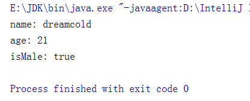

# 数据流

## 什么是数据流

为了方便地操作Java语言的基本数据类型和String的数据， 可以使用数据流。数据流有两个类: (用于读取和写出基本数据类型、String 类的数据)

- DatalnputStream和DataOutputStream
- 分别“套接”在InputStream和OutputStream子类的流上
- 作用:用于读取或写出基本数据类型的变量或字符串

## DataInputStream中的方法

- boolean readBoolean()
- byte readByte()
- char readChar()
- float readFloat()
- double readDouble()
- short readShort()
- long readLone()
- int readInt()
- String readUTF()
- void readully(byte[] b)

## DataOutputStream中的方法

- 将上述的方法的read改为相应的write即可。


## 样例

### 写入

1. 样例一：将内存中的字符审、基本数据类型的变量写出到文件中。

   **注意:处理异常的话，仍然应该使用try-catch-finally.|**

```java
package com.dreamcold.io;

import java.io.DataOutputStream;
import java.io.FileNotFoundException;
import java.io.FileOutputStream;
import java.io.IOException;

public class Demo16 {
    public static void main(String[] args) throws IOException {
       DataOutputStream dos = new DataOutputStream(new FileOutputStream("data.txt"));
       dos.writeUTF("dreamcold");
       dos.writeInt(21);
       dos.writeBoolean(true);
       dos.flush();
       dos.close();
    }
}
```

### 读取

注意点:读取不同类型的数据的顺序要与当初写入文件时，保存的数据的顺序-致!

```java
package com.dreamcold.io;

import java.io.DataInputStream;
import java.io.FileInputStream;
import java.io.FileNotFoundException;
import java.io.IOException;

public class Demo17 {
    public static void main(String[] args) throws IOException {
        DataInputStream dis=new DataInputStream(new FileInputStream("data.txt"));
        String name=dis.readUTF();
        int age=dis.readInt();
        boolean isMale=dis.readBoolean();
        System.out.println("name: "+name);
        System.out.println("age: "+age);
        System.out.println("isMale: "+isMale);

    }
}
```

结果：

