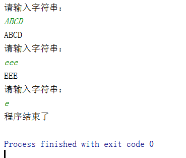
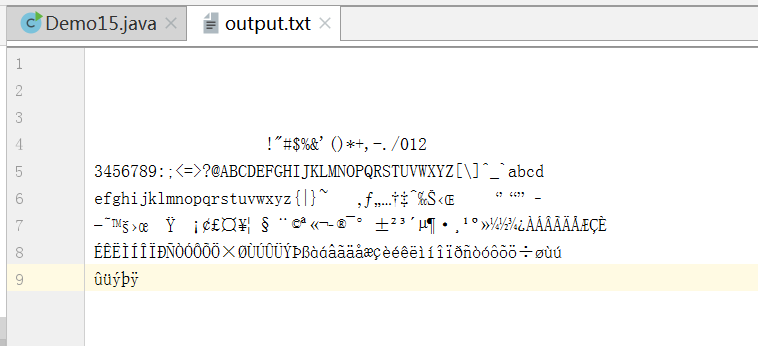

# 标准输入输出流

## 什么是标准输入输出流

- System.in和System.out分别代表了系统标准的输入和输出设备，System还包括了err这个属性
- 默认输入设备是:键盘，输出设备是:显示器
- System.in的类型是InputStream
- System.out的类型是PrintStream,其是OutputStream的子类
- FilterOutputStream的子类
- System类的setIn(InputStream is) / setout(PrintStream is)方式重新指定输入和输出的流。

## 练习

从键盘输入字符串，要求将读取到的整行字符串转成大写输出。然后继续进行输入操作，
直至当输入“e”或者“exit"时，退出程序。


使用System. in实现。System. in--->转换流 --->BufferedReader 的readline()

```java
package com.dreamcold.io;

import java.io.BufferedReader;
import java.io.IOException;
import java.io.InputStreamReader;

public class Demo14 {
    public static void main(String[] args) {
        InputStreamReader isr=new InputStreamReader(System.in);
        BufferedReader br=new BufferedReader(isr);
        while (true){
            System.out.println("请输入字符串：");
            String data=null;
            try {
                data=br.readLine();
            } catch (IOException e) {
                e.printStackTrace();
            }
            try {
                Thread.sleep(5);
            } catch (InterruptedException e) {
                e.printStackTrace();
            }
            if (data.equalsIgnoreCase("e")||data.equalsIgnoreCase("exit")){
                System.out.println("程序结束了");
                break;
            }
            String upper=data.toUpperCase();
            System.out.println(upper);
        }
    }
}

```

效果：



除此之外还可以用使用Scanner实现，调用next()返回一个字符串实现


## 打印流

- 实现将基本数据类型的数据格式转化为字符串输出

- 打印流: PrintStream和PrintWriter
  - 提供了一系列重载的print()和println()方法，用于多种数据类型的输出
  - PrintStream和PrintWriter的输出不会抛出IOException异常
  - PrintStream和PrintWriter有自动flush功能
  - PrintStream打印的所有字符都使用平台的默认字符编码转换为字节。
  - 在需要写入字符而不是写入字节的情况下，应该使用PrintWriter类。
  - System.out返回的是PrintStream的实例

- 提供了一系列重载的print()和println()

```java
package com.dreamcold.io;

import java.io.FileNotFoundException;
import java.io.FileOutputStream;
import java.io.PrintStream;

public class Demo15 {
    public static void main(String[] args) {
        PrintStream ps=null;
        try {
            FileOutputStream fos=new FileOutputStream("output.txt");
            //创建打印输出流，设置为自动刷新的模式，吸入换行符或者字节'\n，的时候都会刷新输出的缓冲区
            ps=new PrintStream(fos,true);
            if (ps!=null){
               System.setOut(ps);
            }
            for (int i=0;i<=255;i++){
                System.out.println((char)i);
                if (i%50==0){
                    System.out.println();
                }
            }
        }catch (FileNotFoundException e){
            e.printStackTrace();
        }finally {
            if (ps!=null){
                ps.close();
            }
        }
    }
}

```

效果：

