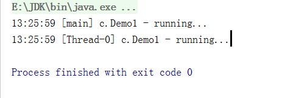
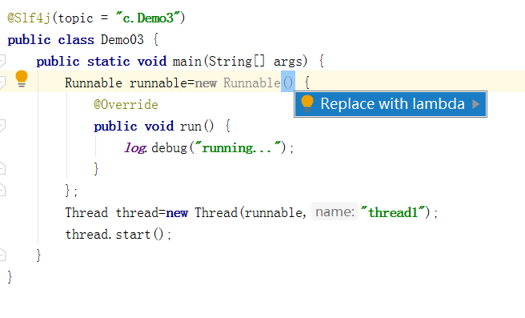

# 创建线程

- 每个Java程序在启动的时候都创建了一个线程这个线程就是主方法线程
- 如果在主线程之外，还想创建其他的线程，那么可以采用如下的方法创建线程

## 方法一：直接使用Thread

- 创建Thread对象还没有与操作系统所说的线程相互关联
- 线程还没有被任务调度器交给CPU去执行
- 之后要启动线程调用start方法，交给任务调度器，让其分配时间片，让CPU去执行

```java
package com.dreamcold.createthread;
public class Demo01 {
    public static void main(String[] args) {
        Thread t=new Thread(){
            @Override
            public void run() {
                //要执行任务的代码
            }
        };
        t.start();
    }
}
```

例如：

```java
package com.dreamcold.createthread;

import lombok.extern.slf4j.Slf4j;

@Slf4j(topic = "c.Demo1")
public class Demo01 {
    public static void main(String[] args) {
        Thread t=new Thread(){
            @Override
            public void run() {
                //要执行任务的代码
                log.debug("running...");
            }
        };
        t.start();
        log.debug("running...");
    }
}

```

输出：



- 两个线程打印running...
- 创建多个线程的时候使用setName方法来指定线程名称

## 方法二，使用 Runnable 配合 Thread

- 把【线程】和【任务】（要执行的代码）分开
- Thread 代表线程
- Runnable 可运行的任务（线程要执行的代码）

```java
package com.dreamcold.createthread;

public class Demo02 {
    public static void main(String[] args) {
        Runnable runnable=new Runnable() {
            @Override
            public void run() {
                //要执行的任务
                System.out.println("running");
            }
        };
        //创建线程对象
        Thread thread=new Thread(runnable);
        //启动线程
        thread.start();
    }
}
```

例如：

```java
package com.dreamcold.createthread;

import lombok.extern.slf4j.Slf4j;

@Slf4j(topic = "c.Demo3")
public class Demo03 {
    public static void main(String[] args) {
        Runnable runnable=new Runnable() {
            @Override
            public void run() {
                log.debug("running...");
            }
        };
        Thread thread=new Thread(runnable,"thread1");
        thread.start();
    }
}
```

结果：

```
com.dreamcold.createthread.Demo03
20:50:37 [thread1] c.Demo3 - running...

Process finished with exit code 0

```

在Java8之后可以用lambda 来精简代码

```java
package com.dreamcold.createthread;

import lombok.extern.slf4j.Slf4j;

@Slf4j(topic = "c.Demo04")
public class Demo04 {
    public static void main(String[] args) {
        //创建任务对象
        Runnable task=()->{
          log.debug("hello");
        };
        //参数1 是任务对象 参数2 是线程名字，推荐
        Thread thread=new Thread(task,"task");
        thread.start();
    }
}
```

运行结果

```
21:11:18 [task] c.Demo04 - hello

Process finished with exit code 0
```

- 在Runable接口中只有一个public abstract方法
- 在JDK中会将只有一个函数方法的接口加上一个@FunctionalInterface注解
- 假如一个接口中有@FunctionalInterface注解就可以用lambda表达式简化，而一个接口中包含多个方法这种是没有办法用Lambda简化的

注：

- Idea中将鼠标放在Runnable接口位置，按住alt+enter键，可以将实现Runable接口替换成为lambda函数
- 如果lambda函数只有一行表达式，那么最外层可以不写{},否则要加多层{}
- lambda函数可以简化代码



## 原理之 Thread 与 Runnable 的关系

分析 Thread 的源码，理清它与 Runnable 的关系
小结

- 方法1 是把线程和任务合并在了一起，方法2 是把线程和任务分开了
- 用 Runnable 更容易与线程池等高级 API 配合
- 用 Runnable 让任务类脱离了 Thread 继承体系，更灵活


## 方法三，FutureTask 配合 Thread

FutureTask 能够接收 Callable 类型的参数，用来处理有返回结果的情况

```java
package com.dreamcold.createthread;

import lombok.extern.slf4j.Slf4j;

import java.util.concurrent.Callable;
import java.util.concurrent.ExecutionException;
import java.util.concurrent.FutureTask;

@Slf4j(topic = "c.Demo05")
public class Demo05 {
    public static void main(String[] args) throws ExecutionException, InterruptedException {
        // 创建任务对象
        FutureTask<Integer> futureTask=new FutureTask(new Callable() {
            @Override
            public Object call() throws Exception {
                log.debug("running...");
                Thread.sleep(1000);
                return 100;
            }
        });
        // 参数1 是任务对象; 参数2 是线程名字，推荐
        Thread thread=new Thread(futureTask,"t1");
        thread.start();
        // 主线程阻塞，同步等待 task 执行完毕的结果
        log.debug("{}",futureTask.get());
    }
}
```

输出

```
19:37:49 [t1] c.Demo05 - running...
19:37:50 [main] c.Demo05 - 100
```


