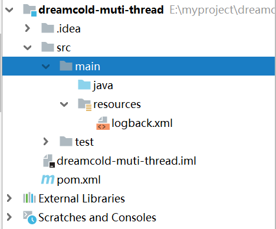

# 前置知识

- 希望你不是一个初学者
- 线程安全问题，需要你接触过 Java Web 开发、Jdbc 开发、Web 服务器、分布式框架时才会遇到
- 基于 JDK 8，最好对函数式编程、lambda 有一定了解
- 采用了 slf4j 打印日志，这是好的实践
- 采用了 lombok 简化 java bean 编写
- 给每个线程好名字，这也是一项好的实践

pom.xml依赖如下：

```xml
<properties>
<maven.compiler.source>1.8</maven.compiler.source>
<maven.compiler.target>1.8</maven.compiler.target>
</properties>
<dependencies>
    
<dependency>
<groupId>org.projectlombok</groupId>
<artifactId>lombok</artifactId>
<version>1.18.10</version>
</dependency>
<dependency>
<groupId>ch.qos.logback</groupId>
<artifactId>logback-classic</artifactId>
<version>1.2.3</version>
</dependency>
</dependencies>
```

logback.xml 配置如下

```xml
<?xml version="1.0" encoding="UTF-8"?>
<configuration
xmlns="http://ch.qos.logback/xml/ns/logback"
xmlns:xsi="http://www.w3.org/2001/XMLSchema-instance"
xsi:schemaLocation="http://ch.qos.logback/xml/ns/logback logback.xsd">
<appender name="STDOUT" class="ch.qos.logback.core.ConsoleAppender">
<encoder>
<pattern>%date{HH:mm:ss} [%t] %logger - %m%n</pattern>
</encoder>
</appender>
<logger name="c" level="debug" additivity="false">
<appender-ref ref="STDOUT"/>
</logger>
<root level="ERROR">
<appender-ref ref="STDOUT"/>
</root>
</configuration>
```

源代码目录：

