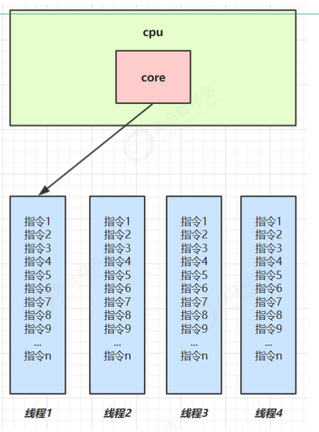
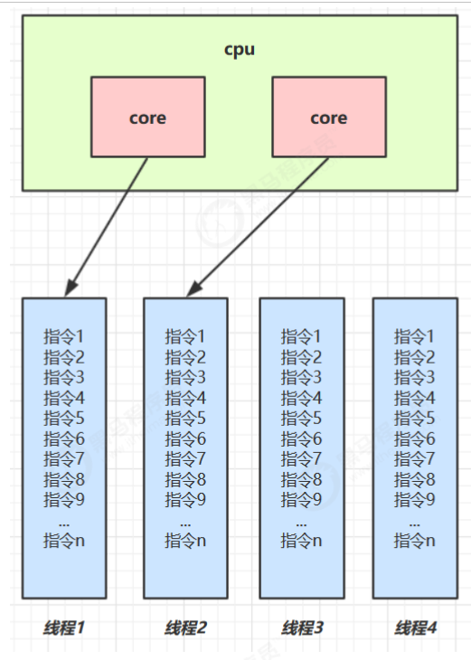

# 并行和并发的概念

## 单核CPU

- 线程其实是由一系列的指令组成的
- 当线程中的所有的指令的执行完之后，整个线程就被执行完了
- 现在四个线程都被执行起来了，都希望CPU执行自己的代码
- 那么CPU有没有应对同时执行四个线程的能力呢？
- 答案是有的，操作系统有一个组件，叫做任务调度器，任务调度器就会把CPU的时间分给不同的的线程去使用，换句话说就是让四个线程轮流去使用CPU，比如先分配给线程1、之后依次分配给线程2、...、线程n
- 比如线程当时线程1还没有执行完，比如执行到第三行代码，之后再回到执行线程1的时候，它会从第三行代码后面开始执行
- 这种同一个时间面对多件事情的能力，我们就称作是并发的能力
- 我们平时可以在听歌的时候去敲代码，好像两件事是同时运行的，但是实际上单核cpu的话，还是会串行执行，cpu分配给不同线程时间片，只不过时间片非常短，导致让我们感觉是在并行执行

| CPU  | 时间片 1 | 时间片 2 | 时间片 3 | 时间片 4 |
| ---- | -------- | -------- | -------- | -------- |
| core | 线程 1   | 线程 2   | 线程 3   | 线程 4   |

- 单核 cpu 下，线程实际还是 串行执行 的。
- 操作系统中有一个组件叫做任务调度器，将 cpu 的时间片（windows下时间片最小约为 15 毫秒）分给不同的程序使用，只是由于 cpu 在线程间（时间片很短）的切换非常快，人类感觉是 同时运行的 。
- 总结为一句话就是： 微观串行，宏观并行 ，**一般会将这种 线程轮流使用 CPU 的做法称为并发， concurrent**

## 多核CPU

- 当前我们的电脑可能是4核或者2核，每一个核心，核心1在执行线程1的指令的时候，核心2页可以同时执行线程2中的指令
- 这种真正可以同时运行多个线程的能力成为并行，大多数时候，我们既有并发又有并行
- 但是一般来讲，线程树是大于核心数的，我们这里有两个核心，但是要处理4个线程，假如核心1正在执行线程3，执行一段时间片后教给线程1去运行，核心2此时正在执行线程4，执行完时间片之后切换会线程2运行
- 多核 cpu下，每个 核（core） 都可以调度运行线程，这时候线程可以是并行的

| CPU   | 时间片1 | 时间片2 | 时间片3 | 时间片4 |
| ----- | ------- | ------- | ------- | ------- |
| core1 | 线程1   | 线程1   | 线程3   | 线程3   |
| core2 | 线程2   | 线程4   | 线程2   | 线程4   |

引用 Rob Pike 的一段描述：

- 并发（concurrent）是同一时间应对（dealing with）多件事情的能力
- 并行（parallel）是同一时间动手做（doing）多件事情的能力

例子

- 家庭主妇做饭、打扫卫生、给孩子喂奶，她一个人轮流交替做这多件事，这时就是并发
- 家庭主妇雇了个保姆，她们一起这些事，这时既有并发，也有并行（这时会产生竞争，例如锅只有一口，一
  个人用锅时，另一个人就得等待）

- 雇了3个保姆，一个专做饭、一个专打扫卫生、一个专喂奶，互不干扰，这时是并行

Rob Pike 资料

- golang 语言的创造者
- Rob Pike - [百度百科](https://baike.baidu.com/item/%E7%BD%97%E5%B8%83%C2%B7%E6%B4%BE%E5%85%8B/10983505?fr=aladdin)

