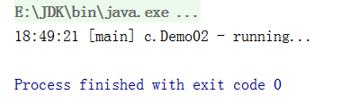
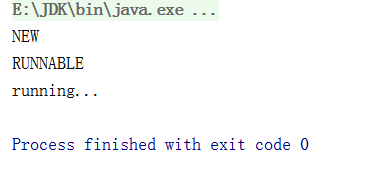
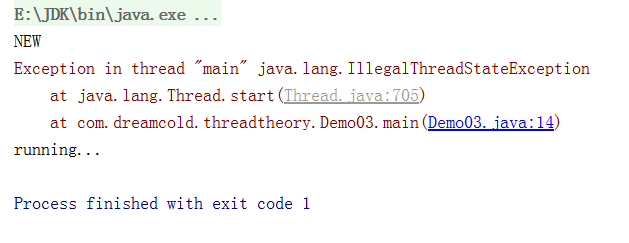

# 线程的常见方法

## 常用方法列表

| 方法名           | static | 功能说明                                                    | 注意                                                         |
| ---------------- | ------ | ----------------------------------------------------------- | ------------------------------------------------------------ |
| start()          |        | 启动一个新线程，在新的线程运行 run 方法中的代码             | start 方法只是让线程进入就绪，里面代码不一定立刻运行（CPU 的时间片还没分给它）。每个线程对象的start方法只能调用一次，如果调用了多次会出现IllegalThreadStateException |
| run()            |        | 新线程启动后会调用的方法                                    | 如果在构造 Thread 对象时传递了 Runnable 参数，则线程启动后会调用 Runnable 中的 run 方法，否则默认不执行任何操作。但可以创建 Thread 的子类对象，来覆盖默认行为 |
| join()           |        | 等待线程运行结束                                            |                                                              |
| join(long n)     |        | 等待线程运行结束,最多等待 n秒                               |                                                              |
| getId()          |        | 获取线程长整型的 id                                         | id 唯一                                                      |
| getName()        |        | 获取线程名                                                  |                                                              |
| setName(String)  |        | 修改线程名                                                  |                                                              |
| getPriority()    |        | 获取线程优先级                                              | java中规定线程优先级是1~10 的整数，较大的优先级<br/>能提高该线程被 CPU 调度的机率 |
| setPriority(int) |        | 修改线程优先级                                              |                                                              |
| getState()       |        | 获取线程状态                                                | Java 中线程状态是用 6 个 enum 表示，分别为：NEW, RUNNABLE, BLOCKED, WAITING,TIMED_WAITING, TERMINATED |
| isInterrupted()  |        | 判断是否被打断                                              | 不会清除 打断标记                                            |
| isAlive()        |        | 线程是否存活（还没有运行完毕）                              |                                                              |
| interrupt()      |        | 打断线程                                                    | 如果被打断线程正在 sleep，wait，join 会导致被打断的线程抛出 InterruptedException，并清除 打断标记 ；如果打断的正在运行的线程，则会设置 打断标记 ；park 的线程被打断，也会设置 打断标记 |
| interrupted()    |        | 判断当前线程是否被打断                                      | 会清除 打断标记                                              |
| currentThread()  |        | 获取当前正在执行的线程                                      |                                                              |
| sleep(long n)    |        | 让当前执行的线程休眠n毫秒，休眠时让出 cpu的时间片给其它线程 |                                                              |
| yield()          |        | 提示线程调度器让出当前线程对CPU的使用                       | 主要是为了测试和调试                                         |


## start与run方法

1. start主要是用来启动线程
2. run是线程启动要执行的代码

### 调用run方法

```java
package com.dreamcold.threadtheory;

import lombok.extern.slf4j.Slf4j;

@Slf4j(topic = "c.Demo02")
public class Demo02 {
    public static void main(String[] args) {
        Thread t1=new Thread("t1"){
            @Override
            public void run() {
                super.run();
                log.debug("running...");
            }
        };
        t1.run();
    }
}
```

输出:



实际上通过直接调用run方法并没有创建一个线程，依旧是主线程main在执行这部分的代码，并不能像异步那样提高我们整个异步的效果。

```java
package com.dreamcold.threadtheory;

public class Demo03 {
    public static void main(String[] args) {
        Thread t1=new Thread("t1"){
            @Override
            public void run() {
                super.run();
                System.out.println("running...");
            }
        };
        System.out.println(t1.getState());
        t1.start();
        System.out.println(t1.getState());
    }
}
```

结果



1. 在调用start方法之前整个线程处于new状态，即新建状态
2. 在调用start方法之后整个线程处于runnable状态,可以被cpu调用执行

假如我们两次调用start方法会导致：

```java
package com.dreamcold.threadtheory;

public class Demo03 {
    public static void main(String[] args) {
        Thread t1=new Thread("t1"){
            @Override
            public void run() {
                super.run();
                System.out.println("running...");
            }
        };
        System.out.println(t1.getState());
        t1.start();
        t1.start();
        System.out.println(t1.getState());
    }
}
```

现象会抛出:java.lang.IllegalThreadStateException异常

