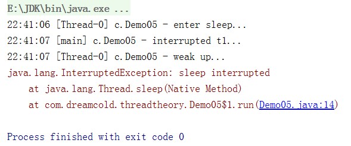

# 线程的常见方法

## 常用方法列表

| 方法名           | static | 功能说明                                                    | 注意                                                         |
| ---------------- | ------ | ----------------------------------------------------------- | ------------------------------------------------------------ |
| start()          |        | 启动一个新线程，在新的线程运行 run 方法中的代码             | start 方法只是让线程进入就绪，里面代码不一定立刻运行（CPU 的时间片还没分给它）。每个线程对象的start方法只能调用一次，如果调用了多次会出现IllegalThreadStateException |
| run()            |        | 新线程启动后会调用的方法                                    | 如果在构造 Thread 对象时传递了 Runnable 参数，则线程启动后会调用 Runnable 中的 run 方法，否则默认不执行任何操作。但可以创建 Thread 的子类对象，来覆盖默认行为 |
| join()           |        | 等待线程运行结束                                            |                                                              |
| join(long n)     |        | 等待线程运行结束,最多等待 n秒                               |                                                              |
| getId()          |        | 获取线程长整型的 id                                         | id 唯一                                                      |
| getName()        |        | 获取线程名                                                  |                                                              |
| setName(String)  |        | 修改线程名                                                  |                                                              |
| getPriority()    |        | 获取线程优先级                                              | java中规定线程优先级是1~10 的整数，较大的优先级<br/>能提高该线程被 CPU 调度的机率 |
| setPriority(int) |        | 修改线程优先级                                              |                                                              |
| getState()       |        | 获取线程状态                                                | Java 中线程状态是用 6 个 enum 表示，分别为：NEW, RUNNABLE, BLOCKED, WAITING,TIMED_WAITING, TERMINATED |
| isInterrupted()  |        | 判断是否被打断                                              | 不会清除 打断标记                                            |
| isAlive()        |        | 线程是否存活（还没有运行完毕）                              |                                                              |
| interrupt()      |        | 打断线程                                                    | 如果被打断线程正在 sleep，wait，join 会导致被打断的线程抛出 InterruptedException，并清除 打断标记 ；如果打断的正在运行的线程，则会设置 打断标记 ；park 的线程被打断，也会设置 打断标记 |
| interrupted()    |        | 判断当前线程是否被打断                                      | 会清除 打断标记                                              |
| currentThread()  |        | 获取当前正在执行的线程                                      |                                                              |
| sleep(long n)    |        | 让当前执行的线程休眠n毫秒，休眠时让出 cpu的时间片给其它线程 |                                                              |
| yield()          |        | 提示线程调度器让出当前线程对CPU的使用                       | 主要是为了测试和调试                                         |


## start与run方法

1. start主要是用来启动线程
2. run是线程启动要执行的代码

### 调用run方法

```java
package com.dreamcold.threadtheory;

import lombok.extern.slf4j.Slf4j;

@Slf4j(topic = "c.Demo02")
public class Demo02 {
    public static void main(String[] args) {
        Thread t1=new Thread("t1"){
            @Override
            public void run() {
                super.run();
                log.debug("running...");
            }
        };
        t1.run();
    }
}
```

输出:


### 调用start方法

实际上通过直接调用run方法并没有创建一个线程，依旧是主线程main在执行这部分的代码，并不能像异步那样提高我们整个异步的效果。

```java
package com.dreamcold.threadtheory;

public class Demo03 {
    public static void main(String[] args) {
        Thread t1=new Thread("t1"){
            @Override
            public void run() {
                super.run();
                System.out.println("running...");
            }
        };
        System.out.println(t1.getState());
        t1.start();
        System.out.println(t1.getState());
    }
}
```

结果


1. 在调用start方法之前整个线程处于new状态，即新建状态
2. 在调用start方法之后整个线程处于runnable状态,可以被cpu调用执行

假如我们两次调用start方法会导致：

```java
package com.dreamcold.threadtheory;

public class Demo03 {
    public static void main(String[] args) {
        Thread t1=new Thread("t1"){
            @Override
            public void run() {
                super.run();
                System.out.println("running...");
            }
        };
        System.out.println(t1.getState());
        t1.start();
        t1.start();
        System.out.println(t1.getState());
    }
}
```

现象会抛出:java.lang.IllegalThreadStateException异常


## Sleep方法

1. 调用 sleep 会让当前线程从 Running 进入 Timed Waiting 状态（阻塞），一个有时限的等待状态，要给其传递一个参数，告诉要睡多久，时间到了，该线程就会苏醒
3. 睡眠结束后的线程未必会立刻得到执行
4. 建议用 TimeUnit 的 sleep 代替 Thread 的 sleep 来获得更好的可读性
4. 让线程处于休眠状态，休眠过程中相当于放弃了对CPU的使用
5. 谁调用sleep方法谁就休眠

### Sleep休眠

```java
package com.dreamcold.threadtheory;

import lombok.extern.slf4j.Slf4j;

@Slf4j(topic = "c.Demo04")
public class Demo04 {
    public static void main(String[] args) {
        Thread t=new Thread(){
            @Override
            public void run() {
                try {
                    Thread.sleep(2000);
                } catch (InterruptedException e) {
                    e.printStackTrace();
                }
            }
        };
        t.setName("t1");
        t.start();
        log.debug("t1's state is:{}",t.getState());
        try {
            Thread.sleep(500);
        } catch (InterruptedException e) {
            e.printStackTrace();
        }

        log.debug("t1's state is:{}",t.getState());

    }
}

```

运行结果:


### sleep打断

其它线程可以使用 interrupt 方法打断正在睡眠的线程，这时 sleep 方法会抛出 InterruptedException

描述：主线程睡眠1秒后唤醒t1线程

```java
package com.dreamcold.threadtheory;

import lombok.extern.slf4j.Slf4j;
import lombok.var;

@Slf4j(topic = "c.Demo05")
public class Demo05 {
    public static void main(String[] args) throws InterruptedException {
        Thread t=new Thread(){
            @Override
            public void run() {
                log.debug("enter sleep...");
                try {
                    Thread.sleep(2000);
                } catch (InterruptedException e) {
                    log.debug("weak up...");
                    e.printStackTrace();
                }
            }
        };
        t.start();
        Thread.sleep(1000);
        log.debug("interrupted t1...");
        t.interrupt();

    }
}
```

结果：



### sleep可读性

睡眠结束后的线程未必会立刻得到执行

 建议用 TimeUnit 的 sleep 代替 Thread 的 sleep 来获得更好的可读性

```java
package com.dreamcold.threadtheory;

import java.util.concurrent.TimeUnit;

public class Demo06 {
    public static void main(String[] args) throws InterruptedException {
        TimeUnit.SECONDS.sleep(2);
        Thread.sleep(2000);
    }
}
```


### sleep应用

防止CPU占用100%

在没有利用cpu来计算时，不要让while(true)空转浪费cpu,这时可以使用yield或sleep来让出cpu的使用
权给其他程序

```java
package com.dreamcold.threadtheory;

public class Demo08 {
    public static void main(String[] args) {
        while (true){
            try {
                Thread.sleep(50);
            }catch (InterruptedException e){
                e.printStackTrace();
            }
        }
    }
}

```

- 可以用wait或条件变量达到类似的效果

- 不同的是，后两种都需要加锁，并且需要相应的唤醒操作，一般适用于要进行同步的场景
- sleep适用于无需锁同步的场景

## yield

1. 调用 yield 会让当前线程从 Running 进入 Runnable 就绪状态，然后调度执行其它线程
2. 具体的实现依赖于操作系统的任务调度器,这时候没其他进程要运行，想让没让出去
3. 任务调度器会分配时间片给就绪状态的线程，但是不会分时间片给阻塞状态的线程，即与sleep方法的区别
4. sleep有休眠时间，而yield没有


## 线程优先级

- 线程优先级会提示（hint）调度器优先调度该线程，但它仅仅是一个提示，调度器可以忽略它
- 如果 cpu 比较忙，那么优先级高的线程会获得更多的时间片，但 cpu 闲时，优先级几乎没作用
- 线程优先级从1~10,最小优先级1，最大优先级10，默认优先级5

```java
package com.dreamcold.threadtheory;

public class Demo07 {
    public static void main(String[] args) {
        Runnable task1=()->{
            int count=0;
            for (;;){
                System.out.println("------>1"+count++);
            }
        };

        Runnable task2=()->{
            int count=0;
            Thread.yield();
            for (;;){
                System.out.println("             ------------->2"+count++);
            }
        };

        Thread t1=new Thread(task1);
        Thread t2=new Thread(task2);
        t1.setPriority(Thread.MIN_PRIORITY);
        t2.setPriority(Thread.MAX_PRIORITY);
        t1.start();
        t2.start();

    }
}

```

yield和设置优先级都不能真正控制线程的调度，调度主要有任务调度器决定


## join方法

### join方法的功能

下面的代码执行，打印 r 是什么？

```java
package com.dreamcold.threadtheory;

import lombok.extern.slf4j.Slf4j;

@Slf4j(topic = "c.Demo09")
public class Demo09 {

    static int r=0;

    public static void main(String[] args) {
        test1();
    }

    public static void test1(){
        log.debug("start");
        Thread t1=new Thread(()->{
            log.debug("start");
            try {
                Thread.sleep(1);
            } catch (InterruptedException e) {
                e.printStackTrace();
            }
            log.debug("outcome");
            r=10;
        },"t1");
        t1.start();
        log.debug("result is:{}",r);
        log.debug("end");
    }
}

```

结果:


分析

- 因为主线程和线程 t1 是并行执行的，t1 线程需要 1 秒之后才能算出 r=10
- 而主线程一开始就要打印 r 的结果，所以只能打印出 r=0


解决方法

- 用 sleep 行不行？为什么？
- 用 join，加在 t1.start() 之后即可
- 个人理解：保证线程执行的先后顺序

```java
package com.dreamcold.threadtheory;

import lombok.extern.slf4j.Slf4j;

@Slf4j(topic = "c.Demo09")
public class Demo09 {

    static int r=0;

    public static void main(String[] args) {
        test1();
    }

    public static void test1(){
        log.debug("start");
        Thread t1=new Thread(()->{
            log.debug("start");
            try {
                Thread.sleep(1);
            } catch (InterruptedException e) {
                e.printStackTrace();
            }
            log.debug("outcome");
            r=10;
        },"t1");
        t1.start();
        try {
            t1.join();// 主线程等待t线程运行结束
        } catch (InterruptedException e) {
            e.printStackTrace();
        }
        log.debug("result is:{}",r);
        log.debug("end");
    }
}

```

结果:


### join方法的应用


