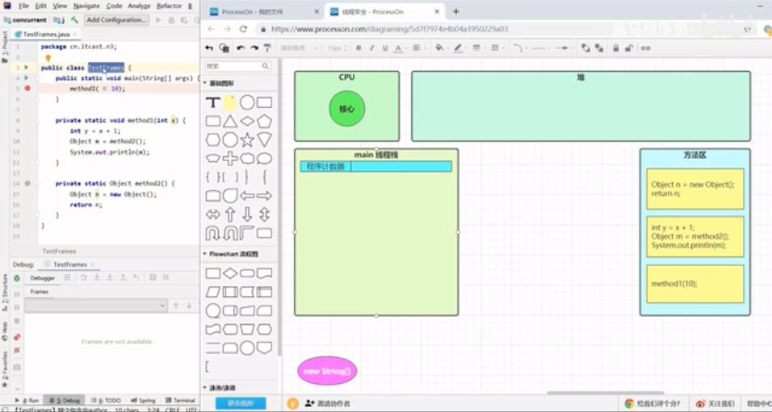
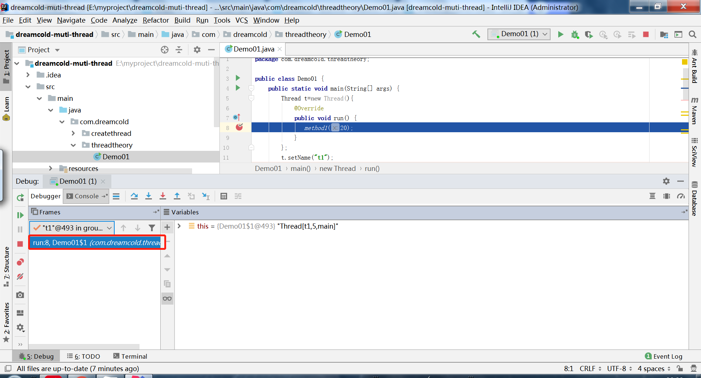

# 线程运行的原理

## 栈与栈帧

Java Virtual Machine Stacks （Java 虚拟机栈）
我们都知道 JVM 中由堆、栈、方法区所组成，其中栈内存是给谁用的呢？其实就是线程，每个线程启动后，虚拟
机就会为其分配一块栈内存。

- 每个栈由多个栈帧（Frame）组成，对应着每次方法调用时所占用的内存
- 每个线程只能有一个活动栈帧，对应着当前正在执行的那个方法


演示代码:

```java
package com.dreamcold.threadtheory;

public class Demo01 {
    public static void main(String[] args) {
        method1(10);
    }

    public  static  void method1(int x){
        int y=x+1;
        Object m=method2();
        System.out.println(m);
    }

    public static  Object method2(){
        Object o=new Object();
        return o;
    }
}
```


- step over F8


## 栈帧图解

1. 类加载，将代码加载到虚拟机，加载位置在方法区，对应method1,method2的代码，实际上是二进制源代码，但是为了方便理解，这里写源代码



2. JVM启动一个Main的主线程，分配线程的内存，线程交给任务调度器执行，CPU分配时间片给主线程，就允许主线程的代码，系统为Main方法分配栈帧内存，栈帧内存包括了局部变量表比如参数args,返回地址、锁记录、操作数栈组成，局部变量表对于方法内的局部变量和方法参数


3. 比如在这里，main方法中的参数是String[]的类型，JVM在堆中开辟内存空间，传递给我们的args,代表了命令行后的参数信息,虚拟机会产生一个args的数组对象，引用指向堆中的new String[].


4. 返回地址对应的是程序的退出地址,主方法执行结束。之后将下一部分要执行的代码，比如method1放到程序计数器PC中，程序就会知道接下来会去执行method1.

5. 调用method1方法会压栈进来一个新的栈帧，method1中的局部变量表中包含了x,y,m。


6. 主方法在执行完method1之后会继续向下执行，所以method1的栈帧中的返回地址应该指向方法区method1的代码部分。，以便继续执行。在栈帧创建的时候内存就会被提前分配好，相当于做好了准备的工作。


7. 主方法会把10传递过来`x=10`,之后再执行method1中的每一行代码，接下来执行的第一行代码就是`int y=x+1;`,同样其也是先被读取到程序计数器，由CPU去执行
8. CPU执行的结果就是`y=11`,再执行下一条代码，发现又要调用其他的方法，那么Java虚拟机就会再次产生一个栈帧给method2用，变量表中的创建n，记录一下method2的返回地址


9. 在堆中创建一个对象Object,引用地址指向对应的对象


10. 该method2返回之后，methid1中的变量m指向对应的堆中的Object


11. method2执行完之后，对应的栈帧弹栈，PC计数器执行method1中的` System.out.println(m);`,之后method1就执行完了，根据返回地址找到之后要执行的代码,回到主方法继续执行，该代码之后没有其他代码了整个程序就运行结束了


## 多线程

```java
package com.dreamcold.threadtheory;

public class Demo01 {
    public static void main(String[] args) {
        Thread t=new Thread(){
            @Override
            public void run() {
               method1(20);
            }
        };
        t.setName("t1");
        t.start();
        method1(10);
    }

    public  static  void method1(int x){
        int y=x+1;
        Object m=method2();
        System.out.println(m);
    }

    public static  Object method2(){
        Object o=new Object();
        return o;
    }
}
```

1. 在如图的位置来进行加入断点，并注意在断点的位置右键来选择多线程的模式，注意两个断点都要进行如下的设置


2. 目前是停在了主线程的method1中，也就是主线程的栈帧


3. 单步跳过之后，我们在线程的位置可以看到两个线程了


4. Java中只要线程处于运行或者就绪的状态来说，其就会显示RNNNING状态，之后我们选择主线程调用method1，h会导致method1压栈，之后method1调用method2,之后method2压栈


5. 我们选择t1线程，可以看到其有自己独立的栈帧，线程之间的栈是相互独立的，每个线程有自己的栈，栈中的栈帧是独立的，栈与栈之间也是独立的，我们不断的step into，会发现以下的现象




## 线程上下文切换（Thread Context Switch）

因为以下一些原因导致 cpu 不再执行当前的线程，转而执行另一个线程的代码

- 线程的 cpu 时间片用完

- 垃圾回收

- 有更高优先级的线程需要运行

- 线程自己调用了 sleep、yield、wait、join、park、synchronized、lock 等方法

当 Context Switch 发生时，需要由操作系统保存当前线程的状态，并恢复另一个线程的状态，Java 中对应的概念
就是程序计数器（Program Counter Register），它的作用是记住下一条 jvm 指令的执行地址，是线程私有的

- 状态包括程序计数器、虚拟机栈中每个栈帧的信息，如局部变量、操作数栈、返回地址等

- Context Switch 频繁发生会影响性能

