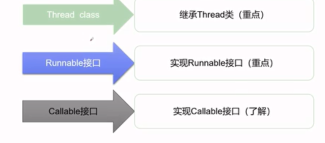

# 创建线程的三种方式



## 继承Thread类

```java
package thread;


//创建线程的方法，继承Thread类，重写run方法，调用start方法开启线程
public class ThreadDemo01  extends Thread{

	@Override
	public void run() {
		for(int i=0;i<10000;i++) {
			System.out.println("我在看代码~~~"+i);
		}
	}
	
	public static void main(String[] args) {
		
		ThreadDemo01 th1=new ThreadDemo01();
		th1.start();
		
		for(int i=0;i<10000;i++) {
			System.out.println("我在学习多线程~~~"+i);
		
		}
	}

}
```

## 实现Runable接口

```java
package thread;

public class ThreadDemo01 implements Runnable {


    @Override
    public void run() {
        for (int i=0;i<2000;i++){
            System.out.println("ThreadDemo run..."+i);
        }
    }

    public static void main(String[] args) {
        new Thread(new ThreadDemo01());
        for (int i=0;i<2000;i++){
            System.out.println("Main Thread run..."+i);
        }
    }
}

```
