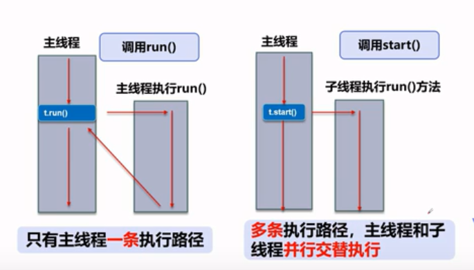
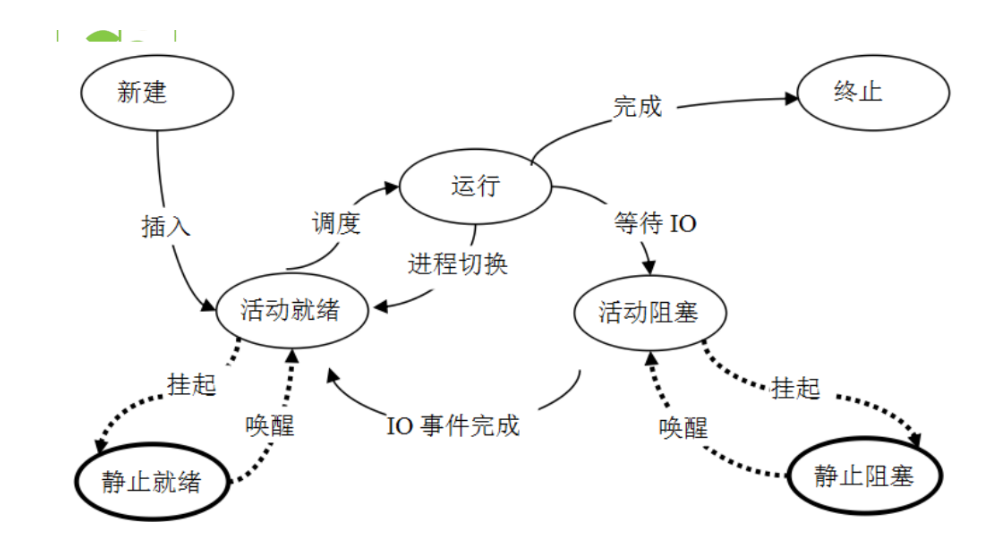

# 多任务

生活中的例子
- 边吃饭边玩手机
- 边卡车边打点滴
- 边上厕所边玩手机

现实中太多这样同时做多件事情的例子，看其阿里是多个任务在做，但是在同一个时间仅仅就做了一件事情。

# 多线程

1. 以前仅仅只有一条路，容易出现堵塞的问题
2. 而现在将马路划分成多条小路，来使得整个马路更加的宽敞

# 普通方法调用和多线程

# 程序、进程、线程

**现实中的例子**

- 在操作系统中运行的程序就是进程，比如平时用的QQ,播放器、游戏、IDE....
- 比如你在看片的时候，会有声音、图像、字幕，这些就是一些线程

**进程和线程**

- 说起进程，就不得不说下程序，程序是数据和指令的聚合，其本身没有任何的含义，是一个静态的概念
- 进程是执行程序的一次执行过程，它是一个动态的概念，是系统资源分配的单位
- 通常一个进程可以包含多个线程，当然一个进程中至少有一个线程，不然没有任何存在的意义，线程是CPU和调度的执行单位，而进程是系统资源分配的一个单位
- 很多的多线程是模拟出来的，真正的多线程是指多个CPU，也就是多和，比如服务器，如果模拟出来的多线程，在一个CPU的情况下，同一个时间点，CPU只能执行一个代码，因为切换的速度很快，所以就有同时执行的错觉

**核心概念**

- 线程就是独立的执行路径
- 在程序运行的时，即使没有自己创建线程，后台也会有多个线程，比如主线程、gc线程
- main()线程称之为主线程,是系统的入口，用于执行整个程序
- 在一个进程中，如果开辟了多个线程，线程的运行由调度器安排调度，调度器是与操作系统紧密相关的，先后顺序是不可以人为干预的
- 对于同一份资源操作的时候，会存在资源抢夺的问题，需要加入并发控制
- 线程会代码来额外的开销，比如CPU的调度时间，并发的控制开销

# 并发和并行

**并行**

- 并行性是指同一时刻内发生的两个或者多个事件
- 并行是在不同实体上的多个事件

**并发**

- 并发性是指同一时间间隔中发生两个或者多个事件
- 并发是在同一个实体上的多个事件

由此可见，并行是针对进程的，并发是针对线程的

## 进程的相关状态与操作

为了使得系统可以并发执行，系统必须要进行一下的操作

- 创建进程，系统在创建一个进程时，必须为它分配所必必需的、除处理机意外的所有资源，如内存空间、I/O设备，以及建立相应的PCB
- 撤销进程，系统在撤销进程中，又必须先对其所占有的资源执行回收操作，然后撤销PCB
- 进程切换，对进程进行上下文切换时，需要保留当前基础的CPU环境，设置新选中进程的CPU环境，因而需要花费不少的处理机时间

