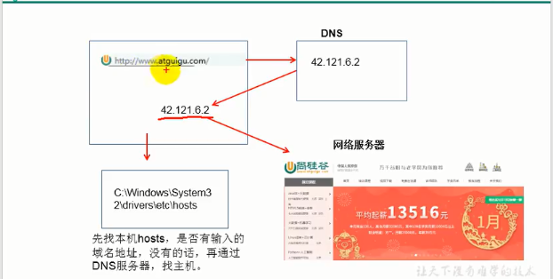
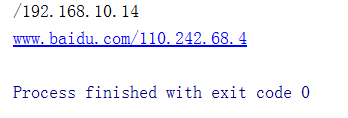

# IP和端口号

### IP地址: InetAddress

- 唯一的标识Internet. 上的计算机(通信实体)
- 本地回环地址(hostAddress): 127.0.0.1
- 主机名(hostName):localhost
- IP地址分类方式1: IPV4和IPV6

  - IPV4: 4个字节组成，4个0-255。 大概42亿，30亿都在北美，亚洲4亿。2011年初已.经用尽。以点分十进制表示，如192.168.0.1
  - IPV6: 128位(16个字节)，写成8个无符号整数，每个整数用四个十六进制位表示，数之间用冒号(:)分开，如: 3ffe:3201: 1401:1280:c8ff:fe4d:db39:1984
- IP地址分类方式2:公网地址(万维网使用)和私有地址(局域网使用)。192.168.开头的就是私有址址，范围即为192.168.0.0--192.168.255.255，专门为组织机构内部使用
- 特点：不容易记忆

## 例子

1. IP:唯一的标识Internet. 上的计算机(透信实体)
2. 在Java 中使用InetAddress类代表IP
3. IP分类: IPv4和IPv6;万维网和局域网
4. 域名:
  - www.baidu.com
  - www.mi.com
  - www.sina.com
5. 本地回路地址:127.0.0.1 对应 localhost




在请求网址的过程中，首先会先向域名解析服务器发起请求，域名解析服务器将域名解析成为ip地址，之后再根据ip地址请求到对应的网站

```java
package com.dreamcold.network;

import java.net.InetAddress;
import java.net.UnknownHostException;

public class Demo01 {
    public static void main(String[] args){
        try {
            //对应着具体的ip地址
            InetAddress inetAddress1=InetAddress.getByName("192.168.10.14");
            System.out.println(inetAddress1);
            InetAddress inetAddress2=InetAddress.getByName("www.baidu.com");
            System.out.println(inetAddress2);
        } catch (UnknownHostException e) {
            e.printStackTrace();
        }
    }
}
```

效果：



获取本机：

```java
InetAddress inetAddress=InetAddress.getLocalHost();
```

## 端口号

IP地址可以唯一标识一台主机，但是主机上有许多的进程，那么你要与那一个进程通信呢？用端口号来区分进程

端口号标识正在计算机上运行的进程(程序)

- 不同的进程有不同的端口号
- 被规定为一个16位的整数0~65535。
- 端口分类:
  - 公认端口: 0~1023。 被预先定义的服务通信占用(如: HTTP占用端口80， FTP占用端口21，Telnet占用端口23)
  - 注册端口: 1024~49151。 分配给用户进程或应用程序。( 如:Tomcat占用端口8080，MySQL 占用端口3306，Oracle 占用端口1521等)。
  - 动态/私有端口: 49152~65535。
- 端口号与IP地址的组合得出一个网络套接字: Socket.


