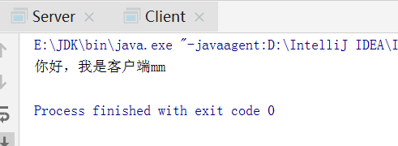
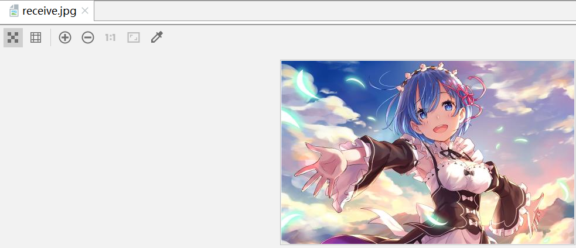
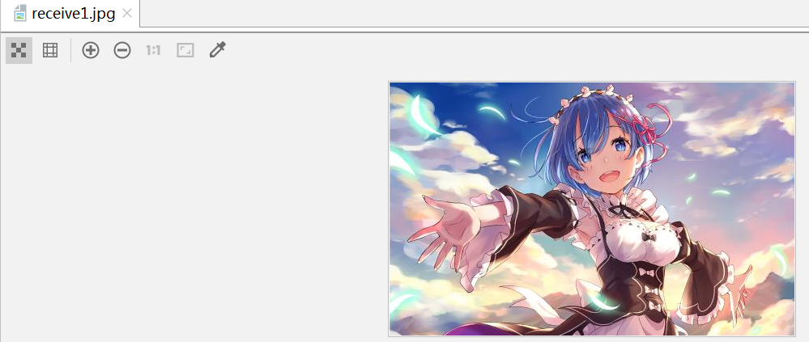
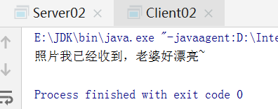

# TCP网络编程

## 客户端与服务端的例子

客户端

```java
package com.dreamcold.network;

import java.io.IOException;
import java.io.OutputStream;
import java.net.InetAddress;
import java.net.Socket;
import java.net.UnknownHostException;

public class Client {
    public static void main(String[] args) throws IOException {
        InetAddress inetAddress=InetAddress.getByName("127.0.0.1");
        Socket socket=new Socket(inetAddress,8899);
        OutputStream os=socket.getOutputStream();
        os.write("你好，我是客户端mm".getBytes());
        os.close();
        socket.close();
    }

}

```

服务端

```java
package com.dreamcold.network;

import java.io.ByteArrayOutputStream;
import java.io.IOException;
import java.io.InputStream;
import java.net.ServerSocket;
import java.net.Socket;

public class Server {
    public static void main(String[] args) throws IOException {
        ServerSocket ss=new ServerSocket(8899);
        Socket socket=ss.accept();
        InputStream is =socket.getInputStream();
        // 不建议这样写，容易出现乱码
        //        byte[] buffer=new byte[1024];
        //        int len;
        //        while ((len=is.read())!=-1){
        //            String str=new String(buffer,0,len);
        //            System.out.println(str);
        //        }
        //关闭资源
        ByteArrayOutputStream baos=new ByteArrayOutputStream();
        byte[] buffer=new byte[5];
        int len;
        while ((len=is.read(buffer))!=-1){
            baos.write(buffer,0,len);
        }
        System.out.println(baos.toString());
        baos.close();
        is.close();
        socket.close();;
        ss.close();
    }
}

```

效果：



## 文件发送

客户端发送文件给服务端，服务端将文件保存在本地。

客户端

```java
package com.dreamcold.network;

import java.io.File;
import java.io.FileInputStream;
import java.io.IOException;
import java.io.OutputStream;
import java.net.InetAddress;
import java.net.Socket;

public class Client01 {
    public static void main(String[] args) throws IOException {
        //创建socket套接字
        Socket socket=new Socket(InetAddress.getByName("127.0.0.1"),9090);
        //创建一个输出流
        OutputStream os=socket.getOutputStream();
        //获取一个输入流
        FileInputStream fis=new FileInputStream(new File("image.jpg"));
        byte[] buffer=new byte[1024];
        int len;
        //将输入流写入到输出流中
        while ((len=fis.read(buffer))!=-1){
            os.write(buffer,0,len);
        }
        //关闭资源
        fis.close();
        os.close();
        socket.close();
    }
}
```

这里涉及到的异常，应该使用try-catch-finally处国

服务器端

```java
package com.dreamcold.network;

import java.io.*;
import java.net.InetAddress;
import java.net.ServerSocket;
import java.net.Socket;
import java.net.UnknownHostException;

public class Server01 {
    public static void main(String[] args) throws IOException {
        ServerSocket ss=new ServerSocket(9090);
        Socket socket=ss.accept();
        InputStream is=socket.getInputStream();
        FileOutputStream fos=new FileOutputStream("receive.jpg");
        int len;
        byte[] buffer=new byte[1024];
        while ((len=is.read(buffer))!=-1){
            fos.write(buffer,0,len);
        }
        //资源关闭
        fos.close();
        is.close();
        socket.close();
        ss.close();
    }
}
```

结果




## 带反馈的发送

例题3:从客户端发送文件给服务端，服务端保存到本地。并返回“发送成功”给客户端。

客户端:

```java
package com.dreamcold.network;

import java.io.*;
import java.net.InetAddress;
import java.net.Socket;

public class Client02 {
    public static void main(String[] args) throws IOException {
        //创建socket套接字
        Socket socket=new Socket(InetAddress.getByName("127.0.0.1"),9090);
        //创建一个输出流
        OutputStream os=socket.getOutputStream();
        //获取一个输入流
        FileInputStream fis=new FileInputStream(new File("image.jpg"));
        byte[] buffer=new byte[1024];
        int len;
        //将输入流写入到输出流中
        while ((len=fis.read(buffer))!=-1){
            os.write(buffer,0,len);
        }

        //图片已经传完了不再继续传输数据了
        socket.shutdownOutput();

        //接受服务器端返回的数据并打印出来
        InputStream is1 = socket.getInputStream();
        ByteArrayOutputStream baos=new ByteArrayOutputStream();
        byte[] buffer1=new byte[20];
        int len1;
        while ((len1=is1.read(buffer1))!=-1){
            baos.write(buffer1,0,len1);
        }
        System.out.println(baos.toString());

        //关闭资源
        fis.close();
        os.close();
        socket.close();
        baos.close();
        is1.close();
    }
}

```

服务器端:

```java
package com.dreamcold.network;

import java.io.FileOutputStream;
import java.io.IOException;
import java.io.InputStream;
import java.io.OutputStream;
import java.net.ServerSocket;
import java.net.Socket;

public class Server02 {
    public static void main(String[] args) throws IOException {
        ServerSocket ss=new ServerSocket(9090);
        Socket socket=ss.accept();
        InputStream is=socket.getInputStream();
        FileOutputStream fos=new FileOutputStream("receive1.jpg");
        int len;
        byte[] buffer=new byte[1024];
        while ((len=is.read(buffer))!=-1){
            fos.write(buffer,0,len);
        }
        OutputStream os=socket.getOutputStream();
        os.write("照片我已经收到，老婆好漂亮~".getBytes());
        //资源关闭
        fos.close();
        is.close();
        socket.close();
        ss.close();
        os.close();
    }
}

```

效果：



输出：

