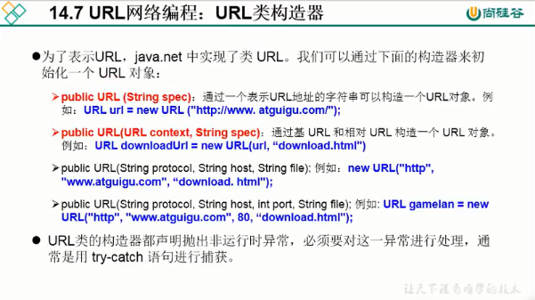

# URL编程

## URL类

- URL(Uniform Resource Locator): 统一 资源定位符，它表示Internet 上某一资源的地址。
- 它是一种具体的URI，即URL可以用来标识-一个资源，而且还指明了如何locate这个资源。
- 通过URL我们可以访问Internet. 上的各种网络资源，比如最常见的www, ftp站点。浏览器通过解析给定的URL可以在网络上查找相应的文件或其他资源。

## URL类构造器




## URL类的方法

```java
public String getProtocol()//获取该URL的协议名
public String getHost()//获取该URL的主机名行
public String getPort()//获取该URL的端口号
public String getPath()//获取该URL的文件路径
public String getFile()//获取该URL的文件名
public String getQuery()//获取该URL的查询名
```

## URL的组成

- `<传输协议>//<主机名>:<端口号>/<文件名>#片段名?参数列表`
- 例如:
  `http://192. 168.1.100:8080/helloworld/index.jsp#a?username=shkstart&password=123`
- 片段名:即锚点，例如看小说，直接定位到章节
- 参数列表格式:参数名=参数值&参数名=参数... .


## 例子

**api调用**

```java
package com.dreamcold.network;

import java.net.MalformedURLException;
import java.net.URL;

public class Demo03 {
    public static void main(String[] args) {
        try {
            URL url=new URL("http://www.baidu.com");
            System.out.println(url.getProtocol());
            System.out.println(url.getHost());
            System.out.println(url.getPort());
            System.out.println(url.getPath());
            System.out.println(url.getFile());
            System.out.println(url.getQuery());
        } catch (MalformedURLException e) {
            e.printStackTrace();
        }
    }
}

```

**下载图片**

```java
package com.dreamcold.network;

import java.io.FileInputStream;
import java.io.FileOutputStream;
import java.io.IOException;
import java.io.InputStream;
import java.net.HttpURLConnection;
import java.net.MalformedURLException;
import java.net.URL;

public class Demo04 {
    public static void main(String[] args) throws IOException {
        URL url=new URL("http://localhost:8080/examples/beauty.jpg");
        HttpURLConnection urlConnection=(HttpURLConnection)url.openConnection();

        urlConnection.connect();
        InputStream is=urlConnection.getInputStream();
        FileOutputStream fos=new FileOutputStream("beauty03.jpg");
        byte[] buffer=new byte[1024];
        int len;
        while ((len=is.read(buffer))!=-1){
            fos.write(buffer,0,len);
        }
        is.close();
        fos.close();
        urlConnection.disconnect();
    }
}

```


