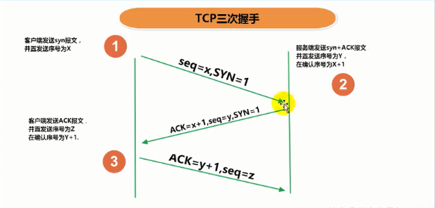
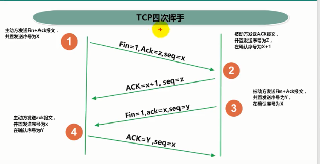

# 网络协议

## 网络通信协议

计算机网络中实现通信必须有一些约定，即通信协议，对速率、传输代码、代
码结构、传输控制步骤、出错控制等制定标准。

## 问题:网络协议太复杂

计算机网络通信涉及内容很多，比如指定源地址和目标地址，加密解密，压缩解压缩，差错控制，流量控制，路由控制，如何实现如此复杂的网络协议呢?

## 通信协议分层的思想

在制定协议时，把复杂成份分解成一些简单的成份，再将它们复合起来。最常用的复合方式是层次方式，即同层间可以通信、上一层可以调用下一层， 而与再下一层不发生关系。各层互不影响，利于系统的开发和扩展。

## TCP/IP协议簇

- 传输层协议中有两个非常重要的协议:
  - 传输控制协议TCP(Transmission Control Protocol)
  - 用户数据报协议UDP(User Datagram Protocol)
- TCP/IP以其两个主要协议:传输控制协议(TCP)和网络互联协议(IP)而得名，实际上是一组协议，包括多个具有不同功能且互为关联的协议。
- IP(Internet Protocol)协议是网络层的主要协议，支持网间互连的数据通信。
- TCP/IP协议模型从更实用的角度出发，形成了高效的四层体系结构，即物理链路层、IP层、传输层和应用层。

## TCP和UDP

### TCP协议:

- 使用TCP协议前，须先建立TCP连接，形成传输数据通道
- 传输前，采用“三次握手”方式，点对点通信，是可靠的
- TCP协议进行通信的两个应用进程:客户端、服务端。
- 在连接中可进行大数据量的传输
- 传输完毕，需释放已建立的连接，效率低
- 类似于打电话

### UDP协议:
- 将数据、源、目的封装成数据包，不需要建立连接

- 每个数据报的大小限制在64K内

- 发送不管对方是否准备好，接收方收到也不确认，故是不可靠[

- 可以广播发送

- 发送数据结束时无需释放资源，开销小，速度快

- 比如网络视频

- 类似发短信、发电报

  

## TCP三次握手

## TCP四次挥手

[详细参考](https://blog.csdn.net/qq_38950316/article/details/81087809)