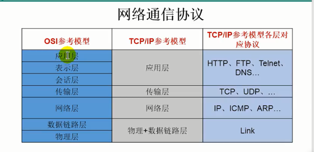
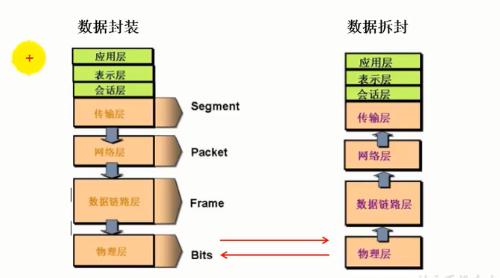

# 网络编程概述

## 什么是网络编程

- Java是Internet 上的语言，它从语言级上提供了对网络应用程序的支持，程序员能够很容易开发常见的网络应用程序。

- Java提供的网络类库，可以实现无痛的网络连接，联网的底层细节被隐藏在Java的本机安装系统里，由JVM进行控制。并且Java实现了一个跨平台的网络库，程序员面对的是一个统一的网络编程环境。

## 计算机网络

### 计算机网络

把分布在不同地理区域的计算机与专门的外部设备用通信线路互连成-一个规模大、功能强的网络系统，从而使众多的计算机可以方便地互相传递信息、共享硬件、软件、数据信息等资源。

### 网络编程的目的

直接或间接地通过网络协议与其它计算机实现数据交换，进行通讯。

### 网络编程中有两个主要的问题

- 如何准确地定位网络上一台或多台主机:定位主机上的特定的应用
- 找到主机后如何可靠高效地进行数据传输

## 网络通信要素概述

### IP和端口号

通信双方地址

- IP
- 端口号

### 网络通信协议

一定的规则(即:网络通信协议。有两套参考模型)

- OSI参考模型:模型过于理想化，未能在因特网上进行广泛推广
- TCP/IP 参考模型(或TCP/IP协议):事实上的国际标准。

计算机网络中实现通信必须有一些约定， 即通信协议，对速率、传输代码、代码结构、传输控制步骤、出错控制等制定标准。

### 问题:网络协议太复杂

计算机网络通信涉及内容很多，比如指定源地址和目标地址，加密解密,，压缩解压缩，差错控制，流量控制，路由控制，如何实现如此复杂的网络协议呢?

### 通信协议分层的思想

在制定协议时，把复杂成份分解成一些简单的成份，再将它们复合起来。最常用的复合方式是层次方式，即同层间可以通信、上一层可以调用下一层，而与再下一层不发生关系。各层互不影响，利于系统的开发和扩展。

### 数据传输的例子

