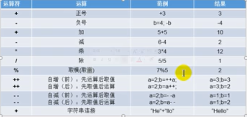

# 运算符

## 运算符的分类


## 算数运算符



算数运算符可以分为+、-、*、/、(前)++、(后)++、(前)--、(后)--

### 除号

```java
package day01;

public class CountTest {
    public static void main(String[] args) {
        int num1=12;
        int num2=5;
        int result1=num1/num2;
        System.out.println(result1);//2
        int result2=num1/num2*num2;
        System.out.println(result2);//10
        double result3=num1/num2;
        System.out.println(result3);//2.0

        double result4=num1/(num2+0.0);//2.4
        System.out.println(result4);

        double result5=(double)num1/num2;//2.4
        System.out.println(result5);

    }
}

```


### 取模

取模的结果的正负号和被模数是一样的,开发中经常需要通过该方式判断能否将该数值除尽。

```java
package day01;

public class CountTest {
    public static void main(String[] args) {
      int m=12;
      int n=5;
      System.out.println("m1 % n1 ="+m%n);//2


      int m1=-12;
      int n1=5;
      System.out.println("m1 % n1 ="+m1%n1);//-2

      int m2=12;
      int n2=-5;
      System.out.println("m1 % n1 ="+m2%n2);//2

      int m3=-12;
      int n3=-5;
      System.out.println("m1 % n1 ="+m3%n3);//-2
      
    }
}

```

### (前)++、(后)++

- (前)++:先自增1，后运算
- (后)++:先运算，后自增1

```java
package day01;

public class CountTest {
    public static void main(String[] args) {
        int a1=10;
        int b1=++a1;
        System.out.println("a1 = "+a1+" b1 ="+b1); // a1=11, b1=11

        int a2=10;
        int b2=a2++;
        System.out.println("a2 = "+a2+" b2 ="+b2); // a2=11, b2=10

    }
}

```

注意：short直接加一的话，会导致的得到的是一个int类型的变量，直接再赋值给short类型的话，会导致因为精度丢失，进而报错

```java
short s1=10;
s1=(short) (s1+1); //正确，强制类型转换
```

相应的如果我们采用自增运算符就不会报错,除此之外自增一的操作的效率更高

```java
s1++;
```

溢出的情况下

```java
byte b=127;
b++;
System.out.println(b); //-128
```
与之对应的--的规律如下
- (前)--,先自减1，后运算
- (后)--，先运算，后自减1

