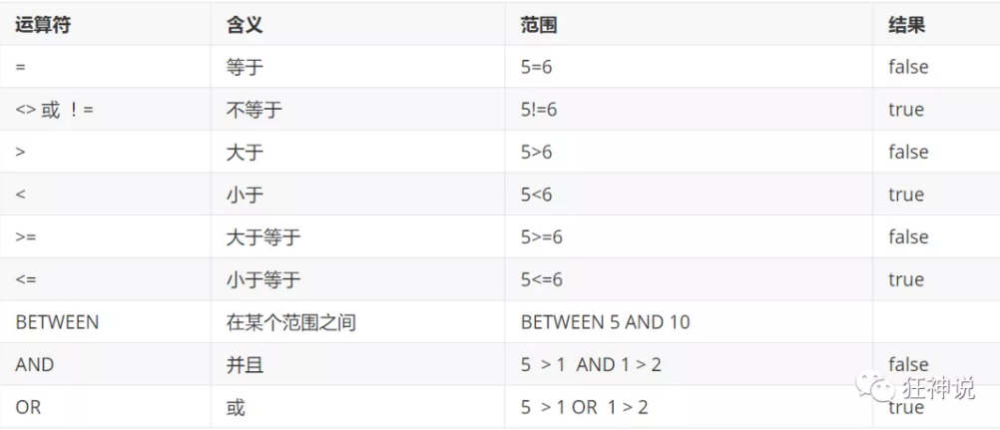

# DML语言

**数据库意义:**数据存储，数据管理

- DML语言:数据操作语言
  - Insert
  - update
  - delete

## 添加

```sql
-- 插入语句(添加)
insert into 表名([字段名1,字段2,字段3]) values('值1', '值2','值3'，....)
```

插入示例

```sql
INSERT INTO `GRADE`(`GRADENAME`) VALUES('大四');
--由于主键自增我们可以省略(如果 不写表的字段，他就会一一匹配
INSERT INTO `GRADE` VALUES('大一');
INSERT INTO `GRADE` VALUES('大三');
--一股写插入语句，我们一.定要数据和字段一一对应!
-- 插入多个字段
INSERT INTO `GRADE`(`GRADENAME`) VALUES('大一'),('大二');
INSERT INTO `GRADE`(`NAME`,`PWD`,`SEX`) VALUES('小明','123456','女');
INSERT INTO `GRADE`(`NAME`,`PWD`,`SEX`) VALUES('小红','123456','女'),('小刚','123456','男');

```

语法: insert into表名([字段名1.字段2.字段3])values(值1.值2.值3. .....)
**注意事项:**
1.字段和字段之间使用英文逗号隔开
2.字段是可以省略的，但是后面的值必须要要一-对应， 不能少
3.可以同时插入多条数据，VALUES 后面的值，需要使用，隔开即可

## 修改

> update 修改谁  (条件) | set 原来的值=新值

语法：

```SQL
UPDATE 表名 SET column_name=value [,column_name2=value2,...] [WHEREcondition];
```

**注意 :** 

- column_name 为要更改的数据列
- value 为修改后的数据 , 可以为变量 , 具体指 , 表达式或者嵌套的SELECT结果
- condition 为筛选条件 , 如不指定则修改该表的所有列数据

```sql
-- 修改学院的名词，带了简介
UPDATE `STUDENT` SET `NAME`='DREAMCOLD' WHERE ID =2;
-- 不指定条件的情况下，会自动修改所有表
UPDATE `STUDENT` SET `NAME`='小明' ;
-- 修改多个属性
UPDATE `STUDENT` SET `NAME`='DREAMCOLD',`EMAIL`='1689242311@qq.com' WHERE ID=1;
-- 条件定位
UPDATE `STUDENT` SET `NAME`='长江七号' WHERE `NAME`='DREAMCOLD' AND SEX='女'

```

> where条件子句

可以简单的理解为 : 有条件地从表中筛选数据



测试：

```java
-- 修改年级信息
UPDATE grade SET gradename = '高中' WHERE gradeid = 1;
```


## 删除

语法：

```sql
DELETE FROM 表名 [WHERE condition];
```

注意：condition为筛选条件 , 如不指定则删除该表的所有列数据

```sql
-- 删除最后一个数据
DELETE FROM grade WHERE gradeid = 5

-- 删除指定的数据
DELETE FROM `STUDENT` WHERE ID =1;
```

> TRUNCATE命令

作用：完全清空数据库表，表的结构和索引约束不变!

```sql
-- 清空 student表
TRUNCATE `STUDENT`
```

> delete 的TRUNCATE区别

- 相同点：都能删除数据
- 不同点：
  - TRUNCATE 重新设置 自增列 计数器会归零
  - TRUNCATE 不会影响事务

- 测试delete和TRUNCATE 区别

```sql
-- 测试delete和TRUNCATE的区别
CREATE TABLE `TEST`(
	`ID` INT(4) NOT NULL AUTO_INCREMENT,
    `COLL` VATCHAR(20) NOT NULL ,
    PRIMARY KEY(`ID`)
)ENGINE=INNDB DEFAULT CHARSET UTF8;

INSERT INTO `TEST`(`COLL`) VALUES('1'),('2'),('3');

DELETE FROM `TEST`;--不会影响自增

TRUNCATE TABLE `TEST`;--自增会归零

```

了解即可：`DELETE删除问题`,重启数据库，现象

- INNDB的区别：自增列会从1开始（存在内存当中，断电即失）
- MyISAM：继续从上一个自增量开始（存在文件中，不会丢失）

