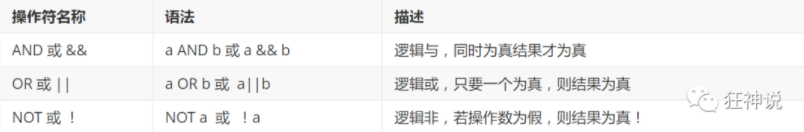
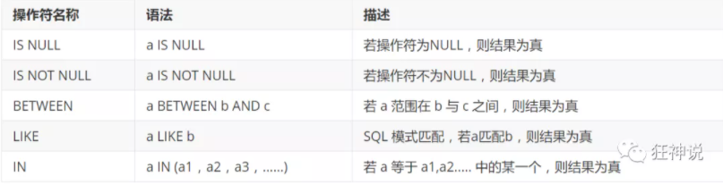

# DQL语言

## DQL

(Data Query Language ：数据查询语言)

- 所有的查询操作都用它： Select
- 简单的查询，复杂的查询它都能做
- 数据库最核心的语言，最重要的语句
- 使用频率最高的语句

> SELECT语法

```sql
SELECT [ALL | DISTINCT]
{* | table.* | [table.field1[as alias1][,table.field2[as alias2]][,...]]}
FROM table_name [as table_alias]
  [left | right | inner join table_name2]  -- 联合查询
  [WHERE ...]  -- 指定结果需满足的条件
  [GROUP BY ...]  -- 指定结果按照哪几个字段来分组
  [HAVING]  -- 过滤分组的记录必须满足的次要条件
  [ORDER BY ...]  -- 指定查询记录按一个或多个条件排序
  [LIMIT {[offset,]row_count | row_countOFFSET offset}];
   -- 指定查询的记录从哪条至哪条
```

**注意 : [ ] 括号代表可选的 , { }括号代表必选得**

## 指定查询字段

- 查询全部的学生 select 字段 from 表、

```sql
-- 查询全部的学生
-- SELECT 字段 FROM STUDENT;
SELECT * FROM STUDENT;
-- 查看指定的字段
SELECT `STUDENTNO`,`STUDENTNAME` FROM STUDENT;
-- 给字段起别名,也可以给表起别名
SELECT `STUDENTNO` AS 学号,`STUDENTNAME` AS 姓名 FROM STUDENT;
-- 函数
SELECT CONCAT('姓名',StudentName) as 新名字 FROM student;
```

> 有的时候，列名字不是那么的见名知意。我们起别名 AS 字段名as 别名 表名as别名

## 去重字段表达式

作用：去除SELECT查询出来的结果中的重复数据，只显示一条

```sql
-- 发现重复数据，去重
SELECT DISTINCT `STUDENTNO` FROM RESULT;

```

## 数据库的列(表达式)

```sql
--查看系统版本
SELECT VERSION();
--计算结果，用来计算
SELECT 100*3-1 AS 计算结果;
-- 查询自增的步长，变量
SELECT @@AUTO_INCREMENT_INCREMENT;
-- 学员考试的成绩+1分查看
SELECT `STUDENTNO`,`STUDENTRESULT`+1 AS '提分后' FROM RESULT;
```

数据库中的表达式：文本式、列、NULL、函数、计算表达式

`select 表达式 from 表;`

## WHERE条件字段

作用：检索数据中的`符合条件`的值

> 逻辑运算符



```sql
SELECT `STUDENTNO`,`STUDENTRESULT` FROM RESULT;

-- 查看考试成绩在95到100之间的
SELECT `STUDENTNO`,`STUDENTRESULT` FROM RESULT WHERE STUDENTRESULT>=95 AND STUDENTRESULT<=1;
-- AND 可以写成 &&
-- 模糊查询
SELECT `STUDENTNO`,`STUDENTRESULT` FROM RESULT WHERE STUDENTRESULT BETWEEN 95 AND 100;
-- 除了1000号学生之外的同学的成绩
SELECT `STUDENTNO`,`STUDENTRESULT` FROM RESULT STUDENTNO!=1000;
--- != NOT
SELECT `STUDENTNO`,`STUDENTRESULT` FROM RESULT WHERE NOT STUDENT=1000;
```

> 模糊查询：比较运算符



19:10:8


