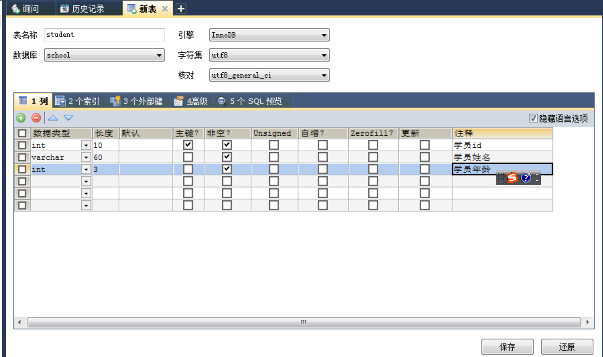

# 数据库介绍

## 初识MySQL

- JavaEE:企业级Java开发Web
- 前端(页面:展示，数据! )
- 后台(连接点:连接数据库 JDBC，链接前端(控制，控制视图跳转，和给前端传递数据) )
- 数据库(存数据，txt, excel, word)

> 只会写代码，学好数据库，基本混饭吃!
> 操作系统，数据结构与算法!当一 一个不错的程序猿!
> 离散数学，数字电路，体系结构，编译原理。+ 实战经验，高级程序猿-优秀的程序猿！

## 为什么要学数据库？

1. 岗位需求I
2. 现在的世界，大数据时代~,得数据库者得天下。
3. 被迫需求:存数据.
4. 数据库是所有软件体系中最核心的存在DBA

## 什么是数据库？

- 数据库(DB, DataBase)
- 概念:数据仓库，软件,安装在操作系统( windqw ,linux, mac. ..)上!
- 作用:存储数据，管理数据

## 数据库的分类

**关系型数据库:**

- MySQL， Oracle, Sql Server, DB2, SQLlite

- 通过表和表之间，行和列之间的关系进行数据的存储，学员信息表，考勤表,

**非关系型数据库:** (NoSQL) Not Only

- Redis, MongDB
- 非关系型数据库，对象存储， 通过对象的自身的属性来决定。

**数据库管理系统(DBMS)**

- 数据库的管理软件，科学有效的管理我们的数据。维护和获取数据:
- MySQL, 数据库管理系统!


## Mysql简介

MySQL是一个关系型数据库管理系统

- 前世:瑞典MySQL AB公司
- 今生:属于Orace旗下产品
- MySQL是最好的RDBMS (Relational Database Management System）关系数据库管理系统)应用软件之一。

- 开源的数据库软件~
- 体积小、速度快.总体拥有成本低，招人成本比较低，所有人必须会~
- 中小型网站、或者大型网站，集群

安装建议:

1. 尽量不要使用exe， 注册表
2. 尽可能使用压缩包安装~


## Mysql的安装

1. 安装地址：https://downloads.mysql.com/archives/community/
2. 安装版本：5.7.19
3. 解压压缩包
4. 配置环境变量：将Mysql的目录下的bin目录添加到环境变量
5. 配置文件，在`D:\Mysql_5.7.19\mysql-5.7.19-winx64`创建配置文件my.ini

````ini
[mysqld]
basedir=D:\Mysql_5.7.19\mysql-5.7.19-winx64\mysql-5.7\
datadir=D:\Mysql_5.7.19\mysql-5.7.19-winx64\mysql-5.7\data\
port=3306
skip-grant-tables
````

6. 启动管理员模式下的CMD，并将路径切换至mysql下的bin目录，然后输入`mysqld –install` (安装mysql)
7. 再输入  `mysqld --initialize-insecure --user=mysql `初始化数据文件

8. 然后再次启动mysql 然后用命令 mysql –u root –p 进入mysql管理界面（密码可为空）

9. 进入界面后更改root密码

```sql
update mysql.user set authentication_string=password('123456') where user='root'and Host = 'localhost';
```

10. 刷新权限

```shell
flush privileges;
```

11. 修改 my.ini文件删除最后一句skip-grant-tables

12. 重启mysql即可正常使用

```shell
net stop mysql
net start mysql
```

13. 连接上测试出现以下结果就安装好了


## Sqlyog安装

1. SqLyog的安装:https://www.cnblogs.com/xiaoran991/p/12375562.html
2. 新建一个数据库：school
3. 新建一张表：student


**注意：每一个sqlyog的执行操作，本质就是对应了一个sql， 可以在软件的历史记录中查看**

```sql
CREATE TABLE `school`.`student`( `id` INT(10) NOT NULL COMMENT '学员id', `name` VARCHAR(60) NOT NULL COMMENT '学员姓名', `age` INT(3) NOT NULL COMMENT '学员年龄', PRIMARY KEY (`id`) ) ENGINE=INNODB CHARSET=utf8 COLLATE=utf8_general_ci; 
```




4. 查看表，右键->打开表，点击刷新保存


## 连接数据库

打开MySQL命令窗口

- 在DOS命令行窗口进入 **安装目录\mysql\bin**
- 可设置环境变量，设置了环境变量，可以在任意目录打开！

**连接数据库语句 :** mysql -h 服务器主机地址 -u 用户名 -p 用户密码

注意 : -p后面不能加空格,否则会被当做密码的内容,导致登录失败 !

**几个基本的数据库操作命令 :**

```sql
update user set password=password('123456')where user='root'; 修改密码
flush privileges;-- 刷新数据库
show databases; --显示所有数据库
use dbname；--打开某个数据库
show tables; --显示数据库mysql中所有的表
describe user; --显示表mysql数据库中user表的列信息
create database name; --创建数据库
use databasename; --选择数据库

exit; 退出Mysql
? 命令关键词 : 寻求帮助
-- 表示注释
-- 所有的命令都要以;结尾
use school; --切换数据库

-- SQL本来的注释
/*
	多行注释
*/
```


