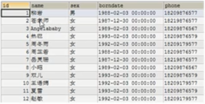

# 数据库如何存储数据

1. 将数据放到表中，表再放到库里

   

2. 一个数据库中可以有多个表，每一个表中有一个名字，表名具有唯一性

3. 表具有一些特性，这些特性定义了数据在表中如何存储，类似于Java中类的设计。

4. 表由列组成，我们也称为字段。所有的表都是由一个或者多个列组成，每一列类似于Java中的属性

5. 表中的数据是按行存储的，每一行类似于Java中的对象

   