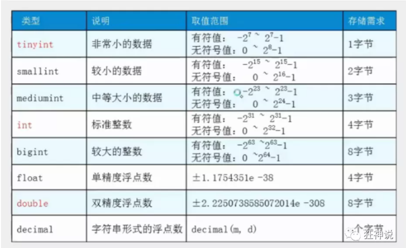
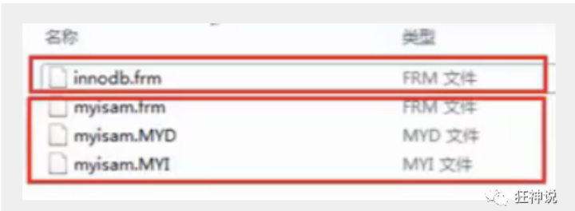

# 数据库的操作

## 基本常用命令

1. 命令行连接!

```sql
mysql -uroot -p123456 --连接数据库
```

2. 修改用户密码

```sql
update mysql.user set authentication string=password('123456') where user='root’ and Host ='localhost'; 
--修改用户密码
flush privileges; -- 刷新权限
```

3. 查看所有数据库

```sql
show databases; --查看所有数据库
```

4. 选择数据库

```sql
use school; --选择数据库
```

5. 查看所有的表

```sql
show tables; --查看所有的表
```

6. 显示数据库中所有的表的信息

```sql
describe student; --显示数据库中所有表的信息
```

7. 创建一个数据库

```sql
create database westos;
```

8. 退出数据库

```sql
exit;
```

9. 注释

```sql
-- 单行注释（SQL的本身注释）
/*
多行注释
*/
```

## 操作数据库

- 操作数据库>操作数据库中的表>操作数据库中表的数据
- mysql关键字不区分大小写

1. 创建数据库

```sql
CREATE DATABASE [IF NOT EXISTS] westos;
```

2. 删除数据库

```sql
DROP DATABASE IF EXISTS hello;
```

3. 为了避免关键词可以加上反引号

```sql
CREATE DATABASE IF NOT EXISTS `school`;
-- tab 键的上面,如果你的表名或者字段名是一个特殊字符，就需要``
```

4. 查看数据库

```sql
SHOW DATABASES; --查看所有的数据库
```

学习思路:

- 对照sqlyog可视化历史记录查看sql
- 固定的语法或关键字必须要强行记住!

## 数据库的数据(列)类型

> 数值

\

> 文本串


> 日期和时间型数值类型


> NULL值

- 理解为 "没有值" 或 "未知值"
- 不要用NULL进行算术运算 , 结果仍为NULL


## 数据库的字段属性（重点）

**UnSigned**

- 无符号的
- 声明该数据列不允许负数 .

**ZEROFILL**

- 0填充的
- 不足位数的用0来填充 , 如int(3),5则为005

**Auto_InCrement**

- 自动增长的 , 每添加一条数据 , 自动在上一个记录数上加 1(默认)

- 通常用于设置**主键** , 且为整数类型

- 可定义起始值和步长

- - 当前表设置步长(AUTO_INCREMENT=100) : 只影响当前表
  - SET @@auto_increment_increment=5 ; 影响所有使用自增的表(全局)

**NULL 和 NOT NULL**

- 默认为NULL , 即没有插入该列的数值
- 如果设置为NOT NULL , 则该列必须有值

**DEFAULT**

- 默认的
- 用于设置默认值
- 例如,性别字段,默认为"男" , 否则为 "女" ; 若无指定该列的值 , 则默认值为"男"的值

扩展：

```sql
/* 每一个表， 都必须存在以下五个字段! 未来做项目用的， 表示-个记录存在意义!
id           主键
version      乐观锁
is_delete    伪删除
gmt_create   创建时间
gmt_update   修改时间
*/
```


## 创建数据库表

```sql
-- 目标 : 创建一个school数据库
-- 创建学生表(列,字段)
-- 学号int 登录密码varchar(20) 姓名,性别varchar(2),出生日期(datatime),家庭住址,email
-- 创建表之前 , 一定要先选择数据库

-- 注意点，使用英文() ，表的名称和字段尽量使用.. 括起来
-- AUTO INCREMENT 自增。字符串使用单引号括起来↑
-- 所有的语句后面加，(英文的) 。最后一个不用加，
-- PRIMARYKEY主键，
-- 一般一个表只有一个唯一的主键!


CREATE TABLE IF NOT EXISTS `student` (
`id` int(4) NOT NULL AUTO_INCREMENT COMMENT '学号',
`name` varchar(30) NOT NULL DEFAULT '匿名' COMMENT '姓名',
`pwd` varchar(20) NOT NULL DEFAULT '123456' COMMENT '密码',
`sex` varchar(2) NOT NULL DEFAULT '男' COMMENT '性别',
`birthday` datetime DEFAULT NULL COMMENT '生日',
`address` varchar(100) DEFAULT NULL COMMENT '地址',
`email` varchar(50) DEFAULT NULL COMMENT '邮箱',
PRIMARY KEY (`id`)
) ENGINE=InnoDB DEFAULT CHARSET=utf8;

-- 查看数据库的定义看SQL
SHOW CREATE DATABASE school;
-- 查看数据表的定义
SHOW CREATE TABLE student;
-- 显示表结构
DESC student;  -- 设置严格检查模式(不能容错了)SET sql_mode='STRICT_TRANS_TABLES';
```

格式：

```sql
CREATE TABLE [IF NOT EXISTS]"表名" (
`字段名` 列类型 [属性]  [索]  [注释],
`字段名` 列类型 [属性]  [索]  [注释],
`字段名` 列类型 [属性]  [索]  [注释],
....
)

```

## 数据表的类型

> 设置数据表的类型

```sql
CREATE TABLE 表名(
   -- 省略一些代码
   -- Mysql注释
   -- 1. # 单行注释
   -- 2. /*...*/ 多行注释
)ENGINE = MyISAM (or InnoDB)

-- 查看mysql所支持的引擎类型 (表类型)
SHOW ENGINES;
```

MySQL的数据表的类型 : **MyISAM** , **InnoDB** , HEAP , BOB , CSV等...

常见的 MyISAM 与 InnoDB 类型：


经验 ( 适用场合 )  :

- 适用 MyISAM : 节约空间及相应速度
- 适用 InnoDB : 安全性 , 事务处理及多用户操作数据表

> 数据表的存储位置

- MySQL数据表以文件方式存放在磁盘中

- - 包括表文件 , 数据文件 , 以及数据库的选项文件
  - 位置 : Mysql安装目录\data\下存放数据表 . 目录名对应数据库名 , 该目录下文件名对应数据表 .

- 注意 :

- - \* . frm -- 表结构定义文件
  - \* . MYD -- 数据文件 ( data )
  - \* . MYI -- 索引文件 ( index )
  - InnoDB类型数据表只有一个 *.frm文件 , 以及上一级目录的ibdata1文件
  - MyISAM类型数据表对应三个文件 :



> 设置数据表字符集

我们可为数据库,数据表,数据列设定不同的字符集，设定方法 :

- 创建时通过命令来设置 , 如 : CREATE TABLE 表名()CHARSET = utf8;
- 如无设定 , 则根据MySQL数据库配置文件 my.ini 中的参数设定